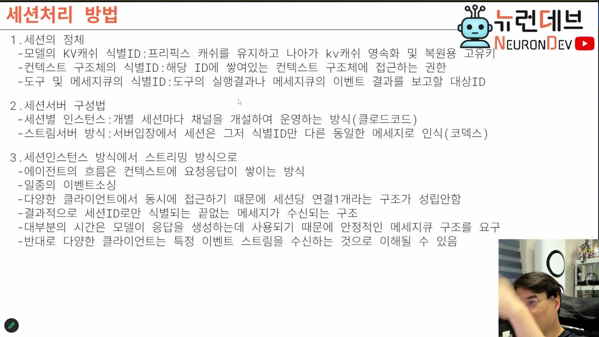

# 02. 세션 서버 아키텍처 — 채팅방에서 이벤트 스트림으로

## 학습 목표

세션 서버를 짓는 두 방식(세션별 인스턴스 / 스트림 서버)을 구분하고, 업계가 후자로 이동하는 이유를 "다중 클라이언트"라는 한 요구에서 설명한다. 그리고 그 이동이 왜 **이벤트 소싱의 재발견**인지, 이벤트 소싱의 고질적 단점이 왜 이 도메인에서는 문제가 되지 않는지 이해한다.

## 선수 지식

- 1장의 세션 = KV 캐시 식별자
- 컨텍스트가 단조 증가하는 불변 리스트라는 성질 (프리픽스 캐시의 전제)
- 이벤트 소싱의 기본 개념 (상태를 저장하지 않고 사건을 append만 하는 방식)

## 핵심 원리 (WHY) — 클라이언트와 세션의 계약을 끊는 것이 핵심

두 방식의 차이는 성능이나 유행이 아니다. **클라이언트가 세션을 점유하는가**의 문제다.

### 방식 A. 세션별 인스턴스 (클로드 코드)

개별 세션마다 채널을 개설해 운영한다. 세션 하나가 완전히 독립된 채널방이다 — 채팅 서버에서 방 하나하나를 소켓으로 격리하는 그 구조와 같다.

여기서는 **클라이언트가 그 세션 채널과 계약을 맺는다.** 세션을 점유하고 있는 클라이언트라는 개념이 존재한다.

### 방식 B. 스트림 서버 (코덱스)

서버 입장에서 세션은 **식별 ID만 다른 동일한 메시지**다. 거대한 카프카 흐름 하나가 있다고 생각하면 된다. 이벤트 메시지 안에 "이건 세션 3번 것, 이건 5번 것"이 적혀 있을 뿐이고, 서버는 그걸 하나의 메시지 스트림으로 본다.

> **결정적 질문:** "어차피 프리픽스 캐시 때문에 앞부분이 불변으로 구현되는데, 그러면 그냥 이벤트 소싱 서버처럼 구현하면 되지 않을까?" `[09:30–10:00]`

이 질문이 아키텍처 전환의 출발점이다. 컨텍스트가 이미 append-only 불변 리스트라면, 세션을 방으로 격리할 이유가 사라진다.

## 필수 지식 (HOW) — 전환이 가져오는 것

### 클라이언트를 가리지 않는다

스트림 방식의 가장 큰 실익이다. 서버는 아무 데서 이벤트가 들어와도 그것을 스트림에 이어 붙인다. 그래서:

- 같은 세션을 모바일에서 열어도 똑같이 보이고, 입력해도 똑같이 반응한다
- 그 상태에서 브라우저로 열어 같은 세션을 건드려도 동일하게 동작한다
- 여러 클라이언트에서 동시에 메시지를 던져도 상관없다 — 이벤트 스트림이니까

가능한 이유는 **세션과 클라이언트가 연결을 맺지 않기 때문**이다. 모든 클라이언트는 이벤트 수신자이자 발송자일 뿐이고, 서버는 모든 곳에서 온 것을 스트림으로 인식한다.

> 리모트 컨트롤 요구가 커지면서 "클라이언트와 세션 채널이 계약을 맺는 건 불편하다. 불편한 걸 넘어서 굳이 그럴 필요가 있나?"라는 판단이 섰고, 그래서 원격 접속·원격 권한 허가에서는 코덱스가 클로드 코드보다 압도적으로 낫다. 클로드 코드도 리모트 지원 때문에 이 방향으로 바꾸는 중이다. `[11:00–12:00]`

### 세션당 연결 1개라는 전제가 깨진다

여러 클라이언트가 동시에 접근하므로 "세션당 연결 하나"가 더는 성립하지 않는다. 결과적으로 서버는 **세션 ID로만 식별되는 끝없는 메시지가 수신되는 구조**가 된다. 그래서 안정적인 메시지 큐 구조가 요구된다.

### 클라이언트 쪽에서 본 그림

클라이언트는 특정 소켓 서버에 들어가 그 세션에 대한 권리를 획득하는 게 아니라, **권한만 있으면 이벤트 스트림을 구독**한다. 여러 세션이 열려 있으면 세션 ID별로 분산해서 보여줄 뿐이다.

구독은 두 단계로 나뉜다: 세션 서버를 처음 열 때 **콜드 스트림**(과거 이벤트)을 한 번 받아오고, 그 다음부터는 **핫 스트림**(실시간 이벤트)을 이어받는다.

## 필수 지식 (HOW) — 이벤트 소싱의 단점이 여기서는 무해한 이유

이벤트 소싱의 고질적 약점은 **읽기가 느리다**는 것이다. 현재 상태를 알려면 사건을 처음부터 재생해야 하므로, 일반 서비스에서는 중간 스냅샷(머티리얼라이즈드 뷰)을 만들어 보완한다.

바이브 코딩 세션에서는 이 최적화가 필요하지 않다.

> **모델 추론이 압도적으로 느리기 때문에 이벤트 재생 비용은 티도 안 난다.** 대부분의 시간은 모델이 응답을 생성하는 데 쓰인다. 우리가 그것을 부하로 느낄 수조차 없다. `[12:30–13:30]`

이것이 **도메인 특성이 아키텍처 선택을 정당화하는 사례**다. 같은 이벤트 소싱이 다른 도메인에서는 스냅샷 없이 못 쓰지만, 여기서는 병목이 다른 곳(모델 추론)에 있으므로 그냥 써도 된다. 아키텍처 결정을 일반론으로 하지 말고 **병목의 위치로 판단하라**는 교훈이다.

## 이 지식이 설계 판단에 쓰이는 자리

- **원격·모바일 지원이 요구사항에 있으면** 세션별 인스턴스로 시작해선 안 된다. 나중에 스트림으로 바꾸는 것은 아키텍처 전면 교체다.
- **CLI 전용 납품이면** 세션 하나만 감당하므로 인스턴스 방식으로도 충분하다 (→ 8장의 손코딩 관여도).
- **메시지 큐를 고를 때** 스루풋보다 안정성·순서 보장을 본다. 처리량은 모델 추론이 이미 병목이라 여유가 있다.

### ⚠️ 암기 필수

- [ ] **두 방식의 구분선 = 클라이언트가 세션을 점유하는가.** 세션별 인스턴스(클로드 코드)는 계약을 맺고, 스트림 서버(코덱스)는 맺지 않는다.
- [ ] **스트림 전환의 근거: 컨텍스트가 이미 append-only 불변 리스트**(프리픽스 캐시 때문)라서 이벤트 소싱과 구조가 같다.
- [ ] **스트림 방식의 실익 = 다중 클라이언트.** 모바일·브라우저·CLI가 같은 세션을 동시에 보고 던질 수 있다. 원격 지원이 필요하면 이 방식이어야 한다.
- [ ] **이벤트 소싱의 재생 비용은 이 도메인에서 무해하다** — 모델 추론이 압도적으로 느려서 티가 안 난다. 스냅샷 최적화를 미리 만들지 말라.
- [ ] **구독은 콜드 스트림(과거) → 핫 스트림(실시간) 2단계.**
