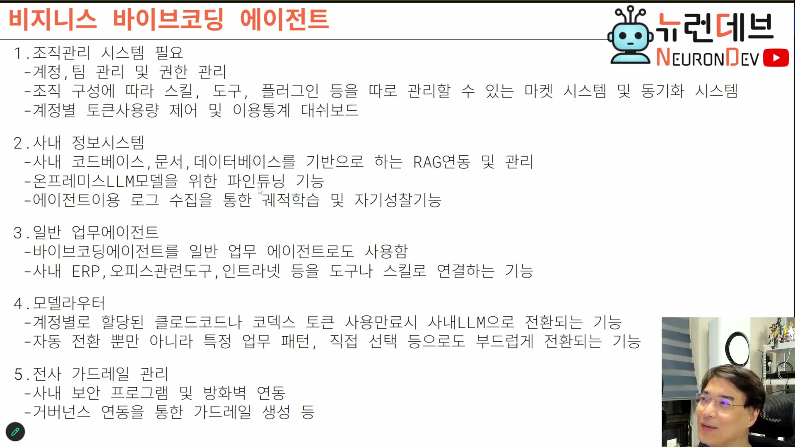

# 07. 비즈니스 요구사항 5종 — 기업이 실제로 요구하는 것

## 학습 목표

산업용 에이전트에 요구되는 5개 영역을 각각 "왜 그 요구가 생기는가"까지 이해한다. 각 항목이 에이전트 코어와 별개의 시스템을 요구한다는 것, 그래서 제품 범위가 코딩 에이전트보다 훨씬 넓어진다는 것을 안다.

## 선수 지식

- 6장: 온프레미스가 시장을 만든다는 인식
- ep01의 RLVR·궤적 학습 개념 (파인튜닝 요구를 이해하는 데 필요)

## 핵심 원리 (WHY) — 요구사항은 "코딩 도구"의 경계를 넘는다

다섯 영역 모두 **에이전트 루프와 무관한 시스템**이다. 그런데 이것들이 실제 구매 결정을 만든다. 즉 제품 범위를 코딩 에이전트로 잡으면 팔 수 없다.

## 필수 지식 (HOW) — 1. 조직관리 시스템

- **계정·팀 관리 및 권한 관리**
- **마켓 시스템 + 동기화**: 조직 구성에 따라 스킬·도구·플러그인을 따로 관리한다. "우리 팀은 이 스킬을 다 깐다" 같은 동기화가 필요하다.
- **계정별 토큰 사용량 제어 + 이용통계 대시보드**: 경영진이 보고 싶어 하는 화면이다.

> 참고로 **엔터프라이즈 코덱스를 사도 별게 없다** — 조직 전용 마켓을 열어주는 정도다. 거기에 그 회사 전용 스킬을 올릴 수 있다.

## 필수 지식 (HOW) — 2. 사내 정보시스템

### RAG 연동

사내 코드베이스, 문서, 데이터베이스, Q&A 데이터베이스, 고객 상담 이력까지 전부 연동 대상이다.

여기서 나오는 실무 질문들이 그대로 난이도다.

> 이걸 어떻게 RAG로 만들 것인가. **코드 RAG는 또 어떻게 만들 것인가.** PDF는 어떻게 밀어 넣고, ARS로 온 통화 기록은 어떻게 넣을 것인가. **일반적인 납품 프로젝트의 귀찮음이 전부 따라온다.**

### 온프레미스 LLM 파인튜닝

기업은 자기네 작은 모델에 파인튜닝을 요구한다. 강의가 든 실제 사례가 요구의 성격을 잘 보여준다.

> 산업용 로봇에 들어가는 **모션 제어기**를 만드는 회사다. 그 칩에는 전용 C 코드와 라이브러리가 있고, **반드시 그 라이브러리대로 코딩되어야 한다.** 그런데 모델이 자꾸 엉뚱한 것을 가져다 쓴다. "반드시 이걸로 코딩해주는 모델로 튜닝해달라"는 요구가 나온다.

해법으로 언급된 것이 **RLVR을 통한 선호 정렬**이다. 그런 업무가 왔을 때 그 라이브러리를 쓰도록 모델을 정렬시킨다. 납품된 모델이 회사 규격대로 코드를 만든다는 것이 판매 포인트가 된다.

### 로그 기반 궤적 학습·자기성찰

에이전트 이용 로그를 수집해 궤적 학습을 시키고, 자기성찰 기능을 만든다. 이 로그가 곧 학습 데이터셋이 된다 (→ 9장의 정보검색센터와 이어진다).

## 필수 지식 (HOW) — 3. 일반 업무 에이전트

**바이브 코딩 툴을 코딩에만 쓴다고 생각하면 안 된다.**

> 개발자들은 이미 채팅을 안 쓴다. 웹 검색이든 귀찮은 일이든 전부 코덱스·클로드 코드에게 시킨다. **권한을 훨씬 많이 갖고 있기 때문**이다. "컴퓨터에서 뭐 찾아서 웹 검색 좀 해봐", "어디 접속해서 이것 좀 가져와봐" — 다 시킨다. 기업 사용자도 똑같이 한다.

그래서 일반 업무 에이전트가 되려면 다음이 연결되어야 한다.

- 사내 ERP 연동
- 인트라넷 연동
- 오피스 관련 도구 연결 (도구나 스킬로)

전형적인 사용 예: **"내 하드에 기안서 있는데 그것 좀 기안해줘."**

> 산업용에서는 이것이 손해가 아니다. **요구 기능을 추가할 때마다 돈을 받으면 된다.** "고객님 돈 주시면 하나씩 추가해 드리겠습니다"가 성립한다. 대신 **다 만들 줄 알아야 한다.**

## 필수 지식 (HOW) — 4. 모델 라우터

기업이 가장 크게 요구하는 기능 중 하나다. 요구가 생기는 구조가 명확하다.

> 온프레미스를 원하면서도 코덱스·클로드 코드는 **기업 계약으로 여전히 쓴다.** 엔터프라이즈 플랜에서 개인에게 토큰이 할당되어 있다. 그래서 가장 많은 요구가 이것이다 — **할당 토큰이 소진되면 사내 LLM으로 전환해달라. 끊김 없이 계속 일할 수 있게.**

필요한 것:

- 토큰 사용량과 계정을 연동해 추적
- 소진 시 사내 LLM으로 **자동 전환**
- 자동 전환뿐 아니라 **특정 업무 패턴별 전환**, **직접 선택**도 부드럽게

여기에 이런 요구까지 붙는다.

> "혹시 업무 중에 쉬운 것들은 사내 LLM으로 돌다가, 어려운 것만 코덱스로 안 되냐? 자동으로 안 되냐?"

## 필수 지식 (HOW) — 5. 전사 가드레일 관리

### 보안 프로그램·방화벽 연동

이것이 실무에서 가장 지저분한 영역으로 언급된다.

> 파수 같은 문서보안 툴을 뚫어본 적 있는가. NHN 그룹웨어 계열의 설치형 제품들, 그 외 회사마다 쓰는 파일 암호화 툴들 — **이런 것 때문에 동작이 안 된다.**

납품 제품이므로 **여러 방화벽·보안 프로그램과 호환되게 만들어야 한다.** 그것도 매우 힘든 일이다.

### 거버넌스 → 가드레일 변환

큰 회사에는 거버넌스가 있다. 어려운 단어지만 실체는 **정책**이다.

> "우리 회사는 무엇을 할 때 이런 절차로 한다", "데이터를 USB로 갖고 나갈 수 없다" — 이런 것이 다 거버넌스다. 사내 규정으로 존재하고, **에이전트도 그것을 지켜야 한다.**

그래서 **거버넌스를 가드레일로 변환해 연동**하는 기능이 필요하다.

> **"비즈니스용으로 제품을 만들려면 수많은 난관이 추가로 기다리고 있다. 이래서 기업들이 사는 것이다."**

## 이 지식이 판단에 쓰이는 자리

- **제품 로드맵을 짤 때**: 5개 영역은 독립적으로 팔 수 있는 단위다. 전부 만들지 않고도 착수할 수 있으나, 어느 것을 먼저 할지는 타깃 고객의 심사 항목에 따라 정한다.
- **RAG 범위를 정할 때**: 코드·문서·DB·통화기록은 각각 다른 파이프라인이다. "RAG 연동"을 한 항목으로 견적하면 반드시 초과한다.
- **모델 라우터를 설계할 때**: 최소 기능은 "누가 어떤 모델을 쓸지 내려주기"이고, 완전 기능은 "토큰 소진 감지 → 무중단 전환"이다. 둘 사이 격차가 크므로 단계적으로 잡는다 (→ 9장에서 강의는 "간략 구현"을 택한다).

### ⚠️ 암기 필수

- [ ] **5개 영역: 조직관리 / 사내 정보시스템 / 일반 업무 에이전트 / 모델 라우터 / 전사 가드레일.** 전부 에이전트 코어 밖의 시스템이다.
- [ ] **모델 라우터의 핵심 요구 = 엔터프라이즈 할당 토큰 소진 시 사내 LLM 무중단 전환.** 토큰 사용량–계정 연동이 전제다.
- [ ] **파인튜닝 요구의 전형 = 자사 전용 라이브러리를 반드시 쓰게 만들기.** 수단은 RLVR 선호 정렬.
- [ ] **바이브 코딩 툴은 일반 업무 에이전트로도 쓰인다** — ERP·인트라넷·오피스 도구 연결이 요구된다. 권한이 많아서 사용자가 다 시킨다.
- [ ] **가드레일 = 사내 보안 프로그램 호환 + 거버넌스(사내 규정)의 가드레일 변환.** 파일 암호화 툴이 동작을 막는 것이 실제 장애 요인이다.
- [ ] **기능 추가는 과금 기회다** (산업용). 대신 전부 만들 수 있어야 한다.
