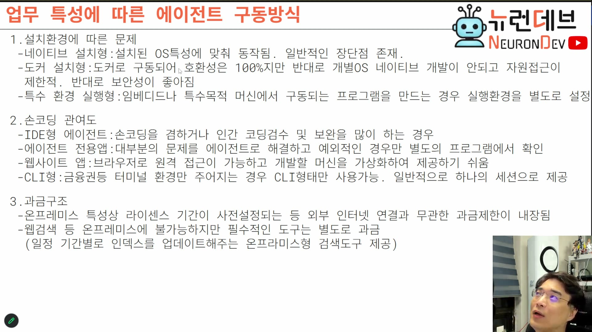

# 08. 업무 특성에 따른 구동 방식 — 설치 환경 · 손코딩 관여도 · 과금

## 학습 목표

같은 에이전트를 어떤 형태로 납품할지 결정하는 세 축을 안다. 특히 "도커가 보안상 유리하다"는 일반론이 **실제 기업 현장에서 뒤집히는 이유**를 알고, CLI형이 왜 구조적으로 다른 제품인지 이해한다.

## 선수 지식

- 2장: 세션별 인스턴스 vs 스트림 서버 (CLI형의 제약을 이해하는 데 필요)
- 6장: 온프레미스 = 인터넷 없음이라는 전제

## 핵심 원리 (WHY) — 배포 형태가 아키텍처를 되돌려 바꾼다

세 축이 독립적으로 보이지만 아니다. CLI형을 택하면 세션 모델이 달라지고, 도커를 택하면 네이티브 개발이 막히고, 온프레미스 과금을 택하면 시간 신뢰 문제가 생긴다. **배포 결정이 코어 설계로 역류한다.**

## 필수 지식 (HOW) — 축 1. 설치 환경

### 네이티브 설치형

코덱스·클로드 코드가 이 방식이다. OS에 직접 프로그램을 설치하고, 프로젝트 폴더도 OS에 직접 만든다.

**장점**: 윈도우에서 되는 건 다 된다. 윈도우용 프로그램을 만들 수 있고, 윈도우가 컴파일할 수 있으면 에이전트도 컴파일할 수 있다.

**단점**: OS를 직접 건드리므로 **보안 설정이 까다롭다.**

**성능 문제 — 트레이닝 환경과의 불일치**: 도구 사용은 모델이 학습한 환경에 맞춰져 있다. 그 환경과 달라지면 성능이 안 나온다. 기본적으로 **리눅스 환경으로 트레이닝**되어 있어서, 그래서 에이전트가 **WSL에서 돌게 바꿀 수 있는 설정**이 존재한다.

셸도 고를 수 있다. 그런데 파워셸을 쓰면 오류가 많다.

> **파워셸 오류의 실체**: 파워셸의 기본 문자 인코딩이 OS 기본 언어를 따라가서 **CP949**가 된다. 이게 계속 문제를 일으킨다. 싫으면 **파워셸 7.0으로 업데이트**해야 하고, 그러면 기본을 UTF-8로 지정할 수 있다.

### 도커 설치형

도커 안에서 구동되므로 **코드가 리눅스만 맞추면 된다.**

**장점**: 보안이 거의 완벽하다. 에이전트가 무슨 짓을 하더라도 컨테이너 안에서만 일어난다. 그래서 웹 프로젝트나, 회사가 원하는 리눅스 기반 이미지 세트가 있는 경우에 좋다. 안드로이드 개발이면 도커에 안드로이드 이미지를 띄우고 그 안에서 개발하면 되므로 **권한 문제가 깔끔하게 정리된다.**

**단점**: 개별 OS의 네이티브 개발이 안 된다. 도커 바깥을 인식하기 어렵다. 자원 접근이 제한된다. 프로젝트를 만들어도 **도커 볼륨에 잡힌 하위 폴더에서만** 가능하다.

### ⚠️ 현장에서 뒤집히는 지점 — RHEL + 사내 보안

여기가 이 장에서 가장 실전적인 정보다.

> 실제 필드에 나가보면 **RHEL(레드햇 엔터프라이즈)을 쓰는 데가 많다.** 그리고 엔터프라이즈 레드햇에 사내 보안이 걸려 있으면 **도커 컨테이너를 막아놓는다.** (크롬 시크릿 탭이 안 뜨는 것과 같은 류의 정책이다.)
>
> **그래서 도커로 만들면 엔터프라이즈에서 안 되는 경우가 많아 네이티브로 만들어야 하는 경우가 많다.**

강의는 처음에 "우리는 도커 설치형으로 만들 것"이라고 했다가, 이 이유를 설명하면서 **네이티브 설치형으로 정정**한다. 일반론(도커가 안전하다)이 고객 환경 제약(컨테이너 차단)에 의해 뒤집히는 사례다.

### 특수 환경 실행형

임베디드나 특수 목적 머신에서 구동되는 프로그램을 만드는 경우다. 컴파일도 안 되고 특정 마더보드가 필요한 경우가 있다.

> 이런 에이전트들이 **산업용**이다. 고객이 그 환경을 원하면 **그 환경을 가상으로 구성하고 그 위에서 도는 에이전트를 만들어줘야 한다.** 그래야 에이전트가 만든 프로그램이 실제로 동작한다.

## 필수 지식 (HOW) — 축 2. 손코딩 관여도

회사마다 사람이 코드에 손을 대는 정도가 다르고, 그에 따라 클라이언트 형태가 갈린다.

| 형태 | 언제 선택되는가 | 특징 |
|---|---|---|
| **IDE형** | 손코딩을 겸하거나 인간의 코딩 검수·보완이 많은 경우 | 유명한 IDE 두 개로 좁혀진다 — **자바 친화 회사는 인텔리제이(커뮤니티) 플러그인**, 그 외는 **VS Code 플러그인** |
| **에이전트 전용 앱** | 대부분의 문제를 에이전트로 해결하고 예외만 별도 확인하는 경우 | **이미 바이브 코딩에 숙달된 회사**가 선호한다 |
| **웹사이트 앱** | 설치 자체가 안 되는 환경 | 설치 금지가 많아 **브라우저를 이용**한다. 원격 접근이 가능하고 개발 머신을 가상화해 제공하기 쉽다 |
| **CLI형** | 금융권처럼 **터미널 환경만 주어지는** 경우 | 아래 참조 |

### CLI형의 구조적 차이

> **CLI형은 세션 하나만 감당한다.** 이것이 앞의 세 형태와의 가장 큰 차이다. 세션을 여러 개 띄우려면 창을 여러 개 띄워야 한다(tmux 등).

앞의 세 형태는 창 여러 개·세션 여러 개를 한꺼번에 관리하므로 편하다. 즉 **CLI형을 지원하려면 "일반적으로 하나의 세션으로 제공"이라는 제약을 제품 사양에 명시**해야 한다.

## 필수 지식 (HOW) — 축 3. 과금 구조

### 라이센스 기간과 시간 신뢰 문제

산업용 납품은 보통 **라이센스 기간을 사전 설정**한다. 온프레미스라 사후 관여를 못 하므로, 강의 표현으로는 **"안에 시간 폭탄을 설치하고 와야 한다."** 기간이 끝나면 자동 종료되고 갱신을 요구한다.

여기서 온프레미스 특유의 문제가 생긴다.

> **인터넷과 무관하다는 것은 타임 서버에 접근할 수 없다는 뜻이다.** 즉 **컴퓨터 시간을 믿어야 한다.** 그런데 라이센스를 속이려고 컴퓨터 시간을 바꾸는 경우가 있다. 그것을 극복할 수 있게 만들어야 한다.

### 웹 검색 대체 — 벡터DB로 판다

웹 검색은 온프레미스에 불가능하지만 필수적이므로 **별도로 과금**한다. 방식은 이렇다.

> 웹 검색은 보통 **벡터DB로 제공**한다. 세상의 모든 구글 웹 인덱스를 가져올 수 없으므로, 기업이 원하는 세트를 구성한다 — 네이버 뉴스 세트 + 나무위키 + 특정 언론 크롤링 등. 그리고 **"이것이 2026년 4월까지의 인덱스다"** 하고 벡터DB에 세팅해준다.
>
> 갱신도 과금 대상이다. "2026년 9월치까지 인덱스를 갱신해드리겠습니다" 하고 **USB를 들고 가서 갱신**한다.

깃허브도 같은 방식으로 처리한다. 개인이 지정한 카테고리에 관련된 저장소를 다운로드해 벡터DB에 밀어넣고 인덱스를 만들어준다.

> 즉 **검색 엔진을 만들어서 납품하는 셈**이다. "온프레미스에서 색을 버라이어티하게 아는가? 죽음이다."

## 이 지식이 판단에 쓰이는 자리

- **설치 형태를 정할 때**: 타깃 고객의 OS와 보안 정책을 먼저 확인한다. RHEL + 사내 보안이면 도커는 후보에서 빠진다. 일반론으로 정하면 납품 단계에서 갈아엎게 된다.
- **클라이언트 형태를 정할 때**: CLI형 요구가 있으면 다중 세션 UI를 전제로 한 설계를 못 쓴다. 세션 모델을 먼저 확정해야 한다.
- **견적을 낼 때**: 웹검색 인덱스 구축·갱신은 별도 항목이다. 검색 엔진 구축 공수가 여기 들어간다.
- **라이센스를 구현할 때**: 시간 조작 방어를 설계에 포함한다. 타임 서버가 없다는 전제에서 시작한다.

### ⚠️ 암기 필수

- [ ] **세 축: 설치 환경(네이티브/도커/특수) × 손코딩 관여도(IDE/전용앱/웹/CLI) × 과금 구조.** 배포 결정이 코어 설계로 역류한다.
- [ ] **도커가 보안상 유리하다는 일반론은 현장에서 뒤집힌다** — RHEL 엔터프라이즈 + 사내 보안은 **도커 컨테이너를 차단**한다. 그래서 네이티브가 필요한 경우가 많다.
- [ ] **네이티브형 성능 문제의 원인 = 모델이 리눅스 환경으로 트레이닝됨.** 그래서 WSL 실행 옵션이 존재한다.
- [ ] **파워셸 오류의 실체 = 기본 인코딩이 OS 언어를 따라 CP949가 되는 것.** 파워셸 7.0에서 UTF-8로 지정 가능.
- [ ] **CLI형은 세션 하나만 감당한다.** 다중 세션은 창을 여러 개 띄워야 한다(tmux). 금융권 등 터미널 전용 환경에서 필수.
- [ ] **IDE형은 인텔리제이(자바 친화 회사) 또는 VS Code 플러그인 둘로 좁혀진다.**
- [ ] **온프레미스 라이센스 = 타임 서버 없음 = 컴퓨터 시간을 믿어야 함.** 시간 조작 방어가 필수.
- [ ] **웹 검색은 벡터DB 인덱스로 대체하고 "언제까지의 인덱스"로 스냅샷 판매한다.** 갱신도 과금 대상(USB 방문 갱신).
