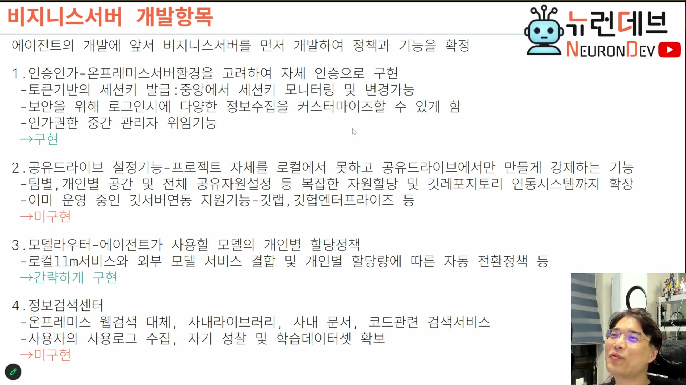

# 09. 비즈니스 서버 개발항목 — 에이전트보다 먼저 만드는 것

## 학습 목표

왜 에이전트가 아니라 **비즈니스(통합 대시보드) 서버를 먼저** 만드는지 이해한다. 4개 개발 항목 각각의 요구사항과, 강의가 어디까지 구현하고 어디를 남기는지(구현 판정)를 안다.

## 선수 지식

- 7장: 비즈니스 요구사항 5종 — 이 장은 그중 실제 구현 계획으로 좁힌 것
- 6장: 온프레미스 = 구글 로그인 같은 외부 인증 불가

## 핵심 원리 (WHY) — 서버가 정책을 확정한 뒤 에이전트가 내려온다

슬라이드 부제가 순서의 이유를 그대로 말한다.

> **"에이전트의 개발에 앞서 비지니스서버를 먼저 개발하여 정책과 기능을 확정"** — 슬라이드 「비지니스서버 개발항목」 부제 `[슬라이드 1:07:39]`

강의의 설명은 이렇다. 에이전트 개발을 먼저 할 것 같지만 아니고, **엔진 서버(통합 대시보드 서버)를 먼저** 만든다. 이것이 만들어지면 **여기서부터 내려와 에이전트들이 동작**한다. 이 서버가 마스터 권한과 각종 설정을 담당한다.

> 그리고 이 서버는 **평범한 웹 서버**다. AI가 관여하지 않는다. `[1:06:30]`

순서를 이렇게 잡는 이유를 설계 관점으로 옮기면 이렇다. 권한·모델 할당·저장 위치·가드레일은 **에이전트가 참조해야 하는 정책**이다. 정책 없이 에이전트를 먼저 만들면, 나중에 정책을 붙일 때 에이전트의 컨텍스트 조립·도구 목록·세션 발급 경로를 전부 다시 손대게 된다 (→ 3장의 도구·스킬 리스트가 계산 결과라는 성질).

## 필수 지식 (HOW) — 1. 인증인가 → **구현**

### 자체 인증이 강제된다

> **온프레미스에서는 구글 로그인이 안 된다.** 그래서 우리가 만들어야 한다. `[1:06:30]`

토큰 기반의 **세션키 발급**이 일반적이다. 이 세션키를 중앙에서 모니터링하고 관리한다.

중앙 통제로 할 수 있는 일:

- **퇴사 시 세션키를 즉시 제거**하고 계정도 제거한다
- 중앙 가드레일에 걸리면(수상한 동작 감지) **세션키를 즉시 만료**시켜 더 작업하지 못하게 한다

### 로그인 시 풋프린트 수집 — 회사마다 다르다

보안 정책 때문에 로그인 시점에 무엇을 남길지가 회사마다 크게 다르다.

> 사내 IP, 부서, 지급받은 노트북에 깔려 있는 보안 코드 등 — **회사마다 요구가 정말 다르므로 커스터마이즈할 수 있어야 한다.** 보안 정책 때문에 로그인 시 엄청나게 많은 풋프린트를 남긴다. "네가 바이브 코딩을 쓰는 조건이 뭐야?"를 확인하는 절차다. `[1:07:00–1:07:30]`

### 중간관리자 위임 — 관리자 페이지가 사람마다 달라진다

> AX팀이 이걸 다 하지 않는다. 팀장에게 "네 팀 애들은 네가 알아서 해"라고 **위임하는 기능**이 필요하다. `[1:08:00]`

이 요구가 UI 설계에 미치는 영향이 크다.

> 위임이 있다는 것은 **관리자 페이지가 로그인하는 사람에 따라 다르게 나온다**는 뜻이다. 이것도 까다롭지만 **이게 없이는 산업용이 안 된다.** `[1:08:00]`

### 인가의 대상

무엇에 대해 권한을 나누는가:

- **도구 접근** — 예: 사내 보안 문서 1등급에 접근할 수 있는 도구 / 없는 도구
- **저장소 접근**
- **특정 스킬 접근** — 우리 팀만 볼 수 있는 스킬
- **RAG 데이터 접근** — 우리 팀만 접근하는 데이터

즉 인가가 3장의 "도구·스킬 리스트 계산"에 직접 입력된다.

## 필수 지식 (HOW) — 2. 공유드라이브 설정 → **미구현**

### 로컬에서 프로젝트를 만들지 못하게 강제한다

많은 회사가 요구하는 기능이다.

> **프로젝트 자체를 로컬에서 생성할 수 없고, 공유드라이브에서만 생성할 수 있게 강제**한다. 자기 컴퓨터에서는 못 만든다. **그래야 소스 코드가 노출되지 않는다.** `[1:08:30–1:09:30]`

강의는 이것이 "깃에서만 생성 가능"과는 다르다고 구분한다. 공유드라이브에 들어갈 수는 있지만, **프로젝트 생성 자체가 그 안에서만** 되는 것이다.

### 이 요구가 끌고 오는 것들

> 팀별·개인별 공간, 전체 공유 자원 설정 — **S3 버킷 설정과 똑같은 일**이 여기서 일어난다. `[1:09:30]`
>
> 그리고 단지 로컬 폴더의 문제가 아니다. **레포지토리 연동까지 여기서 난리가 난다.** 사내에서 이미 온프레미스로 운영하는 **GitLab이나 GitHub Enterprise와 연동**해야 한다. `[1:09:30–1:10:00]`

강의는 이 항목을 **미구현**으로 남긴다. "개념만 있으면 되고, 나중에 하면 된다. 다만 기업 현장에 이 요구가 있다."

## 필수 지식 (HOW) — 3. 모델 라우터 → **간략하게 구현**

7장의 완전 기능(토큰 소진 감지 → 무중단 전환)과 달리, 여기서는 최소 기능으로 좁힌다.

> 산업용에서는 **회사가 LLM 서버를 소유**하고 있으므로 회사가 "어떤 모델을 쓰라"고 내려준다. **개인이 마음대로 선택하는 게 아니다.** `[1:13:00]`
>
> 그래서 모델 라우터의 **최소 기능은 "개인이 사용해야 할 모델이 무엇인지 내려주기"**다. 이건 만들어줘야 한다. `[1:13:00]`

즉 개인별 할당 정책 + 로컬 LLM과 외부 모델 서비스의 결합이 항목이지만, 1차 구현은 "할당 내려주기"까지다.

## 필수 지식 (HOW) — 4. 정보검색센터 → **미구현**

- **온프레미스 웹검색 대체** (→ 8장의 벡터DB 인덱스)
- **사내 라이브러리·사내 문서·코드 관련 검색 서비스**
- **사용 로그 수집 → 자기 성찰 → 학습 데이터셋 확보** → 정기적 튜닝

> 이것들을 다 묶어야 비싸게 팔린다. 오픈코드 같은 것이 공짜로 배포되는 상황에서 **단순한 에이전트 프레임만으로는 몇억 원씩 받을 수 없다.** `[1:13:30–1:14:00]`

## 구현 판정 요약

| 항목 | 판정 | 이유 |
|---|---|---|
| 인증인가 | **구현** | 이게 없으면 산업용이 성립하지 않는다 (중간관리자 위임 포함) |
| 공유드라이브 설정 | **미구현** | 요구는 실재하나 이번 범위 밖. 개념만 확보 |
| 모델 라우터 | **간략 구현** | 최소 기능(모델 할당 내려주기)만 |
| 정보검색센터 | **미구현** | RAG·검색엔진 구축은 별도 규모의 작업 |

이 판정 자체가 **범위 설정 예시**로 볼 가치가 있다. 요구사항 전체를 나열한 뒤(7장) 실제 착수 범위를 좁히고(9장), 남긴 것은 "요구는 있으나 이번엔 안 한다"로 명시한다.

## 이 지식이 판단에 쓰이는 자리

- **개발 순서를 정할 때**: 정책 서버 → 에이전트 순서를 지킨다. 반대로 하면 정책을 붙일 때 에이전트 코어를 재작업한다.
- **인증을 설계할 때**: 세션키 즉시 만료(퇴사·가드레일 위반)를 처음부터 넣는다. 나중에 붙이면 이미 발급된 키의 생명주기를 못 잡는다.
- **관리자 UI를 설계할 때**: 위임이 있으면 화면이 역할별로 달라진다. 단일 관리자 페이지 전제로 만들면 전면 개편이 된다.

### ⚠️ 암기 필수

- [ ] **에이전트보다 비즈니스 서버(통합 대시보드)를 먼저 만든다** — 정책과 기능을 확정한 뒤 에이전트가 그것을 받아 동작한다. 이 서버는 AI가 관여하지 않는 평범한 웹 서버다.
- [ ] **온프레미스에서는 구글 로그인이 안 된다 → 자체 인증 + 토큰 기반 세션키 발급 + 중앙 모니터링**이 기본형.
- [ ] **세션키 즉시 만료 트리거 둘: 퇴사 / 중앙 가드레일 위반.**
- [ ] **로그인 풋프린트 수집 항목은 회사마다 달라 커스터마이즈가 필수다.**
- [ ] **중간관리자 위임이 있으면 관리자 페이지가 로그인 주체에 따라 달라진다.** 없으면 산업용이 안 된다.
- [ ] **인가 대상 = 도구 / 저장소 / 스킬 / RAG 데이터.** 이것이 3장의 도구·스킬 리스트 계산에 입력된다.
- [ ] **공유드라이브 강제 = 프로젝트 생성 자체를 공유드라이브에서만 허용** (소스 노출 방지). 팀·개인 공간 설정은 S3 버킷 설정과 같은 일이고, 사내 GitLab·GitHub Enterprise 연동까지 확장된다.
- [ ] **모델 라우터의 최소 기능 = 개인이 쓸 모델을 서버가 내려주기.** 산업용에서는 회사가 모델을 지정한다.
