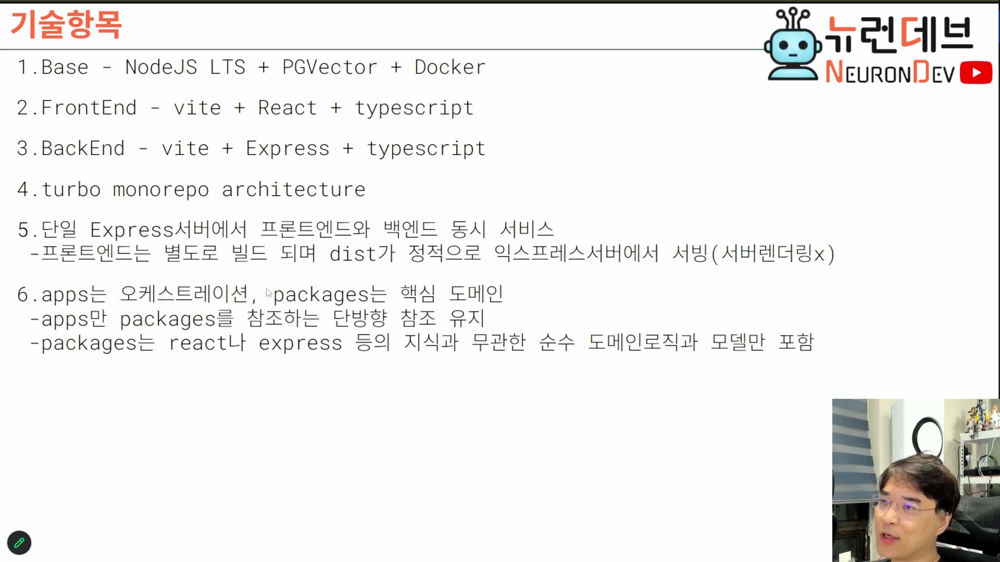

# 10. 기술 스택 — 터보 모노레포와 단일 서버 서빙

## 학습 목표

강의가 고른 스택의 각 선택이 앞 장의 어떤 요구에서 나왔는지 연결한다. 특히 PGVector 하나에 벡터 검색과 이벤트 스트림을 함께 얹는 결정, 그리고 `apps`/`packages` 단방향 참조 규칙의 의미를 이해한다.

## 선수 지식

- 2장: 세션을 이벤트 스트림으로 구현한다는 결정
- 7~9장: RAG·정보검색 요구, 통합 대시보드 서버가 먼저라는 순서

## 핵심 원리 (WHY) — 스택은 앞 결정들의 귀결이다

각 항목이 앞 장의 요구와 1:1로 이어진다.

| 선택 | 어디서 나온 요구인가 |
|---|---|
| Docker 위 Node.js LTS | 8장의 설치 환경 (개발 단계 기준) |
| **PGVector** | 7·9장의 RAG·정보검색 요구 → 벡터 검색 필요 |
| PGVector에 **이벤트 스트림 플러그인** | 2장의 스트림 서버 결정 → 카프카 대체 |
| Express 단일 서버 | 웹소켓 + 일반 백엔드를 하나로 (2장의 스트림 구독) |
| 터보 모노레포 | 이종 프로젝트(C++·파이썬 포함) 통합 빌드 |
| apps/packages 단방향 | 도메인 순수성 유지 |

## 필수 지식 (HOW) — 베이스: Docker + Node.js LTS + PGVector

- **Docker 위에 Node.js LTS** — 버전은 24·25·26 중 하나를 고른다.
- **PGVector** — 원래 PostgreSQL에 벡터 확장을 꽂은 것이다.

여기서 눈여겨볼 결정이 있다.

> **PGVector에 카프카를 대신할 이벤트 스트림 플러그인도 꽂는다.** 이것을 베이스로 해서 돌린다. `[1:15:00]`

즉 **벡터 검색과 이벤트 스트림을 별개 인프라로 두지 않고 PostgreSQL 한 곳에 모은다.** 온프레미스 납품이라는 맥락에서 보면 합리적이다 — 설치·운영해야 하는 미들웨어가 하나 줄면 그만큼 고객사 환경에서 깨질 지점이 줄어든다. (2장에서 본 대로 처리량은 모델 추론이 이미 병목이므로 카프카급 스루풋이 필요하지 않다.)

## 필수 지식 (HOW) — 프론트엔드·백엔드

- **프론트엔드**: React + TypeScript (+ Tailwind 정도)
- **백엔드**: Express + TypeScript — **평범하게** 구현한다

Express를 고른 이유가 명확하다.

> **Express 서버가 웹소켓 서버도 되고 일반적인 웹 백엔드도 되니, 하나만 구동하면 다 된다.** `[1:15:00–1:15:30]`

### 서버 렌더링을 쓰지 않는다

> **"서버 렌더링을 안 쓸 거예요. 문제를 많이 일으켜서."** `[1:17:30]`

대신 이렇게 한다.

> **"프론트엔드는 별도로 빌드 되며 dist가 정적으로 익스프레스서버에서 서빙(서버렌더링x)"** — 슬라이드 5번 항목 `[슬라이드 1:19:12]`. 즉 프론트엔드 서버와 백엔드 서버를 따로 만들지 않고 **서버 한 대에서 다 한다.** `[1:18:00–1:18:30]`

빌드는 따로, 서빙은 한 대다. 백엔드 번들 빌드 시점에 프론트 `dist`를 정적으로 서빙하는 경로가 잡히도록 구성한다.

## 필수 지식 (HOW) — 터보 모노레포 아키텍처

### 자바스크립트 프로젝트만 담지 않는다

이것이 이 선택의 핵심 이유다.

> **터보는 하부에 꼭 자바스크립트 프로젝트만 있을 필요가 없다. 아무 프로젝트나 있으면 되고, 다 빌드해주고 다 통합할 수 있다.** `[1:16:00–1:16:30]`

강의의 실제 저장소에는 `apps` 안에 **라마 C++ 백엔드**를 만드는 프로젝트와 웹 서비스 프로젝트가 함께 들어 있다. 예전에는 파이썬도 많이 들어 있었다. C++이 만들어내는 `artifacts` 같은 것도 통합된다.

> **"이것저것 다 집어넣고 돌리기가 편하다."** `[1:17:30]`

### apps / packages 의 역할 분담

터보가 제시하는 구조를 강의는 이렇게 요약한다.

| 디렉토리 | 담는 것 | 성격 |
|---|---|---|
| **`apps`** | 빌드 단위의 서비스들 | **오케스트레이션** |
| **`packages`** | apps가 참조할 라이브러리들 | **핵심 도메인** |

`packages`에 배치한 것들은 `node_modules`에 심볼릭하게 나타나 apps에서 패키지로 참조된다(예: `linker-domain`, `llama-domain`).

### 단방향 참조 규칙

> **"apps만 packages를 참조하는 단방향 참조 유지"** — 슬라이드 6번 항목 `[슬라이드 1:19:12]`. `packages`가 핵심 도메인이므로 오케스트레이션을 참조할 리가 없다. `[1:19:00]`
>
> **"packages는 react나 express 등의 지식과 무관한 순수 도메인로직과 모델만 포함"** — 슬라이드 6번 항목 `[슬라이드 1:19:12]`. 실제로 `packages`의 의존성을 열어 보면 최소한만 있다. `[1:19:30]`

이 규칙의 의미는 명확하다. 도메인이 프레임워크를 몰라야 프레임워크를 바꿀 때 도메인이 살아남는다. 온프레미스 납품처럼 **환경이 고객마다 달라지는 제품**에서는 이 경계가 특히 값을 한다 — 8장에서 본 대로 배포 형태(도커/네이티브/IDE/CLI/웹)가 고객마다 바뀌는데, 그 변화가 `apps` 쪽에서만 일어나게 막아준다.

> 라이브러리는 많이 쓰지 않는다. **"기술 스택이 복잡해봐야 소용없으니 이 정도에서 정리한다."** `[1:20:00]`

## 다음 단계 (강의 예고)

- 다음 주부터 이 베이스로 **상세 구현**에 들어간다. 지금까지 이야기한 것 중 앞쪽부터 어떻게 구현되고 개발되는지를 말과 구현체로 보여준다.
- **비즈니스 서버는 9장의 범위까지만** 구현한다.
- 그 다음 회차에서 **에이전트**를 만든다.
- 수강자는 구현 계획표를 보고 자기 에이전트에게 시켜 만들어보고 스크린샷을 공유하는 방식으로 참여한다. (→ 5장의 팀 운영 모델을 개인 학습에 적용한 형태)

## 이 지식이 판단에 쓰이는 자리

- **인프라 개수를 정할 때**: 온프레미스 납품이면 미들웨어 수가 곧 장애 지점 수다. PostgreSQL 하나로 벡터+스트림을 처리하는 선택이 그 예다.
- **모노레포 도구를 고를 때**: 하부에 비-JS 프로젝트(C++·파이썬)가 있으면 터보처럼 언어 중립적으로 빌드를 태울 수 있는지가 기준이 된다.
- **도메인 경계를 그을 때**: `packages`의 `package.json` 의존성 목록이 곧 경계 검증 도구다. 프레임워크가 들어오면 경계가 무너진 것이다.

### ⚠️ 암기 필수

- [ ] **베이스 = Docker + Node.js LTS + PGVector.** PGVector는 PostgreSQL + 벡터 확장.
- [ ] **PGVector에 이벤트 스트림 플러그인을 얹어 카프카를 대체한다** — 온프레미스에서 미들웨어 수를 줄이는 선택. 처리량은 모델 추론이 병목이라 충분하다.
- [ ] **Express 하나로 웹소켓 + 일반 백엔드를 겸한다.** 서버 렌더링은 쓰지 않고, 프론트 `dist`를 백엔드가 정적 서빙한다 (빌드는 따로, 서빙은 한 대).
- [ ] **터보 모노레포는 하부가 JS 프로젝트가 아니어도 된다** — C++·파이썬까지 통합 빌드된다.
- [ ] **`apps` = 오케스트레이션(빌드 단위 서비스), `packages` = 핵심 도메인(라이브러리).**
- [ ] **참조는 `apps` → `packages` 단방향.** `packages`에는 react·express 지식과 무관한 순수 도메인 로직과 모델만 들어간다.
