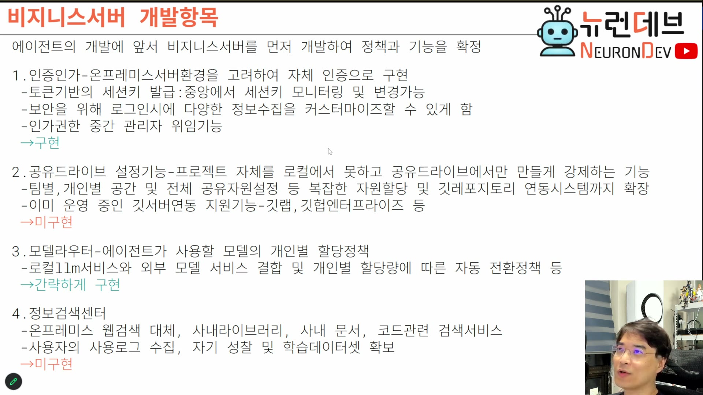

# 00. 3강 개요 — 시연이 아니라 참조 구현이다

## 학습 목표

이 회차를 무엇으로 대해야 하는지 정한다. 강의가 낸 과제가 "이해하라"가 아니라 **"같은 계획표로 네 에이전트에게 시켜서 만들어 와라"**임을 알고, 그 과제를 하려면 무엇을 알아야 하는지의 지도를 갖는다.

## 선수 지식

- 2강 전체, 특히 9장(비즈니스 서버 개발항목) — 이 회차는 그 계획표의 **실행 결과**다
- 2강 5장(팀 운영 모델), 1강 3·4장(도구·훅) — 에이전트에게 시키는 쪽의 배경

## 핵심 원리 (WHY) — 강의가 낸 과제를 먼저 읽는다

2강 마지막 2분에 이 회차의 성격이 정해져 있다.

> 다음주부터 요거 베이스로 여지껏 떠들었던 것 중에 요거부터 상세하게 들어가서 어떤 식으로 구현되고 어떻게 개발하는지에 대해서 말로 하고 **구현체도 보여드리고** 그럴 거야. 여러분들과 함께 하나하나 만들어 보고 — **여러분들도 이 구현계획표를 보고 여러분들 에이전트한테 시켜 가지고 만들고 스크린샷 공유하고** 뭐 이런 식으로 진행할 거거든요. 같이 만들어 보면 되지, **어차피 코딩 우리가 안 한다니까.**
>
> 오늘 여기까지. 다음 주에는 요거 요거 구현하는 걸로 나오고, **딱 비즈니스 서버는 여기까지만 구현할 거구요. 그 다음번에는 바로 에이전트 만들 거예요.**

세 가지가 확정된다.

1. **3강의 화면은 정답이 아니라 참조 구현이다.** 같은 계획표를 받은 사람이 만든 한 가지 답이고, 학습자도 자기 답을 만들어야 한다.
2. **만드는 주체는 에이전트다.** "어차피 코딩 우리가 안 한다" — 그래서 재현해야 하는 능력은 코딩이 아니라 **지시**다. 이 회차에서 스킬 문서가 가장 값진 산출물인 이유가 이것이다(5·6장).
3. **범위가 닫혔다.** 비즈니스 서버는 3강으로 끝이고 다음은 에이전트다. 그러니 여기서 접은 것은 "다음에 할 것"이 아니라 **접은 채로 넘어가는 것**이다 — 무엇을 접었는지 아는 게 중요해진다(1장).

## 필수 지식 (HOW) — 계획표가 이 회차의 목차다

2강이 확정한 개발항목이 그대로 이 회차의 채점표다.



```
에이전트의 개발에 앞서 비지니스서버를 먼저 개발하여 정책과 기능을 확정

1. 인증인가 — 온프레미스서버환경을 고려하여 자체 인증으로 구현        → 구현
   - 토큰기반의 세션키 발급: 중앙에서 세션키 모니터링 및 변경가능
   - 보안을 위해 로그인시에 다양한 정보수집을 커스터마이즈할 수 있게 함
   - 인가권한 중간 관리자 위임기능
2. 공유드라이브 설정기능 — 프로젝트를 공유드라이브에서만 만들게 강제     → 미구현
3. 모델라우터 — 에이전트가 사용할 모델의 **개인별** 할당정책          → 간략하게 구현
   - 로컬 llm 서비스와 외부 모델 서비스 결합 및 개인별 할당량에 따른 자동 전환정책
4. 정보검색센터 — 웹검색 대체·사내 문서·코드 검색, 사용로그 수집       → 미구현
```

**항목이 넷이라는 것보다 하위 불릿이 중요하다.** 3강에서 실제로 만들어진 것을 그 불릿과 대조하면 구현·부분·축소·변경이 갈리고, 그 차이가 자기 구현을 설계할 때 필요한 정보다. 대조표는 1장에 있다.

미리 결론 하나만 말하면, **조직 관리는 계획표의 독립 항목이 아니다.** 3강에서 만든 조직 트리는 `1-c 인가권한 중간 관리자 위임기능`의 구현체다. 이걸 별도 기능으로 보면 "왜 조직을 만들었나"의 근거가 끊긴다.

## 필수 지식 (HOW) — 이 회차에서 실제로 배우는 것 세 층

| 층 | 무엇 | 어디서 |
|---|---|---|
| **계획 → 결정** | 계획표의 한 줄이 구현 단계에서 몇 개의 결정으로 갈리는가, 각 결정의 뒤집기 비용 | 1~4장 |
| **결정 → 지시** | 그 결정을 에이전트가 어기지 못하게 어떻게 문장으로 만드는가 | 5·6장 |
| **지시 → 검증** | 시킨 것이 실제로 됐는지 어떻게 확인하고 남기는가 | 7장 |

세 층이 한 바퀴 도는 것이 이 회차이고, 학습자가 자기 구현에서 돌려야 하는 것도 같은 바퀴다. 문서를 다 읽고 나면 8장(도메인 사실)이 그 바퀴를 돌릴 때 참조하는 사실 목록이 된다.

## 필수 지식 (HOW) — 계획표에 없던 것이 들어왔다

3강 산출물에는 계획표의 어느 항목에도 없는 것들이 있다.

- 모노레포 경계(`common`/`server`/`front`)와 프로토콜 타입 위치
- i18n 8개 언어 강제, 리소스 키 타입화
- 퍼미션 미들웨어 층
- 파일 400줄 상한, 5자리 포트
- 날짜별 테스트 리포트 규정

이것들은 **요구사항이 아니라 스킬이 강제한 것**이다. 즉 이 회차에는 **두 개의 입력**이 있다 — 무엇을 만들지 정하는 계획표와, 어떻게 만들지 정하는 스킬셋. 둘은 층이 다르고 수명도 다르다. 계획표는 이 제품의 것이고 스킬은 다음 프로젝트에도 간다.

이 구분이 6장의 주제다.

## 이 지식이 판단에 쓰이는 자리

- **참조 구현을 볼 때**: 화면을 정답으로 베끼지 않는다. 계획표의 어느 줄에 대응하는지, 왜 그렇게 접었는지를 보고 자기 조건에서 다시 결정한다.
- **AI로 만들 때**: 학습 목표를 "코드를 쓸 수 있다"가 아니라 **"어기지 못하게 지시할 수 있다"**로 잡는다.
- **범위를 닫을 때**: 접은 항목을 "다음에"로 미루지 않고 **접었다고 명시**한다. 이 강의가 비즈니스 서버를 3강에서 닫고 에이전트로 넘어가는 방식이 그 예다.

### ⚠️ 암기 필수

- [ ] **3강의 화면은 정답이 아니라 참조 구현이다.** 강의가 낸 과제는 "같은 계획표로 자기 에이전트에게 시켜 만들고 공유하라"다.
- [ ] **재현할 능력은 코딩이 아니라 지시다** — "어차피 코딩 우리가 안 한다". 그래서 이 회차의 최고 산출물은 화면이 아니라 **스킬 문서**다.
- [ ] **입력이 둘이다: 계획표(무엇을 만들지, 이 제품 한정) + 스킬셋(어떻게 만들지, 다음 프로젝트까지 간다).** 층과 수명이 다르다.
- [ ] **조직 관리는 계획표의 독립 항목이 아니라 `인가권한 중간 관리자 위임`의 구현체다.**
