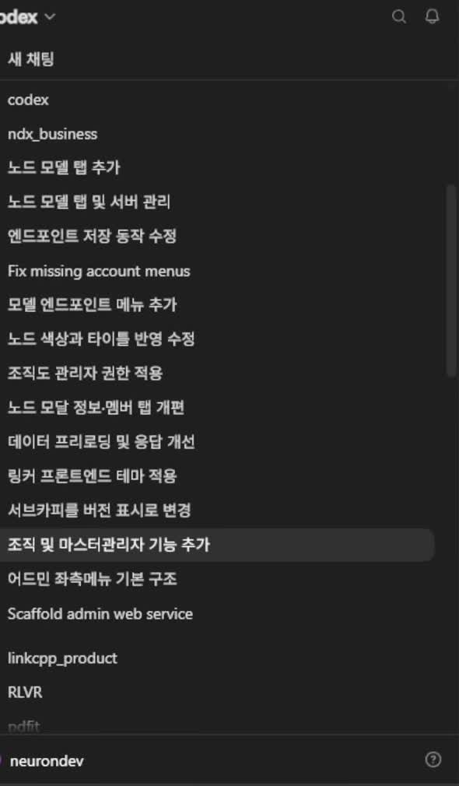

# 00. 3강 개요 — 설계한 것을 실제로 만들어 보이는 회차

## 학습 목표

이 회차가 앞 회차와 성격이 왜 다른지 이해하고, 2강에서 "만들겠다"고 정한 것 중 **무엇이 실제로 구현됐고 무엇이 남았는지** 지도를 갖는다. 그리고 큰 기능을 어떻게 세션 단위로 쪼개 지시했는지 본다.

## 선수 지식

- 2강 전체 — 이 회차는 2강에서 정한 요구사항의 **구현 결과**다. 특히 9장(비즈니스 서버 개발항목)의 구현/미구현 판정표가 이 회차의 목차와 직접 대응한다
- 1강 3장(도구=제어권), 2강 5장(팀 운영 모델) — 스킬로 에이전트를 조이는 방식이 여기서 실물로 나온다

## 핵심 원리 (WHY) — 이론 주와 구현 주를 번갈아 간다

강의는 이 회차부터 **격주 리듬**을 명시한다.

> 뭘 만들지·왜 만드는지에 대한 **이론 설명을 하는 주**가 있으면, 그다음 주에는 **구현 시연을 하는 주**다. 약간 쉬어가는 주인 셈이다.

이 리듬 자체가 학습 설계로 볼 가치가 있다. 이론만 이어 붙이면 "그래서 그게 코드로 어떻게 생겼는데?"가 계속 밀린다. 반대로 구현만 보면 왜 그렇게 만들었는지가 남지 않는다. **직접 어느 정도 서비스를 만들어서 개념을 증명해야** 이론이 검증된다는 것이 이 배치의 근거다.

그래서 이 회차의 문서들은 앞 회차와 읽는 방식이 다르다. 각 장은 "이런 개념이 있다"가 아니라 **"그 개념이 화면과 파일에서 이렇게 생겼다"**를 다룬다.

## 필수 지식 (HOW) — 한 세션에 한 작업

큰 기능을 한 번에 시키지 않는다. 세션 목록이 그 증거다.



아래에서 위로 읽으면 실제 진행 순서가 된다.

```
Scaffold admin web service      ← 스킬로 골격 생성
어드민 좌측메뉴 기본 구조
조직 및 마스터관리자 기능 추가
서브카피를 버전 표시로 변경
링커 프론트엔드 테마 적용
데이터 프리로딩 및 응답 개선
노드 모달 정보·멤버 탭 개편
조직도 관리자 권한 적용
노드 색상과 타이틀 반영 수정
모델 엔드포인트 메뉴 추가
Fix missing account menus
엔드포인트 저장 동작 수정
노드 모델 탭 및 서버 관리
노드 모델 탭 추가               ← 최근
```

읽어 낼 것은 **입자 크기**다. "어드민 사이트 만들어"가 아니라 "노드 모달의 정보·멤버 탭 개편", "노드 색상과 타이틀 반영 수정"처럼 **한 화면의 한 부분**이 한 세션이다. 세션이 작을수록 뽑기(비결정성)가 미치는 범위가 좁아지고, 잘못됐을 때 되돌릴 단위도 그만큼 작아진다 (→ 1강의 폴더 격리와 같은 발상이 시간축에 적용된 것).

시작은 스캐폴딩이다.

> 처음에는 **제 스킬로 스캐폴딩을 쭉 시킵니다.** 스킬이 있기 때문에 한 번에 쭉 만들어 내거든요. 그리고 기본적인 내용을 지시해요.

## 필수 지식 (HOW) — 이번에 만든 것과 남긴 것

2강 9장의 판정표가 여기서 실물이 됐다.

| 항목 | 2강의 판정 | 3강의 실제 |
|---|---|---|
| 인증·인가 | 구현 | **구현** — 계정·세션·승인 정책·마스터 계정 (1·2·3장) |
| 조직 관리 | 구현 | **구현** — 다중 루트 트리·멤버·책임자 범위 (6장) |
| 모델 라우터 | 간략 구현 | **구현** — 엔드포인트·모델·프리셋 등록, 조직별 허용 모델 (5·6장) |
| 공유드라이브 설정 | 미구현 | 미구현 |
| 정보검색센터(RAG) | 미구현 | 미구현 |
| 가드레일·리라이터 | 언급만 | 미구현 — "거지 같은 기능들이 훨씬 많이 있다" |

강의의 요약은 이렇다.

> 이 베이스 어드민을 만들었으면 나중에 여기 추가해 가면 되는 거죠. **반드시 필요한 것부터 만든 거예요.**

무엇이 "반드시"인지도 명시된다: 계정의 토큰·세션 시스템, 감사와 세션 제거, 인퍼런스 서버 등록, 조직별 모델 라우팅. 이 넷이 없으면 에이전트를 붙일 자리가 없다.

## 필수 지식 (HOW) — 이 대시보드에는 AI가 없다

읽기 전에 짚어야 하는 성격이다.

> 이 대시보드는 **순수한 테이블 데이터를 만드는 것뿐**이잖아요. AI를 한 건 아니잖아. 다 CRUD 테이블 데이터일 뿐이잖아. 근데 **이게 필요해. 이 베이스가 없이는 기업용 에이전트를 만들 수가 없어.**

즉 이 회차는 "AI 기능을 어떻게 만드나"가 아니라 **"AI를 기업에 들이기 위한 관리 기반을 어떻게 만드나"**다. 2강 9장의 "이 서버는 평범한 웹 서버다"가 그대로 이어진다.

## 이 지식이 판단에 쓰이는 자리

- **기능을 지시할 때**: 화면 하나가 아니라 화면의 한 부분을 한 세션으로 잡는다. 세션 제목이 곧 되돌리기 단위가 된다.
- **범위를 정할 때**: 다 만들려 하지 않고 "이게 없으면 다음 단계가 아예 막히는 것"만 먼저 만든다. 남긴 것은 남겼다고 명시한다.
- **관리 기반을 얕보지 않기**: CRUD라서 시시해 보이지만, 이것 없이는 에이전트에 권한·모델·감사를 붙일 곳이 없다.

### ⚠️ 암기 필수

- [ ] **이론 주 ↔ 구현 주를 번갈아 간다.** 개념은 직접 만들어 증명해야 검증된다.
- [ ] **한 세션 = 한 작업 단위(화면의 한 부분).** 세션이 작을수록 뽑기의 영향 범위와 되돌리기 단위가 작아진다 — 폴더 격리를 시간축에 적용한 것.
- [ ] **관리 대시보드에는 AI가 없다. 그래도 이것 없이는 기업용 에이전트를 만들 수 없다.** 권한·모델·감사를 붙일 자리가 여기다.
- [ ] **먼저 만들 것 넷: 계정 토큰·세션 시스템 / 세션 감사·제거 / 인퍼런스 서버 등록 / 조직별 모델 라우팅.**
