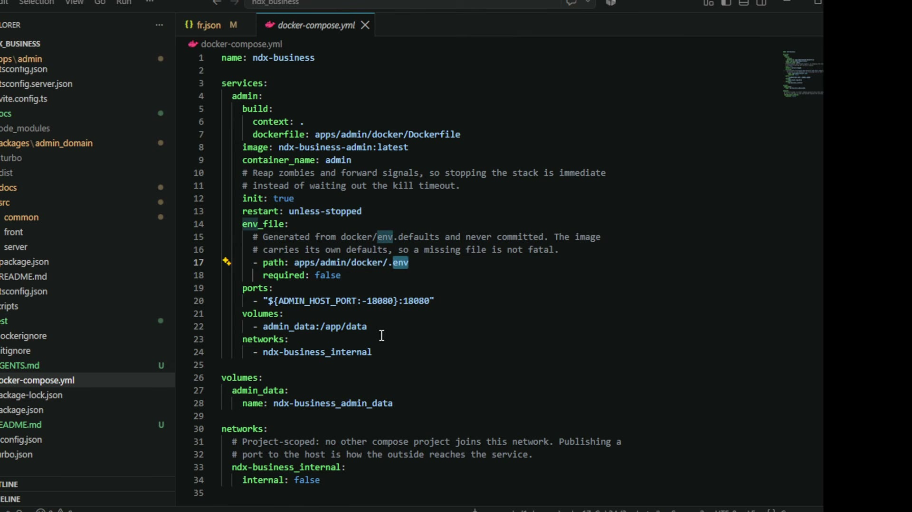

# 02. 계정과 세션 — 계획표 1-a·1-b의 구현 근거

## 학습 목표

계획표의 `자체 인증` / `토큰기반 세션키 발급` / `중앙에서 모니터링 및 변경가능` / `로그인 시 정보수집 커스터마이즈`가 왜 그런 결정으로 내려앉는지 안다. 이 장의 두 결정은 **뒤집기 비용이 매우 높은** 것들이다.

## 선수 지식

- 01장: 이 장이 담당하는 계획표 줄과 그 판정(구현 / 부분)
- 2강 6장: 온프레미스에서 외부 인증이 불가하다는 전제

## 핵심 원리 (WHY) — 저장소는 배포 형태가 정한다

온프레미스 관리 서버는 고객사마다 한 벌씩 들어가고, 동시 사용자는 회사 인원 규모이며, 설치가 쉬워야 한다.

> 사내에서 비즈니스용으로 쓸 거면 **어지간히 대규모로 배포할 게 아니면 그냥 SQLite 써도 충분**하다. 좀 더 가야 된다 그러면 그때 PostgreSQL 깔고 쓰면 된다.

판단이 "데이터가 많냐"가 아니라 **"어떻게 배포되냐"**에 걸려 있다. 이 조건에서 별도 DB 서버는 관리 대상만 하나 더 늘린다.

볼륨이 `admin_data:/app/data` **하나뿐**이라 백업이 "이 디렉토리 하나"가 된다. 온프레미스 납품에서 실질적인 이점이다.

파일시스템 + JSON을 택하지 않은 이유는 둘이다.

> 폴더 나눠 가지고 JSON 쓰는 걸로는 **한계가 금방 와요.** 폴더·파일은 금방 지저분해지기도 하고, **파일 액세스에 대한 동시성은 더 나쁘기** 때문에.

두 번째가 결정적이다. 여러 요청이 같은 JSON을 읽고 쓰면 잠금을 직접 구현해야 하는데, 그건 이미 DB가 하는 일이다.

## 필수 지식 (HOW) — ① 계정 영구 키 (뒤집기 비용: 매우 높음)

계정은 이메일·비밀번호로 정의됐다. 그런데 강의가 곧바로 함정을 짚는다.

> 회사 이메일은 그 사람이 **퇴사하면 없어져야 되거든요.** 그래서 이 이메일이 고유하지가 않아요. 그 사람 퇴사하고 나면 **똑같은 이메일을 신입사원이 다시 받아요.** 많은 회사가 그래요.

`kim@example.com`이 김 대리였다가 다음 해 다른 김 대리가 된다. 이메일을 **영구 키**로 쓰면 두 사람의 이력이 한 계정에 섞이고, **감사가 목적인 시스템에서 "누가"가 무너진다** — 계획표 1-a가 요구한 중앙 모니터링의 값이 사라지는 것이다.

강의는 이 문제를 지금은 열어 둔다("나중에 문제가 되긴 하는데 지금은 이 정도로만"). 하지만 **문제를 인지한 채 보류하는 것과 모르고 지나가는 것은 다르다.**

자기 구현에서 할 일: 이메일은 로그인 수단·표시용으로 쓰되, 감사 로그와 조직 멤버십은 **계정 ID를 참조**하게 한다. 이메일 문자열을 외래키로 박으면 나중에 사번을 도입할 때 이력을 못 옮긴다.

## 필수 지식 (HOW) — ② 세션 토큰의 성질 (뒤집기 비용: 매우 높음)

계획표 1-a의 핵심은 발급이 아니라 **변경가능**이다.

> 관리자 화면에서 어떤 세션 키를 제거하면 **그 사람의 로그인을 취소시키는 거나 마찬가지**잖아요.

이 한 줄이 토큰 방식을 결정한다. 세션을 **무상태 검증형**(JWT만)으로 만들면 발급된 토큰은 만료까지 유효하므로 즉시 회수가 성립하지 않는다. 중앙이 세션 목록을 들고 있어야 끊을 수 있다.

그리고 2강 9장이 말한 두 트리거가 여기 걸린다 — **퇴사 시 즉시 제거 / 가드레일 위반 시 즉시 만료.**

두 번째 만료 경로는 유휴다.

> 일정 시간 이상 아무런 요청도 접수가 안 됐으면 키가 만료되는 거죠. 그럼 재발급 받아야 되는 거고.

## 필수 지식 (HOW) — ③ 정책 화면이 결정 목록이다

| 설정 | 값 | 어느 계획표 줄인가 |
|---|---|---|
| 가입 승인 | 자동 승인 | (계획표에 없음 — 운영 필요로 추가) |
| 필수 가입 JSON | `{"department":"operations"}` | 1-b 부분 |
| 세션 유휴 제한 시간(초) | `7200` | 1-a |
| 만료 세션 기록 | 만료 기록 유지 | 1-a |
| 보관 기간(초) | `86400` | 1-a |
| 세션 헤더 이름 | `X-Admin-Session` | 1-b 부분 |
| 세션 쿠키 이름 | `admin_session` | 1-b 부분 |

**유휴 시간과 보관 기간이 별개 설정**인 것을 놓치지 말 것. 유휴는 "이 키를 계속 쓸 수 있나"(보안)를 정하고, 보관은 "만료된 뒤 기록을 얼마나 들고 있나"(감사·디스크)를 정한다. 두 목적이 반대 방향이라 한 값으로 둘 수 없다 — 짧으면 감사 기록이 사라지고, 길면 끊겨야 할 세션이 살아 있게 된다.

보관 기간이 설정으로 나와 있는 이유가 따로 있다.

> 여러분들 서비스가 제일 많이 죽는 원인 1위 아시죠? **서버 로그 쌓여 가지고 죽는 게 1등이에요.**

## 필수 지식 (HOW) — ④ 왜 헤더·쿠키 이름까지 설정인가 (1-b)

이 설정이 계획표의 "정보수집 커스터마이즈"에 대응하는 부분이고, 사내망 경험이 없으면 필요를 모른다.

> 사내망에서 돌아갈 때는 **보안 방화벽이 HTTP 특정 헤더에 무조건 뭘 집어넣거나, 방해하거나, 거부하거나** 하는 설정이 들어 있어요. 걔네들이 **L7 레이어에서 움직이기 때문에 헤더를 다 감시**해. 그래서 **미리 보안팀에 가서 풀어야** 돼.

즉 이름이 **협의 대상**이다. 코드에 박으면 고객사마다 빌드를 다시 해야 한다.

그리고 두 개가 다 필요한 이유가 따로 있다.

> 쿠키 이름만 알면 되는 거 아니야? 그러면 **브라우저에서만 쿠키가 되지.** 안드로이드 앱이나 아이폰 앱은 **헤더에 넣어서 줘야** 된다고. **쿠키가 자동으로 전송되는 건 브라우저밖에 없단 말이야.**

### 부분 구현으로 남은 것

계획표의 "다양한 정보수집"은 이것보다 넓다.

> 그 사람의 IP, 컴퓨터 이름, 걔네 고유 보안 프로그램이 무조건 헤더에 남기는 정보 — 이런 것도 **추가로 저장할 수 있는 옵션을 줘야** 돼요. (2강)
>
> "김 대리가 사번 몇 번, 인사팀 3번 컴퓨터에서" — 이런 것들이 날아온다고. 그걸 **커스터마이즈할 수 있는 기능이 많이 제공돼야** 되는 거죠.

3강이 만든 것은 값이 실릴 **통로**이고, "이 회사는 이 항목을 남긴다"를 정의하는 화면은 없다. 자기 구현에서 그 자리를 열어 두려면 감사 필드를 **고정 스키마가 아니라 확장 메타**로 받는다 — 컬럼을 고객사마다 추가하는 길로 가지 않기 위해서다.

## 필수 지식 (HOW) — ⑤ 마스터 계정은 DB에 없다

> 얘는 슈퍼 계정인데, **DB상에 있는 데이터로 슈퍼 계정인 걸 알아낸 게 아니라 Docker를 띄울 때 환경으로 지정**하게 돼 있어. 그러니까 **DB로도 얘를 조작할 수 없는 거지.**

공격면이 다르기 때문에 사는 배치다. DB에 마스터 플래그가 있으면 DB 쓰기 권한을 얻은 사람이 스스로 마스터가 된다. 환경변수에 있으면 그러려면 **서버 재기동 권한**이 필요하고, 그건 이미 인프라 접근이라 감사 대상이 다르다.

대가는 "바꿀 때 재기동"이고, 마스터는 자주 바뀌지 않으므로 싸다. 대신 **콤마로 여러 명**을 지정해 다른 문제를 막는다 — 승인자가 한 명이면 휴가에 가입이 멈춘다(3장).

## 이 지식이 판단에 쓰이는 자리

- **저장소를 고를 때**: 동시 사용자와 배포 편의를 먼저 본다. 볼륨 하나로 끝나는 구성이 납품에서 값을 한다.
- **계정 스키마를 짤 때**: 이메일을 로그인 수단으로 쓰고 **영구 키로 쓰지 않는다.** 감사·멤버십은 계정 ID를 참조한다.
- **인증 방식을 고를 때**: "관리자가 즉시 끊을 수 있어야 하나"를 먼저 묻는다. 그렇다면 무상태 토큰만으로는 계획을 못 맞춘다.
- **사내망 납품을 앞뒀을 때**: 헤더·쿠키 이름을 설정으로 빼고 **보안팀 승인 절차를 일정에 넣는다.**
- **감사 로그를 설계할 때**: 보관 기간을 처음부터 설정으로, 수집 항목은 확장 메타로.

### ⚠️ 암기 필수

- [ ] **회사 이메일은 고유하지 않다** — 퇴사자 주소를 신입이 받는다. 영구 키로 쓰면 두 사람의 이력이 한 계정에 섞여 **감사의 "누가"가 무너진다.**
- [ ] **"중앙에서 세션키 변경가능"이 토큰 방식을 결정한다** — 무상태 검증형만으로는 즉시 회수가 성립하지 않는다.
- [ ] **유휴 만료와 기록 보관은 목적이 반대라 별개 설정이다** (보안 ↔ 감사·디스크). 서버가 죽는 원인 1위가 **로그 적재**라 보관에는 상한이 필요하다.
- [ ] **세션 헤더·쿠키 이름은 설정으로 뺀다** — 사내 L7 방화벽이 헤더를 감시하므로 **이름이 보안팀 협의 대상**이다. 그리고 **쿠키 자동 전송은 브라우저뿐**이라 앱용 헤더 경로가 함께 필요하다.
- [ ] **마스터 계정은 DB가 아니라 환경변수로 지정한다** → DB를 조작해도 승격 불가, 대가는 재기동. 콤마로 복수 지정.
- [ ] **저장소 기본값은 SQLite**이고 기준은 데이터 양이 아니라 **배포 형태**다. 파일시스템+JSON은 **동시성이 더 나빠** 제외.
