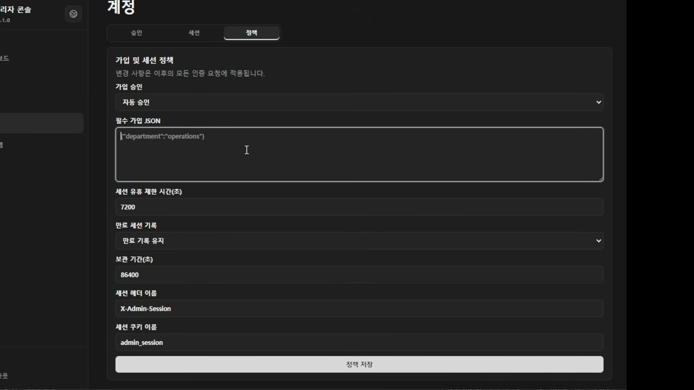

# 02. 세션과 감사 — 헤더 이름까지 설정으로 빼야 하는 이유

## 학습 목표

세션 키의 생명주기(발급·유휴 만료·강제 제거)와, 감사 로그를 남길 때 무엇을 설정으로 열어 둬야 하는지 안다. 세션 헤더·쿠키 이름이 왜 하드코딩 대상이 아닌지 설명할 수 있다.

## 선수 지식

- 1장: 마스터 계정을 환경변수로 두는 것과 달리, 세션 정책은 **런타임에 바뀌어야** 한다
- 2강 1장(세션 식별자 3층)과 구별할 것 — 여기서 다루는 세션은 **로그인 세션**이고, 그쪽은 모델의 KV 캐시 세션이다. 이름이 같지만 다른 층이다

## 핵심 원리 (WHY) — 세션 키는 중앙에서 끊을 수 있어야 한다

인증하면 세션 키(세션 토큰)를 발급받는다. 여기서 중요한 것은 발급이 아니라 **회수**다.

> 관리자 화면에서 어떤 세션 키를 제거하면 **그 사람의 로그인을 취소시키는 거나 마찬가지**잖아요.

이것이 2강 9장에서 말한 "퇴사 시 즉시 제거 / 가드레일 위반 시 즉시 만료"의 실물이다. 세션을 클라이언트가 들고 있는 JWT처럼 **검증만 하는 구조**로 만들면 이 기능이 성립하지 않는다 — 발급된 토큰은 만료까지 유효하기 때문이다. 중앙이 세션 목록을 갖고 있어야 끊을 수 있다.

두 번째 만료 경로는 유휴다.

> 일정 시간 이상 아무런 요청도 접수가 안 됐으면 키가 만료되는 거죠. 그럼 재발급 받아야 되는 거고.

## 필수 지식 (HOW) — 정책 화면이 곧 설계 목록이다

한 화면에 이 회차의 결정이 모여 있다.

| 설정 | 화면의 값 | 무엇을 정하는가 |
|---|---|---|
| 가입 승인 | 자동 승인 | 3장 주제 |
| 필수 가입 JSON | `{"department":"operations"}` | 가입 시 반드시 받을 메타 정보 |
| 세션 유휴 제한 시간(초) | `7200` | 2시간 무요청이면 만료 |
| 만료 세션 기록 | 만료 기록 유지 | 만료된 세션을 지울지 남길지 |
| 보관 기간(초) | `86400` | 남긴 기록을 하루 뒤 정리 |
| 세션 헤더 이름 | `X-Admin-Session` | 아래 참조 |
| 세션 쿠키 이름 | `admin_session` | 아래 참조 |

유휴 시간과 보관 기간이 **별개 설정**인 점을 놓치지 말 것. 유휴는 "이 키를 계속 쓸 수 있나"를 정하고, 보관은 "만료된 뒤 기록을 얼마나 들고 있나"를 정한다. 전자는 보안, 후자는 감사와 디스크 문제다.

### 로그 적재가 서버를 죽인다

보관 기간이 설정으로 나와 있는 이유가 여기다.

> 여러분들 서비스가 제일 많이 죽는 원인 1위 아시죠? **서버 로그 쌓여 가지고 죽는 게 1등이에요.** 서버 왜 죽었나 보면 다 로그 쌓여서 죽는 거예요.

세션 로그는 로그인마다, 요청마다 쌓인다. 감사 목적이라 지우기도 조심스럽다. 그래서 **보관 기간을 처음부터 설정으로 빼 둔다** — 나중에 붙이려면 이미 쌓인 것을 어떻게 할지부터 정해야 한다.

## 필수 지식 (HOW) — 헤더·쿠키 이름을 하드코딩하면 사내에서 안 뜬다

이 설정이 가장 의외이고, 사내망 경험이 없으면 왜 필요한지 모른다.

> 사내망에서 돌아갈 때는 **보안 방화벽이 HTTP 특정 헤더에 무조건 뭘 집어넣거나, 방해하거나, 거부하거나** 하는 설정이 들어 있어요. 걔네들이 **L7 레이어에서 움직이기 때문에 헤더를 다 감시**해. 그래서 **미리 보안팀에 가서 풀어야** 돼. "우리 시스템은 로그인할 때 헤더에 이런 걸 넣을 거예요, 혹은 쿠키에 이 이름 좀 허가해 주세요" 하고.

즉 이름이 **협의 대상**이다. 우리가 `X-Session`을 쓰고 싶어도 그 회사 방화벽이 그 헤더를 떨어뜨리면 로그인이 안 된다. 코드에 박아 두면 고객사마다 빌드를 다시 해야 한다.

### 쿠키만으로는 부족하다

그리고 두 개가 다 필요한 이유가 따로 있다.

> 쿠키 이름만 알면 되는 거 아니야? 그러면 **브라우저에서만 쿠키가 되지.** 딴 데는 쿠키가 없잖아. 안드로이드 앱이나 아이폰 앱은 **헤더에 넣어서 줘야** 된다고. 한번 획득한 세션 토큰을 헤더에 계속 주입해야 세션을 유지할 거 아니에요. **쿠키가 자동으로 전송되는 건 브라우저밖에 없단 말이야.**

그래서 같은 세션 토큰을 두 경로로 실을 수 있어야 하고, **두 이름 모두** 방화벽 통과 승인을 받아야 한다.

## 필수 지식 (HOW) — 감사에 남기는 것은 회사마다 다르다

기본으로 남는 것은 요청 시각이다. 그 위에 회사가 요구하는 것이 얹힌다.

> 그 사람의 IP, 컴퓨터 이름, 걔네 고유 보안 프로그램이 무조건 헤더에 남기는 정보 — 이런 것도 **추가로 저장할 수 있는 옵션을 줘야** 돼요.

실제 요구는 이 정도까지 간다.

> "김 대리가 사번 몇 번, 누구누구가 무슨 자리에 있는 인사팀 3번 컴퓨터에서" — 이런 것들이 날아온다고. 그걸 **커스터마이즈할 수 있는 기능이 많이 제공돼야** 되는 거죠.

이 요구의 성질은 2강 9장의 "로그인 풋프린트는 회사마다 다르다"와 같다. 스키마를 고정하면 고객사마다 컬럼을 추가하게 되므로, **확장 가능한 메타 필드**로 받는 편이 낫다 (정책 화면의 "필수 가입 JSON"이 같은 발상이다).

## 이 지식이 판단에 쓰이는 자리

- **인증 방식을 고를 때**: "관리자가 세션을 즉시 끊을 수 있어야 하나"를 먼저 묻는다. 그렇다면 무상태 토큰만으로는 안 된다.
- **사내망 납품을 앞뒀을 때**: 헤더·쿠키 이름을 설정으로 빼고, 보안팀 승인 절차를 일정에 넣는다. 이걸 빼먹으면 설치 당일에 막힌다.
- **감사 로그를 설계할 때**: 보관 기간을 처음부터 설정으로 만든다. 그리고 회사별 추가 필드가 들어올 자리를 열어 둔다.

### ⚠️ 암기 필수

- [ ] **세션 키는 중앙에서 즉시 제거할 수 있어야 한다** = 로그인 취소. 무상태 검증형 토큰만 쓰면 이 기능이 성립하지 않는다.
- [ ] **유휴 만료와 기록 보관 기간은 별개 설정이다.** 전자는 보안, 후자는 감사·디스크.
- [ ] **서버가 죽는 원인 1위는 로그 적재.** 그래서 세션 기록 보관 기간을 처음부터 설정으로 뺀다.
- [ ] **세션 헤더 이름과 쿠키 이름은 반드시 설정으로 뺀다** — 사내 L7 보안 방화벽이 헤더를 감시·차단하므로 **이름을 보안팀과 미리 협의**해야 한다.
- [ ] **쿠키가 자동 전송되는 것은 브라우저뿐** — 모바일 앱은 헤더로 토큰을 실어야 하므로 두 경로가 모두 필요하다.
- [ ] **감사 필드(IP·컴퓨터 이름·보안 프로그램 헤더)는 회사마다 다르다** → 고정 스키마가 아니라 확장 가능한 메타로 받는다.
