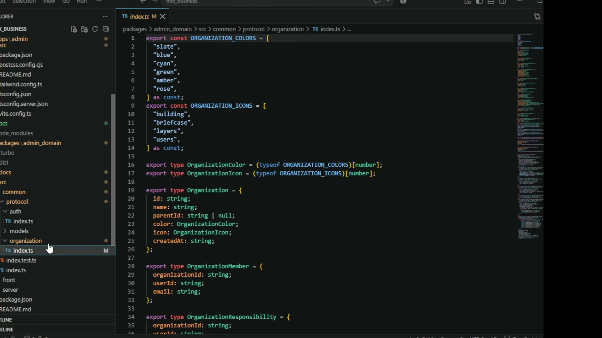

# 04. 모노레포 경계 — 프로토콜을 어디 두느냐가 구조를 정한다

## 학습 목표

`apps`/`packages` 분리 위에 도메인을 `common`·`server`·`front` 셋으로 다시 나누는 이유를 안다. 프로토콜 타입이 왜 공용 자리에 있어야 하는지, 퍼미션을 미들웨어 층에 두면 무엇이 달라지는지 설명할 수 있다.

## 선수 지식

- 2강 10장: 모노레포 참조는 `apps` → `packages` 단방향이고, `packages`에는 프레임워크 의존이 없는 순수 도메인만 둔다
- 이 장은 그 규칙이 실제 폴더로 어떻게 내려오는지를 본다

## 핵심 원리 (WHY) — 같은 규격을 두 번 쓰는 곳이 경계를 만든다

기본 골격은 2강에서 배운 그대로다.

> 터보 기반의 모노레포 구조는 `packages`하고 `apps`가 나온다 그랬잖아요. **앱스에 지금은 어드민 사이트만 만들었는데** 나중에 **에이전트도 추가**되고 이렇게 될 거고, **패키지스도 이 어드민에 관련된 도메인만 모아서** 작성이 되게 됩니다.

여기서 한 겹이 더 들어간다. 도메인 패키지 안이 셋으로 갈린다.



```
apps/admin/                                  ← 이 앱의 구현 (프론트 + 서버)
packages/admin_domain/src/
├── common/          프론트와 백엔드가 둘 다 쓰는 것
│   └── protocol/
│       ├── auth/
│       ├── models/
│       └── organization/
├── front/           프론트 전용 순수 객체 (모델 등)
└── server/          서버 전용
```

경계를 가르는 기준이 명확하다.

> **조직 관리에 대해서 어떤 식으로 통신하겠다는 통신 프로토콜 규격**은 프론트엔드하고 백엔드하고 **다 써야 되니까 `common`에 잡히고**, 프론트엔드에서는 모델 쪽에서 써야 되는 순수한 객체들 여기 잡고, 그다음에 `apps`에 가면 어드민 앱에서 프론트 구현 여기 있는 거고, 서버 쪽 구현도 여기 있는 거고.

즉 **양쪽이 같은 규격을 봐야 하는 것이 `common`으로 간다.** 그리고 통신 규격이 정확히 그것이다. 요청·응답 타입이 프론트와 서버에 각각 선언돼 있으면 둘이 어긋나는 순간을 컴파일러가 못 잡는다. 한 곳에 두면 어긋남 자체가 불가능해진다.

## 필수 지식 (HOW) — 프로토콜 타입이 도메인 규칙을 담는다

캡처의 `protocol/organization/index.ts`가 무엇을 담는지 보면 이 배치의 값이 드러난다.

```ts
export const ORGANIZATION_COLORS = ["slate","blue","cyan","green","amber","rose"] as const;
export const ORGANIZATION_ICONS  = ["building","briefcase","layers","users"] as const;

export type OrganizationColor = (typeof ORGANIZATION_COLORS)[number];
export type OrganizationIcon  = (typeof ORGANIZATION_ICONS)[number];

export type Organization = {
  id: string;
  name: string;
  parentId: string | null;      // ← 트리 구조가 타입에 있다 (6장)
  color: OrganizationColor;
  icon: OrganizationIcon;
  createdAt: string;
};

export type OrganizationMember = { organizationId: string; userId: string; email: string };
export type OrganizationResponsibility = { organizationId: string; userId: string; /* … */ };
```

두 가지를 읽어 낼 것.

**① `as const` + `(typeof X)[number]`로 값과 타입을 한 번에 정의한다.** 색상 목록을 배열로 한 번 쓰면 타입이 따라 나온다. 목록과 타입을 따로 관리하면 색을 추가할 때 두 곳을 고쳐야 하고, 하나를 잊으면 런타임에만 드러난다. 프론트의 색상 선택 UI와 서버의 유효성 검사가 **같은 배열**을 보게 되는 것이 이 배치의 결과다.

**② `parentId: string | null`이 트리를 타입 수준에서 확정한다.** null이 루트라는 뜻이고, 이것이 6장의 "루트가 여러 개일 수 있다"를 구조적으로 허용한다 — 루트를 별도 테이블이나 플래그로 뒀다면 하나로 제한하기 쉬웠을 것이다.

## 필수 지식 (HOW) — 퍼미션은 미들웨어 한 층에서 걸린다

엔터프라이즈 제품에 반드시 들어가는 층이 하나 더 있다.

> 엔터프라이즈 솔루션들은 그 **미들웨어에 퍼미션 레이어가 들어와야** 돼. 퍼미션 레이어에서 **전체 퍼미션 정책에 따라서 모든 요청을 걸러**. 로그인하거나 사인업하거나 이럴 때는 안 따지지만, **그 이후 나머지 페이지들은 다 퍼미션을 따져 가지고 거부하는 기능**을 기본으로 깔고 간다.

핵심은 **기본값이 거부**라는 점이다. 인증 없이 통과하는 경로(로그인·가입)를 예외로 명시하고 나머지 전부를 검사한다. 반대로 만들면 — 즉 보호가 필요한 엔드포인트마다 검사를 붙이면 — 새 엔드포인트를 추가할 때마다 검사를 붙이는 것을 잊을 수 있고, **잊으면 조용히 열린다.**

한 층에 모으면 "이 시스템의 권한 규칙"을 한 파일에서 읽을 수 있다는 이점도 따라온다. 감사받는 제품에서 이건 실질적인 가치다.

그리고 이 층은 앞 회차와 이어진다. 2강 9장의 인가 대상(도구·저장소·스킬·RAG 데이터)이 곧 이 퍼미션 정책의 항목이 되고, 그 결과가 1강 3장의 "도구·스킬 리스트는 계산 결과다"에 입력된다.

### AI에게 다 맡기면 되지 않나

강의가 이 대목에서 짚는 말이 있다.

> 그냥 AI만 알고 다 시키면 되지 않을까 싶기도 한데 또 **그렇게 잘 되지 않아.** 실제로는 **아직은 개발 지식이 많이 필요한 걸** 어떻게 해.

퍼미션 층 같은 구조 결정이 정확히 그 예다. "권한 검사 붙여 줘"라고 시키면 엔드포인트마다 검사가 붙은 코드가 나올 수 있는데, 그건 동작하지만 위에서 말한 이유로 틀린 구조다. **무엇이 옳은 구조인지 아는 쪽이 지시해야** 한다.

## 이 지식이 판단에 쓰이는 자리

- **모노레포를 자를 때**: "양쪽이 같은 규격을 봐야 하나"를 기준으로 `common`을 정한다. 통신 프로토콜은 거의 항상 여기다.
- **열거형 값을 정의할 때**: `as const` 배열 하나에서 타입을 파생시켜 목록과 타입이 어긋날 수 없게 만든다.
- **권한을 붙일 때**: 미들웨어 한 층에서 전부 검사하고 예외만 열거한다. 엔드포인트마다 붙이면 빠뜨리는 순간 열린다.

### ⚠️ 암기 필수

- [ ] **도메인 패키지는 `common`·`server`·`front`로 다시 나눈다.** 기준은 "양쪽이 같은 규격을 봐야 하는가" — **통신 프로토콜 타입은 `common`**에 둔다. 양쪽에 따로 선언하면 어긋남을 컴파일러가 못 잡는다.
- [ ] **`as const` 배열 + `(typeof X)[number]`로 값과 타입을 한 번에 정의한다** → 목록과 타입이 어긋날 수 없고, 프론트 UI와 서버 검증이 같은 배열을 본다.
- [ ] **퍼미션은 미들웨어 한 층에서 걸고 기본값은 거부.** 로그인·가입만 예외로 명시한다. 엔드포인트마다 붙이면 빠뜨린 곳이 **조용히 열린다.**
- [ ] **`parentId: string | null`처럼 트리 구조를 타입에 담으면** 루트 복수를 구조적으로 허용하게 된다.
