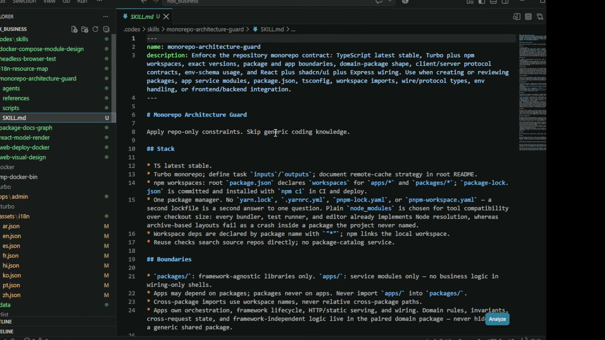
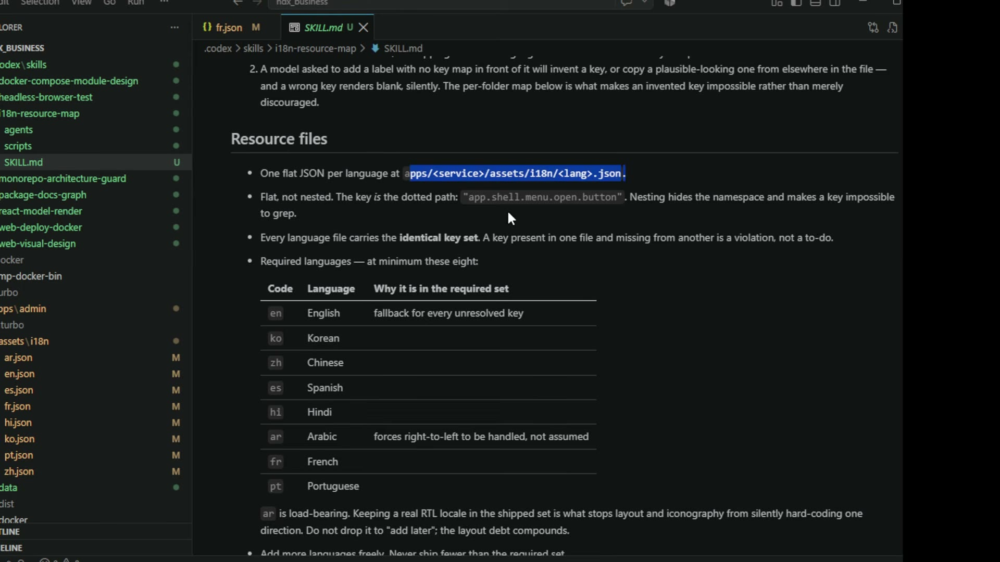
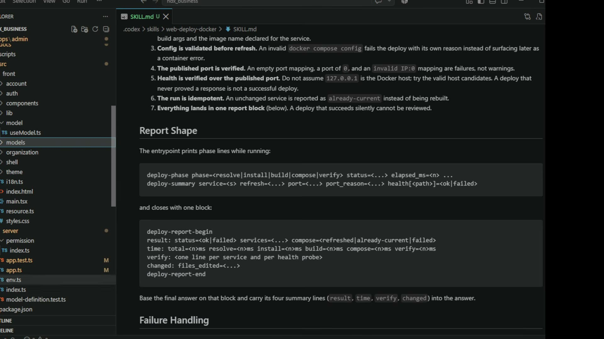

# 05. 에이전트에게 지시하기 — 이 시스템을 만든 프롬프트를 읽는다

## 학습 목표

이 관리 서버는 사람이 아니라 에이전트가 썼다. 그렇다면 **그것을 지시한 스킬 문서가 실제 설계도**다. 시연 중 화면에 열린 `SKILL.md` 원문에서 프롬프트 작성 기법을 추출해, 자기 스킬을 쓸 때 적용할 수 있게 한다.

## 선수 지식

- 00장: "어차피 코딩 우리가 안 한다" — 재현할 능력이 코딩이 아니라 지시라는 전제
- 01장: 계획표에 없던 구조 규칙이 스킬에서 왔다는 대조 결과
- 1강 3장·4장: 도구·훅. 스킬은 "도구 설명의 빈약함을 보완하는 단위"다

## 핵심 원리 (WHY) — 결과물보다 지시문이 재사용된다

시연에서 만든 어드민 화면은 그 프로젝트의 것이다. 하지만 그것을 만들게 한 스킬은 **다음 프로젝트에도 그대로 쓰인다.** 강의자가 프로젝트 유형별로 스킬셋을 나눠 두는 이유가 이것이고, 그래서 학습 가치가 가장 높은 산출물도 화면이 아니라 스킬이다.

스킬 목록이 보이는 자리가 있다.



```
.codex/skills/
├── docker-compose-module-design
├── headless-browser-test
├── i18n-resource-map
├── monorepo-architecture-guard     ← 화면에 열린 것
├── package-docs-graph
├── react-model-render
├── web-deploy-docker
└── web-visual-design
```

각 스킬이 `SKILL.md` + `agents/` + `references/` + `scripts/`를 갖는다. 이름이 전부 **강제할 규약의 이름**이고 기능 이름이 아니라는 점을 보라 — `monorepo-architecture-guard`는 "모노레포 만들기"가 아니라 "모노레포 계약을 **지키게 하는** 것"이다.

## 필수 지식 (HOW) — 아홉 가지 작성 기법

### ① 일반 지식을 빼서 컨텍스트를 아낀다

`monorepo-architecture-guard`의 본문 첫 줄이 이것이다.

> **Apply repo-only constraints. Skip generic coding knowledge.**

모델은 TypeScript를 이미 안다. 스킬에 일반론을 적으면 기반 컨텍스트만 먹고(2강 3장의 5% 예산) 얻는 게 없다. 스킬은 **이 레포에서만 참인 것**을 담는다.

### ② description에 트리거 조건을 쓴다

```
description: Enforce the repository monorepo contract: TypeScript latest stable, Turbo plus
npm workspaces, exact versions, package and app boundaries, domain-package shape,
client/server protocol contracts, env-schema usage, and React plus shadcn/ui plus Express
wiring. Use when creating or reviewing packages, app service modules, package.json,
tsconfig, workspace imports, wire/protocol types, env handling, or frontend/backend integration.
```

두 부분으로 되어 있다 — **무엇을 강제하는가**(앞)와 **언제 쓰는가**(`Use when …`). 후자가 없으면 모델이 로딩 시점을 판단할 근거가 없다. 그리고 트리거를 **파일·작업 이름으로** 열거한 점을 보라: `package.json`, `tsconfig`, `workspace imports`. 추상적인 "아키텍처 작업 시"보다 걸리는 확률이 높다.

### ③ 금지에는 이유를, 그것도 "실패 양상"으로 붙인다

락파일 규칙이 좋은 예다.

> One package manager. No `yarn.lock`, `.yarnrc.yml`, `pnpm-lock.yaml`, or `pnpm-workspace.yaml` — **a second lockfile is a second answer to one question.** Plain `node_modules` is chosen for tool compatibility over checkout size: every bundler, test runner, and editor already implements Node resolution, whereas **archive-based layouts fail as a crash inside a package the project never named.**

세 가지가 한 문단에 있다: 금지 목록 / 금지의 이유(한 질문에 두 답) / 대안 선택의 근거(호환성 우선). 마지막 절이 특히 좋다 — 실패가 **어떻게 나타나는지**("프로젝트가 이름조차 모르는 패키지 안에서의 크래시")를 적으면 모델이 그 위험을 다른 상황에도 적용한다.

### ④ 위반의 지위를 못박는다

가장 반복되는 패턴이다.

| 스킬 문장 | 막는 것 |
|---|---|
| A key present in one file and missing from another is a **violation, not a to-do.** | "나중에 채우겠습니다" |
| An empty port mapping, a port of `0`, and an `invalid IP:0` mapping are **failures, not warnings.** | 경고로 넘기고 성공 보고 |
| A deploy that never proved a response **is not a successful deploy.** | 헬스 체크 생략 |
| A deploy that succeeds silently **cannot be reviewed.** | 리포트 없이 끝내기 |

모델은 애매한 지시를 **자기에게 유리하게** 해석한다. "가능하면 확인하라"는 확인하지 않을 여지를 주고, "확인하지 않은 것은 성공이 아니다"는 여지를 없앤다.

### ⑤ 모델의 실패 모드를 예측해서 이름 붙인다

`i18n-resource-map`의 이 문단이 이 장에서 가장 배울 만하다.



> **A model asked to add a label with no key map in front of it will invent a key, or copy a plausible-looking one from elsewhere in the file** — and a wrong key renders blank, **silently**. The per-folder map below is what makes an invented key **impossible rather than merely discouraged**.

세 겹이다.

1. **모델이 어떻게 실패할지** 구체적으로 적는다 — 키를 지어내거나, 그럴싸한 걸 복사한다
2. **그 실패가 왜 위험한지** — 틀린 키는 조용히 빈칸으로 렌더된다(에러가 아니다)
3. **그래서 이 장치가 무엇을 하는지** — "권고"가 아니라 "불가능"하게 만든다

마지막 문장이 이 회차의 핵심 사고다. **impossible rather than merely discouraged** — 이 대비가 스킬 작성의 목표를 한 줄로 요약한다.

### ⑥ 판정 가능한 경계를 조건으로 열거한다

"적당히 나누라"는 지시는 판정할 수 없다. 그래서 조건을 센다.

> Prefer one clear top-level function over a chain of single-use private helpers. First-level decomposition is fine; **nesting needs real duplication, a second caller, or a genuine boundary (parsing, validation, persistence, network IO, a nontrivial algorithm).**
>
> Avoid classes **without identity, mutable lifecycle, polymorphism, or resource ownership.**

앞은 "중첩이 정당한 4가지 조건", 뒤는 "클래스가 정당한 4가지 조건"이다. 열거되어 있으므로 모델도 리뷰어도 **하나씩 대조**할 수 있다. `no function, class, or file whose abstraction is effectively just its name`도 같은 성질이다 — "이름 말고 하는 일이 있나"는 물어볼 수 있는 질문이다.

### ⑦ 사소해 보이는 항목에 "load-bearing" 근거를 붙인다

8개 필수 언어 중 아랍어에 이런 주석이 붙어 있다.

> `ar` Arabic — **forces right-to-left to be handled, not assumed**
>
> `ar` **is load-bearing.** Keeping a real RTL locale in the shipped set is what stops layout and iconography from silently hard-coding one direction. **Do not drop it to "add later"; the layout debt compounds.**

아랍어가 목록에 있는 이유가 "아랍 시장"이 아니라 **RTL을 가정하지 못하게 만드는 장치**라는 것이다. 이유를 안 적으면 다음 사람이 "우리는 아랍권에 안 팔아요"라며 지운다. 그리고 그 순간 레이아웃이 한 방향으로 굳는다.

**교훈**: 스킬의 항목 중 지워질 것 같은 것에는 지우면 안 되는 이유를 미리 적는다.

### ⑧ 데이터 형태를 grep 가능성으로 정한다

> Flat, not nested. The key **is** the dotted path: `"app.shell.menu.open.button"`. **Nesting hides the namespace and makes a key impossible to grep.**

중첩 JSON이 더 "구조적"으로 보이지만, 이 선택의 기준은 미학이 아니라 **검색 가능성**이다. 키 하나를 코드에서 찾을 수 있어야 정적 검사가 성립하고, 그게 없으면 ⑤의 "불가능하게 만들기"가 무너진다.

같은 스킬이 파일 위치까지 고정한다: `apps/<service>/assets/i18n/<lang>.json`. 경로가 정해져 있으면 검사 스크립트를 쓸 수 있다.

### ⑨ 출력 형식을 파싱 가능하게 못박고, 최종 답변을 거기 묶는다

`web-deploy-docker`가 가장 정교하다.



```
deploy-phase phase=<resolve|install|build|compose|verify> status=<...> elapsed_ms=<n> ...
deploy-summary service=<s> refresh=<...> port=<...> port_reason=<...> health[<path>]=<ok|failed>

deploy-report-begin
result:  status=<ok|failed> services=<...> compose=<refreshed|already-current|failed>
time:    total=<n>ms resolve=<n>ms install=<n>ms build=<n>ms compose=<n>ms verify=<n>ms
verify:  <one line per service and per health probe>
changed: files_edited=<...>
deploy-report-end
```

그리고 결정적인 한 줄이 뒤에 붙는다.

> **Base the final answer on that block and carry its four summary lines (`result`, `time`, `verify`, `changed`) into the answer.**

이것이 환각을 막는 장치다. 모델이 "배포 성공했습니다"라고 요약하는 대신 **실제 출력 블록에 근거하도록** 묶는다. 형식이 `key=value`로 고정돼 있어 사람도 스크립트도 읽을 수 있고, 요약 네 줄을 답변으로 옮기게 해서 **보고와 실제가 어긋날 수 없게** 만든다.

같은 스킬의 다른 규칙도 같은 성격이다.

> Do not assume `127.0.0.1` is the Docker host; **try the valid host candidates.**
>
> The run is idempotent. An unchanged service is reported as `already-current` **instead of being rebuilt.**

전자는 04장의 Docker localhost 함정을 스킬 층에서 막은 것이고, 후자는 "변경 없음"을 명시적 상태로 만들어 **불필요한 재빌드와 그 부작용**을 없앤다.

## 필수 지식 (HOW) — 스킬 구조

`SKILL.md` 하나가 아니다. 스킬 디렉토리가 네 종류를 갖는다.

| 구성 | 역할 |
|---|---|
| `SKILL.md` | 규약 본문. 위 아홉 기법이 적용되는 자리 |
| `agents/` | 그 스킬이 부르는 서브에이전트 정의 |
| `references/` | 상세 참고 — 본문에서 링크로 위임(본문을 짧게 유지) |
| `scripts/` | **검사 스크립트.** 규칙을 판정으로 바꾸는 장치 (06장) |

`references/`가 있는 이유는 기반 컨텍스트 예산이다. 본문에 다 넣으면 5% 예산을 넘고, 링크로 두면 필요할 때만 읽는다 (2강 3장의 2단계 로딩과 같은 발상).

## 이 지식이 판단에 쓰이는 자리

- **스킬을 쓸 때**: 일반 지식을 지우고 이 레포에서만 참인 것만 남긴다. 분량이 줄면서 강제력은 올라간다.
- **금지 규칙을 적을 때**: 이유를 **실패 양상**으로 쓴다. "권장하지 않음"이 아니라 "무엇이 어떻게 깨지는가".
- **애매한 지시를 발견했을 때**: 위반의 지위를 못박는 문장으로 바꾼다 — `violation, not a to-do` / `failures, not warnings`.
- **"적당히"를 쓰려 할 때**: 정당한 경우를 조건으로 열거한다. 대조할 수 있어야 판정이 된다.
- **에이전트 보고를 믿기 어려울 때**: 출력 형식을 고정하고 **최종 답변을 그 블록에 근거하도록** 묶는다.
- **항목을 지우려 할 때**: 그 항목에 붙은 이유를 먼저 읽는다. `ar` 같은 load-bearing 항목이 있다.

### ⚠️ 암기 필수

- [ ] **스킬 본문은 "이 레포에서만 참인 것"만 담는다** — `Skip generic coding knowledge`. 일반론은 기반 컨텍스트 예산만 먹는다.
- [ ] **description은 [무엇을 강제하나] + [`Use when` 트리거]** 두 부분이고, 트리거는 파일·작업 이름으로 열거한다.
- [ ] **금지에는 이유를 "실패 양상"으로 붙인다** — 무엇이 어떻게 깨지는지 적으면 모델이 다른 상황에도 적용한다.
- [ ] **위반의 지위를 못박는다: `violation, not a to-do` / `failures, not warnings` / "확인하지 않은 것은 성공이 아니다".** 애매한 지시는 모델이 자기에게 유리하게 해석한다.
- [ ] **모델의 실패 모드를 예측해 이름 붙이고, 장치로 "권고"가 아니라 "불가능"하게 만든다** (`impossible rather than merely discouraged`).
- [ ] **"적당히"를 조건 열거로 바꾼다** — 중첩이 정당한 4조건, 클래스가 정당한 4조건처럼 대조 가능하게.
- [ ] **데이터 형태는 grep 가능성으로 정한다** — 플랫 키 + 고정 경로여야 정적 검사가 성립한다.
- [ ] **출력 형식을 `key=value`로 고정하고 최종 답변을 그 블록에 묶는다** — 보고와 실제가 어긋날 수 없게 만드는 장치.
- [ ] **지워질 것 같은 항목에는 지우면 안 되는 이유를 미리 적는다** (`ar` is load-bearing).
