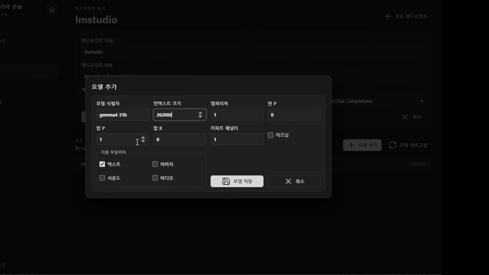

# 05. 모델 엔드포인트 레지스트리 — 같은 모델을 여러 번 등록하는 이유

## 학습 목표

사내 추론 서버를 등록하는 구조(엔드포인트 → 모델 → 프리셋)를 이해한다. 샘플링 파라미터의 실무 기본값과 각각이 무엇을 바꾸는지 알고, Docker 안에서 `localhost`를 쓰면 왜 실패하는지 설명할 수 있다.

## 선수 지식

- 2강 7장·9장: 모델 라우터의 요구 — 회사가 모델을 지정해 내려준다
- 1강 6장: 로컬 LLM의 크기·양자화 하한. 여기서 등록하는 것이 그 로컬 모델들이다

## 핵심 원리 (WHY) — 모델은 코드가 아니라 데이터로 등록된다

사내 추론 서버는 회사마다 다르고, 같은 회사에서도 늘고 줄어든다. 그래서 모델 목록을 코드에 두면 매번 배포가 필요하다. 이 회차는 **관리 화면에서 등록하는 데이터**로 만든다.

계층은 셋이다.

```
엔드포인트 (lmstudio, vllm, 외부 유료 API …)
   ├─ API 형식 (OpenAI Chat Completions 등) + 인증 헤더
   └─ 모델
        └─ 프리셋 = 모델 식별자 + 샘플링 파라미터 조합
```

엔드포인트를 저장하면 모델 목록을 자동으로 끌어올 수 있다.

> **모델스 프로토콜 때리면** 모델스 프로토콜로 가져와야 되잖아.

OpenAI 호환 서버의 `/v1/models`를 말한다. 이것이 표준이라 **엔드포인트 종류를 몰라도 목록을 받을 수 있다** — API 형식만 "OpenAI Chat Completions"로 지정해 두면 된다. 자동 조회가 실패하면 수동 추가로 떨어진다.

## 필수 지식 (HOW) — 등록 화면이 파라미터 목록이다



| 필드 | 화면 값 | 무엇을 바꾸는가 |
|---|---|---|
| 모델 식별자 | `gemma4 31b` | 추론 서버가 아는 이름 |
| 컨텍스트 크기 | `262000` | 이 프리셋이 쓸 컨텍스트 — 곧 **VRAM 비용** (1강 5장) |
| 템퍼러처 | 코딩엔 **0.4** | 낮으면 결정적, 높으면 창의적 |
| min_p | `0` (기본) | 최소 확률 컷 |
| top_p | **0.95** | 누적 확률 상위만 후보로 |
| top_k | **50** (권장 50~60) | 후보 토큰 개수 — **20은 너무 빡빡** |
| repeat_penalty | 기본 없음 | **리즈닝 루프에 빠질 때** 준다 (소수, 예: 0.02) |
| 리즈닝 | 체크박스 | 켜면 좋을 것 같지만 **루프에 자주 빠져 끄는 경우도 있다** |
| 지원 모달리티 | 텍스트/이미지/사운드/비디오 | 아래 참조 |

강의가 준 실무값을 그대로 옮기면 이렇다.

> 템퍼러처는 **코딩에 좀 빡빡하라고 0.4** 주고, top_p는 일반적으로 **0.95** 보통 이 정도 주죠. top_k는 **20개는 너무 빡빡하고 보통 권장 50에서 60개** 정도거든요. 50 정도 주고. repeat_penalty는 안 줘. 근데 **모델이 작아 가지고 리즈닝 루프에 자주 빠지는 것 같으면** repeat_penalty를 주면 되고.

repeat_penalty가 **증상에 대응하는 처방**으로 등장하는 점을 놓치지 말 것. 기본은 주지 않고, 작은 모델이 같은 말을 반복할 때 꺼내 쓴다 (1강의 "약한 모델 리즈닝 루프 → 스트림 가드 훅"과 같은 증상에 대한 다른 층의 처방이다).

### 모달리티는 적재된 것에 달렸다

> 똑같은 모델이라도 **우리가 적재한 모델이 모달리티를 제거한 모델일 수 있어요.** 얼마든지. 모달리티를 어디까지 제공하는지 저희가 골라 주면 되고.

같은 이름의 모델이라도 양자화·변환 과정에서 비전 부분이 빠진 배포본이 흔하다. 그래서 모달리티는 모델 이름에서 추론할 수 없고 **등록할 때 사람이 지정**한다.

## 필수 지식 (HOW) — 프리셋: 같은 모델을 여러 번 등록한다

이 구조의 핵심이 여기다.

> 같은 모델이라도, **같은 모델 식별자라도 컨텍스트나 템퍼러처가 다를 수도 있잖아.** 똑같다 하더라도 템퍼러처를 1.0짜리 쓰고 싶어. 이러면 얘 따로 저장하는 거야. 근데 **이름이 같아 가지고 안 되잖아요.** 이거 이제 **이름을 좀 다르게 해서 여러 개 추가해서 프리셋을 미리 만드는** 거지.

왜 필요한가. 같은 `gemma4 31b`를 코딩용(0.4)과 문서 작성용(1.0)으로 동시에 쓰고 싶다. 파라미터를 요청할 때마다 클라이언트가 보내게 하면, **조직별로 모델을 통제하는 의미가 사라진다** — 클라이언트가 값을 마음대로 바꿔 보낼 수 있으니까. 서버가 프리셋 단위로 내려주면 통제가 유지된다 (→ 6장의 조직별 모델 할당).

그래서 등록 단위는 "모델"이 아니라 **"모델 + 파라미터 조합"**이고, 그것을 사람이 읽을 이름으로 구분한다. 이름 충돌이 안 되므로 **프리셋 이름이 실질적인 키**가 된다.

## 필수 지식 (HOW) — Docker 안의 localhost는 컨테이너 자신이다

시연 중 실제로 걸린 함정이다. 엔드포인트 URL에 `localhost`를 넣었는데 연결이 실패했다.

> **Docker에서 돌고 있는 서비스의 `localhost`는 Docker 컨테이너 자신이죠.** 그래서 보통 `localhost`라고 쓰시면 안 됩니다.

관리 서버는 컨테이너 안에 있고, LM Studio는 호스트에서 돌고 있다. 컨테이너의 `localhost`는 컨테이너 자신의 네트워크 인터페이스이므로 호스트에 닿지 않는다. 진단 신호가 명확하다 — **연결은 되는 것 같은데 요청이 상대에게 도착하지 않는다.**

이 함정이 특히 잘 걸리는 이유는 **개발 중에는 잘 됐다는 점**이다. 컨테이너에 넣기 전 로컬에서 돌릴 때 `localhost`가 맞았기 때문에, 설정값이 그대로 남아 배포 후에만 깨진다.

## 이 지식이 판단에 쓰이는 자리

- **추론 서버를 붙일 때**: OpenAI 호환 형식이면 `/v1/models`로 목록을 자동 조회하고, 실패하면 수동 등록으로 떨어지게 만든다.
- **샘플링 기본값을 정할 때**: 코딩은 temperature 0.4 / top_p 0.95 / top_k 50에서 출발한다. 반복이 보이면 repeat_penalty를 꺼내 쓴다.
- **같은 모델을 여러 용도로 쓸 때**: 클라이언트가 파라미터를 보내게 하지 않고 **프리셋으로 등록**한다. 그래야 조직별 통제가 유지된다.
- **컨테이너에서 외부를 호출할 때**: `localhost`를 쓰지 않는다. 개발 중엔 통했다는 사실이 오히려 함정이다.

### ⚠️ 암기 필수

- [ ] **등록 계층: 엔드포인트(API 형식·인증) → 모델 → 프리셋.** 모델 목록은 OpenAI 호환 `/v1/models`로 자동 조회, 실패 시 수동.
- [ ] **코딩용 샘플링 기본값: temperature 0.4 · top_p 0.95 · top_k 50(권장 50~60, 20은 과하게 빡빡).** repeat_penalty는 기본 없음 — **작은 모델이 리즈닝 루프에 빠질 때** 주는 처방이다.
- [ ] **리즈닝을 켜면 루프에 자주 빠져 오히려 끄는 경우가 있다.**
- [ ] **모달리티는 모델 이름으로 알 수 없다** — 적재된 배포본에서 제거됐을 수 있어 등록 시 지정한다.
- [ ] **프리셋 = 모델 식별자 + 파라미터 조합, 이름으로 구분.** 같은 모델을 온도만 달리해 여러 개 등록한다. 클라이언트가 파라미터를 보내게 하면 **조직별 모델 통제가 무너진다.**
- [ ] **Docker 컨테이너 안의 `localhost`는 컨테이너 자신이다.** 호스트 서비스에 닿지 않는다 — 개발 중엔 통했기 때문에 배포 후에만 깨진다.
