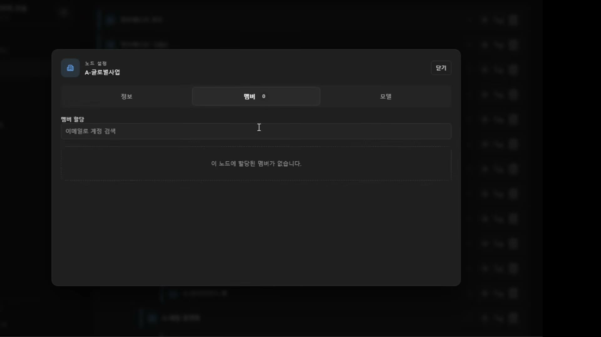

# 06. 조직 트리와 모델 라우팅 — 루트는 하나가 아니다

## 학습 목표

조직도를 만들 때 가장 흔한 설계 실수를 알고 피한다. 조직이 존재하는 실질적 이유(모델 접근 권한)와, 관리자 권한을 노드 단위/하위 전체로 나누는 이유를 설명할 수 있다.

## 선수 지식

- 4장: `Organization.parentId: string | null` — 이 타입이 이 장의 구조를 이미 담고 있다
- 5장: 프리셋 단위로 등록된 모델들 — 조직에 할당되는 대상이 그것이다
- 2강 9장: 인가 대상(도구·저장소·스킬·RAG) — 조직은 그 인가의 단위가 된다

## 핵심 원리 (WHY) — 루트를 하나로 만드는 것이 가장 흔한 실수다

강의가 실수라고 직접 지목한다.

> 조직도 만들 때 **가장 많이 한 실수가 루트를 하나밖에 안 되게 만드시는 건데 그러시면 안 돼요.** 진짜 실무에서는 **조직의 루트가 여러 개 있을 수 있어.** 이게 아예 **지사 A, 지사 B**가 될 수 있잖아요. 그래서 완전히 최상위 루트를 계속 신설할 수 있어야 돼.

왜 하나로 만들기 쉬운가. 조직도를 "회사"의 그림으로 생각하면 회사는 하나이므로 루트도 하나가 된다. 하지만 실제 시스템이 담아야 하는 것은 회사가 아니라 **관리 단위의 집합**이다. 지사·법인·인수한 자회사·프로젝트 단위 조직이 서로의 하위가 아니면서 나란히 존재한다.

그리고 이 제약은 **되돌리기가 비싸다.** 루트를 하나로 전제하면 그 가정이 스키마·쿼리·화면·권한 판정에 다 퍼진다. 나중에 지사가 하나 더 생겼을 때 고칠 곳이 전부다. 반대로 처음부터 복수를 허용하면 하나만 쓰는 회사도 문제없다 — **비대칭이므로 복수 쪽이 기본값이어야 한다.**

4장에서 본 `parentId: string | null`이 이 결정을 타입에 박아 둔 형태다. 루트는 "부모가 없는 노드"이고, 그런 노드가 여러 개인 것을 막을 근거가 구조상 없다.

## 필수 지식 (HOW) — 트리 조작 두 가지

노드마다 두 종류의 추가가 있다.

- **형제 추가(sibling)** — 자기 옆에 같은 레벨로
- **자식 추가(child)** — 자기 밑에

> 요렇게 하면 시블링으로 자기 옆에 형제를 만들어 가는 거고, 요거는 자기 밑에 자식을 만들어 가는 거거든요.

깊이 제한은 두지 않는다. 화면의 예시는 자식 3개, 각 자식 밑에 다시 2개씩 있는 형태다.

## 필수 지식 (HOW) — 조직이 존재하는 큰 이유는 모델 통제다

조직 노드는 세 가지를 갖는다: **정보 / 멤버 / 모델**.

이 중 모델 탭이 조직의 존재 이유와 직결된다.

> 이 조직이 **사용할 모델을 지정**하게 돼. 얘가 LM Studio 쓰는 조직이야, 그럼 이 중에서 어떤 모델을 쓸 수 있어. 그렇게 하면 **이 조직에 속해 있는 애들은 싹 다 이것밖에 못 쓰게** 되는 거야. 모든 걸 다 쓸 수 있는 게 아니라고. **내가 이렇게 다 지정해 줘야지만 쓸 수 있는 거지.**
>
> 이게 저번 주에 **특정 조직마다 어떤 모델에 접근할 수 있는지 권한을 따로따로 줘야 된다** 그랬잖아요. 이거예요. 뭐 인사팀은 이거 못 써, 요것만 써야 돼. 그중에서도 얘만 쓸 거야, QwQ만.
>
> **조직이 존재하는 큰 이유 중에 하나가 이거고.**

여기서 기본값이 중요하다. **지정하지 않으면 못 쓴다** — 4장의 퍼미션 레이어와 같은 "기본 거부" 원칙이다. 모델은 곧 비용(VRAM·토큰)이므로, 열어 두고 막는 방식이면 새 모델을 등록할 때마다 전 조직이 접근하게 된다.

그리고 할당 대상이 5장의 **프리셋**이라는 점이 두 장을 잇는다. "gemma를 쓸 수 있다"가 아니라 "gemma-코딩용(temp 0.4) 프리셋을 쓸 수 있다"까지 정해진다.

## 필수 지식 (HOW) — 관리자 권한의 범위는 두 종류다

멤버에게 어드민을 줄 때 범위를 고른다.

> 이 노드에다가 **어드민을 부여**하잖아요. 그럼 이 계정이 어드민이 되면서 이 계정에 대해서 **멤버 승인을 할 수도 있고 모델을 컨트롤할 수도 있게** 되는 권한을 줄 수도 있고요. **어드민 하면 얘 하이어라키의 모든 노드에 어드민이 될 수 있게끔** 할 수도 있고 — **이 두 가지를 제공**해 주는 거예요. 계정마다 얘가 단지 이 노드 하나의 어드민이냐, 아니면 이 밑에 하이어라키 조직 전체에 대한 어드민이냐.

| 범위 | 의미 | 쓰이는 곳 |
|---|---|---|
| **노드 단독** | 그 노드에서만 관리자 | 팀장 — 자기 팀만 |
| **하위 계층 전체** | 그 노드와 모든 후손에서 관리자 | 본부장·지사장 — 아래 조직 전부 |

이 구분이 없으면 위임이 성립하지 않는다. 지사장에게 권한을 주려고 지사 아래 모든 노드에 개별 부여하면, 노드를 새로 만들 때마다 다시 부여해야 한다 — **권한이 조직 변경을 따라오지 못한다.** 하위 전체 범위는 "미래에 생길 노드"까지 포함한다.

위임은 재귀적이다.

> 조직의 **책임자는 마스터 관리자가 임명**할 수 있으며, 책임자는 다시 **자신의 권한에 따라 노드 또는 하위 노드 전체에 대해 책임자를 지정**할 수 있다.

이것이 3장의 "승인자 단일화" 문제에 대한 구조적 답이다. 마스터 혼자 모든 승인을 하지 않고, 아래로 위임 사슬이 뻗는다. 그리고 위임할 수 있는 범위는 **자신의 권한을 넘지 못한다** — 팀장이 본부 전체 관리자를 임명할 수는 없다.

## 필수 지식 (HOW) — 색상과 아이콘도 요구사항이었다

사소해 보이는 기능인데 강의가 굳이 짚는다.

> 이런 사소한 기능들이 이제 **편리성을 가져오게 되죠. 조직이 커지면.** 이것도 다 괜히 만든 게 아닙니다. **회사 부서 아이콘 뭐 이런 거 해 달라고 그래 가지고** 이거 다 만들어 놓은 거란 말이죠.

조직이 수십 개가 되면 이름만으로는 트리에서 눈이 길을 잃는다. 4장에서 본 `ORGANIZATION_COLORS`·`ORGANIZATION_ICONS`가 이 요구의 결과물이고, 실사용에서 올라온 요구라는 점이 기억할 부분이다.

## 이 지식이 판단에 쓰이는 자리

- **조직도를 설계할 때**: 루트 복수를 기본으로 잡는다. 하나만 쓰는 회사는 문제없지만 반대는 전면 수정이다.
- **자원 접근을 통제할 때**: 조직을 인가 단위로 쓰고 **기본은 거부**로 둔다. 할당 대상은 모델이 아니라 프리셋이다.
- **위임을 만들 때**: 권한 범위를 "노드 단독 / 하위 전체" 두 종류로 나눈다. 하위 전체가 있어야 새로 생기는 노드까지 권한이 따라온다.
- **위임 사슬을 열 때**: 위임자가 자기 권한을 넘는 권한을 줄 수 없게 막는다.

### ⚠️ 암기 필수

- [ ] **조직 루트는 여러 개일 수 있다** — 지사 A·지사 B. **루트를 하나로 만드는 것이 가장 흔한 실수**이고, 그 가정은 스키마·쿼리·권한 판정에 퍼져 되돌리기가 비싸다. 복수 허용이 기본값이어야 한다(비대칭).
- [ ] **조직이 존재하는 큰 이유 = 조직별 모델 접근 통제.** 지정하지 않으면 못 쓴다(**기본 거부**). 할당 단위는 모델이 아니라 **프리셋**이다.
- [ ] **관리자 권한 범위 2종: 노드 단독 / 하위 계층 전체.** 하위 전체가 있어야 **나중에 생기는 노드**까지 권한이 따라온다.
- [ ] **위임은 재귀적이되 자기 권한을 넘지 못한다.** 마스터가 책임자를 임명하고, 책임자가 다시 자기 범위 안에서 임명한다 — 승인자 단일화 문제의 구조적 해답.
- [ ] **트리 조작은 형제 추가와 자식 추가 두 가지**이고 깊이 제한은 두지 않는다.
