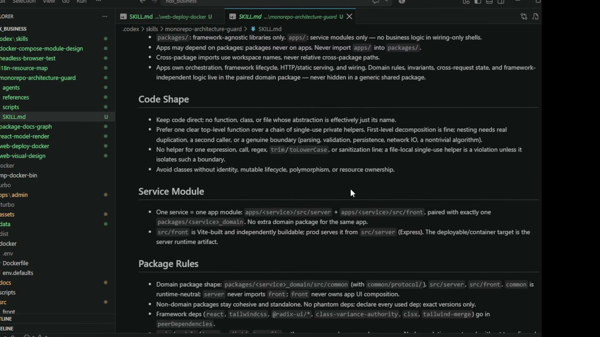

# 06. 스킬이 강제한 구조 — 계획표에 없었는데 들어온 것들

## 학습 목표

계획표에 없던 구조 규칙들이 어디서 왔고 각각 무엇을 막는지 안다. 규칙과 **검사 스크립트**가 짝이어야 하는 이유를 이해하고, 자기 프로젝트에 옮길 규칙을 고를 수 있다.

## 선수 지식

- 01장: 계획표에 없던 것 목록
- 05장: 스킬 작성 기법 — 이 장은 그 기법이 **어떤 규칙에** 적용됐는지를 본다
- 2강 10장: 터보 모노레포와 `apps` → `packages` 단방향

## 핵심 원리 (WHY) — 입력이 둘이고 수명이 다르다

3강에는 두 입력이 있다.

| 입력 | 정하는 것 | 수명 |
|---|---|---|
| **계획표** (2강) | 무엇을 만들지 | 이 제품 한정 |
| **스킬셋** (`.codex/skills/`) | 어떻게 만들지 | 다음 프로젝트까지 간다 |

계획표만 들고 시작하면 "어떻게"가 비고, 그러면 에이전트가 만든 코드의 모양이 매번 달라진다. 그리고 모양이 매번 다르면 **사람이 매번 코드를 처음 읽는 셈**이 되어 유지보수가 성립하지 않는다.

> 대충 이런 **스킬 베이스로 만들면 언제나 얘가 삽질을 못 하게** 되고, 그럼 되게 **정형화되어 있는 구조로밖에 못 나오게** 된단 말이야. 그래야지 **코드를 보고 통제를 할 거 아니야.** 뭘 고치려고 그래도 **어딜 고쳐야 되고 뭘 잘못했는지 알아야지** 수정을 계속해야 되니까.

즉 정형화의 목적은 미학이 아니라 **가독성의 재현성**이다.

## 필수 지식 (HOW) — ① 경계: 무엇이 어디 사는가


`monorepo-architecture-guard`가 규정하는 배치다.

```
apps/admin/src/{server,front}          ← 이 서비스의 구현
packages/admin_domain/src/
├── common/protocol/{auth,models,organization}   ← 양쪽이 보는 통신 규격
├── front/                                        ← 프론트 전용 순수 객체
└── server/                                       ← 서버 전용
```

스킬 원문이 경계를 이렇게 정한다.

> `packages/`: framework-agnostic libraries only. `apps/`: service modules only — no business logic in wiring-only shells.
>
> Apps may depend on packages; packages never on apps.
>
> One service = one app module: `apps/<service>/src/server` + `apps/<service>/src/front`, paired with **exactly one** `packages/<service>_domain`. **No extra domain package for the same app.**
>
> Domain package shape: `packages/<service>_domain/src/common` (with `common/protocol/`), `src/server`, `src/front`. `common` is runtime-neutral; `server` never imports `front`; `front` never owns app UI composition.

**핵심 기준은 "양쪽이 같은 규격을 봐야 하는가"**다. 통신 프로토콜이 정확히 그것이므로 `common/protocol/`에 산다. 양쪽에 따로 선언하면 둘이 어긋나는 순간을 **컴파일러가 못 잡는다** — 빌드는 통과하고 런타임에만 드러난다.

그리고 프로토콜 파일이 도메인 규칙을 함께 담는다.

```ts
export const ORGANIZATION_COLORS = ["slate","blue","cyan","green","amber","rose"] as const;
export type OrganizationColor = (typeof ORGANIZATION_COLORS)[number];
```

`as const` 배열 하나에서 타입이 파생되므로 목록과 타입이 어긋날 수 없고, 프론트의 선택 UI와 서버의 유효성 검사가 **같은 배열**을 본다.

## 필수 지식 (HOW) — ② 코드 모양: "적당히"를 조건으로 바꾼다



> Keep code direct; no function, class, or file **whose abstraction is effectively just its name.**
>
> Prefer one clear top-level function over a chain of single-use private helpers. First-level decomposition is fine; **nesting needs real duplication, a second caller, or a genuine boundary (parsing, validation, persistence, network IO, a nontrivial algorithm).**
>
> No helper for one expression, call, regex, `trim`/`toLowerCase`, or sanitization line.
>
> Avoid classes **without identity, mutable lifecycle, polymorphism, or resource ownership.**

이것이 05장 ⑥의 실제 적용이다. "적당히 나누라"가 아니라 **정당한 경우를 열거**했으므로 모델도 리뷰어도 하나씩 대조할 수 있다.

여기에 파일 길이 상한(400줄)과 폴더 세분화가 붙는다.

> 저는 **폴더를 엄청 잘게 나눠요.** 얘가 수정할 때 **폴더 경계를 못 넘어가게 하려고**.

목적은 1강의 폴더 격리와 같다 — 뽑기가 미치는 범위를 좁히는 것. 400줄 상한도 같은 성격의 울타리다.

## 필수 지식 (HOW) — ③ 퍼미션: 기본값이 거부여야 한다

> 엔터프라이즈 솔루션들은 그 **미들웨어에 퍼미션 레이어가 들어와야** 돼. 퍼미션 레이어에서 **모든 요청을 걸러**. 로그인하거나 사인업하거나 이럴 때는 안 따지지만, **그 이후 나머지 페이지들은 다 퍼미션을 따져 가지고 거부하는 기능**을 기본으로 깔고 간다.

**기본값이 거부**라는 점이 전부다. 인증 없이 통과할 경로(로그인·가입)를 예외로 명시하고 나머지 전부를 검사한다. 반대로 만들면 — 보호가 필요한 엔드포인트마다 검사를 붙이면 — 새 엔드포인트에서 검사를 빼먹었을 때 **조용히 열린다.** 에러도 경고도 없다.

한 층에 모으면 "이 시스템의 권한 규칙"을 한 파일에서 읽을 수 있다는 이점도 따라온다. 감사받는 제품에서 실질적인 가치다.

그리고 이 층은 2강 9장의 인가 대상(도구·저장소·스킬·RAG 데이터)이 내려앉는 자리이고, 그 결과가 1강 3장의 "도구·스킬 리스트는 계산 결과다"에 입력된다.

## 필수 지식 (HOW) — ④ i18n: 나중에 하면 전면 작업이 된다


스킬이 요구하는 것.

> One flat JSON per language at `apps/<service>/assets/i18n/<lang>.json`
>
> **Flat, not nested.** The key **is** the dotted path: `"app.shell.menu.open.button"`. Nesting hides the namespace and **makes a key impossible to grep.**
>
> Every language file carries the **identical key set.** A key present in one file and missing from another is a **violation, not a to-do.**
>
> Required languages — at minimum these eight: `en`(fallback) `ko` `zh` `es` `hi` `ar` `fr` `pt`

그리고 `ar`에 붙은 주석이 이 스킬의 백미다.

> `ar` **is load-bearing.** Keeping a real RTL locale in the shipped set is what stops layout and iconography from **silently hard-coding one direction.** Do not drop it to "add later"; **the layout debt compounds.**

아랍어가 목록에 있는 이유는 시장이 아니라 **RTL을 가정하지 못하게 만드는 장치**다. 이유를 안 적으면 다음 사람이 "우리는 아랍권에 안 팔아요"라며 지우고, 그 순간 레이아웃이 한 방향으로 굳는다.

강의의 지시는 더 강하다.

> **너네는 뷰에서 그냥 생 리터럴로 쓸 생각도 하지 마.**

리소스 키를 타입으로 선언하는 이유도 같은 계열이다 — 번역 파일은 런타임 데이터라 키 오타를 컴파일러가 못 잡고, **오타는 그 언어로 볼 때만 빈칸으로** 드러난다. 8개 언어 중 개발자가 안 보는 언어의 오타는 고객이 발견한다.

**뒤집기 비용이 매우 높은 이유**가 여기 있다. 뷰에 리터럴이 박힌 뒤 외부화는 화면 전체를 다시 만지는 일이다.

## 필수 지식 (HOW) — ⑤ 규칙은 검사와 짝이어야 지켜진다

이 장에서 가장 실천적인 부분이다.

> 스크립트로는 **체크를 제공**한단 말이에요. 만든 어떤 코드 파일이 있으면 **제대로 애들이 썼는지 안 썼는지 검증해 주는** 애들을 돌려 주거든요. 저는 **정적 체크를 같이 해요. 보통 일종의 린트지.** 그래서 **준수했는지 안 했는지를 이 스크립트 돌려 가지고 검사**하게 만들거든요.

왜 필요한가. 스킬에 적어 둔 규칙은 **지시**다. 지시는 지켜질 때도 있고 안 지켜질 때도 있다 — 비결정성이 있는 상대에게 문서만 주는 것으로는 보장이 안 된다. 검사 스크립트는 **판정**이다.

```
스킬(규칙 서술)  →  에이전트가 코드 작성  →  검사 스크립트(판정)  →  위반 시 되돌림
```

그래서 스킬 디렉토리에 `scripts/`가 있다. 이 학습 레포가 과제마다 테스트를 함께 주는 것과 같은 발상이고, **과제 `e03-06-01`이 바로 이 검사를 직접 만드는 것**이다.

## 필수 지식 (HOW) — ⑥ 스킬셋은 프로젝트 유형별로 나눈다

> 필수적인 이 스킬셋이 **웹 프로젝트에 쓴 스킬셋**이고, **안드로이드 프로젝트에 쓴 스킬셋이 따로** 있고. 웹 중에도 **React + Express 기반**이 있고 **Next.js 기반이 따로** 있고.

규칙의 내용이 스택에 종속적이기 때문이다. "폴더를 이렇게 나눠라"는 Next.js의 라우팅 규약과 Express의 자유 배치에서 다른 답이 된다. 하나로 합치면 조건 분기가 늘고, 조건이 늘면 강제력이 떨어진다.

그리고 이 대목에서 강의자가 방법론 회의를 밝힌다.

> **개발 세트에 맞게 AI를 구성하지 않았는데 걔가 통제 가능한 코드가 될까?** 자유롭게 풀어뒀는데 첫 번째 만들어 내고, **그다음에 유지보수가 될까?**

판단 기준이 "처음 만들어지나"가 아니라 **"두 번째 수정이 되나"**다.

## 이 지식이 판단에 쓰이는 자리

- **자기 구현을 시작할 때**: 계획표 외에 **스킬 층을 먼저 세운다.** 없으면 산출물 모양이 매번 달라진다.
- **경계를 정할 때**: "양쪽이 같은 규격을 봐야 하는가"로 `common`을 가른다. 통신 프로토콜은 거의 항상 여기다.
- **권한을 붙일 때**: 미들웨어 한 층 + 기본 거부. 엔드포인트마다 붙이면 빠뜨린 곳이 조용히 열린다.
- **i18n을 미루려 할 때**: 미루는 비용이 복리로 붙는다. RTL 로케일을 처음부터 넣는 것이 그 부채를 막는 장치다.
- **규칙을 세울 때**: 검사 스크립트를 함께 만든다. 판정이 없으면 규칙이 아니라 바람이다.

### ⚠️ 암기 필수

- [ ] **입력이 둘: 계획표(무엇, 이 제품 한정) + 스킬셋(어떻게, 다음 프로젝트까지).** 계획표만 들고 시작하면 산출물 모양이 매번 달라져 **사람이 매번 코드를 처음 읽게** 된다.
- [ ] **도메인 패키지는 `common`·`server`·`front`.** 기준은 "양쪽이 같은 규격을 봐야 하는가" — **프로토콜 타입은 `common`**. 양쪽에 따로 선언하면 어긋남을 컴파일러가 못 잡는다.
- [ ] **퍼미션은 미들웨어 한 층, 기본값은 거부.** 엔드포인트마다 붙이면 빠뜨린 곳이 **조용히 열린다.**
- [ ] **i18n은 처음부터. 플랫 키(grep 가능) + 전 언어 동일 키셋 + 뷰에 리터럴 금지.** RTL 로케일(`ar`)은 **load-bearing** — 빼면 레이아웃이 한 방향으로 굳고 부채가 복리로 쌓인다.
- [ ] **규칙에는 검사 스크립트를 짝으로 붙인다.** 문서의 규칙은 지시이고 **검사만이 판정**이다.
- [ ] **"적당히"를 조건 열거로 바꾼다** — 중첩이 정당한 4조건, 클래스가 정당한 4조건.
- [ ] **판단 기준은 "처음 만들어지나"가 아니라 "두 번째 수정이 되나".**
