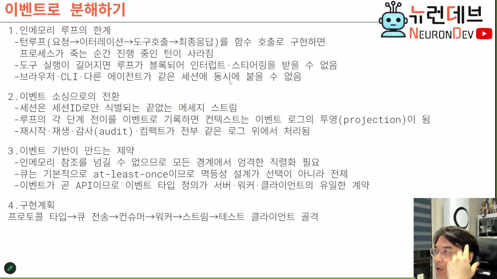
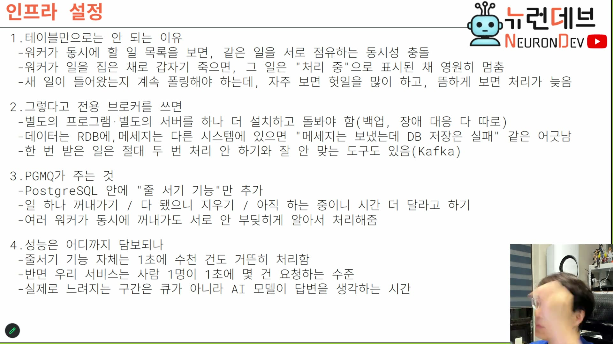

# 01. 왜 HTTP 서버로는 안 되는가

## 학습 목표

이벤트 기반으로 가는 결정이 **취향이 아니라 강제**임을 안다. 두 개의 압력이 있다 — 배치 형태가 만드는 부하 압력(클라이언트 서버 분리)과 실행 형태가 만드는 붕괴 압력(인메모리 턴 루프). 둘을 구분해서 잡으면 이 회차의 나머지가 왜 필요한지가 정리된다.

## 선수 지식

- 1강 2장(에이전트 루프 3요소: 세션 ⊃ 턴 ⊃ 이터레이션)
- 2강 2장(세션별 인스턴스 vs 스트림 서버) — 이 장은 그 갈림길의 "왜 스트림인가"에 해당한다

## 핵심 원리 (WHY) — 압력 1: 에이전트 본체가 서버에 있다

먼저 배치 형태가 다르다. 코덱스·클로드 코드는 에이전트 **본체가 클라이언트 컴퓨터에 설치**된다. 이 강의가 만드는 것은 그렇지 않다.

> 저희는 기업용 에이전트니까 보안 때문에 에이전트를 클라이언트 설치형으로 안 해요. 보통 코덱스나 클로드 코드는 에이전트 본체 자체가 다 클라이언트 컴퓨터에 설치가 되거든요. 저희는 클라이언트 서버 개념을 도입해서 클라이언트 쪽에서는 철저하게 클라이언트만 구현하게 되고, 이걸 운영하는 서버 자체는 **온프레미스에 설치되는 에이전트 서버**가 처리하게끔 할 거예요. `[01:30–02:00]`

이 한 줄이 부하의 성격을 바꾼다.

> 그러면 서버는 **전 직원의 부하를 다 받아야** 돼요. 그게 이제 좀 괴로운 거죠. 설치형은 여러분들 PC를 괴롭혀서 컴퓨터 한 대만 돌면 되는데, 온프레미스용 에이전트 서버는 서버니까 직원들을 다 상대해 줘야 되잖아요. `[02:00–02:30]`

**로컬 에이전트에는 없는 문제다.** 클로드 코드가 세션을 몇 시간 붙잡고 있어도 그 비용은 사용자 자기 노트북이 낸다. 서버형에서는 그 점유가 서버 자원이 되고, 사용자 수만큼 곱해진다.

## 핵심 원리 (WHY) — HTTP의 전략은 "빨리 응답하고 잊는다"

대규모 HTTP 서버가 성립하는 이유를 강의자가 정확히 짚는다.

> 왜 네이버가 수천만의 한국인을 받을 수 있냐면, 요청이면 **빨리 응답을 해주고 잊어버리기** 때문에 그렇거든요. 근데 바이브 코딩 에이전트는 그런 식이 아니잖아. 저랑 이틀이고 3일이고 계속 그 세션 열고 채팅을 할 거잖아요. 이놈이 날 끌어낼 수가 없는 거라 계속 유지가 돼. 이 지옥에서 벗어나려면 부하를 평균하게 줄이는 **이벤트 기반 프로토콜**을 쓸 수밖에 없어. `[02:30–03:30]`

정리하면 HTTP 확장성의 전제는 **연결의 짧은 수명**이다. 응답을 주고 잊기 때문에 동시 연결 수가 사용자 수와 무관해진다. 에이전트 세션은 그 전제를 정면으로 깬다 — 며칠짜리 세션, 응답까지 수십 초 걸리는 추론, 그 사이 계속 흘러나오는 스트림. **연결 수명이 길어지는 순간 동시 연결 수 = 사용자 수**가 되고, 서버는 사용자 수에 선형으로 무너진다.

## 핵심 원리 (WHY) — 압력 2: 인메모리 턴 루프가 무너지는 세 지점

배치 문제를 해결해도 실행 형태에 별개의 문제가 있다. 턴 루프를 그냥 함수 호출로 짜면 세 가지가 동시에 깨진다. 슬라이드가 이것을 셋으로 정리한다.



```
1. 인메모리 루프의 한계
 - 턴루프(요청→이터레이션→도구호출→최종응답)를 함수 호출로 구현하면
   프로세스가 죽는 순간 진행 중인 턴이 사라짐
 - 도구 실행이 길어지면 루프가 블록되어 인터럽트·스티어링을 받을 수 없음
 - 브라우저·CLI·다른 에이전트가 같은 세션에 동시에 붙을 수 없음
```

세 항목은 각각 다른 축이 깨진 것이다. 헷갈리기 쉬우니 축을 붙여 둔다.

| 깨진 것 | 축 | 왜 |
|---|---|---|
| 프로세스가 죽으면 턴이 사라진다 | **내구성** | 진행 중인 턴의 상태를 들고 있는 것이 프로세스 메모리뿐이다 |
| 인터럽트·스티어링을 못 받는다 | **제어권** | 루프가 블로킹된 동안 외부 신호를 받을 코드가 실행되지 않는다 |
| 같은 세션에 동시에 못 붙는다 | **다중 클라이언트** | 턴 루프가 특정 연결에 매인 인메모리 프로세스로 진행되고 있다 |

세 번째는 사용자가 매일 겪는 것이라 감이 온다.

> 브라우저, CLI, 수많은 유저의 다른 에이전트가 같은 세션에 동시에 붙기도 안 되는 거죠. 왜냐하면 턴 루프를 **어떤 연결에 대한 인메모리 프로세스로 진행하고 있었기 때문에.** 우리 모바일로도 동시에 돌아가는 거 보잖아, 같은 세션에 대해서. 그런 게 안 되는 거죠. `[13:00–13:30]`

멀티스레드로 막을 수 있느냐 — 안 된다. 강의자가 미리 막는다.

> 멀티 스레드를 하지라 해도 소용없어. 여러 유저가 달라붙어가지고 인터럽트를 시키면 어차피 죽어. `[13:00]`

**스레드를 늘리는 것은 처리량 문제의 답이고, 위 세 항목은 처리량 문제가 아니다.** 상태의 소유자가 프로세스 메모리라는 점이 문제라서, 스레드를 늘려도 각 스레드가 같은 방식으로 취약할 뿐이다.

## 필수 지식 (HOW) — 그래서 이벤트로 분해한다

전환의 정의는 한 줄이다.

> **세션은 세션 아이디로만 식별되는 끝없는 메시지 스트림**이라고 생각을 해보죠. 그러면 턴 생성도, 턴에 있는 이터레이션 시작도, 도구 호출하는 것도, 도구 결과도 전부 다 뭔가 처리하면 이벤트에 등록되는 그런 메시지 스트림이라고 생각을 하는 거예요. `[13:30]`

그리고 컨텍스트의 정의가 따라서 바뀐다. 슬라이드 2번 항목이다.

```
2. 이벤트 소싱으로의 전환
 - 세션은 세션ID로만 식별되는 끝없는 메세지 스트림
 - 루프의 각 단계 전이를 이벤트로 기록하면 컨텍스트는 이벤트 로그의 투영(projection)이 됨
 - 재시작·재생·감사(audit)·컴팩트가 전부 같은 로그 위에서 처리됨
```

**세 번째 줄이 2강과 이어지는 지점이다.** 2강에서 컴팩션을 다룰 때 "모델 입력은 마지막 컴팩트 레코드 아래로만 구성한다"는 규칙이 나왔는데, 그것이 왜 자연스럽게 가능한지가 여기서 설명된다.

> 이 투영 기법이 있어야지만 전 시간에 얘기했던 컴팩션 같은 거 했을 때 **컴팩션 밑으로만 투영**하거나 이런 일이 됩니다. 재시작, 재생, 감사, 컴팩트 이런 거 다 이벤트 로그만 쌓여있으면 거기서 적당하게 함수적 연산으로 끄집어내가지고 컨텍스트로 전환시켜줄 수가 있는 거죠. `[14:00]`

즉 **컴팩션·재시작·감사는 각각 만드는 기능이 아니다.** 로그 하나 위의 서로 다른 투영일 뿐이다. 인메모리 구조에서는 이 셋이 전부 별개 기능이 되고, 각각 따로 구현하고 따로 깨진다.

## 필수 지식 (HOW) — 분해의 대가 세 가지

공짜가 아니다. 슬라이드 3번 항목이 대가를 미리 적어 둔다.

```
3. 이벤트 기반이 만드는 제약
 - 인메모리 참조를 넘길 수 없으므로 모든 경계에서 엄격한 직렬화 필요
 - 큐는 기본적으로 at-least-once이므로 멱등성 설계가 선택이 아니라 전제
 - 이벤트가 곧 API이므로 이벤트 타입 정의가 서버·워커·클라이언트의 유일한 계약
```

첫째 대가가 이 강의 대상에서 특히 아프다. 이미지·PDF가 이벤트를 타고 흐르기 때문이다.

> 이미지 같은 경우도 다 Base64로 바뀌니까 용량이 커져요. 우리가 업로드할 때는 이미지는 그냥 바이너리로 업로드하면 되는데, 이벤트 기반에서 그런 바이너리 애들이 옮겨다닐 때는 직렬화 때문에 Base64로 바뀌어서 용량이 커져. 그래서 큰 이미지가 들어오면 약간 버벅거려. (…) 카프카에 2메가짜리 이미지 올리고 그러진 않잖아. 근데 우리는 그렇게 한다고. 여러분들이 올릴 거기도 하고, 그리고 막 PDF 파일도 올라가야 되고. **원래 10메가짜리 PDF를 Base64로 감히 직렬할 엄두가 나나.** `[15:00–15:30]`

이건 **미해결로 남은 문제**다. 강의자도 "그걸 또 해결하는 여러 가지 방법들이 있거든요, 그런 것도 좀 고민해야 되고"로 넘긴다. 자기 설계를 할 때 열어 둬야 하는 자리다(첨부는 이벤트에 실지 않고 참조만 싣는 식).

둘째 대가는 4·5장 전체, 셋째 대가는 3·7장에서 다룬다.

## 필수 지식 (HOW) — 왜 별도 브로커가 아니고 PostgreSQL 확장인가

이벤트 기반으로 가기로 했으면 큐가 필요하다. 여기서 인프라 선택이 나오는데, **성능 근거가 아니다.** 슬라이드 전체가 그 판단이다.



**후보 1. 그냥 RDB 테이블에 할 일 목록을 쌓는다** — 셋이 깨진다.

```
1. 테이블만으로는 안 되는 이유
 - 워커가 동시에 할 일 목록을 보면, 같은 일을 서로 점유하는 동시성 충돌
 - 워커가 일을 집은 채로 갑자기 죽으면, 그 일은 "처리 중"으로 표시된 채 영원히 멈춤
 - 새 일이 들어왔는지 계속 폴링해야 하는데, 자주 보면 헛일을 많이 하고, 뜸하게 보면 처리가 늦음
```

두 번째가 이 도메인에서 특히 자주 터진다.

> 그 락을 획득해서 태스크를 가져간 애가 죽으면 **영원히 멈추는 일**이 생긴단 말이야. 근데 바이브 코딩에서는 우리가 함부로 작업을 중단시키는 경우도 많고 중간에 끊어버리는 경우도 많고 막 그래요. 그럼 그때마다 다 시스템에 여기저기 구멍이 생기게 됩니다. `[04:00–04:30]`

**후보 2. 카프카·키네시스 같은 전용 브로커** — 성능은 좋은데 비용이 다른 데서 온다.

```
2. 그렇다고 전용 브로커를 쓰면
 - 별도의 프로그램·별도의 서버를 하나 더 설치하고 돌봐야 함(백업, 장애 대응 다 따로)
 - 데이터는 RDB에, 메세지는 다른 시스템에 있으면 "메세지는 보냈는데 DB 저장은 실패" 같은 어긋남
 - 한 번 받은 일은 절대 두 번 처리 안 하기와 잘 안 맞는 도구도 있음(Kafka)
```

두 번째 줄이 핵심 근거다. 3강에서 만든 어드민 DB에 가드레일·프롬프트 리라이팅 설정이 들어 있는데, 큐가 다른 시스템에 있으면 그 둘이 따로 논다.

> 그런 시스템은 데이터베이스랑 별개로 들어가 있으니까, 우리 예전에 설정했던 어드민에서 보안·프롬프트 리라이팅·가드레일 이런 거 설정할 거잖아요. 이런 데이터하고 카프카 데이터하고 따로 놀잖아. **둘이 또 동기화 시켜줘야 돼.** `[04:30–05:00]`

**결론: PostgreSQL 확장을 깐다.** pgvector를 깔듯 pgmq를 깔면, 큐가 DB 안에 들어온다.

```
3. PGMQ가 주는 것
 - PostgreSQL 안에 "줄 서기 기능"만 추가
 - 일 하나 꺼내가기 / 다 됐으니 지우기 / 아직 하는 중이니 시간 더 달라고 하기
 - 여러 워커가 동시에 꺼내가도 서로 안 부딪히게 알아서 처리해줌
```

> PG 익스텐션을 깔면 좋은 점은 다 그거야. **다 SQL문으로 돼.** 그래서 DB를 두 개씩 원격으로 운영하지 않고, 싱크로나이저 따로 맞출 필요가 없어 가지고 다 도는 거죠. `[10:00–10:30]`

## 필수 지식 (HOW) — 성능은 걱정거리가 아니라는 명시적 판정

이 부분이 인프라 논의에서 가장 자주 오해되는 지점이라, 슬라이드가 4번 항목으로 못을 박는다.

```
4. 성능은 어디까지 담보되나
 - 줄서기 기능 자체는 1초에 수천 건도 거뜬히 처리함
 - 반면 우리 서비스는 사람 1명이 1초에 몇 건 요청하는 수준
 - 실제로 느려지는 구간은 큐가 아니라 AI 모델이 답변을 생각하는 시간
```

> 기본적으로 **인퍼런스가 워낙 느리기 때문에** 다른 애들의 부하는 그렇게 눈에 띄지 않고, 처리 용량만 잘 처리할 수 있으면 되는데. MQ를 쓰면 워커들이 필요한 만큼만 태스크를 집어서 일하고 나머지는 방치하기 때문에 (…) 여러 가지 장점들이 많이 있습니다. `[07:30–08:00]`

**이 판정을 자기 설계에 옮길 때의 규칙:** 병목이 추론에 있는 시스템에서 큐의 처리량을 최적화하는 것은 대체로 헛수고다. 큐 선택은 성능이 아니라 **운영 대상 수와 정합성**으로 판단한다.

## 필수 지식 (HOW) — 실제로 어떻게 이사했나

3강의 어드민이 SQLite였다. 4강에서 그것이 PostgreSQL로 옮겨졌고, 에이전트는 별도 DB를 띄우지 않고 그 DB를 함께 쓴다.

> 어드민이 원래 아무 의존성 없이 SQLite를 쓰고 있었는데 얘가 포스트그레스로 이사를 갔어. 그래서 이미지를 보면 노드하고 pgvector를 일단 깔고, pgvector에다가 추가로 빌드를 시켜. (…) 여기 MQ 익스텐션을 이제 클론해가지고 설치를 해주는 과정을 겪어서. `[08:30–09:30]`
>
> 기존에 SQLite에 있던 코드들도 다 여기 Initialize DB 코드로 이사를 왔어요. 유저 만들었던 거, 세션, 모델 엔드포인트, 모델 설정 이런 것들 다 옮겨 왔죠. `[10:30]`
>
> 여기에는 따로 PostgreSQL 컨테이너를 따로 뜨는 게 아니라, 그냥 어드민에 DB까지 들어있어서 **이 DB를 에이전트가 사용하는 식**으로 연결되어 있다. `[12:00]`

확장이 둘 깔린다. 용도가 다르다.

| 확장 | 용도 | 근거 |
|---|---|---|
| **pgvector** | 임베딩 검색 — 에이전트가 과거 세션을 정기 점검하며 자기 개선(자기 성찰)하려면 히스토리 검색이 필요하다 | `[09:30–10:00]` |
| **pgmq** | 이벤트 큐 — 이벤트 소싱 서버의 베이스 | `[10:00]` |

> 벡터 익스텐션은 나중에 임베딩 검색해서 그 자기 성찰 같은 거 하거든요. 에이전트가 자기가 벌려놨던 세션들을 정기적으로 점검하면서 자기 개선하고 자기 루프 개선하고. 이러려면 임베딩 DB가 필요해요. `[09:30–10:00]`

## 우리 프로젝트와의 연결

이 장에서 확정된 것은 **"이벤트 기반이 강제다"**까지다. 어떻게 이벤트로 주고받을지는 아직 안 정해졌다. 다음 장이 그 형태를 도출한다 — 그리고 그 도출이 이 회차에서 가장 값진 대목이다.

자기 설계로 옮길 때의 판단 순서:

1. **에이전트 본체가 어디 있나** — 클라이언트면 이 장의 압력 대부분이 없다. 서버면 전부 있다
2. **세션 수명이 얼마나 긴가** — 짧으면 HTTP로 버틴다. 길면 연결 수명이 사용자 수를 따라간다
3. **인터럽트를 지원할 것인가** — 지원하면 인메모리 블로킹 루프는 쓸 수 없다
4. **큐를 어디에 둘 것인가** — 성능이 아니라 "운영 대상을 몇 개 유지할 수 있나"와 "데이터와 메시지가 갈라져도 되나"로 판단한다
