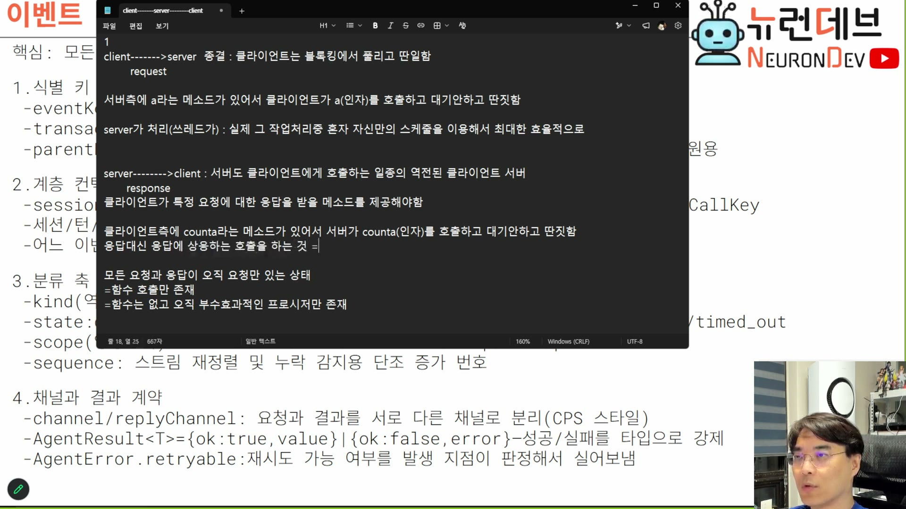

# 02. CPS — 응답을 포기하면 무엇이 남는가

> ★ 이 회차의 등뼈. 뒤의 모든 장은 여기서 잘라낸 것의 대가를 갚는 이야기다.

## 학습 목표

요청–응답 한 쌍을 어떻게 잘라내는지를 도출 순서대로 따라가고, 잘라낸 결과가 **왜 발행-구독으로 귀결되는지**를 안다. CPS를 "비동기의 다른 이름"으로 알고 있으면 이 장의 절반을 놓친다. 핵심은 비동기가 아니라 **응답이라는 개념 자체를 없앤 것**이다.

## 선수 지식

- 1장 — 이벤트 기반이 강제라는 결론
- `event-sourcing-msa/docs/08-pubsub-channel.md` — 발행-구독과 관찰자 패턴의 차이. 이 장 마지막이 그 구분과 맞물린다

## 핵심 원리 (WHY) — 함수 호출과 HTTP 요청은 같은 그림이다

강의자는 메모장에 그림을 그려 가며 도출한다. 출발점은 요청–응답이 함수 호출과 구조적으로 동일하다는 관찰이다.

> 클라이언트가 서버에게 보내는 게 이게 리퀘스트잖아요. 그리고 서버가 다시 클라이언트한테 보내는 게 리스펀스란 말이에요. **이건 함수의 호출도 별다르지 않아.** 콜러가 펑션에게, 그리고 다시 콜러에게 한단 말이야. 이게 콜이고 이게 리턴이란 말이야. `[28:00]`

```
클라이언트 ──request──▶ 서버          콜러 ──call──▶ 함수
클라이언트 ◀─response── 서버          콜러 ◀─return── 함수
```

문제가 어디 있는지가 그림에서 바로 보인다.

> 뭐가 문제냐고? 그게 큰 문제인 거지. 왜냐하면 **여기서부터 여기까지 블로킹이 걸릴 거죠.** 그리고 더 큰 문제는 이 블로킹이 얼마나 길어질지는 **함수에서 얼마나 무거운 일을 하냐에 달려있다**는. 따라서 이 블로킹은 상당히 오랜 기간 동안 유지될 수 있어요. `[28:30–29:00]`

**두 번째 문장이 이 도메인에서 치명적이다.** 블로킹 길이의 결정권이 호출자에게 없다. 에이전트에서 그 "무거운 일"은 LLM 추론이고, 수십 초에서 수 분이다. 호출자는 그 시간 동안 아무것도 못 하면서 대기 자원을 점유한다.

## 필수 지식 (HOW) — 1단계: 응답을 자른다

해결은 난폭하다. **응답을 없앤다.**

> 이 문제 어떻게 해결하냐면, 콜러 나갔으니까 이걸로 잘라 버려. 그 종결 났어. **클라이언트는 아무런 응답도 못 받아. 끝이야.** 클라이언트는 나한테 요청을 보냈는데 클라이언트는 나한테 응답을 못 받아. `[29:00]`
>
> 이러면 여기는 빨리 끝나서 클라이언트의 블로킹은 안 걸리겠죠. 던지고 끝났잖아요. `[29:30]`

메모장 1단계가 이렇게 정리된다.



```
1
client------->server   종결 : 클라이언트는 블로킹에서 풀리고 딴일함
     request

서버측에 a라는 메소드가 있어서 클라이언트가 a(인자)를 호출하고 대기 안 하고 딴짓함

server가 처리(쓰레드가) : 실제 그 작업 처리 중 혼자 자신만의 스케줄을 이용해서 최대한 효율적으로
```

**얻은 것이 명확하다.** 서버는 이제 자기 스케줄로 일한다 — 클라이언트가 기다리고 있지 않으니 언제 처리할지, 어느 스레드에 줄지, 몇 개씩 묶을지를 서버가 정할 수 있다.

> 되게 많은 클라이언트들이 되게 많이 던지고, 서버는 최대한 자원을 잘 활용해서 **자기가 던지고 싶을 때 다시 스케줄링해서** 잘 던질 수가 있기 때문에 요 작업을 분리해요. `[34:30–35:00]`

## 필수 지식 (HOW) — 2단계: 결과는 "또 하나의 호출"로 온다

응답을 없앴으니 결과를 받을 방법이 없다. 그래서 대칭을 만든다.

> 클라이언트가 응답을 받고 싶으면 **마치 서버처럼 자기도 서버가 응답을 던질 메소드를 준비해놔야** 돼. 양쪽 다 서버인 거지. 클라이언트나 서버나 둘 다 서버인 거야. 그래서 알고 보면 둘 다 서버인 거야. `[31:30]`

메모장 2단계다.

```
server-------->client : 서버도 클라이언트에게 호출하는 일종의 역전된 클라이언트 서버
     response
클라이언트가 특정 요청에 대한 응답을 받을 메소드를 제공해야 함

클라이언트측에 counta라는 메소드가 있어서 서버가 counta(인자)를 호출하고 대기 안 하고 딴짓함
응답 대신 응답에 상응하는 호출을 하는 것 =

모든 요청과 응답이 오직 요청만 있는 상태
=함수 호출만 존재
=함수는 없고 오직 부수효과적인 프로시저만 존재
```

마지막 세 줄이 이 장의 결론이다. 순서대로 읽어야 한다.

| 표현 | 무슨 뜻인가 |
|---|---|
| **오직 요청만 있는 상태** | 프로토콜에서 "응답"이라는 종류가 사라졌다. 남은 건 방향이 다른 요청 둘 |
| **함수 호출만 존재** | 호출은 있는데 리턴이 없다 |
| **함수는 없고 부수효과적인 프로시저만 존재** | 리턴이 없으면 수학적 함수가 아니다. 값을 돌려주지 않고 세상을 바꾸는 프로시저만 남는다 |

> 순수함수는 인자를 받아서 리턴하잖아. **얘는 리턴이 없어. 리턴 안 해. 리턴은 받을 사람도 없어.** 콜하면 끝이야. `[33:30]`

이 이름이 CPS다.

> 우리는 이걸 뭐라 그러냐면 — 특히 어떤 부분? 이거, 이 부분, 이 파트. 뭐라 부르지? **컨티뉴에이션**이라고. 그래서 우리는 이 스타일을 **CPS**로 부릅니다. `[33:30–34:00]`

슬라이드의 정의가 가장 압축돼 있다.

```
CPS(Continuation-Passing Style)
보통 호출은 요청하고 그 자리에서 응답을 기다림
CPS는 요청과 함께 응답을 나중에 받을 곳(continuation)만 던져두고 바로 다음 일로 넘어감
응답은 훗날 그 목적지로 알아서 배달됨
응답을 받는 곳도 엄밀하게는 함수로서 호출되는 것임
```

## 필수 지식 (HOW) — 컨티뉴에이션은 콜백이다

거창해 보이는 이름의 정체를 강의자가 스스로 벗긴다. 이 대목은 개념을 이미 알고 있는 사람에게 오히려 중요하다.

> 이 요청이 들어올 때 이미 이 응답을 나중에 어디에다 던져야 되는지, **그 위치가 바로 Continuation이야.** 그리고 바로 다른 데로 가는 거죠. (…) 보통 함수형 프로그램에서 Continuation을 짜면 Continuation이 당연히 함수겠죠. 다 끝나면 보고해 줄 함수. 1급 함수를 받아가지고. 이거를 자바에서 뭐라 그러죠? **콜백이라고 합니다.** 콜백이에요. **CPS가 대단해 보이지만 대단한 건 아니고 콜백이잖아 이게.** `[57:30–58:00]`

그럼 콜백과 CPS의 차이는 뭔가. 정도의 차이다.

> 근데 콜백하고 다른 점은, 컨티뉴에이션은 **모든 애들이 다 콜백으로만 연쇄되는** 애라고 볼 수 있어요. `[58:30]`

**즉 CPS는 새로운 메커니즘이 아니라 규율이다.** "콜백을 쓸 수도 있다"가 아니라 "리턴이 아예 없고 모든 진행이 콜백 연쇄로만 이뤄진다"는 전면 적용. 부분 적용은 성립하지 않는다 — 한 군데라도 리턴을 기다리면 그 지점이 블로킹으로 남고, 1단계에서 얻은 것이 사라진다.

## 필수 지식 (HOW) — 3단계: 이벤트 소싱에서는 더 심해진다

여기까지는 두 당사자의 이야기였다. 이벤트 큐가 끼면 상대가 사라진다.

> **뭘 던진다? 이벤트를 던집니다. 요청을 던지지 않는다.** 이벤트 소싱 서버에서는. 그러면 서버는 뭐하죠? 이걸 끝없이 합니다. `[36:00–36:30]`
>
> 모든 건 다 서버에 있는 이벤트 큐에서 일어나. 끝없이. **이게 바로 응답이 없는 거야.** CPS가 계속 이렇게 일어나요. `[38:00–38:30]`

그리고 여기서 결정적인 갈림길이 나온다. 클라이언트도 CPS를 받으려면 엔드포인트를 열어야 하는데, 그게 싫으면?

> 클라이언트가 저걸 받아줘야 되겠죠. 클라이언트한테 이게 있다는 얘기야. 그러면 클라이언트가 **특정 엔드포인트를 갖게 하고 싶지 않으면** 어떻게 돼요? 클라이언트도 똑같이 이렇게 되겠죠. 근데 이것도 싫어. 그럼 어떻게 하면 돼요? **이게 바로 이벤트 구독 발행이라는 개념이 진짜 부연이에요.** `[38:30–39:00]`

**이것이 이 장에서 가장 놓치기 쉬운 문장이다.** 발행-구독을 "확장성이 좋아서 고른 아키텍처"로 이해하면 순서가 거꾸로다. 도출 순서는 이렇다.

```
① 블로킹을 없애려고 응답을 잘랐다
② 잘랐으니 결과는 역방향 호출로 와야 한다 → 클라이언트도 서버가 된다
③ 클라이언트가 엔드포인트를 열기 싫다  → 발행-구독만 남는다
```

그리고 클라이언트의 성격이 바뀐다.

> 클라이언트도 마찬가지로 들어오는 이벤트에 대해서 반응을 가능하는 **리액티브한 존재**일 뿐이에요. 특정 메시지를 처리하는 메소드를 다 만드는 게 아니라. `[39:30–40:00]`

## 필수 지식 (HOW) — 계약은 상대가 아니라 채널로 맺는다

발행-구독으로 가면 계약의 상대가 사라진다. 이 대목은 `event-sourcing-msa/docs/08-pubsub-channel.md`의 "채널이 계약이다"와 정확히 같은 지점이다.

> 결국에는 우린 이거 뭐라고 하면 다 **이벤트 브로커**라고 그러는데, 클라이언트든 서버든 다 이벤트 브로커고 **둘 사이의 계약은 채널로 성립하는 거야.** 사실은 그 클라이언트가 누군지 별로 안 궁금한 거야. 우리는 채널로 계약하는 거야. A라는 클라이언트는 3번 채널을 구독하기로 했고, 할 말 있으면 3번 채널에 남길 거니까. 서버도 3번 채널에 온 메시지 처리하다가 클라이언트들한테 할 말이 있으면 3번 채널에다 이벤트를 발행하는 거지. `[40:00–40:30]`

**"클라이언트가 누군지 안 궁금하다"가 관찰자 패턴과 갈라지는 지점이다.** 관찰자 패턴에서는 주체가 관찰자 목록을 들고 있어서 상대를 안다. 발행-구독에서는 채널만 알고, 그 채널을 누가 몇 명 듣는지는 모른다. 그 무지가 있어야 클라이언트를 늘리거나 줄여도 서버 코드가 안 바뀐다.

그리고 강의자가 이 지점에서 학습 요구를 한 번 더 못 박는다. 자료로 남길 가치가 있는 기준선이다.

> 어디까지 공부해야 되냐면, 이렇게 굉장히 자세하게 **어떻게 구현되는지 이해할 때까지** 공부하라고. 어쩔 수 없다고. 대충 이벤트가 어쩌고저쩌고 막 거룩한 얘기하지 말고, **진짜로 구현이 어떻게 되는지 완전히 이해할 때까지** 공부하라고. 그걸로 구현할 거예요 저희는. `[40:30–41:00]`

## 필수 지식 (HOW) — 제약: HTTP로는 못 하고 SSE로도 못 한다

CPS의 청구서 중 가장 먼저 오는 것은 전송 계층이다.

> 제약사항은 뭐죠? 이게 제약사항이야. **그래서 HTTP로는 안 돼. 소켓으로밖에 안 돼.** 부하는 확 줄어드는 대신에 소켓으로밖에 안 되는 거지. `[35:00–35:30]`
>
> SSE는 양방향 통신이 아니라 서버가 간간이 보낼 수 있어요. 간간이 서버만 보낼 수 있어요. `[35:30]`

슬라이드가 결론만 적어 둔다.

```
1. 소켓 클라이언트
 - CPS는 반드시 양방향 통신을 요구하기 때문에 SSE로는 대응불가
 - 웹소켓을 기반으로 동작
```

이유를 한 줄로 정리하면: **CPS에서 클라이언트는 발신자이면서 수신자다.** 서버 푸시만 되는 SSE는 ②단계의 역방향 호출을 받을 수는 있지만, 클라이언트가 그 위에서 다시 발행할 수 없다. 반쪽만 있는 채널로는 채널 계약이 성립하지 않는다.

그리고 이건 시행착오로 확인된 사실이다 — 강의자가 실제로 SSE로 만들었다 버렸다.

> 코드는 이미 한 바퀴 짜서 돌려봤다고 했죠. **처음에는 SSE를 구현했다가 안 되겠더라고요. 그래서 날려버렸고.** `[1:40:00]`

## 필수 지식 (HOW) — 얻은 것과 잃은 것

이 장의 회계를 명시적으로 정리해 둔다. 뒤의 장들이 각각 어느 손실을 갚는지의 지도다.

| | 무엇 | 어디서 다루나 |
|---|---|---|
| **얻음** | 블로킹 소멸 — 동시 접속이 대기 자원을 점유하지 않는다 | 이 장 |
| **얻음** | 서버가 자기 스케줄로 일한다 — 멀티스레드 분산이 자유롭다 | 8장 |
| **얻음** | 세션이 연결에 매이지 않는다 — 여러 클라이언트가 같은 세션을 본다 | 9장 |
| **잃음** | 도착 순서 보장 | 3장 (봉투의 인과 키·시퀀스) |
| **잃음** | 처리 여부 판정 — 어느 한쪽만 봐서는 알 수 없다 | 4·5장 (멱등 키) |
| **잃음** | 중복·유실 회피 | 6장 (삭제 시점) |

슬라이드가 손실 쪽을 한 문단으로 요약한다. **"선택 사항이 아니라 존재 조건"**이라는 표현이 정확하다.

```
4. CPS(요청과 응답을 분리된 채널로 주고받는 구조)를 지향할수록 심각
 - 요청을 보낸 쪽이 같은 연결에서 응답을 기다리지 않고, 결과는 나중에 별도 채널로 돌아옴
 - 요청-응답의 물리적 연결이 끊어져 있으므로, 어느 한쪽만 보고는 처리여부 판정 불가
 - 이 구조를 택한 순간 중복·재정렬 대응은 선택 사항이 아니라 이 아키텍처의 존재 조건이 됨
```

## 필수 지식 (HOW) — 성능은 왜 극적으로 좋아지는가

같은 슬라이드 구간에서 강의자가 이 구조를 "현대 고성능 서버 아키텍처"로 규정한다. 표현이 강한 만큼 근거를 붙여 둘 가치가 있다.

> 딱 제가 이 디스크립션으로 묘사한 것만 해도 벌써 서버 자원을 빵빵하게 쓸 것 같죠. **이 요청에서 응답까지 블로킹 하는 거랑 비교가 안 돼요.** `[55:00–55:30]`
>
> 현대 고성능 서버 아키텍처는 굳이 얘기하면 다 이거야. 이 고성능을 추구하면 무조건 이걸 할 수밖에 없어. (…) **아직까지 우리의 소프트웨어 공학은 네트워크 문제에서 저걸 해결하는 다른 방법을 발견하지 못했어요.** `[56:00–57:00]`

라이브러리도 어디에나 있다는 점을 덧붙인다 — 직접 구현할 것이 아니라는 뜻이다.

> 이거는 아주 일반적인 구현이고, 라이브러리와 이걸 처리해주는 서버까지 다 오픈소스로 다 있습니다. 그냥 가져다 쓰면 돼요. 거의 모든 언어로 다 있어요. `[54:00–54:30]`

> **주의:** 강의자가 이 대목에서 언어별 런타임을 몇 개 열거하는데(파이썬·러스트·Rx 계열 등) 본인이 *"라이브러리 다 기억이 안 나요"*라고 말한 즉흥 나열이다. 자료에서는 이름을 옮기지 않았다. 확인 없이 옮기면 사실이 아닌 목록이 남는다.

## 필수 지식 (HOW) — 워커에게 무거운 일을 주면 이득이 사라진다

CPS의 이득에는 조건이 하나 붙는다. 8장의 abort 논의와 이어지는 대목이라 여기서 미리 잡아 둔다.

> 요런 시스템을 쓰실 때 제일 중요한 것은 각각의 워커들이 (…) 이런 식으로 여러분들의 이벤트들이 빨리빨리 처리될 수 있게끔 **분산시키는 게 설계에서 되게 중요한 점**이에요. **어렵고 무거운 일을 시키면 안 돼.** 그러면 워커들이 다 락에 걸리니까. 최대한 멀티스레드를 많이 활용하려면 개별 이벤트들이 빨리빨리 처리될 수 있는 페이로드로 바꿔줘야 돼. `[55:30–56:00]`

**즉 CPS는 블로킹을 없애는 구조를 주지만, 블로킹을 없애 주지는 않는다.** 이벤트 하나의 처리가 무거우면 그 워커에서 블로킹이 되살아난다. 구조로 얻은 것을 페이로드 설계로 지켜야 한다.

여기서 자바스크립트를 쓰는 사람이 오해하기 쉬운 점 하나를 강의자가 명시적으로 끊는다.

> 그 자바스크립트의 싱글스레드 이벤트 루프 아닙니다. **워커스레드 패턴은** 이렇게 굉장히 비동기적인 컨텍스트를 갖고 있기 때문에 그거랑은 달라요. `[56:00]`

## 우리 프로젝트와의 연결

이 장이 확정한 것은 **응답이라는 개념이 프로토콜에서 사라졌다**는 사실이다. 그래서 다음 장의 질문이 필연적으로 나온다 — 응답이 없는데, 무엇을 보고 "이건 아까 그 요청의 결과다"라고 알아보는가? 그 식별 정보를 담는 그릇이 봉투(envelope)다.

자기 설계로 옮길 때 확인할 것:

1. **부분 적용을 하고 있지 않은가** — 어딘가 한 군데라도 `await` 로 응답을 기다리면 그 지점이 블로킹으로 남는다. CPS는 전면 적용이거나 아니거나다
2. **클라이언트가 발행도 하는가** — 수신만 하면 SSE로 충분하고, 발행도 하면 소켓이 필수다. 이 판단이 전송 계층을 결정한다
3. **계약이 상대인가 채널인가** — 상대를 알고 있으면(관찰자) 클라이언트 증감이 서버 코드를 건드린다
4. **이벤트 하나의 처리 시간이 얼마인가** — 무거우면 구조로 얻은 이득이 워커에서 되돌아간다
