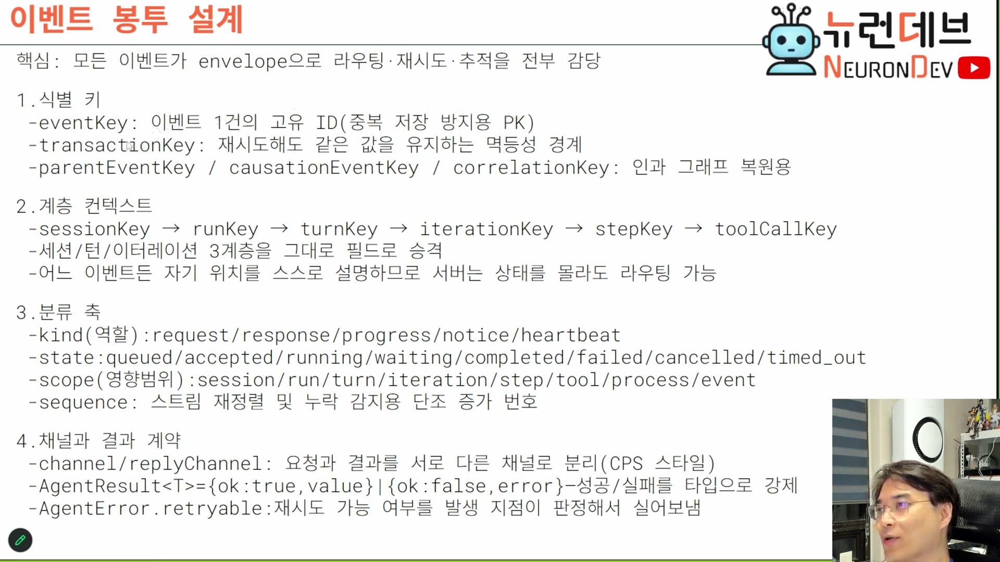

# 03. 이벤트 봉투 — 응답이 없어도 알아볼 수 있게 만드는 것

## 학습 목표

봉투(envelope)의 필드가 왜 그 네 묶음인지를 안다. 각 묶음이 2장에서 잃은 것 하나씩을 갚는다 — 임의로 정한 스키마가 아니라 **손실 목록에서 역산된 스키마**다.

## 선수 지식

- 2장 — 응답이 사라졌다는 결론. 봉투는 그 결과로 필요해진 물건이다
- 1강 2장 — 세션 ⊃ 턴 ⊃ 이터레이션. 계층 컨텍스트가 이 셋을 필드로 승격시킨다

## 핵심 원리 (WHY) — 페이로드가 아니라 래퍼가 계약이다

이벤트에는 층이 둘이다.

> 이벤트가 일단 래퍼인 **엔벨로프**, 보통 엔벨로프라고 그러죠. 요 래퍼한테 감싸져 있어서 모든 이벤트는 일단 래퍼 스펙이 있단 말이야. 엔벨로프 스펙이 있어요. **엔벨로프 스펙부터 먼저 정리를 해.** 이 엔벨로프 안에 페이로드가 들어가는 거죠. 이벤트의 진짜 내용은 페이로드인데, 페이로드가 이 엔벨로프 안에 들어가는 거야. `[18:00–18:30]`

**"엔벨로프 스펙부터 먼저 정리를 해"가 설계 순서에 대한 지시다.** 페이로드는 기능마다 다르고 계속 늘어난다. 봉투는 모든 이벤트가 공유하고 거의 안 바뀐다. 그래서 봉투가 서버·워커·클라이언트 사이의 **불변 계약**이 되고, 라우팅·재시도·추적을 전부 봉투만 보고 처리할 수 있다. 슬라이드 헤드라인이 그 말이다.



> **핵심: 모든 이벤트가 envelope으로 라우팅·재시도·추적을 전부 감당**

## 필수 지식 (HOW) — 네 묶음, 그리고 각각이 갚는 손실

슬라이드 전문이다.

```
1. 식별 키
 - eventKey: 이벤트 1건의 고유 ID(중복 저장 방지용 PK)
 - transactionKey: 재시도해도 같은 값을 유지하는 멱등성 경계
 - parentEventKey / causationEventKey / correlationKey: 인과 그래프 복원용

2. 계층 컨텍스트
 - sessionKey → runKey → turnKey → iterationKey → stepKey → toolCallKey
 - 세션/턴/이터레이션 3계층을 그대로 필드로 승격
 - 어느 이벤트든 자기 위치를 스스로 설명하므로 서버는 상태를 몰라도 라우팅 가능

3. 분류 축
 - kind(역할): request/response/progress/notice/heartbeat
 - state: queued/accepted/running/waiting/completed/failed/cancelled/timed_out
 - scope(영향범위): session/run/turn/iteration/step/tool/process/event
 - sequence: 스트림 재정렬 및 누락 감지용 단조 증가 번호

4. 채널과 결과 계약
 - channel/replyChannel: 요청과 결과를 서로 다른 채널로 분리(CPS 스타일)
 - AgentResult<T>={ok:true,value}|{ok:false,error} - 성공/실패를 타입으로 강제
 - AgentError.retryable: 재시도 가능 여부를 발생 지점이 판정해서 실어보냄
```

네 묶음을 2장의 손실 목록에 붙이면 왜 이 넷인지가 보인다.

| 묶음 | 갚는 손실 | 없으면 무슨 일이 |
|---|---|---|
| 1. 식별 키 | 처리 여부 판정 불가 + 인과 관계 소실 | 같은 요청인지 모른다. 어느 이벤트가 어느 이벤트의 결과인지 모른다 |
| 2. 계층 컨텍스트 | 상태 없는 라우팅 불가 | 서버가 세션 상태를 들고 있어야 이벤트를 어디로 보낼지 알 수 있다 |
| 3. 분류 축 | 도착 순서 보장 불가 | 스트림이 뒤섞이고, 빠진 조각을 알아채지 못한다 |
| 4. 채널·결과 계약 | 응답 도착지 소실 | 결과를 어디로 보낼지 모른다. 실패를 성공처럼 취급한다 |

## 필수 지식 (HOW) — 1번: 식별 키 세 종류가 서로 다른 일을 한다

세 키가 이름이 비슷해서 뭉개기 쉽다. **책임이 완전히 다르다.**

| 키 | 범위 | 재시도하면 |
|---|---|---|
| `eventKey` | 이벤트 1건 | **바뀐다** — 재시도는 새 이벤트다 |
| `transactionKey` | 멱등 경계 (턴 하나, 이터레이션 하나, 도구 호출 하나…) | **안 바뀐다** — 그래서 검문소가 알아본다 |
| `parentEventKey`·`causationEventKey`·`correlationKey` | 인과 그래프의 간선 | 그래프상 위치를 가리킨다 |

`eventKey`의 발급 방식에 근거가 붙는다.

> 이벤트 발급도 특정 리더가 발급할 게 아닌 이상은 UID 같은 걸로 발급할 수밖에 없어. **유니크하게 식별이 되어야 되기 때문에** 대부분 이벤트 키는 UUIDv7이나 이런 걸로 발급하거든요. `[19:00]`

> **왜 UUIDv7인가 (강의에 없는 보충):** UUIDv7은 앞부분이 밀리초 타임스탬프라 **문자열 정렬이 대체로 생성 순서와 일치**한다. 순수 랜덤인 v4는 인덱스에 무작위로 꽂혀 B-tree가 흩어지는데, v7은 뒤에 붙는다. 이벤트 로그처럼 계속 추가되고 시간순으로 조회하는 테이블에서 이 차이가 크다. 다만 "대체로"다 — 같은 밀리초 안의 순서는 보장되지 않으므로, **정렬 근거로 삼으면 안 된다.** 순서는 3번 묶음의 `sequence`와 인과 키가 담당한다.

`transactionKey`는 **경계를 무엇으로 잡을지가 설계 결정**이라는 점이 중요하다. 이 강의의 세션 진행 구조에 대입하면 후보가 여럿이다.

> 여러분들이 어떤 세션을 진행하고 있어요. 채팅창을 하나 열었어. 그러면 채팅창에서 발급되는 모든 이벤트는 다 채팅창 소속일 거 아니야. 근데 채팅할 때 어떻게 일어난다? 요청하면 턴이 만들어지고, 턴에서 이터레이션을 여러 번 돌면서 도구 호출 다 하고, 그 다음에 빠져나오면서 최종 답을 하는 식으로 턴이 종결되고 턴이 쌓이고 이렇게 진행이 될 거잖아요. **그 단위별로 트랜잭션이라는 개념이 있단 말이지.** 턴이 끝났어 안 끝났어? 이게 턴의 일부야 아니야. 이번 이터레이션에 도구 호출을 요청했는데 도구 호출 결과를 보고하는 그 짧은 또 이터레이션 트랜잭션이 아니야. `[19:30–20:30]`

인과 키에 대해서는 강의자가 **결정을 안 내렸다고 명시한다.** 미결정 사항은 미결정으로 기록해 두는 것이 자기 설계에 도움이 된다.

> 어떤 이벤트들은 연속돼 있단 말이야. 이거 한 다음에 저거 한 다음에 그거 해서 이거 했어요라는, 얘네들을 연결하는 어떤 그래프 키가 필요할 경우도 있어요. **제가 모르겠어. 이 키를 쓸지 전부 다 트랜잭션 키로 퉁칠지 고민하고 있어요.** 아마 이런 키가 있어도 트랜잭션 키의 보완책이겠죠. `[19:30]`

그리고 인과 키가 필요한 이유는 큐가 순서를 안 지키기 때문이다.

> 이벤트는 계속 순서도 없이 막 도착하니까 걔네들을 연결해주는 내부적인 그래프 처리가 필요하잖아. 이벤트 소싱 서버는 이벤트가 발급되고 수신하는데 그냥 왔으니까 처리할 뿐이고 아무 관심도 없어요. 그럼 어떻게 순서 보장을 할 건데? 분명히 순서가 있는 일인데 **이벤트 큐 시스템이 순서 보장을 안 해준단 말이지.** 막 날아 나온단 말이야. 그러니까 그 순서 보장을 해주는 인과관계를 그래프로 이해하려면 이벤트 자체의 엔벨로프에 저런 키 같은 게 포함될 수밖에 없어. `[20:30–21:00]`

## 필수 지식 (HOW) — 2번: 계층 컨텍스트와 자기 서술성

여섯 단계다. 1강의 3계층이 그대로 필드가 되고, 아래로 셋이 더 붙는다.

```
sessionKey → runKey → turnKey → iterationKey → stepKey → toolCallKey
```

아래 셋이 왜 필요한가.

> 계층적 컨텍스트가 있죠. 세션키가 있고, 현재 실행 중인 키, 턴과 관련된 키, 이터레이션과 관련된 키, 이터레이션이 여러 스텝으로 이루어지는 스텝에 대한 키. 툴 호출할 때도 여러 툴들이 개별로 요청하고 호출되고 결과가 나오면 결합하고 — **이거에 대한 개별 툴 콜별로 키가 또 필요해요.** `[23:00–23:30]`

**핵심은 이 필드들이 있으면 서버가 상태를 안 들고 있어도 된다는 것이다.** 이것을 슬라이드가 자기 서술성으로 부른다.

> 어떤 이벤트든 간에 자기 위치를 — 이제 이거 **셀프 디스크립션**이라고 하는데 — **이벤트는 이벤트 자체 메시지만으로 완전해야 돼.** 다른 걸로는 못 들어와. `[24:00]`

이 성질이 왜 결정적인지는 8장의 워커와 붙여 보면 안다. 워커는 스레드일 뿐이고 언제든 죽고 새로 뜬다. 갓 뜬 워커가 이벤트 하나를 집었을 때 그 이벤트만 보고 전부 판단할 수 있어야 한다 — 세션 상태를 조회해야 한다면 워커가 상태 저장소에 매이고, 상태 조회가 새 병목이 된다.

그리고 이 구조 자체는 발명이 아니라는 점도 밝힌다.

> 이게 지금 우리가 흔하게 쓰고 있는 에이전틱 AI의 일반적인 형태잖아요. 근데 이거 다 업체들이 만들어낸 흐름이거든. 여러분들하고 실험할 건 아니니까. 암튼 **아주 익숙한 이 구조를 그대로 쓰긴 할 거예요.** `[23:30]`

## 필수 지식 (HOW) — 3번: 세 축이 직교한다, 그리고 시퀀스는 왜 따로인가

`kind` / `state` / `scope` 는 서로 다른 질문에 답한다. 하나로 합치려 들면 조합이 폭발한다.

| 축 | 질문 | 값 |
|---|---|---|
| `kind` | **이 이벤트의 역할이 무엇인가** | request / response / progress / notice / heartbeat |
| `state` | **그 일이 지금 어디까지 갔나** | queued / accepted / running / waiting / completed / failed / cancelled / timed_out |
| `scope` | **영향 범위가 어디인가** | session / run / turn / iteration / step / tool / process / event |

`state`에 `waiting`이 따로 있는 것을 강의자가 짚는다 — 실행 중인데 일단 대기시키는 상태다.

> state에서는 이게 큐에 들어왔다, 워커가 가져갔다, **워커가 지금 실행 중인데 일단 대기해봐**, 완료됐다, 실패했다, 취소됐다, 타임아웃 됐다 이런 스테이트들이 있고요. `[24:30]`

**`sequence`는 위 세 축과 성격이 다르다.** 분류가 아니라 순번이다. 그리고 왜 트랜잭션 키만으로 안 되는지가 이 장에서 가장 실무적인 대목이다.

> 시퀀스 같은 경우엔 스트림 정렬 때문에 단조 증가 번호가 필요해요. 이거 뭐냐면, 제가 모델이 최종 응답을 하든지 아니면 툴 콜 할 때도 계속 응답이 날아오면 스트림으로 날아오잖아. 그 스트림을 이벤트에다가 — 인퍼런스한테 토큰 생성될 때마다 제가 받아가지고 클라이언트한테 쏴줘야 되잖아. 그런 거 할 때에는 **이 키에 대한 트랜잭션이 아니라, 그 이번 응답에 대한 키는 똑같은데 거기에 이제 번호를 쭉 붙여가지고** 이게 첫 번째 토큰이야, 세 번째 토큰이야 이렇게 보내야 되거든요. `[24:30–25:00]`
>
> **모델 응답을 한 번에 보낼 수 있다고 생각하면 안 돼.** 모델은 다 스트림으로 오기 때문에 이 안에 다시 시퀀스가 또 필요해. `[25:00–25:30]`

정리하면 계층이 이렇게 된다.

```
transactionKey  = "이 응답"   ← 같은 값
   └ sequence 0, 1, 2, 3 ...   ← 토큰(또는 청크) 순번
```

트랜잭션 키는 **하나의 일**을 식별하고, 시퀀스는 그 일이 뿜어내는 **조각들의 순서**를 잡는다. 그리고 슬라이드가 시퀀스의 두 번째 용도를 적어 놨다 — *"스트림 재정렬 및 **누락 감지**용"*. 단조 증가라서 3 다음에 5가 오면 4가 빠졌음을 수신자가 안다.

## 필수 지식 (HOW) — 4번: 채널 분리와 결과 타입

`channel` / `replyChannel` 이 CPS의 컨티뉴에이션이 실제로 필드가 된 모습이다. 2장에서 "응답을 나중에 받을 곳"이라고 부른 그 위치다.

강의자는 채널을 얼마나 쪼갤지에 대해서는 유보한다.

> 그래서 이제 채널 리플레이 채널 뭐 이런 요청 결과를 다른 채널로 분리할 수도 있고요. **별로 그럴 생각도 없어요, 사실은.** 그때 CPS 스타일로 가는 건 맞고. `[41:00]`

결과 타입 쪽은 명확한 규율이다.

```
AgentResult<T> = {ok:true, value} | {ok:false, error}
AgentError.retryable : 재시도 가능 여부를 발생 지점이 판정해서 실어보냄
```

> 성공 실패에 대한 합 타입을 미리 지정해서 (…) 모든 응답 페이로드에 대해서 이런 것들을 좀 지정해 놓고. `[41:00–41:30]`

**`retryable` 플래그의 배치가 설계적으로 중요하다.** 재시도 가능 여부를 판정하는 주체가 수신자가 아니라 **발생 지점**이다. 이유는 정보의 위치다 — "이 실패가 일시적인지"를 아는 것은 실패가 난 곳이고, 이벤트를 받는 워커는 에러 메시지 문자열을 보고 추측할 수밖에 없다. 문자열 매칭으로 재시도를 결정하는 코드는 반드시 썩는다.

그리고 봉투 수준의 계약이라는 성격을 다시 확인한다.

> 어쨌든 이게 이제 엔벨로프 래퍼 수준에서의 계약이야. **모든 이벤트는 다 이 규격을 따르는 거지.** `[41:30]`

## 우리 프로젝트와의 연결

봉투에서 확정된 것은 **"응답 없이도 알아보는 방법"**이다. 하지만 알아보는 것과 처리 여부를 판정하는 것은 다르다. 같은 `transactionKey`를 가진 요청이 두 번 왔을 때 무엇을 해야 하는가 — 그것이 4장이다.

자기 설계로 옮길 때 확인할 것:

1. **`transactionKey`의 경계를 무엇으로 잡을 것인가** — 세션? 턴? 이터레이션? 도구 호출? 이 결정이 5장의 검문소 단위를 그대로 정한다
2. **인과 키를 따로 둘 것인가** — 강의자도 미결정이다. 트랜잭션 키로 퉁칠 수 있는지 자기 도메인에서 판단해야 한다
3. **시퀀스를 어디에 붙일 것인가** — 스트리밍이 있으면 반드시 필요하다. 없으면 안 붙여도 된다
4. **`retryable`을 누가 판정하는가** — 발생 지점이 아니면 수신 측이 에러 문자열을 파싱하게 된다

> 코딩 과제 `e04-03-01`(봉투로 인과 그래프 복원)이 이 장의 내용을 판정 가능한 형태로 낸 것이다. 순서 없이 도착한 이벤트 배열을 인과 키와 시퀀스로 재정렬하고, 빠진 조각을 찾아낸다.
