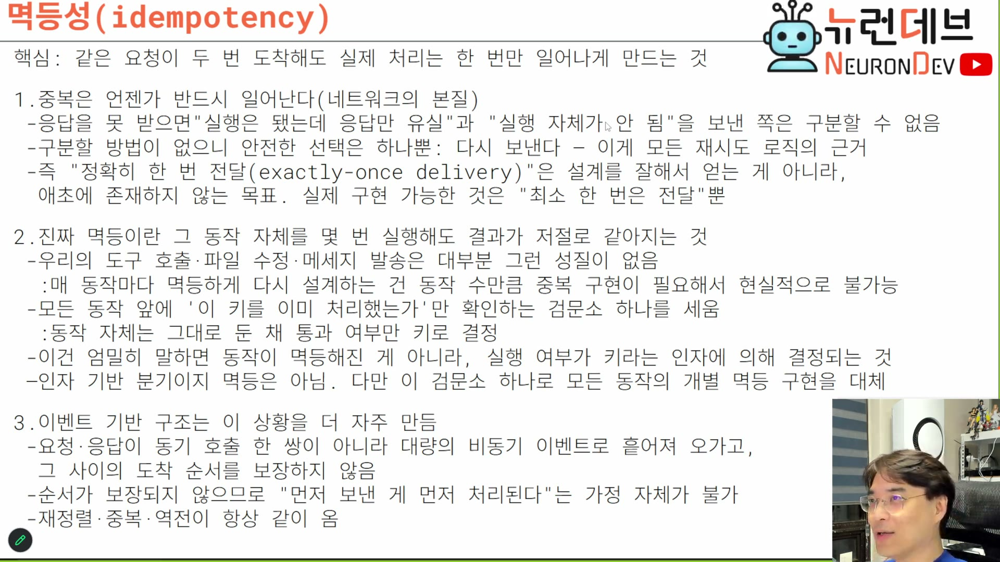
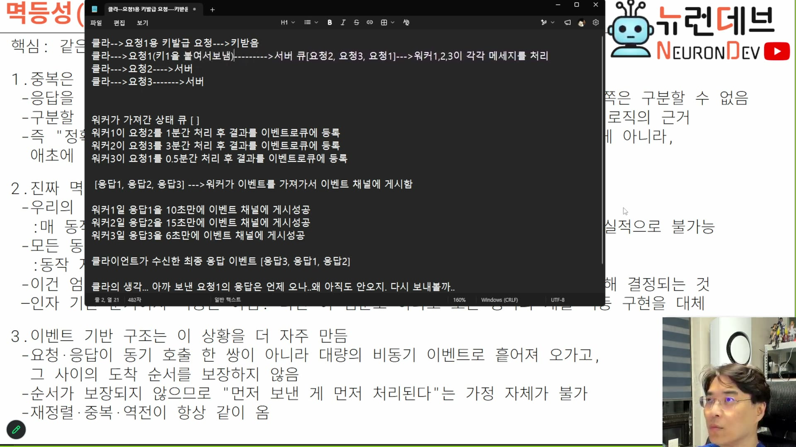
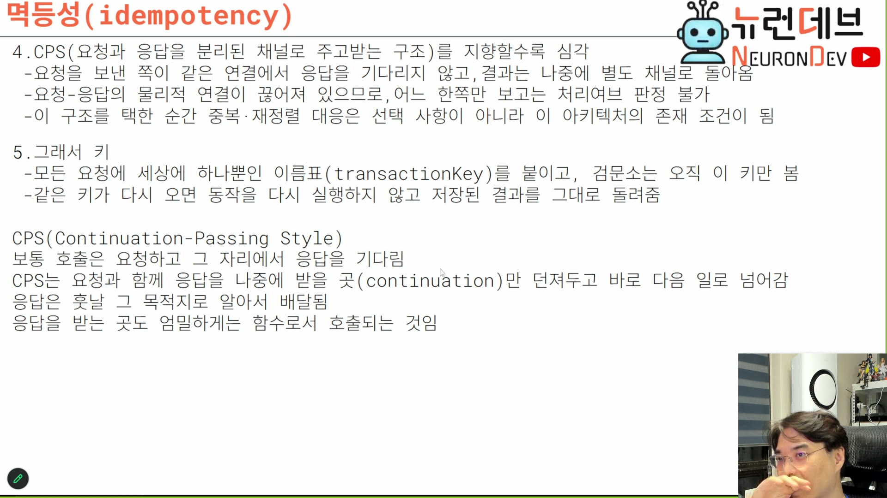

# 04. 멱등성 — 그런데 이건 멱등이 아니다

> ★ 이 회차의 등뼈. 그리고 강의자가 자기 설계를 스스로 정정하는 유일한 대목이다.

## 학습 목표

두 개의 역전을 붙잡는다. **① exactly-once는 잘 설계해서 얻는 것이 아니라 존재하지 않는 목표다. ② 키 기반 멱등은 엄밀히 말하면 멱등이 아니다.** 둘 다 슬라이드에 강의자가 직접 적어 놓은 문장이고, 요약본을 읽으면 반드시 사라진다.

## 선수 지식

- 2장 — 요청과 응답의 물리적 연결이 끊어졌다는 결론
- 3장 — `transactionKey`가 멱등 경계라는 정의
- `event-sourcing-msa/docs/09-consistency-kinds.md` — 결과적 일관성. 여기서 "언젠가 달성"이 성립하려면 재시도가 안전해야 한다는 조건이 이 장의 내용이다

## 핵심 원리 (WHY) — 중복은 막을 수 있는 게 아니라 반드시 일어난다

슬라이드가 헤드라인부터 결론을 적는다.



> **핵심: 같은 요청이 두 번 도착해도 실제 처리는 한 번만 일어나게 만드는 것**

그리고 왜 중복이 필연인지가 1번 항목이다. 이 세 줄이 이 장의 첫 번째 역전을 담고 있다.

```
1. 중복은 언젠가 반드시 일어난다(네트워크의 본질)
 - 응답을 못 받으면 "실행은 됐는데 응답만 유실"과 "실행 자체가 안 됨"을 보낸 쪽은 구분할 수 없음
 - 구분할 방법이 없으니 안전한 선택은 하나뿐: 다시 보낸다 - 이게 모든 재시도 로직의 근거
 - 즉 "정확히 한 번 전달(exactly-once delivery)"은 설계를 잘해서 얻는 게 아니라,
   애초에 존재하지 않는 목표. 실제 구현 가능한 것은 "최소 한 번은 전달"뿐
```

**세 번째 줄이 역전 ①이다.** exactly-once를 "노력하면 되는 좋은 목표"로 알고 있으면 설계가 어긋난다. 원인은 정보 부족이 아니라 정보의 **원리적 부재**다.

> 클라이언트가 요청을 했는데 응답을 못 받았어. 그러면 뭐라고 생각해요? 실행이 서버에서 잘 됐는데 응답이 유실된 걸까, 중간에 서버가 끊어졌나, 아니면 실행 자체가 서버에서 실패하고 안 된 걸까. **응답이 없잖아, 실패했는지도 모른단 말이야.** `[42:30–43:00]`
>
> 500 코드도 **서버가 보내줘야 500 코드야. 못 받으면 없는 거야.** `[43:00]`

이 마지막 문장은 인용할 가치가 있다. 500을 "서버가 실패했다는 정보"로 알고 있으면, 500을 못 받은 상황을 "성공"으로 착각하기 쉽다. 실제로는 **아무것도 못 받은 것은 아무 정보도 없는 것**이다.

> 그래서 이거 구분이 안 돼. 이게 멱등성을 요구하게 되는 가장 큰 이유야. 구분할 방법이 없기 때문에 **유일한 대안은 리트라이밖에 없는 거지.** `[43:30]`

강의자가 든 비유가 이 원리를 잘 잡는다.

> 여러분들이 지인한테 전화를 걸었어요. 신호가 두 번 갔는데 그다음에 딱 끊겼어. 이놈이 강제로 끊은 걸까? 아니면 갤럭시 같은 경우에는 영화관 모드 하면 벨 한 번 울리고 자동으로 끊는 기능이 있거든요 — 영화관 모드 때문에 불가피하게 못 받는 걸까? 나를 벨이 울릴 때 씹은 걸까? 궁금하잖아, 모르겠잖아. 그럼 유일한 방법은 뭐죠? **다시 전화 한 번밖에 없단 말이야.** `[44:00–44:30]`

## 핵심 원리 (WHY) — 그래서 재시도는 실수가 아니라 정상 동작이다

리트라이가 왜 불가피하게 **여러 번** 일어나는지를 구체적 수치로 설명한다.

> 불가피하게 리트라이를 했는데, 그저 서버가 즉시 응답 안 하고 **15초 후에 응답했을 뿐**인데, 나는 타임아웃을 5초로 걸었기 때문에 **이미 요청을 3번이나 보냈어.** 그러면 내가 송금을 3번이나 하면 내 돈이 3배로 나갔을 거 아니야. 그건 안 되는 거지. `[45:00]`

**타임아웃 값과 서버 응답 시간의 불일치만으로 중복이 3배가 된다.** 버그도 장애도 아니다. 그리고 이 강의의 대상 시스템은 응답 시간이 특히 길고 편차가 크다(추론 시간). 즉 **에이전트 서버는 중복이 유독 자주 일어나는 종류의 시스템**이다.

멱등의 정의 자체는 간단하다.

> 멱등이라는 건 같은 요청이 두 번 도착해도 괜찮다는 거야. 왜냐하면 이미 처리한 것은 처리했다고 알려주면 되고, 처리 안 했으면 처리해 주면 되고. **멱등은 트랜잭션이 아니에요.** 그냥 계속 똑같은 걸 보낼 수 있다는 거야. 그래도 문제가 아니라. `[41:30–42:00]`

"멱등은 트랜잭션이 아니다"를 짚어 둘 필요가 있다. 멱등은 원자성·격리를 주지 않는다. **재시도가 안전하다**는 성질일 뿐이다.

## 핵심 원리 (WHY) — 역전 ②: 우리가 만드는 건 멱등이 아니다

여기가 이 장의 정점이다. 슬라이드 2번 항목을 한 줄씩 읽어야 한다.

```
2. 진짜 멱등이란 그 동작 자체를 몇 번 실행해도 결과가 저절로 같아지는 것
 - 우리의 도구 호출·파일 수정·메세지 발송은 대부분 그런 성질이 없음
   : 매 동작마다 멱등하게 다시 설계하는 건 동작 수만큼 중복 구현이 필요해서 현실적으로 불가능
 - 모든 동작 앞에 '이 키를 이미 처리했는가'만 확인하는 검문소 하나를 세움
   : 동작 자체는 그대로 둔 채 통과 여부만 키로 결정
 - 이건 엄밀히 말하면 동작이 멱등해진 게 아니라, 실행 여부가 키라는 인자에 의해 결정되는 것
 - 인자 기반 분기이지 멱등은 아님. 다만 이 검문소 하나로 모든 동작의 개별 멱등 구현을 대체
```

**셋째·넷째 줄이 자기 정정이다.** 흔히 "멱등 키를 붙였으니 이 API는 멱등하다"고 말하는데, 슬라이드는 그 표현이 틀렸다고 말한다. 동작은 그대로 비멱등이고, 앞에 게이트를 세워 **실행 자체를 건너뛴** 것이다.

왜 이 구분이 실무에서 중요한가. 세 가지가 달라진다.

| 구분을 흐리면 | 실제로는 |
|---|---|
| "멱등하니까 키 없이 재시도해도 안전하다" | 키가 없으면 그냥 두 번 실행된다. 안전성은 동작이 아니라 **키의 존재**에 달려 있다 |
| "멱등하니까 저장 공간이 안 든다" | 검문소는 표 하나다. 표가 커지고, 결과를 통째로 보관해야 한다(5장) |
| "게이트만 통과시키면 된다" | 게이트를 통과한 뒤 죽으면 "실행 중"으로 남는다. 그 상태 관리가 5장의 세 갈래다 |

왜 진짜 멱등을 포기했는지도 근거가 있다. 비용이다.

> 멱등을 구현하려면 송금에 대한 멱등을 구현하고, 입금에 대한 멱등을 구현하고, 로그인에 대한 멱등을 구현하고 — 이러면 너무 힘들잖아. 그래서 **멱등은 구현하기도 어렵고 별도의 메모리나 부가적인 연산도 많이 먹거든요.** 이미 이건 송금된 건데 또 송금을 요청했네 — 이거 다 메모리잖아. 어딘가에 용량을 더 썼거나 아니면 IF문이 더 있는 거잖아. **그 비용을 모든 건수에 다 만들 수가 없으니까 우리는 꼼수를 써요. 이게 바로 키 기반 멱등이야.** `[45:30–46:00]`

"꼼수"라는 표현을 강의자가 직접 썼다는 점을 기억해 둘 만하다. 정석의 대체물이라는 자각이 있는 선택이다.

## 필수 지식 (HOW) — 키 발급 자체는 비멱등이다

미묘하지만 놓치기 쉬운 지점이다.

> 키를 발급해줘, 먼저. 근데 **이거는 비멱등이란 말이야.** 왜냐하면 키를 발급한 순간에도 또 다른 키를 발급할 수 있기 때문에. 키를 발급한다는 행위는 내가 요청할 때마다 새로운 키가 오기 때문에 이건 멱등이 아닌 거야. **여러 번 키 요청하면 여러 개의 키가 발급되니까.** 근데 그렇게 해서 일단 키를 얻잖아요. 키를 얻으면 모든 요청에 키를 넣으면, 이 키로 일어나는 요청은 이미 처리했어 안 했어 라고 멱등스럽게 처리할 수가 있다. `[46:00–46:30]`

즉 구조가 **비멱등 1회 + 멱등 N회**다.

```
① 키 발급        ← 비멱등. 여러 번 부르면 키가 여러 개 나온다
② 그 키로 요청   ← 몇 번을 보내도 실행은 한 번
```

**①이 비멱등이어도 괜찮은 이유는 ①이 아무것도 실행하지 않기 때문이다.** 키를 여러 개 받아도 손해는 표에 안 쓰인 키가 남는 것뿐이다. 반면 ②는 실제로 무언가를 한다. 그래서 위험한 쪽만 보호한다.

키의 정체는 특별하지 않다. 이미 있는 식별자를 쓰면 된다.

> 키 기반 멱등을 이용하면 어떠한 애를 다 멱등으로 바꿀 수가 있어요. **요청 아이디, 세션 아이디 다 마찬가지야.** 일반적으로 요청 아이디라고 부르는 건데 — 이 요청 아이디는 내가 이미 처리한 건데? 이렇게 생각하면 모든 애들은 다 멱등을 구현할 수 있게 되는 거지. `[46:30–47:00]`

## 필수 지식 (HOW) — 이벤트 소싱에서는 이 문제가 더 심해진다

CPS와 이벤트가 겹치면 판정 불가가 한 겹 더 쌓인다.

> 이벤트하고 CPS 구조는 이게 더 심해요. 내가 요청하면 응답이 오는 것도 아니야. **또 다른 이벤트로서 그 응답을 내가 확인해야 돼.** 그러면 얘가 이벤트가 온 거야 안 온 거야, 즉 요청한 거에 대한 응답의 이벤트가 온 거야 안 온 거야 — 이거는 더 중복적이고 더 리트라이를 할 가능성이 높잖아요. **이벤트 소싱은 멱등이 안 되면 너무 많은 혼란을 일으켜.** `[47:00–47:30]`

**"더 심해진다"를 정도의 문제로 읽으면 안 된다.** 강의자가 뒤의 시뮬레이션 도중에 이 점을 못 박는다.

> 클라가 무슨 생각하고 있죠? 이 [리트]라이를 안 할 수가 있겠냐고. 이 [리트]라이를 한다고. 어, 이 일이 더 쉽게 일어나는 거야. **일반적인 시스템보다 훨씬 더 쉽게 일어나.** 이 이벤트 소싱 시스템에서는 **멱등성을 지키기 위해서 키 발급을 안 할 수가 없어요.** `[52:00–52:30]`

즉 키 발급이 **선택이 아니라 진입 조건**이다. 일반 HTTP 시스템에서는 "중복이 문제가 되는 API에만 멱등 키를 붙인다"가 성립하지만, 이벤트 소싱에서는 중복 발생률 자체가 올라가므로 **전역으로 깔아야 한다.** 1장 슬라이드가 이것을 *"멱등성 설계가 선택이 아니라 전제"*라고 적은 근거가 여기다.

> 이 두 문장은 **로컬 STT에서 소실된 구간**이다(반복 루프로 뭉개졌다). 라이브 종료 후 생성된 유튜브 자동 자막으로 복원했다. 대괄호는 두 전사가 모두 흔들린 부분을(`국리`) 문맥으로 채운 것이다.

그래서 키 발급이 이벤트 소싱 기반 시스템의 공통 특징이 된다.

> 이벤트 소싱에서는 필히 반드시 키를 발급해야 되잖아요. **카프카도 기본적으로 다 키를 발급하잖아요.** 이벤트 소싱 기반은 다 키를 발급하게 돼 있어, 멱등 때문에. `[47:30–48:00]`

슬라이드 3번 항목이 그 상황을 정리한다.

```
3. 이벤트 기반 구조는 이 상황을 더 자주 만듬
 - 요청·응답이 동기 호출 한 쌍이 아니라 대량의 비동기 이벤트로 흩어져 오가고,
   그 사이의 도착 순서를 보장하지 않음
 - 순서가 보장되지 않으므로 "먼저 보낸 게 먼저 처리된다"는 가정 자체가 불가
 - 재정렬·중복·역전이 항상 같이 옴
```

**"재정렬·중복·역전이 항상 같이 온다"가 중요하다.** 셋을 따로 대응하려 들면 안 된다. 하나가 있으면 나머지 둘도 있다.

## 필수 지식 (HOW) — 재정렬 시뮬레이션: 왜 클라이언트가 재시도하게 되는가

강의자가 메모장에 구체적 수치로 시뮬레이션을 돌린다. **이 회차에서 가장 실습 가치가 높은 대목**이라 그대로 옮긴다.



```
클라-->요청1용 키발급 요청--->키받음
클라--->요청1(키1을 붙여서보냄)--------->서버 큐[요청2, 요청3, 요청1]--->워커1,2,3이 각각 메세지를 처리
클라--->요청2---->서버
클라--->요청3------->서버

워커가 가져간 상태 큐 [ ]
워커1이 요청2를 1분간 처리 후 결과를 이벤트로큐에 등록
워커2가 요청3을 3분간 처리 후 결과를 이벤트로큐에 등록
워커3이 요청1을 0.5분간 처리 후 결과를 이벤트로큐에 등록

 [응답1, 응답2, 응답3] ---> 워커가 이벤트를 가져가서 이벤트 채널에 게시함

워커1이 응답1을 10초만에 이벤트 채널에 게시성공
워커2가 응답2를 15초만에 이벤트 채널에 게시성공
워커3이 응답3을 6초만에 이벤트 채널에 게시성공

클라이언트가 수신한 최종 응답 이벤트 [응답3, 응답1, 응답2]

클라의 생각... 아까 보낸 요청1의 응답은 언제 오나..왜 아직도 안오지. 다시 보내볼까..
```

이 시뮬레이션이 보여주는 것을 정리하면 세 가지다.

1. **큐에 도착한 순서부터 이미 뒤집혔다** — 클라이언트가 1→2→3 순으로 보냈는데 큐는 `[요청2, 요청3, 요청1]`이다. 네트워크가 순서를 안 지킨다
2. **처리 시간 차이가 순서를 또 뒤집는다** — 1분/3분/0.5분. 마지막에 집힌 요청1이 가장 먼저 끝난다
3. **게시 단계에서 세 번째로 뒤집힌다** — 10초/15초/6초
4. **결과: 클라이언트는 `[응답3, 응답1, 응답2]`를 받고, 재시도를 결심한다**

마지막 줄이 핵심이다. **재시도는 클라이언트가 성급해서 하는 게 아니다.** 정상 동작하는 시스템에서 정상적으로 발생한다. 강의자가 이 지점을 짚는다.

> 이 사이에 클라가 무슨 생각하고 있죠? `[52:00]` (…) 이게 바로 **멱등이 구현되는 순간**이란 말이에요. `[53:30]`

그리고 이 뒤섞임이 예외가 아니라 이 구조의 정상 모습이라고 못 박는다.

> 함부로 누가 먼저 온다는 게, 이게 큐일 뿐인 거지. 이걸 거치면서 **뭐가 어떻게 올지는 절대 알 수 없는 거야. 예측도 할 수 없는 거야.** 대신에 고성능이지. 딱 보기에도 고성능이죠. 엄청난 멀티스레드들을 가장 효율적으로 움직여서 개별로 분할하고 블로킹 부분이 하나도 없잖아. **그래 고성능, 대신에 이렇게 움직인단 말이지. 순서 예측이 안 돼.** `[51:30–52:00]`

**즉 순서 예측 불가는 버그가 아니라 성능의 대가다.** 순서를 되찾고 싶으면 봉투의 인과 키와 시퀀스로 애플리케이션에서 복원해야 한다(3장).

## 필수 지식 (HOW) — 키만 검사하면 안 된다: 페이로드도 봐야 한다

이 장의 마지막 조각이고, 5장의 세 갈래 판정으로 직결된다.

> 이미 있는 거라면 — 이렇게 이게 멱등이죠. 처리 중이면 기다려주면 되고. 이름표인데 **요청이 다르면** "넌 이거 이미 사용된 키인데 왜 또 썼어, 이 키로 작업은 끝난 건데. 지금 보니까 니가 똑같은 키로 요청 내용이 다른데" — 그럼 말이 안 돼. `[1:19:00–1:19:30]`
>
> 이건 괜찮아. 이건 멱등이야. **이건 멱등이 아닌 거야. 키만 검사하는 게 아니라 키와 페이로드를 같이 검사하는 거라고.** 그래서 이건 오류인 거야. 그냥 오류야. `[1:20:00]`

정리하면 판정이 2차원이다.

| | 페이로드 같음 | 페이로드 다름 |
|---|---|---|
| **키 처음 봄** | 실행한다 | 실행한다 (다른 키니까) |
| **키 이미 있음** | 멱등 — 저장된 결과를 돌려준다 | **오류** — 키를 실수로 재사용했다 |

**오른쪽 아래 칸을 오류로 처리하는 것이 이 설계의 안전장치다.** 그 칸을 멱등으로 취급하면(키만 보고 통과시키면) 클라이언트의 두 번째 요청이 조용히 삼켜지고, 클라이언트는 자기 요청이 처리됐다고 믿는다. 유실보다 나쁜 결과다 — 유실은 알아챌 수 있고 이건 알아챌 수 없다.

## 필수 지식 (HOW) — 슬라이드의 결론: 키와 검문소

슬라이드 5번 항목이 이 장을 두 줄로 닫는다.



```
5. 그래서 키
 - 모든 요청에 세상에 하나뿐인 이름표(transactionKey)를 붙이고, 검문소는 오직 이 키만 봄
 - 같은 키가 다시 오면 동작을 다시 실행하지 않고 저장된 결과를 그대로 돌려줌
```

> 우리는 키 — 아까 엔벨로프에 박았죠 — 트랜잭션 키를 붙이고, 키를 바탕으로 중복된 요청인지 아닌지를 판정하는 **전역적인 베이스**를 깔고 이제 움직이는 거죠. `[57:00]`

그리고 이 구조가 특별한 발명이 아니라 업계 표준이라는 점을 확인한다.

> 지금 제가 말씀드린 게 여러분들한테 신기하겠지만, **엔터프라이즈 솔루션에서는 이거 외에는 방법이 없기 때문에 다 이렇게 구현되어 있어요. 멱등 외에는 방법이 없거든요.** `[54:00]`

## 우리 프로젝트와의 연결

이 장에서 확정된 것은 **"검문소가 필요하다"와 "검문소는 키와 페이로드를 본다"**까지다. 검문소를 실제로 무엇으로 만들고, 통과 후 죽으면 어떻게 되는지는 5장이다.

자기 설계로 옮길 때 확인할 것:

1. **exactly-once를 목표로 적어 두지 않았는지** — 문서에 그 단어가 있으면 그 자리는 잘못 설계됐다. at-least-once + 멱등이 실제로 가능한 조합이다
2. **"이 API는 멱등하다"고 쓰지 않았는지** — 멱등한 것은 API가 아니라 키가 붙은 호출이다. 키 없이 호출할 경로가 열려 있으면 그 경로는 보호되지 않는다
3. **키 발급을 별도 왕복으로 둘 것인가** — 비멱등 1회를 감수하는 대신 판정이 단순해진다. 클라이언트가 자기 키를 생성하게 하면 왕복이 줄지만 키 충돌·재사용 검증을 서버가 더 엄격히 해야 한다
4. **키 재사용 + 다른 페이로드를 오류로 처리하는가** — 조용히 삼키면 클라이언트가 잘못된 성공을 믿는다

> 코딩 과제 `e04-05-01`(멱등 검문소)이 이 장과 5장을 합쳐 낸 것이다. 위 2차원 판정표를 그대로 테스트로 옮겼다.
