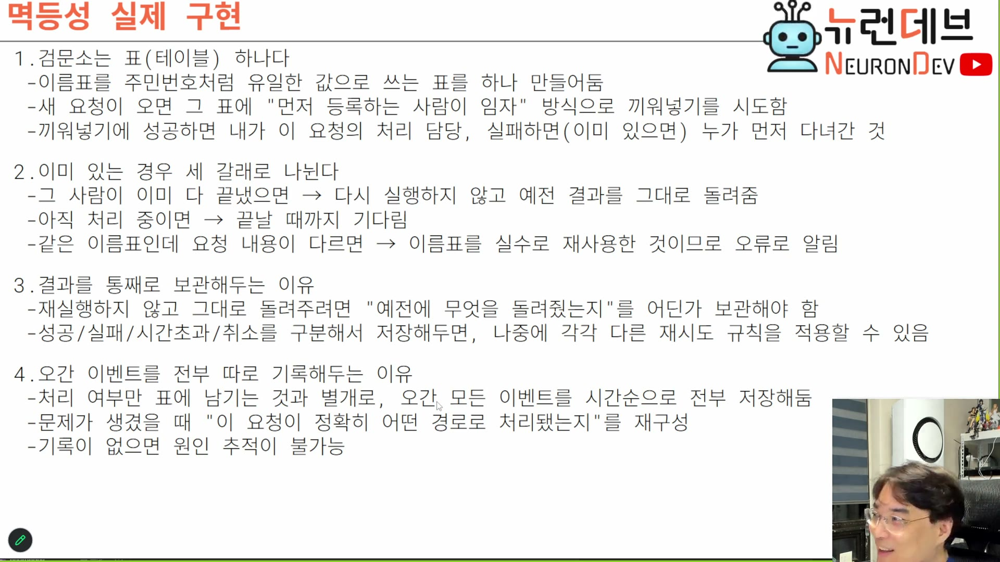
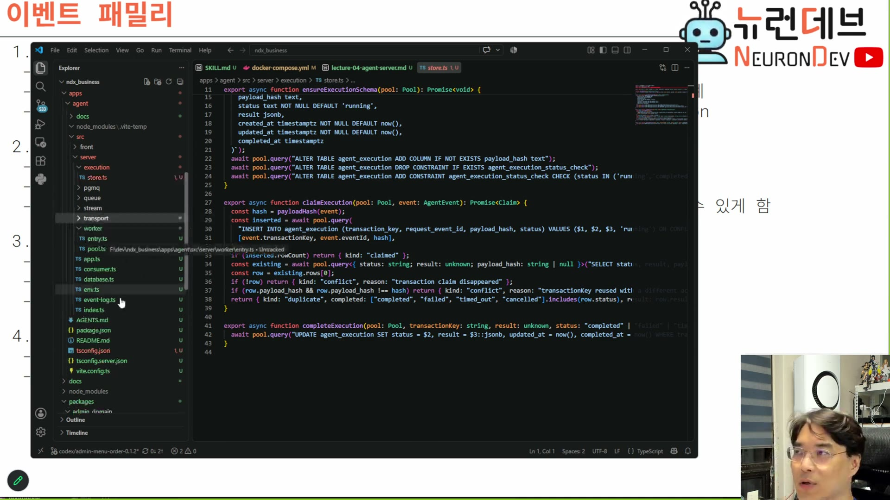
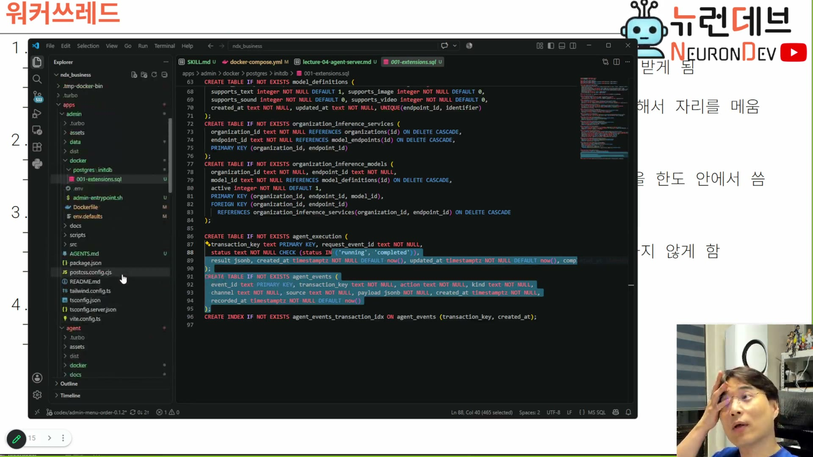

# 05. 검문소의 실제 구현 — 표 하나와 세 갈래

> ★ 이 회차의 등뼈. 4장의 원리가 테이블 두 개와 함수 셋으로 내려온다.

## 학습 목표

검문소를 **실제로 무엇으로 만드는지** 안다. 4장의 "게이트를 세운다"가 코드에서는 `INSERT ... ON CONFLICT` 한 줄이고, 게이트를 통과한 뒤의 상태 관리가 세 갈래 판정으로 갈린다. 그리고 왜 결과를 통째로 보관해야 하고 왜 이벤트를 전량 별도로 기록해야 하는지를 안다.

## 선수 지식

- 4장 — 특히 마지막의 2차원 판정표
- 3장 — `transactionKey`, `eventKey`의 역할 구분

## 핵심 원리 (WHY) — 검문소는 표 하나다

슬라이드 1번 항목이 구현 방식을 한 문장으로 준다.



```
1. 검문소는 표(테이블) 하나다
 - 이름표를 주민번호처럼 유일한 값으로 쓰는 표를 하나 만들어둠
 - 새 요청이 오면 그 표에 "먼저 등록하는 사람이 임자" 방식으로 끼워넣기를 시도함
 - 끼워넣기에 성공하면 내가 이 요청의 처리 담당, 실패하면(이미 있으면) 누가 먼저 다녀간 것
```

**두 번째 줄의 "끼워넣기를 시도한다"가 설계의 핵심이다.** 조회해서 없으면 넣는 것이 아니다. 조회와 삽입 사이에 다른 워커가 끼어들 수 있기 때문이다(경합). 삽입 자체를 판정으로 쓰면 유일 제약이 원자적으로 승자를 결정한다.

> **왜 "조회 후 삽입"이 안 되는가 (강의에 없는 보충):** 워커 A와 B가 같은 키로 동시에 도착하면, 둘 다 조회에서 "없음"을 보고 둘 다 실행에 들어간다. 그 창이 밀리초라도 열려 있으면 부하가 높을 때 반드시 통과당한다. `INSERT ... ON CONFLICT DO NOTHING` 은 그 창을 없앤다 — DB의 유일 인덱스가 승자를 한 명으로 만들고, 진 쪽은 `rowCount = 0` 으로 자기가 졌음을 안다. **판정 근거를 애플리케이션 로직에서 DB 제약으로 내려보내는 것**이 이 패턴의 요지다.

## 필수 지식 (HOW) — 세 갈래 판정

이미 있을 때가 셋으로 갈린다. 슬라이드 2번 항목이다.

```
2. 이미 있는 경우 세 갈래로 나뉜다
 - 그 사람이 이미 다 끝냈으면  → 다시 실행하지 않고 예전 결과를 그대로 돌려줌
 - 아직 처리 중이면            → 끝날 때까지 기다림
 - 같은 이름표인데 요청 내용이 다르면 → 이름표를 실수로 재사용한 것이므로 오류로 알림
```

4장 마지막의 2차원 판정표를 여기에 맞춰 4갈래로 펼치면 이렇게 된다. 이 표가 코딩 과제 `e04-05-01`의 명세다.

| 상황 | 판정 | 무엇을 반환하나 |
|---|---|---|
| 표에 키가 없음 → 삽입 성공 | `claimed` | 내가 담당. 실행하러 간다 |
| 키 있음 · 페이로드 같음 · 상태 종결(completed/failed/timed_out/cancelled) | `duplicate` | **저장된 결과를 그대로** |
| 키 있음 · 페이로드 같음 · 상태 running | `running` (대기) | 아직. 끝날 때까지 기다린다 |
| 키 있음 · 페이로드 **다름** | `conflict` | 오류 — 키를 실수로 재사용했다 |

강의자의 실제 코드가 이 판정을 그대로 담고 있다.



캡처에서 읽히는 구조를 옮기면 이렇다.

```ts
export async function claimExecution(pool: Pool, event: AgentEvent): Promise<Claim> {
  const hash = payloadHash(event);
  const inserted = await pool.query(
    "INSERT INTO agent_execution (transaction_key, request_event_id, payload_hash, status)
     VALUES ($1, $2, $3, 'running') ON CONFLICT ...",
    [event.transactionKey, event.eventId, hash],
  );
  if (inserted.rowCount) return { kind: "claimed" };

  const existing = await pool.query(/* SELECT status, result, payload_hash ... */);
  const row = existing.rows[0];
  if (!row) return { kind: "conflict", reason: "transaction claim disappeared" };
  if (row.payload_hash && row.payload_hash !== hash)
    return { kind: "conflict", reason: "transactionKey reused with a different ..." };
  return {
    kind: "duplicate",
    completed: ["completed", "failed", "timed_out", "cancelled"].includes(row.status),
    result: row.result,
  };
}
```

읽을 때 짚어야 할 것 셋:

1. **`payloadHash(event)`** — 페이로드 전체를 비교하지 않고 해시로 비교한다. 표에 원본 페이로드를 통째로 넣지 않아도 되고, 비교가 상수 시간이다
2. **`conflict`가 두 종류다** — 페이로드 불일치 말고도 `"transaction claim disappeared"`가 있다. 삽입에 실패했는데 조회하니 없는 상황 — 그 사이에 누가 지운 것이다. 이런 경합을 조용히 넘기지 않고 오류로 올린다
3. **`completed`가 상태 넷을 묶는다** — `completed / failed / timed_out / cancelled`. 성공만 종결이 아니다. 실패도 "끝난 것"이고, 재시도가 오면 저장된 실패를 돌려줘야 한다

실제 DDL도 캡처에 잡혔다.



```sql
CREATE TABLE IF NOT EXISTS agent_execution (
  transaction_key text PRIMARY KEY, request_event_id text NOT NULL,
  status text NOT NULL CHECK (status IN ('running', 'completed')),
  result jsonb, created_at timestamptz NOT NULL DEFAULT now(),
  updated_at timestamptz NOT NULL DEFAULT now(), completed_at timestamptz
);

CREATE TABLE IF NOT EXISTS agent_events (
  event_id text PRIMARY KEY, transaction_key text NOT NULL,
  action text NOT NULL, kind text NOT NULL,
  channel text NOT NULL, source text NOT NULL, payload jsonb NOT NULL,
  created_at timestamptz NOT NULL, recorded_at timestamptz NOT NULL DEFAULT now()
);
CREATE INDEX IF NOT EXISTS agent_events_transaction_idx
  ON agent_events (transaction_key, created_at);
```

**`transaction_key`가 PK라는 점이 1번 항목의 "주민번호처럼 유일한 값"이다.** 유일 제약이 곧 검문소다.

그리고 DDL과 코드 사이에 어긋남이 하나 보인다 — 정직하게 기록해 둘 값이 있다. DDL의 `CHECK (status IN ('running','completed'))`는 값이 둘인데, 코드는 `failed / timed_out / cancelled`도 종결로 취급한다. 강의 중 `store.ts` 캡처에도 그 간극을 메우는 마이그레이션이 보인다 — `ALTER TABLE agent_execution ADD COLUMN IF NOT EXISTS payload_hash text`, `DROP CONSTRAINT IF EXISTS agent_execution_status_check` 후 새 CHECK로 교체. **즉 이 스키마는 강의 시점에 아직 움직이고 있었다.** 자기 구현에서는 상태 집합을 먼저 확정하는 편이 낫다.

## 필수 지식 (HOW) — 결과를 통째로 보관하는 이유

슬라이드 3번 항목이다. 4장에서 "메모리를 먹는다"고 했던 비용이 여기서 실제로 청구된다.

```
3. 결과를 통째로 보관해두는 이유
 - 재실행하지 않고 그대로 돌려주려면 "예전에 무엇을 돌려줬는지"를 어딘가 보관해야 함
 - 성공/실패/시간초과/취소를 구분해서 저장해두면, 나중에 각각 다른 재시도 규칙을 적용할 수 있음
```

첫째 줄은 논리적 필연이다 — 재실행을 건너뛴다면 돌려줄 값이 저장돼 있어야 한다. 그래서 `agent_execution.result jsonb` 가 있다.

**둘째 줄이 설계적으로 더 중요하다.** 종결 상태를 하나로 뭉개지 않고 넷으로 나누면 재시도 정책을 상황별로 달리 걸 수 있다.

| 저장된 상태 | 합리적인 재시도 정책 |
|---|---|
| `completed` | 재시도 금지. 저장된 결과 반환 |
| `failed` | 원인에 따라 — 봉투의 `AgentError.retryable`이 이 판단의 근거다(3장) |
| `timed_out` | 재시도 여지 있음. 단 같은 타임아웃이면 또 걸린다 |
| `cancelled` | 사용자가 끊은 것. 자동 재시도는 사용자 의도를 뒤집는다 |

**마지막 줄이 특히 그렇다.** `cancelled`를 `failed`와 합쳐 두면, 사용자가 명시적으로 중단시킨 작업을 시스템이 알아서 다시 시도하게 된다. 8장의 abort와 이어지는 지점이다.

## 필수 지식 (HOW) — 판정 표와 이벤트 로그는 별개다

슬라이드 4번 항목이고, 테이블이 왜 둘인지의 답이다.

```
4. 오간 이벤트를 전부 따로 기록해두는 이유
 - 처리 여부만 표에 남기는 것과 별개로, 오간 모든 이벤트를 시간순으로 전부 저장해둠
 - 문제가 생겼을 때 "이 요청이 정확히 어떤 경로로 처리됐는지"를 재구성
 - 기록이 없으면 원인 추적이 불가능
```

두 테이블의 역할이 다르다.

| 테이블 | 무엇 | 행 수 | 성격 |
|---|---|---|---|
| `agent_execution` | 트랜잭션 키별 **현재 판정** | 트랜잭션당 1 | 갱신된다 (running → completed) |
| `agent_events` | 오간 **모든 이벤트** | 트랜잭션당 N | 추가만 된다 |

> 오고 간 이벤트를 전부 따로 기록해 둬야지만, 처리 여부에 어떤 시간 순으로 재정렬해가지고 "아 이게 이렇게 해서 저렇게 했구나" 하고 **그래프를 다시 재구성**할 수 있기 때문에. 따로따로 기록해가지고 연결하게 됩니다. **원인 추적 결과 때문에** 그런 거죠. 이건 이벤트 소싱의 가장 큰 장점이죠. **이벤트 리플레이**라고 부르는 건데요. `[1:21:30–1:22:00]`
>
> 이걸 이용해가지고 장부가 잘못됐으면 어디서 잘못됐지 이런 거 찾아내고. 이러려면 그래프 구조가 만들어져야 되니까. `[1:22:00]`

**인덱스 `(transaction_key, created_at)`가 이 용도 전용이다.** 트랜잭션 하나를 골라 시간순으로 훑는 조회 — 즉 "이 요청이 어떤 경로로 처리됐는가"를 재구성하는 조회에 정확히 맞춰져 있다.

그리고 4장에서 언급된 아웃박스 패턴이 여기 붙는 자리다.

> 우리가 이 큐 기반의 이벤트 서버 자체를 멱등하게 설계해야지만 시스템이 안전하게 돌아. 이벤트 소싱 서버에 대해서 좀 개념 있으신 분은 아시겠지만 **안정성을 위해서 아웃박스도 구현해야 되고.** 뭐 할 거 맞습니다. 키워드나 던지고 가자. `[16:00–16:30]`

> **아웃박스가 왜 필요한가 (강의에 없는 보충):** 검문소 삽입과 큐 발행은 서로 다른 시스템일 수 있다. "DB에는 썼는데 큐 발행은 실패"가 나면 표에는 `running`이 남고 아무도 처리하지 않는다 — 1장에서 지적한 "영원히 멈춤"이 검문소 층에서 재현되는 것이다. 아웃박스는 발행할 메시지를 **같은 트랜잭션 안에서** 테이블에 쓰고, 별도 프로세스가 그 테이블을 보고 실제 발행하는 방식이다. 다만 이 강의의 구조에서는 큐도 같은 PostgreSQL 안(PGMQ)에 있어서 그 어긋남이 애초에 작다 — 1장에서 PGMQ를 고른 근거 중 하나가 정확히 이것이다.

## 필수 지식 (HOW) — 키를 표에 남기는 것은 보안 요구이기도 하다

강의 후반에 키 저장의 또 다른 이유가 나온다. 성능·정합성과 무관한, 기업용이라서 생기는 요구다.

> 이게 뭐라고 생각하면 되면, 은행 가서 번호표 받잖아요. **그 번호표를 DB에 기록할래 말래, 이 문제거든.** DB에 기록하면 번호표를 다 알고 있기 때문에 그 사이에 예약 손님을 먼저 끼워 넣거나 (…) 여러 가지를 할 수가 있게 돼요. 근데 만약에 DB에 발급되지 않은 거면, 그 사람이 왔을 때 걔를 어떻게 중간에 끼워 넣을 방법이 없잖아. `[1:14:00–1:14:30]`
>
> 우리는 이거 왜 등록하냐면, 전에 말씀드린 것처럼 얘가 하는 행위를 감시하려면 — 엔터프라이즈에서는 얘가 부정적인 일을 하고 있는지 아닌지를 감시하려면 — **키를 발급하고 키에다가 로그를 쌓아주면** 얘가 이 키를 발급받아서 뭘 했는지가 다 남을 거 아니에요. 그건 이제 기업 요구사항에 따라서 얼마큼까지 세션 키를 관리할지, 아니면 작업 키를 기억할지. 이런 것들은 이제 각각의 **보안 요구사항에 따라서 정도가 달라져요.** `[1:14:30–1:15:00]`

**즉 `agent_events`가 두 가지 목적을 겸한다** — 원인 추적(엔지니어링)과 행위 감사(보안). 이 겸용이 3강에서 나온 감사 요구와 이어지고, 10장의 "세션 데이터가 자산이다"로 연결된다.

## 필수 지식 (HOW) — 키 발급 서버를 DB로 둘 때 생기는 것

위 인용의 앞부분에 설계 트레이드오프가 숨어 있다. 짚어 둘 값이 있다.

| 키를 표에 안 남긴다 | 키를 표에 남긴다 |
|---|---|
| 순식간에 발급되고 아무도 기억 안 한다 | 발급 이력이 전부 남는다 |
| **끼워넣기·특혜 처리가 불가능하다** | 우선순위 조작이 가능해진다 (기능이자 위험) |
| 감사 불가 | 감사 가능 — 기업 요구를 충족한다 |
| 저장 비용 없음 | 표가 계속 커진다 (보관 기간 정책 필요) |

강의자가 "그 꼼수를 부리려면 이거 테이블에 등록해야 되거든요" `[1:14:30]` 라고 말한 대목이다. **감사 가능성과 조작 가능성이 같은 뿌리에서 나온다** — 둘 다 "발급된 키를 시스템이 알고 있다"는 사실의 결과다. 기업용에서는 감사가 요구사항이므로 저장을 택하고, 그 대가로 조작 경로가 열리는 것을 다른 통제(권한)로 막아야 한다.

## 우리 프로젝트와의 연결

이 장에서 확정된 것은 **검문소의 실물**이다. 하지만 아직 남은 구멍이 있다 — 검문소를 통과해서 `running`으로 표에 박아 놓고 워커가 죽으면? 표에는 영원히 `running`이 남는다. 그 문제는 검문소가 아니라 **큐의 삭제 시점**에서 해결된다. 6장이다.

자기 설계로 옮길 때 확인할 것:

1. **판정을 조회 후 삽입으로 하고 있지 않은가** — 삽입 자체를 판정으로 써야 경합이 닫힌다
2. **페이로드를 어떻게 비교할 것인가** — 해시면 무엇을 해시에 넣을지가 결정이다(타임스탬프·재시도 카운터를 넣으면 매번 다르다고 판정된다)
3. **종결 상태를 몇 개로 둘 것인가** — 하나로 뭉개면 `cancelled`를 자동 재시도하는 사고가 난다
4. **판정 표와 이벤트 로그를 분리했는가** — 하나로 합치면 갱신과 추가가 섞여서 리플레이가 불가능해진다
5. **키 이력의 보관 기간을 정했는가** — 감사 요구가 있으면 길고, 없으면 표가 무한히 커진다

> 코딩 과제 `e04-05-01`이 이 장의 세 갈래 판정을 그대로 낸 것이다. `payloadHash` 설계와 `conflict` 두 종류까지 포함한다.
