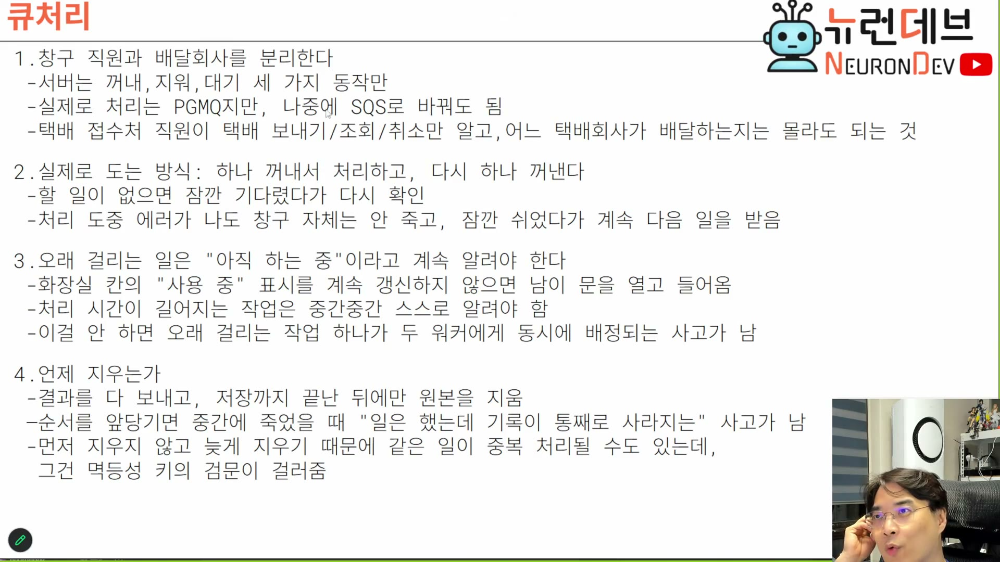
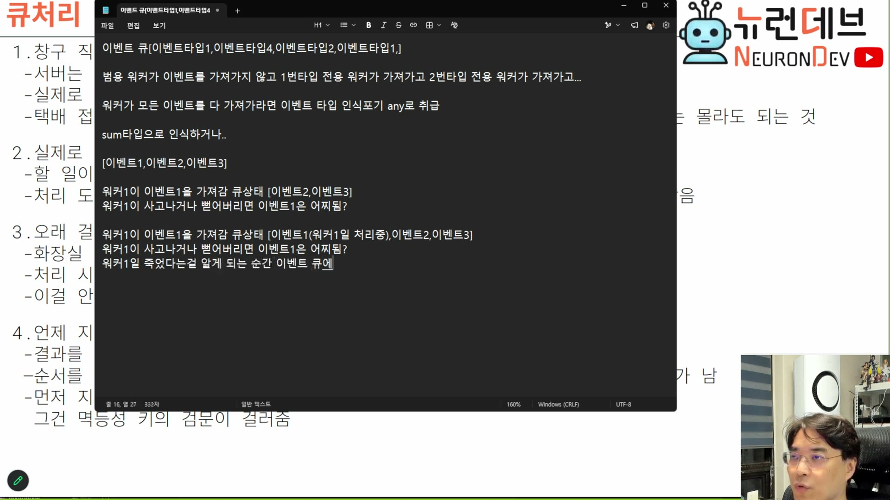

# 06. 큐 — 언제 지우는가가 전부다

> ★ 이 회차의 등뼈. 그리고 앞의 두 등뼈(CPS·멱등)와 맞물려 설계가 닫히는 지점이다.

## 학습 목표

큐에서 **언제 메시지를 지우는가**가 유실과 중복 중 무엇을 남길지 결정한다는 것을 안다. 그리고 이 설계가 **유실을 중복으로 치환한 뒤 중복을 5장의 검문소로 흡수**하는 구조임을 안다 — 세 등뼈가 여기서 하나로 붙는다.

## 선수 지식

- 1장 — PGMQ를 고른 근거
- 5장 — 검문소 세 갈래 판정. 이 장이 만드는 중복을 그것이 받는다
- `event-sourcing-msa/docs/11-postgres-as-broker.md` — 가시성 타임아웃·아카이브

## 핵심 원리 (WHY) — 큐는 세 가지밖에 안 한다

먼저 큐가 해 주는 일의 범위를 정확히 잡아야 한다. 기대보다 훨씬 작다.

> 메시지 큐 시스템은 보통 세 가지밖에 안 해요. **큐에 있는 거 꺼내기, 그다음에 지우기, 그리고 "이거 꺼내지도 말고 지우지도 마 내가 이거 점유하고 있어"라고 계속 마킹하기.** 뭐 이런 거밖에 안 하거든요. 실제 아마존 SQS도 마찬가지예요. 걔 아무것도 안 해주고, 저희가 지속적으로 폴링하면서 걔네들 갱신해 주거나 가져가거나 이렇게 하는 거거든요. `[05:30–06:00]`

그리고 큐가 보장해 주는 것도 둘뿐이다.

> 그럼 뭐 해주는데 MQ가? MQ도 마찬가지인데 그냥 **선입선출을 보장해 주는 것**뿐이죠. 이게 앞에 있어, 이게 두 번째 있어. 그리고 이제 큐에 접근한 애들 사이에 **동기화를 보장해 주죠.** RDB도 물론 락을 통해서 동기화를 보장하잖아요. 얘는 **되게 가벼운 동기화**를 보장한다고 생각하면 돼요. `[06:00–06:30]`

**"되게 가벼운 동기화"라는 표현이 정확하다.** 큐는 트랜잭션도, 순서 보장(도착 순서 기준)도, 정확히 한 번도 주지 않는다. 여러 워커가 같은 항목을 동시에 집지 않게만 해 준다. 그래서 큐 서버는 놀랄 만큼 가볍다.

> MQ는 그냥 서버로 존재할 뿐이에요. 이 부하가 굉장히 작기 때문에 성능이 굉장히 뛰어납니다. (…) **MQ가 제일 가벼운 서버인 거야. 하는 일이 별로 없으니까. 큐만 관리해 주는 겁니다.** `[07:00–07:30]`

이 관찰이 1장의 "성능은 걱정거리가 아니다"와 이어진다. 큐가 느려서 문제가 되는 일은 이 도메인에서 거의 없다.

## 필수 지식 (HOW) — 접수와 배달을 분리한다

슬라이드 1번 항목이 큐를 낀 구조를 비유로 준다.



```
1. 창구 직원과 배달회사를 분리한다
 - 서버는 꺼내, 지워, 대기 세 가지 동작만
 - 실제로 처리는 PGMQ지만, 나중에 SQS로 바꿔도 됨
 - 택배 접수처 직원이 택배 보내기/조회/취소만 알고, 어느 택배회사가 배달하는지는 몰라도 되는 것
```

**둘째 줄이 설계 이득이다.** 서버가 큐에 대해 아는 것이 세 동작뿐이면 구현체를 갈아치울 수 있다. PGMQ → SQS 이전이 어댑터 교체로 끝난다.

> PGMQ에서 지원하는 메소드가 3개밖에 없거든요. 보내기, 조회, 취소. 이걸 중간에 껴가지고 큐는 여기를 쓰는 거지. 외부 서버에 있는. `[1:09:00]`

**즉 큐 인터페이스를 좁게 유지하는 것 자체가 설계 결정이다.** PGMQ의 고급 기능을 쓰기 시작하면 이 이식성이 사라진다.

## 필수 지식 (HOW) — 폴링이다, 그리고 그게 정상이다

푸시가 아니다. 이 점을 오해하면 구조가 안 잡힌다.

```
2. 실제로 도는 방식: 하나 꺼내서 처리하고, 다시 하나 꺼낸다
 - 할 일이 없으면 잠깐 기다렸다가 다시 확인
 - 처리 도중 에러가 나도 창구 자체는 안 죽고, 잠깐 쉬었다가 계속 다음 일을 받음
```

> 지금 에이전트 서버는 MQ에 정기적으로 가서 이벤트가 있는지 없는지 확인하고 와. 여러분들이 AWS에 있는 SQS를 구현해도 마찬가지예요. **SQS에 가서 정기적으로 폴링으로 조회해가지고 와야 됩니다.** 저희도 똑같이 MQ에 가서 가져올게요. `[1:09:30]`

1장의 "테이블만으로는 안 되는 이유" 세 번째 줄이 폴링 부하를 지적했었다 — *"자주 보면 헛일을 많이 하고, 뜸하게 보면 처리가 늦음"*. 큐를 써도 폴링 자체는 남는다. 다만 폴링 대상이 락 경합이 있는 테이블 조회에서 큐의 가벼운 동기화로 바뀐다.

## 필수 지식 (HOW) — 오래 걸리는 일은 살아 있다고 계속 알려야 한다

세 번째 동작(대기 마킹)의 정체다. 슬라이드의 비유가 직관적이다.

```
3. 오래 걸리는 일은 "아직 하는 중"이라고 계속 알려야 한다
 - 화장실 칸의 "사용 중" 표시를 계속 갱신하지 않으면 남이 문을 열고 들어옴
 - 처리 시간이 길어지는 작업은 중간중간 스스로 알려야 함
 - 이걸 안 하면 오래 걸리는 작업 하나가 두 워커에게 동시에 배정되는 사고가 남
```

> 그리고 MQ는 금방금방 제거를 해버리기 때문에 **워커가 마킹하고 와야 돼요.** `[1:09:30–1:10:00]`

> **가시성 타임아웃의 정체 (강의에 없는 보충):** PGMQ의 `read(queue, vt, qty)`에서 `vt`가 가시성 타임아웃(초)이다. 메시지를 읽으면 그 시간 동안 **다른 워커에게 안 보인다.** `vt`가 지나면 다시 보이게 되고 — 그게 워커 사망 시 자동 복구의 메커니즘이다. 그래서 `vt`를 정하는 것이 트레이드오프다: **짧게 잡으면** 살아 있는 워커의 일이 다른 워커에게 중복 배정되고, **길게 잡으면** 워커가 죽었을 때 그만큼 일이 멈춰 있다. 추론처럼 처리 시간 편차가 큰 작업에서는 `vt`를 한 값으로 맞출 수 없다 — 그래서 처리 중 `set_vt`로 연장하는 하트비트가 필요하다. 슬라이드의 "사용 중 표시를 계속 갱신"이 이것이다.

**이것이 8장의 "작업을 잘게 쪼개라"와 같은 뿌리다.** 무거운 작업 하나를 통째로 블로킹하면 하트비트를 보낼 틈이 없고, `vt`가 만료되어 중복 배정이 난다.

## 핵심 원리 (WHY) — 삭제 시점: 이 장의 정점

슬라이드 4번 항목이다. **이 회차 전체에서 가장 압축된 세 줄이다.**

```
4. 언제 지우는가
 - 결과를 다 보내고, 저장까지 끝난 뒤에만 원본을 지움
 - 순서를 앞당기면 중간에 죽었을 때 "일은 했는데 기록이 통째로 사라지는" 사고가 남
 - 먼저 지우지 않고 늦게 지우기 때문에 같은 일이 중복 처리될 수도 있는데,
   그건 멱등성 키의 검문이 걸러줌
```

**셋째 줄이 4·5장과 이 장을 하나로 묶는다.** 삭제를 늦춘 대가가 중복이고, 그 중복을 검문소가 받는다. 즉 이 설계 전체가 이렇게 읽힌다.

```
유실 (못 고침: 사라진 것은 복원할 수 없다)
   ↓ 삭제 시점을 완료 후로 늦춘다
중복 (고칠 수 있음: 이미 처리했음을 알아볼 수 있다)
   ↓ 멱등 키 + 검문소 (5장)
해결
```

강의자가 이 판단을 두 번에 걸쳐 설명한다. 먼저 자기가 앞에서 그린 그림을 정정한다.

> 그럼 MQ에서는 언제 이벤트를 지울래? 아까 제가 묘사했던 거에서는 이벤트를 워커가 가져간 순간 큐에서 내려버렸잖아요. **그렇게 하면 안 되고요.** 이 MQ를 쓰는 경우에는 **작업이 완료되는 순간 지워져야 돼요.** 안 그러면 기록이 통째로 사라지는 사고가 나거든요. 사실은 아까 워커가 가져갈 때 지우는 것도 그런 위험이 있어. `[1:10:00–1:10:30]`

그리고 메모장으로 사고 시나리오를 재현한다.



```
[이벤트1,이벤트2,이벤트3]

워커1이 이벤트1을 가져감  큐상태 [이벤트2,이벤트3]
워커1이 사고나거나 뻗어버리면 이벤트1은 어찌됨?

워커1이 이벤트1을 가져감  큐상태 [이벤트1(워커1이 처리중),이벤트2,이벤트3]
워커1이 사고나거나 뻗어버리면 이벤트1은 어찌됨?
워커1이 죽었다는걸 알게 되는 순간 이벤트 큐에...
```

**두 시나리오의 차이가 큐 상태 한 줄이다.** 위는 이벤트1이 큐에서 사라졌고, 아래는 "처리 중" 표시로 남아 있다.

> 이런 문제가 생긴다는 거야. **유실됐잖아. 아무도 모른단 말이야.** 워커가 죽었으니까. 워커는 죽어도 괜찮거든요, 스레드일 뿐이니까. 스레드는 다시 추가하면 되고, 죽은 스레드는 버리면 그만이란 말이야. **이벤트가 없어졌잖아.** `[1:11:00–1:11:30]`

"워커는 죽어도 괜찮다"와 "이벤트가 없어지면 안 된다"의 대비가 이 설계의 가치 판단이다. **실행 주체는 대체 가능하고, 기록은 대체 불가능하다.**

> 이게 싫은 거라. 그래서 이렇게 안 하고 이렇게 한다는 거죠. (…) 그러면 여기다 **풋프린트를 남깁니다.** `[1:11:30–1:12:00]`
>
> **완전히 처리가 됐을 때 지워야지, 그 전에 지우면 바보 된단 말이야. 사고가 일어났을 때.** 그래서 이 일이 안 일어나려면 **저장까지 끝난 뒤에 원본을 지우는** 식으로, 그 전엔 마킹을 한다. 이런 일을 하게 됩니다. `[1:12:30]`

## 필수 지식 (HOW) — 순서를 정리하면

한 이벤트의 생애를 순서대로 쓰면 이렇게 된다. **각 단계에서 죽었을 때 무슨 일이 일어나는지**가 설계의 검증이다.

| 단계 | 여기서 워커가 죽으면 |
|---|---|
| ① `read(vt)` — 큐에서 꺼내며 `vt` 동안 숨긴다 | `vt` 만료 후 다시 보인다. **재처리** → 검문소가 `duplicate` 또는 `running`으로 받는다 |
| ② 검문소에 `claimed` 삽입 (5장) | 표에 `running`이 남는다. ①의 재출현으로 다시 도착하면 `running` 판정 → 대기 |
| ③ 처리. 길어지면 `set_vt`로 하트비트 | 하트비트가 끊기면 `vt` 만료 → ①과 같다 |
| ④ 결과를 이벤트로 발행 + `agent_events`에 기록 + `agent_execution`을 종결로 갱신 | 부분 완료 상태. ①의 재출현으로 재처리되고, 검문소가 어디까지 됐는지 안다 |
| ⑤ **여기서 비로소** 큐에서 삭제(또는 아카이브) | 정상 종료 |

**⑤를 ①이나 ②로 옮기면 그 사이 구간이 전부 유실 창이 된다.** 반대로 ⑤에 두면 유실 창이 없고, 대신 ①~④ 사이의 죽음이 모두 중복으로 나타난다 — 그것을 검문소가 흡수한다.

> **삭제냐 아카이브냐 (강의에 없는 보충):** PGMQ에는 `delete`와 `archive`가 따로 있다. `delete`는 없애고, `archive`는 `a_<queue>` 테이블로 옮긴다. 이벤트 리플레이(5장)를 하려면 아카이브가 유리하다 — 다만 이 강의 구조에서는 리플레이 원본이 `agent_events` 테이블이므로 큐 쪽은 삭제해도 기록이 남는다. 즉 **원본의 소유자를 누구로 둘지가 먼저 결정이고**, 그다음에 삭제/아카이브가 따라온다.

## 필수 지식 (HOW) — 워커가 필요한 만큼만 집는다

큐를 끼는 부수 이득 하나가 메모리 관리다.

> MQ를 쓰면 **워커들이 필요한 만큼만 태스크를 집어서 일하고 나머지는 방치하기 때문에**, 인메모리가 끝없이 큐로 불어나지도 않고 여러 가지 장점들이 많이 있습니다. `[07:30–08:00]`

**인메모리 큐와 갈라지는 지점이다.** 인메모리 큐는 유입이 처리보다 빠르면 무한히 커지고 결국 프로세스가 죽는다. 외부 큐는 유입이 큐에 쌓일 뿐 워커 프로세스의 메모리는 집은 만큼만 쓴다. 즉 **역압(backpressure)이 공짜로 생긴다.**

> 너무 바빠서 이걸 가져갈 애가 없어가지고 쌓여있는 거지. 아니면 다 쳐내는 거야. `[37:00]`

## 우리 프로젝트와의 연결

세 등뼈가 여기서 닫혔다. 정리하면 4강의 설계는 이 한 문단이다.

> **응답을 잘라 블로킹을 없앤다(2장). 그 대가로 순서·판정·유실을 잃는다. 순서는 봉투의 인과 키와 시퀀스로 복원하고(3장), 유실은 삭제 시점을 늦춰 중복으로 바꾸고(6장), 그 중복은 트랜잭션 키 검문소로 흡수한다(4·5장).**

남은 장들은 이 골격 위에 붙는 것이다 — 계약의 형태(7장), 실행 주체(8장), 확장(9장).

자기 설계로 옮길 때 확인할 것:

1. **큐 인터페이스를 세 동작으로 좁혔는가** — 넓히면 이식성이 사라진다
2. **가시성 타임아웃을 얼마로 잡을 것인가, 그리고 연장하는가** — 처리 시간 편차가 크면 고정값으로는 못 맞춘다
3. **삭제를 어느 단계에 두었는가** — 완료+저장 후가 아니면 그 앞 구간이 유실 창이다
4. **그래서 생기는 중복을 정말 검문소가 받고 있는가** — 삭제를 늦추기만 하고 멱등이 없으면 중복이 그대로 실행된다
5. **리플레이 원본의 소유자가 큐인가 이벤트 테이블인가** — 이 결정이 삭제/아카이브를 정한다
