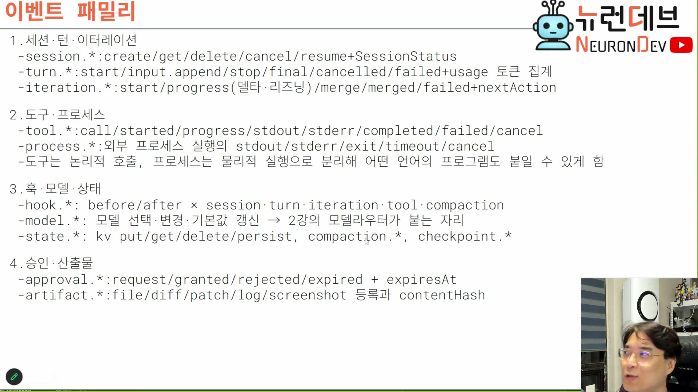
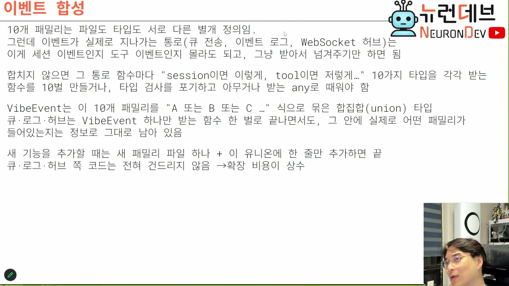
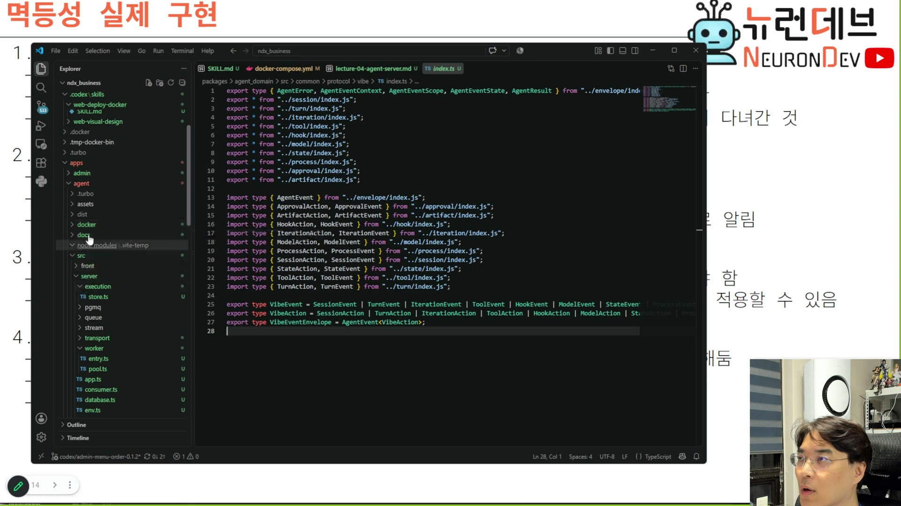

# 07. 이벤트가 곧 API — 10개 패밀리와 합타입

## 학습 목표

프로토콜 정의가 사라지고 이벤트 타입 정의가 유일한 계약이 되는 전환을 안다. 그리고 패밀리가 열 개로 늘었을 때 통로 코드가 열 배가 되지 않게 하는 방법 — **합타입 하나로 묶으면 확장 비용이 상수가 된다**는 것을 안다.

## 선수 지식

- 3장 — 봉투는 래퍼다. 이 장은 그 안의 페이로드 쪽 이야기다
- TypeScript 판별 유니온(discriminated union)의 기본 — 태그 필드로 갈라지는 합타입

## 핵심 원리 (WHY) — 프로토콜이라는 개념이 없어진다

2장에서 응답을 없앴으니 요청–응답 짝으로 정의하던 API 스펙도 없어진다.

> 이벤트 자체가 API예요. 그러니까 이제는 **요청 응답에 대한 API 정의가 필요 없어. 프로토콜이라는 개념이 없는 거죠.** 그냥 이벤트가 뭐냐, 그 이벤트를 누가 만들었냐, 그 이벤트를 수신하면 무슨 일을 할 건데 — 즉 **이벤트 자체가 타입이야.** `[16:30–17:00]`
>
> 서버, 워커(서버 안에 있는 이벤트 워커들), 클라이언트 사이의 **유일한 계약은 이벤트를 누가 발급하고 수신했냐밖에 없는 거죠.** `[17:00]`

1장의 슬라이드가 이것을 대가 목록의 세 번째로 적어 뒀다 — *"이벤트가 곧 API이므로 이벤트 타입 정의가 서버·워커·클라이언트의 유일한 계약."*

**"대가"로 분류된 이유가 있다.** 요청–응답 스펙에는 짝이 명시돼 있어서 "이 요청을 보내면 이 응답이 온다"가 문서화된다. 이벤트만 있으면 그 짝이 코드 어디에도 안 적힌다 — 발급자와 수신자를 따라가며 사람이 재구성해야 한다. 3장의 인과 키가 런타임에서 그 일을 하고, 문서에서는 패밀리 표가 그 일을 한다.

그리고 이 전환이 어렵다는 것을 강의자가 인정한다.

> 이벤트적인 사고가 잘 되나? 그게 약간 까다로워요. **이걸로 발상 전환하기가 좀 힘들어.** 근데 한번 발상 전환이 되고 나면 큰 문제는 없을 거예요. `[17:00]`

다만 정의하기는 오히려 쉬워진다.

> 미리 사전 정의된 상태에다가 결합돼가지고, 이제 훨씬 더 리퀘스트 리스판스보다는 **정의하기가 편하죠. 타입이, 이벤트 타입만 정의하면 되니까.** `[1:03:30]`

## 필수 지식 (HOW) — 열 개 패밀리

슬라이드가 패밀리를 네 묶음으로 정리한다.



```
1. 세션·턴·이터레이션
 - session.*    : create/get/delete/cancel/resume + SessionStatus
 - turn.*       : start/input.append/stop/final/cancelled/failed + usage 토큰 집계
 - iteration.*  : start/progress(델타·리즈닝)/merge/merged/failed + nextAction

2. 도구·프로세스
 - tool.*       : call/started/progress/stdout/stderr/completed/failed/cancel
 - process.*    : 외부 프로세스 실행의 stdout/stderr/exit/timeout/cancel
 - 도구는 논리적 호출, 프로세스는 물리적 실행으로 분리해 어떤 언어의 프로그램도 붙일 수 있게 함

3. 훅·모델·상태
 - hook.*       : before/after × session·turn·iteration·tool·compaction
 - model.*      : 모델 선택·변경·기본값 갱신 → 2강의 모델라우터가 붙는 자리
 - state.*      : kv put/get/delete/persist, compaction.*, checkpoint.*

4. 승인·산출물
 - approval.*   : request/granted/rejected/expired + expiresAt
 - artifact.*   : file/diff/patch/log/screenshot 등록과 contentHash
```

**2번 묶음의 마지막 줄이 1강 3장과 이어지는 설계 결정이다.** 도구(논리)와 프로세스(물리)를 나눈 것은 1강에서 "도구를 인메모리가 아니라 외부 프로세스로 실행한다"고 한 결정의 결과다.

> 저는 도구를 다 내장 도구가 아니라 **외부 익스터널 프로세스로 분리**해가지고 도구를 각각 실행할 거라고 얘기 드렸죠. 그래서 프로세스 관리하는 거에 관련된 것들. 그럼 외부 프로세스하고 에이전트하고 통신을 해야지만 중계를 할 거 아니야. **걔네들 사이에 이벤트가 있단 말이야.** `[1:01:30–1:02:00]`

그리고 그 통신에서 인터럽트가 어디까지 전파돼야 하는지가 나온다 — 8장의 abort와 이어진다.

> 여러분들이 중간에 인터럽트 걸어가지고 "야 그만해" 했더니 그게 타고 타고 도구한테 가서 **캔슬레이션이 일어나야 될 거 아니야.** 얘가 지금 문서를 500장을 뒤지고 있는 도구인데, 여러분들이 인퍼런스 중지했으면 도구한테도 그만하라고 해야 될 것 같아. 이 루프 중간중간에도 통신을 통해가지고 인터럽트 명령을 받아가지고 도구 실행을 그만둬야 된단 말이에요. `[1:02:00–1:02:30]`

## 필수 지식 (HOW) — 도구 호출도 스트리밍된다

`tool.*`에 `progress / stdout / stderr`가 있는 이유다. 놓치기 쉬운 사실이라 짚어 둔다.

> 요 각각의 이터레이션 보면 중간중간에 스트림이 들어오잖아. **이거는 모델의 스트림이 아니라 도구 실행의 스트림이야.** 예전처럼 "도구 호출했습니다, 결과 나왔습니다" 이렇게 하지 않고, **도구에 대해서도 스트림을 한다고.** 요즘은. `[1:00:00]`
>
> 새삼스레 다 써보면 **모델 토큰 출력만 스트리밍이 되는 게 아니야. 그것도 스트리밍이 된다고.** 도구 콜도. 그래서 스트리밍이 돼야 돼. 그지 같죠. **장난감 말고 진짜 여러분들이 산업적인 코드와 경쟁하려면 걔네들 스펙은 다 갖춰야 될 거 아니야.** `[1:01:00–1:01:30]`

왜 그렇게까지 하는지의 근거도 나온다. 기능이 아니라 UX다.

> 현대 시스템들은 **모니터링 투명성**이라고 그러는데, **구경하는 재미**를 주기 위해서. 도구 호출은 사실 모델과도 무관하잖아요, 그냥 처리기인데. 그 처리하는 과정도 도구에서 계속 중간중간에 출력을 해줍니다. `[1:00:30]`
>
> "지금 파일 탐색 중입니다. 15권에 관련된 문서를 찾았습니다. 그중에 3개가 굉장히 관련 깊은 걸로 판정이 났습니다." 이렇게 계속 그 도구를 수행하는 것도 스트리밍이 된다니까요. `[1:01:00]`

**이 요구가 3장의 `sequence` 필드를 정당화한다.** 모델 스트림에만 순번이 필요한 게 아니라, 도구 실행 스트림에도 필요하다. 그래서 시퀀스가 특정 이벤트 종류의 부가 기능이 아니라 봉투의 공통 필드에 있다.

## 핵심 원리 (WHY) — 문제: 통로 함수가 열 벌이 된다

패밀리가 열 개면 이벤트를 통과시키는 함수마다 열 갈래가 생긴다. 강의자가 메모장으로 이 문제를 세운다.

```
이벤트 큐[이벤트타입1,이벤트타입4,이벤트타입2,이벤트타입1,]

범용 워커가 이벤트를 가져가지 않고 1번타입 전용 워커가 가져가고 2번타입 전용 워커가 가져가고...

워커가 모든 이벤트를 다 가져가라면 이벤트 타입 인식포기 any로 취급

sum타입으로 인식하거나..
```

세 갈래가 있다는 것이다.

| 선택 | 결과 |
|---|---|
| **타입별 전용 워커** | 워커를 열 종류 운영해야 한다. 부하 분산이 타입별로 갈려서 한 타입이 몰리면 그 워커만 밀린다 |
| **`any`로 취급** | 워커 하나로 끝나지만 타입 정보가 사라진다 |
| **합타입(sum type)** | 워커 하나 + 타입 정보 유지 |

> 그걸 개별 워커를 운영할 수는 없잖아. (…) 이렇게 하기 싫다 이거야. **이벤트의 타입 인식을 포기해야겠죠?** 그럼 강타입 생태계가 약해지잖아. 이게 싫으면 **union 타입을 정해야 되겠지. 합타입.** 그래서 sum 타입을 지정해서 이렇게 될 거 아니야. `[1:07:00–1:07:30]`

**전용 워커를 배제하는 근거가 6장·8장과 이어진다.** 서버는 이벤트가 어떤 종류인지 관심이 없어야 하고(3장 자기 서술성), 워커는 아무 이벤트나 집을 수 있어야 한다(8장 풀 운영). 타입별 워커는 그 두 성질을 동시에 깨뜨린다.

> 아까 서버의 동작을 보면 **어떤 이벤트인지 별로 관심도 없잖아.** 그래서 받아서 넘겨주기만 하면 되니까, 워커가 가져가기만 하면 되거든요. `[1:06:00]`

## 필수 지식 (HOW) — 해법: 합타입 하나, 확장 비용 상수

슬라이드가 이 판단을 전문으로 적는다. **이 회차에서 타입 설계에 관한 유일한 슬라이드다.**



```
10개 패밀리는 파일도 타입도 서로 다른 별개 정의임.
그런데 이벤트가 실제로 지나가는 통로(큐 전송, 이벤트 로그, WebSocket 허브)는
이게 세션 이벤트인지 도구 이벤트인지 몰라도 되고, 그냥 받아서 넘겨주기만 하면 됨

합치지 않으면 그 통로 함수마다 "session이면 이렇게, tool이면 저렇게…" 10가지 타입을 각각 받는
함수를 10벌 만들거나, 타입 검사를 포기하고 아무거나 받는 any로 때워야 함

VibeEvent는 이 10개 패밀리를 "A 또는 B 또는 C …" 식으로 묶은 합집합(union) 타입
큐·로그·허브는 VibeEvent 하나만 받는 함수 한 벌로 끝나면서, 그 안에 실제로 어떤 패밀리가
들어있는지는 정보로 그대로 남아 있음

새 기능을 추가할 때는 새 패밀리 파일 하나 + 이 유니온에 한 줄만 추가하면 끝
큐·로그·허브 쪽 코드는 전혀 건드리지 않음 →확장 비용이 상수
```

마지막 두 줄이 요점이다. **확장 비용이 패밀리 수에 비례하지 않고 상수다.**

실제 코드가 캡처에 잡혔다. 정확히 그 구조다.



```ts
export type VibeEvent =
  SessionEvent | TurnEvent | IterationEvent | ToolEvent | HookEvent |
  ModelEvent | StateEvent | ProcessEvent | ApprovalEvent | ArtifactEvent;

export type VibeAction =
  SessionAction | TurnAction | IterationAction | ToolAction | HookAction |
  ModelAction | StateAction | ProcessAction | ApprovalAction | ArtifactAction;

export type VibeEventEnvelope = AgentEvent<VibeAction>;
```

세 줄에서 읽어야 할 것:

1. **`Event`와 `Action`이 짝으로 있다** — 패밀리마다 이벤트 타입과 액션 타입이 따로 정의되고, 각각의 유니온이 따로 만들어진다
2. **`VibeEventEnvelope = AgentEvent<VibeAction>`** — 3장의 봉투가 제네릭이고, 페이로드 자리에 유니온이 들어간다. **봉투와 페이로드의 분리가 타입 수준에서 실현된 모습이다**
3. **파일은 패밀리별로 갈려 있다** — `../session/index.js`, `../turn/index.js` … 그리고 `index.ts` 하나가 그것들을 모아 유니온을 만든다. 새 패밀리는 파일 하나 + 유니온에 한 줄

> 그래서 이제 VibeEvent가 이 패밀리를 합집합 유니온으로 묶어가지고 **썸타입으로 인식하는 거예요.** 이렇게 합타입으로 만들어 놓은 거예요. 그러면 요거 처리하는 처리기가 처리하면 되니까. `[1:08:00–1:08:30]`

> **판별 유니온의 조건 (강의에 없는 보충):** 유니온이 실제로 쓸모 있으려면 **각 멤버를 구분하는 리터럴 태그 필드**가 있어야 한다. 3장의 봉투에 `kind`·`scope`가 있고, 페이로드 쪽에 `session.create` 같은 액션 이름이 있는 것이 그 태그다. 태그가 없으면 `switch`로 좁혀지지 않고 결국 타입 단정(`as`)을 쓰게 되는데, 그러면 `any`로 때운 것과 안전성이 같아진다. 그리고 TypeScript에서 `filter`로는 유니온이 좁혀지지 않는다 — 좁히려면 태그를 먼저 검사하거나 타입 가드 함수를 쓴다.

## 필수 지식 (HOW) — 어디까지 구현됐나

정직하게 기록할 것 하나. 이 시점의 워커는 타입별 처리기가 안 붙은 상태다.

> 이 operation의 async로 처리를 쭉 해서 parent 포트한테 다시 메시지를 전송하겠지. **지금은 구체적인 타입별 처리기가 안 붙은 거지. 개념만 구현했으니까.** 여기에 나중에 이벤트 타입별 처리기가 여기 다 붙겠지. routing 돼가지고. `[1:24:30]`

즉 합타입은 정의됐고, 그 유니온을 갈라 실제 일을 하는 라우터는 다음 회차 몫이다. 자료가 인용하는 코드를 완성품으로 읽지 않아야 한다.

## 우리 프로젝트와의 연결

이 장이 확정한 것은 **계약의 형태**다. 계약은 이벤트 타입이고, 통로는 그 타입을 몰라도 되고, 확장은 상수 비용이다. 다음 장은 그 이벤트를 실제로 실행하는 주체 — 워커다.

자기 설계로 옮길 때 확인할 것:

1. **통로 함수가 패밀리 수만큼 늘어나고 있지 않은가** — 늘어나면 유니온이 없거나 통로가 타입을 알려 하고 있다
2. **판별 태그가 있는가** — 없으면 유니온이 `any`와 같아진다
3. **도구와 프로세스를 분리했는가** — 안 나누면 외부 언어 도구를 붙일 자리가 없다
4. **도구 실행도 스트리밍하는가** — 안 하면 산업용 스펙과 갈라진다. 하려면 시퀀스가 필요하다
5. **패밀리별 파일 + 유니온 한 줄 구조인가** — 한 파일에 다 넣으면 새 패밀리 추가가 그 파일 전체를 건드린다
