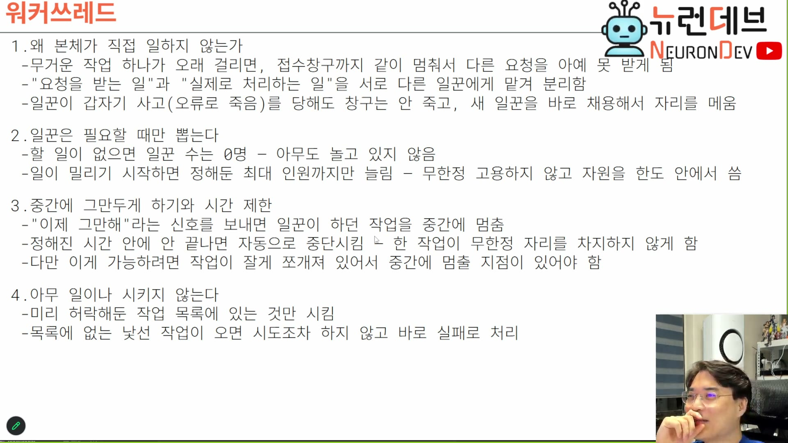
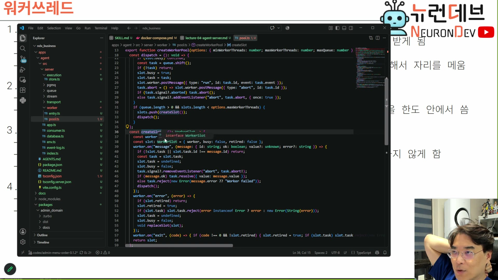

# 08. 워커 — 취소는 런타임 기능이 아니라 코드 구조다

## 학습 목표

워커 풀을 왜 그렇게 운영하는지, 그리고 이 장의 핵심 — **abort는 심는다고 되는 게 아니라 작업이 잘게 쪼개져 있어야 가능하다**는 것을 안다. 취소 가능성이 라이브러리 기능이 아니라 **코드를 어떻게 썼는지의 성질**이라는 점이 이 장의 값이다.

## 선수 지식

- 6장 — 가시성 타임아웃과 하트비트. 그 하트비트를 보낼 틈이 이 장의 "쪼개기"에서 나온다
- 2장 마지막 — "어렵고 무거운 일을 시키면 안 돼"

## 핵심 원리 (WHY) — 접수와 처리를 왜 나누는가

슬라이드 1번 항목이다. 6장의 "창구 직원과 배달회사"와 같은 비유의 서버 안쪽 버전이다.



```
1. 왜 본체가 직접 일하지 않는가
 - 무거운 작업 하나가 오래 걸리면, 접수창구까지 같이 멈춰서 다른 요청을 아예 못 받게 됨
 - "요청을 받는 일"과 "실제로 처리하는 일"을 서로 다른 일꾼에게 맡겨 분리함
 - 일꾼이 갑자기 사고(오류로 죽음)를 당해도 창구는 안 죽고, 새 일꾼을 바로 채용해서 자리를 메움
```

> 무거운 작업 하나가 오래 걸리면 다 날아가니까, **요청받는 일, 실제로 처리하는 일 이런 것들을 다 다른 워커한테 분리를 해 줍니다.** 그래서 워커가 죽어도 다른 워커 투입하면 되니까. `[1:22:30]`

**6장의 "워커는 죽어도 괜찮다"가 여기서 완성된다.** 워커를 대체 가능하게 만들려면 워커가 아무 상태도 소유하지 않아야 하고, 그것을 3장의 자기 서술성이 보장한다. 세 장이 같은 요구를 서로 다른 층에서 지지하고 있다.

## 필수 지식 (HOW) — 일꾼은 필요할 때만 뽑는다

```
2. 일꾼은 필요할 때만 뽑는다
 - 할 일이 없으면 일꾼 수는 0명 - 아무도 놀고 있지 않음
 - 일이 밀리기 시작하면 정해둔 최대 인원까지만 늘림 - 무한정 고용하지 않고 자원을 한도 안에서 씀
```

여기에 트레이드오프가 하나 있다. 스레드 생성이 공짜가 아니라는 것.

> 워커를 미리 뽑아 놓을 필요도 없어요. 작업이 많아지면 그때 워커를 생성해서 투입하면 되기 때문에. 근데 이제 **워커를 만드는 거 채용 절차라고 생각하면, 채용은 오래 걸리잖아요. 실제로 물리 스레드를 만드는 과정도 오래 걸려요.** 그래서 기본 워커 풀을 운영하고, 미리 만들어 놓은 스레드를 계속 운영하고, 그다음에 작업이 더 많아지면 거기에서 추가적으로 더 늘리고, 그러다가 필요 없어지면 좀 줄이기도 하고. 그런 식의, 이걸 **워커 스레드 풀**이라고 불리는데 **정책이 있는 거죠.** `[1:23:00–1:23:30]`

즉 슬라이드의 "0명"과 인용의 "기본 워커 풀"이 겹치는 것처럼 보이는데, 실제 코드가 정답을 준다 — 파라미터가 셋이다.



```ts
export function createWorkerPool(options: {
  minWorkerThreads: number;   // 미리 띄워 둘 최소 수 — 채용 지연을 피한다
  maxWorkerThreads: number;   // 상한 — 자원을 한도 안에서 쓴다
  maxQueue: number;           // 대기열 상한 — 역압
}) { /* ... */ }
```

**`min`이 0이면 슬라이드의 "0명"이고, 0보다 크면 인용의 "기본 풀"이다.** 정책 파라미터로 둘을 다 표현한다. 셋의 역할을 구분해 두면 자기 설계에서 헷갈리지 않는다.

| 파라미터 | 막는 문제 | 너무 크면 | 너무 작으면 |
|---|---|---|---|
| `minWorkerThreads` | 첫 요청의 스레드 생성 지연 | 놀고 있는 스레드가 자원을 잡는다 | 유입 시작 때 지연이 튄다 |
| `maxWorkerThreads` | 무한 고용 | 컨텍스트 스위칭·메모리 폭발 | 처리량 상한이 낮다 |
| `maxQueue` | 대기열 무한 증가 | 응답 없이 쌓이기만 한다 | 유입을 거절하기 시작한다 |

풀 객체의 인터페이스는 의도적으로 좁다.

> 다 create worker 풀이잖아. 풀 만들고, **워커풀 객체는 run 메소드밖에 제공하는 심플한 걸로** 되어 있네요. `[1:25:00]`

그리고 워커 슬롯의 실체는 노드 표준 기능이다.

> 실제 워커는 노드 **워커 스레드**라는 애에서 가져왔나 봐요. 이거 네이티브하게 **LTS 23인가 22부터** 지원되는 녀석이거든요. 실제로 워커 스레드 가져와서 스레드 기반으로 만들어주고, 걔랑 포스트 통신으로 돌리면 되고요. `[1:25:30]`
>
> 크리에이트 슬롯이 여기서 진짜로 워커를 만들어내는 거죠. **똑같네, 웹하고. 그쵸 웹워커 만드는 과정은 똑같잖아.** 메시지 들어오면 처리하고, 어보트에 반응하고, 에러면 에러 보고. `[1:26:00]`

> **주의:** 위 인용의 "LTS 23인가 22부터"는 강의자가 말하면서 스스로 흔든 것이고, **로컬 STT와 유튜브 자동 자막이 둘 다 같은 형태로 옮겼다** — 즉 전사 오류가 아니라 실제 발언이 불확실했다. 도커 파일 설명 구간에서는 "노드26"이라고도 했다. 실제로 `worker_threads`는 Node.js 12부터 안정화된 표준 모듈이므로, **버전 숫자는 자료에서 근거로 쓰지 않는다.** 확인 가능한 사실은 "노드 표준 `worker_threads`를 쓴다"까지다.

`pool.ts` 캡처에서 읽히는 슬롯의 생애주기가 이 설명과 정확히 맞는다.

```ts
const slot: WorkerSlot = { worker, busy: false, retired: false };

worker.on("message", (message) => {          // 완료 보고
  if (!slot.task || slot.task.id !== message.id) return;   // 늦게 온 응답 무시
  slot.task = undefined; slot.busy = false;
  message.ok ? task.resolve({ value: message.value })
             : task.reject(new Error(message.error ?? "Worker failed"));
  dispatch();                                 // 다음 일 배정
});
worker.on("error", (error) => {               // 사고 → 은퇴 후 교체
  if (slot.retired) return;
  slot.retired = true;
  if (slot.task) slot.task.reject(/* ... */);
  slot.task = undefined; slot.busy = false;
  void replaceSlot(slot);                     // ← 슬라이드의 "새 일꾼을 바로 채용"
});
worker.on("exit", (code) => { if (code !== 0 && !slot.retired) { /* ... */ } });
```

**`replaceSlot`이 슬라이드 1번 세 번째 줄의 구현이다.** 그리고 `slot.task.id !== message.id` 검사가 눈에 띈다 — 취소된 작업의 늦은 응답을 무시하는 장치다. 4장의 재정렬 문제가 워커 층에서도 같은 모양으로 나타난다는 증거다.

## 핵심 원리 (WHY) — abort는 심는 게 아니라 쪼개는 것이다

이 장의 정점이다. 슬라이드 3번 항목의 마지막 줄이 핵심이다.

```
3. 중간에 그만두게 하기와 시간 제한
 - "이제 그만해"라는 신호를 보내면 일꾼이 하던 작업을 중간에 멈춤
 - 정해진 시간 안에 안 끝나면 자동으로 중단시킴 - 한 작업이 무한정 자리를 차지하지 않게 함
 - 다만 이게 가능하려면 작업이 잘게 쪼개져 있어서 중간에 멈출 지점이 있어야 함
```

**셋째 줄이 없으면 앞의 두 줄이 거짓말이 된다.** 강의자가 이 점을 반복해서 강조한다.

> 어보트가 다 내장을 시켜야 되는 게 되게 중요하고, **어보트가 동작하려면 작업이 블로킹이 걸리면 안 돼요, 워커에서.** 이것도 되게 어려운 점이야. 이게 만약에 이런 메소드가 있어, 이 메소드가 이러면 얘가 중간에 **어보트 신호가 와도 소용이 없잖아.** `[1:27:30–1:28:00]`
>
> **그냥 무거운 덩어리로 짜면 어보트가 와도 얘가 반응할 수가 없단 말이지.** 어보트에 반응하려면 이렇게 짜야 된단 말이지. 그러면 이 분할된 작업을 할 테니까 여기에 뭐가 필요해. `[1:29:30]`
>
> 기본적으로 **워커의 구조가 이렇게 생겨야지 뭐 어보트에 반응할 거 아니야.** 어보트에 반응하려면 그렇게 짜줘야 돼요. `[1:30:00–1:30:30]`

즉 취소 가능성은 이렇게 정리된다.

```
AbortSignal을 받는다        → 인터페이스. 이것만으로는 아무 일도 안 일어난다
작업 사이사이 신호를 본다   → 실제 취소. 이걸 하려면 "사이사이"가 존재해야 한다
작업을 잘게 쪼갠다          → "사이사이"를 만드는 유일한 방법
```

**한 번의 긴 동기 호출이나 취소 불가능한 대기(예: 취소를 지원하지 않는 라이브러리 호출)가 있으면 그 구간은 취소 불가다.** 라이브러리를 바꾸거나 프로세스를 분리하는 수밖에 없다 — 그래서 7장에서 도구를 외부 프로세스로 분리한 결정이 여기서도 값을 한다. 프로세스는 최악의 경우 죽일 수 있다.

실제 코드에도 그 구조가 보인다.

```ts
slot.worker.postMessage({ type: "run", id: task.id, event: task.event });
task.abort = () => slot.worker.postMessage({ type: "abort", id: task.id });
if (task.signal?.aborted) task.abort();
else task.signal?.addEventListener("abort", task.abort, { once: true });
```

> 여기 execute logic에 어보트 컨트롤러가 따로 있어가지고, 어보트 컨트롤러가 오면 중간에 여러분들이 "야 그만해" 하고 끊으면 끊어질 수 있어야 되잖아. 그리고 나면 얘는 진짜로 **웹워커 기반의 멀티 스레드 기반**이거든요. 그래서 이렇게 **메시지 포스트로 보내게** 돼 있는 거죠. `[1:05:00–1:05:30]`

**`signal.aborted`를 먼저 검사하는 순서가 중요하다.** 등록보다 먼저 abort가 왔을 수 있다 — 그러면 이벤트 리스너는 영원히 안 불린다. 이 한 줄이 없으면 "이미 취소된 작업을 그대로 실행"하는 경합이 남는다.

그리고 6장과 이어지는 지점: **쪼개기는 취소만을 위한 것이 아니다.** 쪼개진 틈이 하트비트(`set_vt`)를 보낼 자리이기도 하다. 통째로 블로킹하면 취소도 안 되고 가시성 타임아웃도 만료된다 — 하나의 원인이 두 개의 사고를 만든다.

## 필수 지식 (HOW) — 화이트리스트

슬라이드 4번 항목이다. 짧지만 성격이 다르다 — 성능이 아니라 보안이다.

```
4. 아무 일이나 시키지 않는다
 - 미리 허락해둔 작업 목록에 있는 것만 시킴
 - 목록에 없는 낯선 작업이 오면 시도조차 하지 않고 바로 실패로 처리
```

**"시도조차 하지 않고"가 규율이다.** 모르는 액션을 일단 실행해 보고 실패하는 것과, 목록에 없으면 즉시 거절하는 것은 다르다. 후자만이 3강의 가드레일 요구와 맞는다 — 기업용 에이전트에서 워커는 임의 코드 실행 지점이므로, 여기가 열려 있으면 이벤트를 주입할 수 있는 누구든 서버에서 임의 작업을 돌릴 수 있다.

이것은 5장의 `conflict` 판정과 같은 성격의 결정이다. **모르는 것을 조용히 통과시키지 않는다.**

## 필수 지식 (HOW) — 자바스크립트라서 헷갈리는 것

2장에서 나온 경고를 여기 한 번 더 붙여 둔다. 워커를 노드로 구현하기 때문에 특히 그렇다.

> 그 자바스크립트의 싱글스레드 이벤트 루프 아닙니다. **워커스레드 패턴은** 이렇게 굉장히 비동기적인 컨텍스트를 갖고 있기 때문에 그거랑은 달라요. `[56:00]`

| | 단일 이벤트 루프 | 워커 스레드 풀 |
|---|---|---|
| 병렬성 | 없다 (동시성만) | 있다 (실제 스레드) |
| CPU 무거운 작업 | 루프 전체가 멈춘다 | 그 워커만 바쁘다 |
| 메모리 공유 | 공유한다 | 격리 — 메시지로만 오간다 |
| 그래서 직렬화 | 불필요 | **필요** (1장의 첫째 대가) |

마지막 줄이 1장에서 말한 직렬화 비용이 워커 층에서도 발생하는 이유다. `postMessage`로 오가려면 구조화 복제가 되어야 한다 — 인메모리 참조를 못 넘긴다는 제약이 여기서도 같다.

## 참고 — 언어 선택은 가독성 결정이었다

본질은 아니지만 판단 근거가 명시적이라 남길 값이 있다.

> 제가 일부러 타입스크립트로 만든 거 아시죠? 여러분 좀 편하게 읽으라고. 그 비슷한 프로젝트 중에 다른 프로젝트는 Rust로 되어 있는데, **Rust로 짜면 코드가 여러분들이 읽기에 너무 어렵던데.** 다 비슷한 코드들이거든요. `[1:26:00–1:27:00]`
>
> 전 러스트하고 많이 친해져 가지고 그냥 러스트 코드도 그럭저럭 읽을 만한데, (…) 근데 Rust로 짜놓으면 읽기가 너무 어려워. 설명하기도 어렵고. 그래서 이번에도 Rust로 짤까 하다가 **멀티스레드임에도 불구하고 그냥 노드로 짰어요, 좀 읽기 편하라고.** `[1:27:00]`

**즉 TypeScript는 성능 판단이 아니라 교육용 가독성 판단이다.** 같은 아키텍처를 자기가 구현할 때 언어는 자유롭게 골라도 된다는 뜻이기도 하다.

## 우리 프로젝트와의 연결

이 장이 확정한 것은 **실행 주체의 성질**이다. 워커는 상태를 안 갖고, 죽어도 교체되고, 취소에 반응하려면 코드가 쪼개져 있어야 하고, 모르는 일은 안 한다.

자기 설계로 옮길 때 확인할 것:

1. **접수와 처리가 분리돼 있는가** — 안 나누면 무거운 작업 하나가 서버 전체를 멈춘다
2. **풀 파라미터 셋을 다 갖췄는가** — `min`이 없으면 첫 요청이 느리고, `max`가 없으면 폭발하고, `maxQueue`가 없으면 역압이 없다
3. **취소 불가능한 구간이 있는가** — 있으면 `AbortSignal`을 받아도 취소되지 않는다. 쪼개거나 프로세스로 분리한다
4. **`signal.aborted`를 리스너 등록 전에 검사하는가** — 안 하면 이미 취소된 작업이 실행된다
5. **늦게 온 응답을 무시하는가** — `task.id` 비교가 없으면 취소된 작업의 결과가 새 작업의 결과로 들어온다
6. **허용 목록이 있는가** — 없으면 워커가 임의 작업 실행 지점이 된다

> 코딩 과제 `e04-08-01`(abort 가능한 워커 루프)이 이 장의 3번 항목을 판정 가능한 형태로 낸 것이다. 무거운 덩어리는 테스트를 통과하지 못한다.
