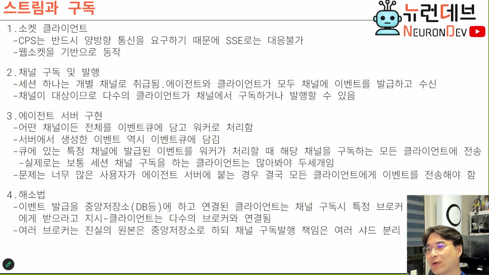

# 09. 스트림과 구독 — 병목은 수신이 아니라 송신이다

## 학습 목표

세션 하나가 채널 하나가 되는 구조를 잡고, 이 도메인의 특이한 성질 — **채널은 엄청 많은데 채널당 구독자는 한두 명**을 안다. 그리고 확장의 병목이 수신이 아니라 **송신**이라는 것, 그것을 샤드로 나눌 때 무엇이 진실의 원본으로 남는지를 안다.

## 선수 지식

- 2장 — CPS가 양방향을 요구한다는 결론. SSE로 안 되는 이유
- 6장 — 서버가 어떤 채널이든 다 큐에 담는다는 원칙

## 핵심 원리 (WHY) — 전송 계층은 이미 정해져 있다

슬라이드 1번 항목은 2장의 결론을 재확인한다.



```
1. 소켓 클라이언트
 - CPS는 반드시 양방향 통신을 요구하기 때문에 SSE로는 대응불가
 - 웹소켓을 기반으로 동작
```

> 스트림하고 구독해야 되죠. 그래서 **소켓 클라이언트가 반드시 필요합니다.** CPS는 양방향 통신을 요구하는 거 보셨죠. SSE로는 대응이 안 되고요. 웹소켓 기반으로 이제 동작을 하게끔 만들어서 **소켓 포트 하나 열어가지고** 처리할 거고. `[1:36:00]`

## 필수 지식 (HOW) — 세션 하나 = 채널 하나

```
2. 채널 구독 및 발행
 - 세션 하나는 개별 채널로 취급됨. 에이전트와 클라이언트가 모두 채널에 이벤트를 발급하고 수신
 - 채널이 대상이므로 다수의 클라이언트가 채널에서 구독하거나 발행할 수 있음
```

> 채널 구독하고 발행하는 문제도 있어요. 그래서 **세션 하나가 개별 채널로 취급이 될 거거든요.** 즉 여기에는 이거 하나하나가 다 세션인 거죠, 요게 채널인 거야. 그럼 **제가 만들어낸 세션 수만큼 채널이 생기고**, 그 채널만큼 구독 중인 거지. `[1:36:00–1:36:30]`

**둘째 줄이 1장의 세 번째 한계를 갚는 지점이다.** 1장에서 "브라우저·CLI·다른 에이전트가 같은 세션에 동시에 붙을 수 없다"가 문제였다. 채널이 대상이 되면 그 제약이 풀린다 — 채널에 몇 명이 붙어 있는지 서버가 신경 쓰지 않기 때문이다(2장의 "클라이언트가 누군지 안 궁금하다").

## 핵심 원리 (WHY) — 이 도메인의 특이한 성질

여기가 이 장에서 가장 흥미로운 관찰이다. 일반적인 pub/sub 시스템과 형태가 거꾸로다.

> 근데 이게 바이브 코딩 에이전트는 재밌는 게, 요거 하나하나가 채널이라고 봤을 때 **채널을 수신하는 클라이언트가 채널 안에 하나밖에 없어요.** 보통은 클라이언트 이거 하나잖아. 많아봤자 두세 개, 모바일까지 켜봐야 두세 개. 그래서 이 채널이 되게 재밌는 게 **채널은 엄청 많은데 채널에 구독자가 한두 명밖에 없어.** 그런 특성인 거야. `[1:36:30–1:37:00]`

일반적인 pub/sub과 대비하면 성격이 뚜렷해진다.

| | 흔한 pub/sub (알림·피드·중계) | 에이전트 세션 채널 |
|---|---|---|
| 채널 수 | 적다 (토픽 수십~수백) | **매우 많다** (세션 수만큼) |
| 채널당 구독자 | 많다 (수천~수백만) | **1~3명** |
| 최적화 대상 | 팬아웃 — 한 메시지를 여러 명에게 | **채널 수** — 많은 채널을 싸게 유지하기 |

**이 차이가 인프라 선택에 영향을 준다.** 팬아웃 최적화에 특화된 브로커의 장점이 이 도메인에서는 거의 안 나타난다 — 1장에서 카프카를 밀어낸 근거에 이 성질이 한 겹 더 얹힌다. 반대로 채널 수가 많으므로 **채널 하나당 고정 비용**(연결·메모리·구독 등록)이 중요해진다.

그럼에도 채널을 합치지 않는다는 것이 결정이다.

> 그렇다 하지만 **채널은 분리해야 돼.** 그래야지 턴, 이터레이션, 세션 같은 것들 다 분리해서 관리할 수가 있으니까. `[1:37:00]`

## 필수 지식 (HOW) — 서버는 채널을 구분하지 않는다

```
3. 에이전트 서버 구현
 - 어떤 채널이든 전체를 이벤트큐에 담고 워커로 처리함
 - 서버에서 생성한 이벤트 역시 이벤트큐에 담김
 - 큐에 있는 특정 채널에 발급된 이벤트를 워커가 처리할 때 해당 채널을 구독하는 모든 클라이언트에 전송
   - 실제로는 보통 세션 채널 구독을 하는 클라이언트는 많아봐야 두세개임
 - 문제는 너무 많은 사용자가 에이전트 서버에 붙는 경우 결국 모든 클라이언트에게 이벤트를 전송해야 함
```

> 에이전트 서버는 구현할 건데, **어떤 채널이든 전체를 이벤트 큐에 담고서 워커로 처리하면 되죠.** 사실 서버 입장에서는 이게 어떤 채널 거인지는 그냥 **채널의 속성값일 뿐**이지. 이벤트에. 그냥 전체를 다 이벤트 큐에 넣고 쫙 워커를 돌리면 됩니다. 서버에서 생성한 이벤트도 마찬가지로 이벤트 큐에 담겨서 아까 이렇게 처리해주면 됩니다, CPS답게. `[1:37:00–1:37:30]`

**"채널의 속성값일 뿐"이 3장의 자기 서술성이 여기서 값을 하는 지점이다.** 채널이 봉투의 필드라서 서버는 채널별 큐를 따로 운영하지 않는다 — 큐는 하나고, 워커도 종류가 없다(7장). 채널은 라우팅 시점에만 읽힌다.

**서버가 만든 이벤트도 큐에 넣는다**는 둘째 줄도 규율이다. 서버가 자기 이벤트를 큐를 건너뛰고 바로 소켓으로 보내면 그 경로만 순서·기록·재시도 밖에 놓인다. 예외를 만들지 않는 것이 5장의 이벤트 전량 기록과 6장의 삭제 시점을 성립시킨다.

## 핵심 원리 (WHY) — 병목은 송신이다

슬라이드 3번 항목 마지막 줄이 문제를 세운다. 그리고 강의자가 방향을 명확히 갈라 준다.

> 문제는 이벤트를 수신하는 클라이언트가 너무 많아질 수 있다는 거예요. 왜냐하면 얘는 서버인데 전 직원이 달라붙어서 바이브 코딩을 하면 사용자가 많아질 수 있는 거죠. 그걸 단일 서버 엔드포인트로 감당할 수 있느냐. 감당하기 어려운 거지. 하나의 서버가 모든 전사 직원에게 다 이벤트를 송신해주기가 어려워. **수신까지는 되지만 — 수신이야 고속으로 하겠지 — 이벤트 소싱하고 CPS로 송신할 때 너무 많은 클라이언트한테 써야 되잖아. 너무 힘들잖아.** `[1:38:00–1:38:30]`

**비대칭이다.** 정리하면:

| | 왜 |
|---|---|
| **수신은 싸다** | 클라이언트가 던진 이벤트를 큐에 넣기만 하면 끝. 1장의 "줄서기는 1초에 수천 건" |
| **송신은 비싸다** | 채널마다, 구독자마다 소켓에 써야 한다. 그리고 스트리밍이라 이벤트 수가 많다(토큰마다, 도구 출력마다 — 3장의 시퀀스) |

송신이 비싼 진짜 이유는 채널 수가 아니라 **이벤트 수**다. 3장·7장에서 봤듯 모델 토큰 하나하나, 도구 출력 한 줄 한 줄이 이벤트다. 사용자 한 명이 만드는 송신 이벤트가 초당 수십~수백이 되고, 그것이 사용자 수만큼 곱해진다.

## 필수 지식 (HOW) — 해소법: 샤드, 그리고 진실의 원본

```
4. 해소법
 - 이벤트 발급을 중앙저장소(DB등)에 하고 연결된 클라이언트는 채널 구독시
   특정 브로커에게 받으라고 지시 - 클라이언트는 다수의 브로커와 연결됨
 - 여러 브로커는 진실의 원본은 중앙저장소로 하되 채널 구독발행 책임은 여러 샤드 분리
```

> 이벤트 발급은 어차피 PGMQ에서 하고 있잖아요. 그러면 그냥 에이전트한테 오면 에이전트가 클라이언트한테 안내를 해주는데 "너는 앞으로 **샤드 1번하고 얘기해.** 그럼 그 샤드가 너한테 이 이벤트 스트림을 전송해줄 거야" — 이렇게 샤드를 분리해가지고, 처음에 접속하는 클라이언트한테 샤드한테 이벤트 수신하라고 보내면 됩니다. **이벤트 송신이야 원래 에이전트한테 해도 되는데 수신이 문제거든요. 수신을 여러 샤드한테 나눠주면 돼요.** `[1:38:30–1:39:00]`

> **용어 주의:** 이 인용에서 "송신/수신"의 주어가 슬라이드와 반대다. 슬라이드는 **서버 기준**("서버가 클라이언트에게 송신하는 것이 문제")이고, 이 인용은 **클라이언트 기준**("클라이언트가 수신하는 것이 문제")이다. 가리키는 것은 같다 — **서버→클라이언트 방향이 병목**이다.

샤드의 성질이 핵심이다. **샤드는 아무것도 몰라야 한다.**

> 샤드는 아무 지식도 없어도 되고 특정 채널만 계속 그에게 쏴주기만 하면 되기 때문에. 우리는 어차피 다 MQ나 PG 안에 다 있기 때문에 그냥 쏴주기만 하면 되거든요. **그런 샤드는 여러 개 발급하면 서버를 이제 스케일아웃 할 수 있게 되는 거죠.** `[1:39:00–1:39:30]`

즉 구조가 이렇게 갈린다.

```
진실의 원본  →  중앙 저장소 (PostgreSQL / PGMQ)   ← 상태·순서·기록을 소유
구독 발행    →  샤드 N개                          ← 아무 상태도 없다. 읽어서 쏘기만
```

**이 분리가 성립하는 이유가 3장의 자기 서술성이다.** 샤드가 이벤트를 그대로 중계할 수 있는 건 이벤트가 자기 위치를 스스로 설명하기 때문이다. 샤드가 세션 상태를 알아야 한다면 상태를 복제해야 하고, 그러면 무상태가 깨져 스케일아웃 이득이 사라진다.

**그리고 이것이 이 회차의 가장 반복되는 패턴이다** — 상태를 한 곳에 모으고 실행 주체는 무상태로 두어 대체·증식 가능하게 만드는 것. 워커(8장)와 샤드(이 장)가 같은 형태다.

## 필수 지식 (HOW) — 지금 구현하지 않는다

이 항목은 **계획으로만 남았다.** 자료가 이 구분을 흐리면 안 된다.

> 이것까지 우리가 구현할지는 잘 모르겠어요. 실무에서는 구현한 경우도 있었는데, 여러분들이 이 샤드까지 구현해야 될지는 잘 모르겠어. 혼자 놀 거 아니에요 지금은. 그리고 충분히 이벤트 소싱을 이 방식으로 구현하면, CPS와 워커스레드 구현하면 빠르기 때문에 **기간한 사용자 수로는 안 뻗어요.** 그걸로 이제 나중에 감당이 안 될 때, 엔터프라이즈쯤에 감당이 안 될 때는 이제 샤드 분리를 하겠다 이런 거죠. `[1:39:30–1:40:00]`

**판단이 명확하다: 샤드는 열어 둔 확장 경로이고 지금 필요한 것이 아니다.** 이 태도 자체가 배울 점이다 — 병목의 위치를 미리 알아 두고 구조를 그쪽으로 열어 두되(진실의 원본을 중앙에, 실행을 무상태로), 실제 분리는 필요할 때 한다.

## 참고 — 스크린샷을 증거로 남긴다

이 장 끝에 강의자가 3강의 규율을 한 번 더 반복한다. 다음 회차 과제와 이어지는 대목이라 남긴다.

> 전에도 말씀드렸지만 **테스트하면 결과는 항상 스샷으로 받으세요.** 스샷으로 안 받으면 괴로워. 제 거는 보면 테스트를 얘가 해서 뭔가 증거를 남기면 이렇게 날짜별로 남기잖아요. 무슨 프로젝트가 됐던 건지. 그래서 여기 폴더에 가보면 스크린샷이 항상 있잖아. 보면 다 보인다, 얘가 뭘 증명했는지. `[1:40:30–1:41:00]`

3강 7장(빌드 사이클)에서 다룬 "에이전트가 증거를 남긴다"와 같은 규율이다. 7장의 `artifact.*` 패밀리에 `screenshot`이 들어 있는 것이 그 규율의 프로토콜 반영이다.

## 우리 프로젝트와의 연결

이 장이 확정한 것은 **확장 경로**다. 채널은 세션 단위로 쪼개고, 서버는 채널을 구분하지 않고, 병목은 서버→클라이언트 방향이며, 그것은 무상태 샤드로 나눈다. 다만 지금 구현하지 않는다.

자기 설계로 옮길 때 확인할 것:

1. **채널 단위를 무엇으로 잡을 것인가** — 세션이면 채널이 사용자 수 × 세션 수만큼 생긴다. 채널당 고정 비용이 그만큼 곱해진다
2. **서버가 만든 이벤트도 큐를 거치는가** — 예외 경로를 만들면 그 경로만 기록·순서 밖에 놓인다
3. **송신 이벤트가 초당 몇 건인가** — 스트리밍이 있으면 이 숫자가 확장 한계를 정한다. 세어 보지 않으면 병목을 못 찾는다
4. **진실의 원본을 하나로 유지했는가** — 샤드가 상태를 갖기 시작하면 스케일아웃 이득이 사라진다
5. **지금 필요한가** — 강의자도 미룬 항목이다. 구조만 열어 두는 것과 구현하는 것을 구분한다
