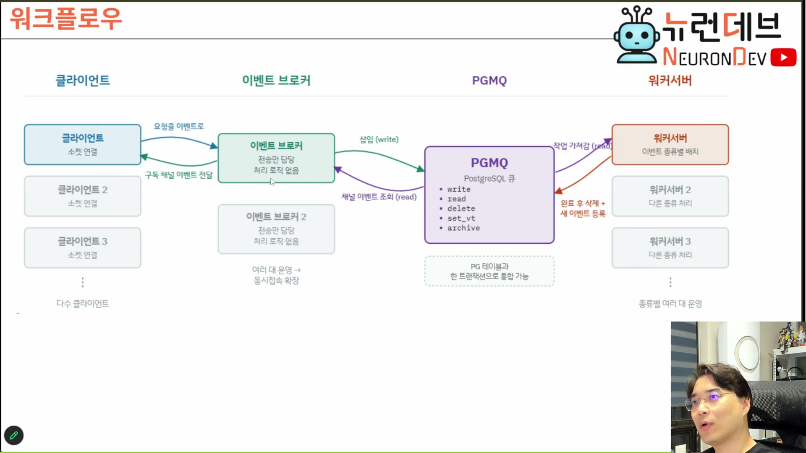

# 02. 참가자는 넷이고, 각자가 모르는 것이 확장의 방향이다

## 학습 목표

이 아키텍처의 네 참가자를 대고, 각자가 **무엇을 모르는지**로 역할을 구분할 수 있게 된다. 그리고 그 무지의 배치가 곧 "무엇을 늘릴 수 있는가"의 목록이라는 것을 안다.

## 선수 지식

- 1장 — 응답 대기 제거와 채널 기반 송수신
- 4강 7장(이벤트가 곧 API) — 이벤트 타입이 계약이라는 사실

## 핵심 원리 (WHY) — 계층을 나누는 기준이 "하는 일"이 아니라 "모르는 것"이다

보통 계층은 책임으로 나눈다. 이 아키텍처는 그렇게 나눠도 되지만, **무지로 나누는 편이 더 정확하다.** 각 계층의 확장 가능성이 책임이 아니라 무지에서 나오기 때문이다.

| 참가자 | 하는 일 | **모르는 것** | 그 무지가 허용하는 것 |
|---|---|---|---|
| **PGMQ** | `write`·`read`·`delete`·`set_vt`·`archive` 다섯 연산 | 이벤트의 의미 | 이벤트 타입별로 MQ 서버 자체를 분리 |
| **이벤트 브로커** | 채널 구독분을 모아 소켓으로 송신 | **이벤트의 내용과 처리 방법** | 브로커 대수 = 동시 접속 수용량 |
| **클라이언트** | 요청을 이벤트로 만들어 보내고, 받은 이벤트를 해석해 그린다 | 누가 처리하는지 | — (대신 두꺼워진다, 6장) |
| **워커 서버** | 자기 타입만 가져가 처리하고 결과를 다시 등록 | **클라이언트의 존재와 통신 방법** | 이벤트 타입별 워커 증설 = 기능 추가 |

**무지가 대각선으로 짜여 있다.** 브로커는 내용을 모르고 워커는 상대를 모른다. 두 무지가 만나는 자리에 PGMQ가 있고, PGMQ도 의미를 모른다. 그래서 새 애플리케이션을 붙일 때 손댈 곳이 워커 하나로 좁혀진다.

이 그림이 말하는 것 하나: **브로커와 워커를 직접 잇는 화살표가 없다.** 둘 다 PGMQ만 보고 있고, 서로에 대한 참조가 어디에도 없다.

## 필수 지식 (HOW) — 한 요청이 도는 다섯 걸음

1. **클라이언트가 요청을 이벤트로 만들어** 브로커에게 보낸다 (소켓)
2. **브로커가 PGMQ에 삽입한다** (`write`) — 내용은 보지 않는다
3. **워커가 자기 타입 이벤트를 가져간다** (`read` + `set_vt`) — 누가 보냈는지는 보지 않는다
4. **워커가 처리하고 결과를 새 이벤트로 등록한다**, 그러면서 가져갔던 원본을 지운다 (`write` + `delete`)
5. **브로커가 그 결과 이벤트를 집어 구독 중인 클라이언트에게 쏜다**

> 워커 서버는 실제로 뭐하냐? PGMQ에 접속해서 지가 처리해야 되는 이벤트 가져가서 처리한 다음에 그 다음에 어떻게 해요? **대기하지 않아.** 지가 일을 끝냈으면 다시 PGMQ한테 이벤트 등록해. 그 등록한 이벤트는 누가 들고 갈 거지? 이벤트 브로커가 들고서 클라이언트 쏘겠지 알아서. **이것 때문에 모든 대기가 다 사라져.** `[17:00–17:30]`

**4번에서 대기가 사라진다.** 워커가 "결과를 누구에게 돌려줄지" 대신 "결과를 어디에 놓을지"만 알면 되므로, 돌려줄 상대를 기다릴 이유가 없어진다. 이것이 1장에서 본 CPS가 실제 코드에 나타나는 지점이다.

## 필수 지식 (HOW) — 요청 채널과 결과 채널은 다르다

같은 PGMQ를 쓰는데 왜 요청 이벤트가 클라이언트에게 되돌아오지 않는가? **채널이 다르기 때문이다.**

> 얘가 보낸 요청 이벤트를 이벤트 브로커가 다시 얘한테 보낼 리가 없겠죠. 왜냐하면 **채널이 달라.** 그 이벤트 타입. 그건 얘한테로 흘러가는… 그리고 얘가 발급한 이벤트에 있는 타입이, 얘가 들고 가서 얘한테 쏠 거지. 왜냐하면 **얘가 그걸 구독할 거야.** `[21:30–22:00]`

정리하면 이벤트 타입 하나가 **두 가지를 동시에 결정한다.**

| 이벤트 타입이 정하는 것 | 결과 |
|---|---|
| 어느 워커가 집어가는가 | 처리 주체 배정 |
| 어느 클라이언트가 받는가 | 전달 대상 배정 |

라우팅 테이블이 따로 없는 이유가 이것이다. **타입이 곧 주소**다.

## 필수 지식 (HOW) — 이 아키텍처는 새로 발명된 것이 아니다

강의자가 직접 못 박는다. 이 문장을 흘려 들으면 자료가 "우리만의 아키텍처"를 배우는 것으로 오해된다.

> 이거는 거의 모든 서비스에 적용 가능한 굉장히 안정적인 아키텍처예요. **제가 이걸 개발했다고 얘기하면 안 되지. 익히 알려져 있는 아키텍처입니다.** 무지하게 잘 알려져 있는 초대형 규모의 트래픽을 받는 아키텍처예요. `[18:30–19:00]`

그리고 MQ 구현체에도 묶이지 않는다.

> 여기에 RabbitMQ를 쓰든 SQS를 쓰든 좀 더 빡세게 Kafka 같은 거 쓰든 뭐 그런 것들은 자유롭습니다. **이 아키텍처는 어차피 PGMQ에 의존적인 건 아니잖아.** 얘는 그냥 MQ 서버만 있으면 되는 거니까. Redis 써도 되고. `[19:30–20:00]`

**그러면 왜 PGMQ인가**는 3장에서 따로 다룬다. 답은 성능이 아니다.

## 필수 지식 (HOW) — 엔터프라이즈에서 이 구조를 못 쓰는 진짜 이유

초대형 트래픽에 적합한데도 기업 시스템에서 잘 안 쓰이는 이유가 있고, 그것은 기술적 난이도가 아니다.

> 초대형 규모의 시스템들은 이벤트 브로킹 시스템으로 만드는 게 제일 합리적인데 **많은 엔터프라이즈 시스템에서 그렇게 하기가 어려운 이유는** 그거죠. **팻 클라이언트를 만들어야 된다는 거죠.** 팻 클라이언트를 만들면 웹에서 배포하기 어렵다는 거. 그리고 앱 입장에서는 앱 유지 보수비가 많이 드니까 어떻게든 신 클라이언트를 만들려는 요즘 유행 때문에 그랬는데 **유행은 돌고 돌아 다시 팻 클라이언트 시대로 돌아오고 있기 때문에 괜찮아요.** `[19:00–19:30]`

**아키텍처 채택의 장벽이 서버 쪽이 아니라 클라이언트 배포 쪽에 있다**는 것 — 이것이 이 회차에서 가장 실무적인 관찰이다. 6장이 이 대목을 자세히 다룬다.

### ⚠️ 암기 필수

- [ ] **참가자 넷: PGMQ · 이벤트 브로커 · 클라이언트 · 워커 서버.** 각자를 "하는 일"이 아니라 **"모르는 것"**으로 외운다 — 브로커는 내용을 모르고, 워커는 상대를 모르고, PGMQ는 의미를 모른다
- [ ] **이벤트 타입 하나가 처리 주체와 전달 대상을 동시에 정한다.** 그래서 라우팅 테이블이 없다 — **타입이 곧 주소**다
- [ ] **워커가 결과를 "누구에게"가 아니라 "어디에" 놓기 때문에 대기가 사라진다.** 이것이 CPS가 코드에 나타나는 지점이다
- [ ] **이 아키텍처의 채택 장벽은 서버가 아니라 팻 클라이언트 배포다.** 기술이 아니라 배포·유지보수 비용이 막는다

## 이 지식이 설계 판단에 쓰이는 자리

새 시스템에 이 구조를 얹을지 판단할 때 순서가 있다.

1. **중간 계층에 처리 로직이 필요한가?** 필요하면 그 계층은 무한 증설 대상에서 빠진다 (4장)
2. **결과를 받을 주체가 여럿인가?** 여럿이면 큐가 아니라 로그로 읽어야 한다 (4장)
3. **클라이언트를 두껍게 만들어도 되는 배포 경로인가?** 웹 배포만 가능하고 번들 크기가 제약이면 이 구조의 이득이 줄어든다 (6장)

3번에서 걸리면 나머지가 아무리 좋아도 도입이 어렵다. **판단을 서버 설계에서 시작하지 말고 배포 제약에서 시작하는 편이 빠르다.**

> 원본 근거 — 슬라이드 `참가자 구성` `[10:00]` · `워크플로우` `[21:00]`, 발화 `[08:30–25:30]`
