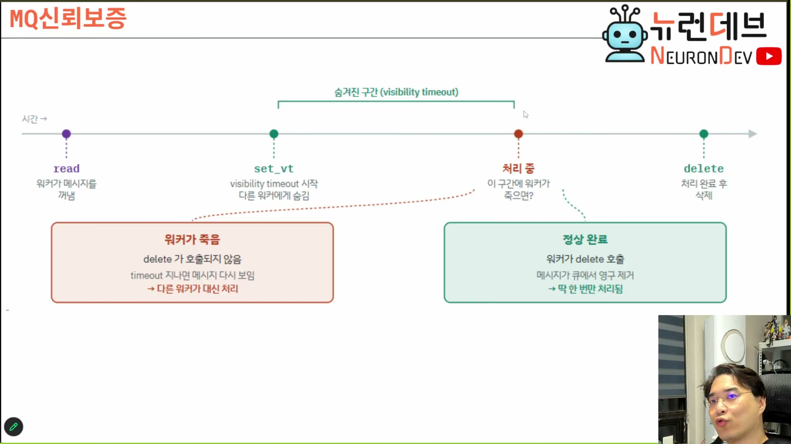

# 03. PGMQ — 성능이 아니라 한 트랜잭션 때문에 고른다

## 학습 목표

PGMQ가 무엇을 포기하고 무엇을 얻었는지 설명할 수 있게 된다. 특히 "왜 전용 브로커 대신 DB 확장인가"에 **성능이 아닌 답**을 댈 수 있어야 하고, 큐가 신뢰성을 만드는 방식(`set_vt` → `delete`)을 시간축 위에 그릴 수 있어야 한다.

## 선수 지식

- 4강 6장(큐 삭제 시점) — 유실을 중복으로 치환한다는 결론. 이 장은 그 결론을 PGMQ의 실제 연산으로 옮긴다
- 4강 4·5장(멱등 검문소) — 여기서 생기는 중복을 받아내는 곳
- 트랜잭션·락의 상식적 이해

## 핵심 원리 (WHY) — 메시지와 데이터가 갈라지면 그 틈에서 사고가 난다

전용 메시지 브로커를 쓰면 시스템이 둘이 된다. 메시지는 브로커에, 데이터는 DB에 있고, **둘 사이에는 트랜잭션이 없다.** 그래서 "메시지는 보냈는데 DB 저장은 실패" 또는 그 반대가 원리적으로 가능해진다.

> 이렇게 원격에 있는 큐 서버 같은 게 있으면 그런 식의 트랜잭션이 불가능하잖아. 근데 얘는 **다 하나의 PG 안에 들어있기 때문에** 말도 안 되는 트랜잭션이 MQ하고 테이블 사이에도 성립해요. 그게 엄청난 장점이야. **큐에서 끊는 순간 테이블에 쓰겠다를 원자화시킬 수 있어.** `[10:30–11:00]`
>
> AWS의 SQS나 MQTT 이런 거 써보신 분들은 **영속화 테이블 사이에 데이터 파이프라이닝에서 유실되는 거 보정하려고 난리 치시는 걸** 생각해보면… `[11:00]`

**이것이 PGMQ 선택의 유일한 결정적 근거다.** 성능이 아니다. 4강에서도 같은 결론이 나왔지만 근거가 달랐다(운영 대상 수) — 5강은 정합성 쪽에서 같은 자리에 도착한다.

| | 전용 브로커 (RabbitMQ · SQS · Kafka) | PGMQ (DB 확장) |
|---|---|---|
| 처리량 | 높다 | DB가 상한 |
| 운영 대상 | **하나 더 늘어난다** (백업·장애 대응 따로) | 기존 DB 운영에 흡수 |
| 메시지 ↔ 데이터 정합성 | **트랜잭션 없음** → 보정 코드가 필요하다 | **한 트랜잭션** |
| 확장 | 전용 수단 | SQL로 처리 |

## 필수 지식 (HOW) — 다섯 연산이 전부다

> PGMQ는 **간단한 메시지큐 서버로 `write`, `read`, `delete`, `set_vt`, `archive` 5가지 연산만 지원**. 꺼내기와 지우기가 분리되어 있어 그 사이에 죽으면 메시지가 살아남(신뢰성). PG 테이블과 통합되어 하나의 트랜잭션으로도 처리 가능. — 슬라이드 `참가자 구성` `[10:00]`

| 연산 | 하는 일 | 왜 있나 |
|---|---|---|
| `write` | 메시지를 넣는다 | 접수 |
| `read` | 메시지를 꺼낸다 | 배달 |
| `set_vt` | **가시성 타임아웃**을 건다 — 그동안 다른 워커에게 안 보인다 | 중복 배정 방지 |
| `delete` | 큐에서 영구 제거 | 처리 완료 표시 |
| `archive` | 지우는 대신 보관 테이블로 옮긴다 | 감사·재처리 |

**`read`와 `delete`가 분리되어 있다는 것이 신뢰성의 전부다.** 하나였다면 꺼내는 순간 사라지고, 그 뒤에 워커가 죽으면 메시지는 어디에도 없다.

## 필수 지식 (HOW) — 시간축 위의 신뢰 보정

이 그림이 말하는 것 하나: **워커의 죽음은 사고가 아니라 설계에 들어 있는 경로다** — `delete`가 호출되지 않는 것만으로 자동 복구가 걸린다.

> 워커가 메시지를 꺼냈어요. 그러면 `set_vt`를, visibility timeout이라는 걸 시작을 해요. 그러면 이게 **일종의 마커**야. 다른 워커들이 그럼 얘를 못 건드려. 그래서 여기서 죽잖아요. 그러면 **타임아웃이 끝났을 때 다시 read 상태로 바뀌어.** 타임아웃이 끝나기 전에 delete 시켜요. 그래서 이 신뢰성이 보장이 되는 거예요. (…) **이거 원자성 연산이에요.** `[26:00–27:00]`

| 워커에게 일어난 일 | 큐에서 벌어지는 일 | 결과 |
|---|---|---|
| 정상 처리 후 `delete` | 메시지 영구 제거 | 딱 한 번 처리 |
| 타임아웃 안에 못 끝냄 | 메시지가 다시 보임 | **다른 워커가 중복 처리** → 멱등 검문소가 흡수 |
| 처리 중 죽음 | 위와 같음 | 유실 없음 |

**유실이 중복으로 치환되는 자리가 정확히 여기다.** `delete`를 나중에 하기로 정한 대가로 중복이 생기고, 그 중복은 4강의 멱등 키가 받아낸다. 두 회차가 한 문장으로 이어진다 — **못 고치는 문제(유실)를 고칠 수 있는 문제(중복)로 바꾼 뒤 키 하나로 처리한다.**

## 필수 지식 (HOW) — 락을 왜 푸는가

PGMQ가 빠른 이유는 저장소가 특별해서가 아니라 **읽기 락을 걸지 않기 때문**이다. 그리고 안 걸어도 되는 이유는 위쪽에 멱등이 있기 때문이다.

> 리드락을 안 걸면 제가 1부터 10개의 레코드를 읽어들였단 말이에요. 근데 그 사이에 어떤 애가 라이트락을 걸고 썼어. 그러면 (…) 어떤 애는 11개로 읽고 어떤 애는 10개로 읽어서 불일치가 일어났잖아. **별로 상관 안 하겠다는 거지.** 왜냐하면 **멱등성에 의해서** (…) 이런 중복 같은 거 돼도 큰 문제가 안 생기니까 리드락을 굳이 안 걸겠다 이거지. `[09:30–10:00]`

**의존 방향을 정확히 보라.** 성능 최적화가 정합성을 희생시킨 것이 아니라, **먼저 멱등을 확보했기 때문에 락을 풀 수 있는 자격이 생긴 것**이다. 순서를 거꾸로 이해하면 "락을 풀었더니 빨라졌다"는 위험한 교훈만 남는다.

## 필수 지식 (HOW) — MQ 서버는 가벼워도 된다

> PGMQ도 엄청 가벼워요. 왜? **여기서 다 무거운 일 하고** 이벤트만 넣었다 뺐다 해주는 중계 테이블이니까. `[23:00–23:30]`

MQ에 요구되는 것은 처리량이 아니라 **작은 메시지를 넣었다 뺐다 하는 일**뿐이다. 그래서 구현체 선택의 자유도가 크고(2장), 어느 것을 골라도 병목이 되지 않는다. 실제로 느려지는 구간은 4강에서 확인한 그대로 — **AI 모델이 답을 생각하는 시간**이다.

### ⚠️ 암기 필수

- [ ] **PGMQ 5연산: `write` · `read` · `delete` · `set_vt` · `archive`.** `read`와 `delete`가 분리된 것이 신뢰성의 전부다
- [ ] 🔴 **PGMQ를 고르는 결정적 이유는 성능이 아니라 "MQ와 영속화 테이블을 한 트랜잭션으로 묶을 수 있다"는 것.** 전용 브로커는 그 트랜잭션이 원리적으로 불가능해 보정 코드가 상시 필요하다
- [ ] **`set_vt`는 원자적이다.** 그래서 두 워커가 같은 메시지를 동시에 집을 수 없다
- [ ] 🔴 **읽기 락을 푸는 자격은 멱등에서 나온다.** 순서가 반대가 아니다 — 멱등이 없으면 락을 풀 수 없다
- [ ] **가시성 타임아웃이 짧으면 중복 배정, 길면 워커 사망 시 그만큼 정지.** 처리 시간 편차가 크면 고정값으로 못 맞춘다

## 이 지식이 설계 판단에 쓰이는 자리

메시지 인프라를 고를 때 질문 순서가 정해진다.

1. **메시지와 데이터가 한 트랜잭션에 있어야 하는가?** 그렇다면 DB 확장이 유일한 답에 가깝다. 아니라면 전용 브로커의 처리량이 이긴다
2. **운영 인력이 시스템 하나를 더 감당할 수 있는가?** 백업·모니터링·장애 대응이 각각 따로 붙는다는 뜻이다
3. **가시성 타임아웃을 얼마로 잡을 것인가?** 이 값 하나가 "중복 처리"와 "정지 시간" 사이의 다이얼이다. 처리 시간 편차가 크면 고정값 대신 하트비트로 연장한다

3번은 운영에 들어간 뒤에 반드시 다시 만나므로, **처음부터 설정으로 빼 두는 편이 싸다.**

> 원본 근거 — 슬라이드 `참가자 구성` `[10:00]` · `MQ신뢰보증` `[26:30]`, 발화 `[09:00–11:30]` · `[25:30–27:30]`
