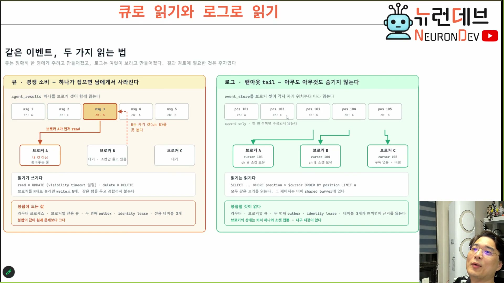

# 04. 이벤트 브로커 — 아무것도 처리하지 않기 때문에 늘릴 수 있다

## 학습 목표

이벤트 브로커의 정의를 "전달하는 서버"가 아니라 **"처리하지 않는 서버"**로 잡을 수 있게 된다. 그리고 결과 경로를 큐로 읽을 때와 로그로 읽을 때 무엇이 갈라지는지 — 이 회차에서 가장 깊은 대목 — 을 설명할 수 있어야 한다.

## 선수 지식

- 2장 — 네 참가자와 무지의 배치
- 3장 — PGMQ의 5연산, 특히 `read`가 `set_vt`를 동반한다는 사실
- 4강 9장(세션=채널, 병목은 송신)

## 핵심 원리 (WHY) — 무능이 확장성이다

브로커의 정의에서 결정적인 것은 하는 일이 아니라 **하지 않는 일**이다.

> 이벤트 브로커를 왜 이벤트 브로커라고 부르냐면 PGMQ에 있는 메시지를 쓰거나 전송해주는 기능만 하지 **그 메시지 처리를 전혀 하지 않아. 관심이 없는 거지. 오직 이벤트 브로킹만 담당하는 거야.** 그러다 보니까 (…) 이벤트 브로커 서버를 여러 개 붙이면 일종의 **접수 창구를 여러 개** 만들 수가 있다. `[11:30–12:30]`

**왜 "그러다 보니까"인가.** 처리 로직이 없으면 브로커 사이에 공유해야 할 상태가 없다. 상태가 없으면 대수를 늘려도 정합성 문제가 생기지 않는다. 즉 **확장 가능성은 브로커가 잘해서가 아니라 아무것도 안 해서 생긴다.**

이 논리는 뒤집어서도 쓸 수 있다. 어떤 중간 계층을 무한 증설하고 싶다면, 그 계층에서 로직을 걷어내야 한다. **로직을 하나 넣는 순간 증설 가능성이 사라진다** — 이것이 이 장의 실무 교훈이다.

## 필수 지식 (HOW) — 브로커는 DB 앞의 프록시다

브로커를 늘리면 PGMQ가 힘들어지는 것 아닌가? **반대다.**

> PGMQ 입장에서 이벤트 브로커 몇 개만 상대하는 거잖아. 이벤트 브로커가 PGMQ에 있는 이벤트를 **인메모리로 옮긴 다음에** 이벤트 브로커에서 담당하고 있는 클라이언트한테 이벤트를 쏘는 거잖아. **오히려 PGMQ 입장에서는 부하가 줄어.** `[12:30–13:00]`
>
> 마치 MySQL 프록시 서버 같은 것들처럼 직접적으로 DB 부하를 줄이고, 얘가 일종의 프록시가 돼서 PGMQ 입장에서는 **몇 개의 클라이언트만 상대하는** 그런 효과가 일어나는 거죠. `[13:30]`

정리하면 접속 수의 층이 이렇게 접힌다.

```
클라이언트 수만    →   브로커 수십~수백   →   PGMQ 1대
   (소켓)              (인메모리 캐시)         (DB 커넥션 수십)
```

**DB가 감당해야 하는 것은 클라이언트 수가 아니라 브로커 수다.** RDB 한 대가 커넥션 100개를 상대하는 것은 평범한 일이므로, 그 100대가 각각 수백~수천 소켓을 받으면 전체 수용량이 자릿수로 올라간다.

PGMQ 자체도 더 나눌 수 있다. 이벤트 타입이 곧 주소(2장)이므로 나누는 기준이 이미 있다.

> PGMQ를 마스터 슬레이브가 아닌 **완전히 다른 PGMQ 한 대를 또 띄워도 돼.** (…) **메시지 채널에 따라서 어떤 PGMQ 서버에 쓸지만 결정하면 됩니다.** 어차피 메시지 안에 이벤트 타입이 기술되기 때문에. `[14:00–14:30]`

## 핵심 원리 (WHY) — 이 장의 정점: 큐로 읽기와 로그로 읽기

브로커가 여럿이 되면 즉시 문제가 생긴다. **같은 큐를 여럿이 읽으면 서로 뺏는다.**

> 이거를 이제 큐 읽기를 경쟁하면 **브로커끼리 경쟁할 거 아니야.** 그럼 여기서 다시 대기가 걸릴 거니까 **똑같은 대기가 걸리죠.** `[27:30]`

응답 대기를 없애려고 만든 구조에서 대기가 되살아나는 자리다. 강의는 여기서 방향을 튼다.



이 그림이 말하는 것 하나: **큐는 정확히 한 명에게 주려고 만들어졌고 로그는 여럿이 보라고 만들어졌는데, 결과 경로에 필요한 것은 후자였다.**

| | 큐로 읽기 (경쟁 소비) | 로그로 읽기 (팬아웃 tail) |
|---|---|---|
| 대상 | 하나의 큐 테이블을 브로커 셋이 함께 | 이벤트 로그를 브로커 셋이 **각자 자기 위치부터** |
| 읽기의 성질 | **읽기가 쓰기다** — `read`는 가시성 타임아웃을 거는 `UPDATE`, `delete`는 `DELETE` | **읽기는 읽기다** — `SELECT … WHERE position > $cursor ORDER BY position LIMIT n` |
| 브로커를 N대로 늘리면 | **쓰기도 N배**, 같은 행을 두고 경합까지 | 모두 같은 꼬리를 읽는다. 그 페이지는 이미 공유 버퍼에 있다 |
| 남이 집으면 | **내 것(내 채널)이었어도 안 보인다** | 아무도 아무것도 숨기지 않는다 |
| 봉합에 드는 것 | 라우터 프로세스 · 브로커별 전용 큐 · 두 번째 아웃박스 · identity lease · 전용 테이블 셋 | **없다** |
| 브로커가 들고 있는 상태 | 위 장치들의 상태 | **커서 하나와 소켓 맵뿐** — 내구 저장이 없다 |

**"읽기가 쓰기다"가 핵심 문장이다.** 큐의 `read`는 조회가 아니라 `UPDATE`이므로, 읽는 쪽을 늘리면 쓰기 부하가 같이 늘고 같은 행을 두고 경합이 붙는다. 로그의 `read`는 진짜 조회라서 늘려도 부하가 거의 늘지 않는다 — 모두 **같은 최신 페이지**를 읽으므로 캐시가 그대로 듣는다.

강의자가 말로 설명한 것도 같은 원리다.

> 저희는 **이벤트가 불변값이거든요.** 이벤트가 불변이니까 얘 입장에서는 "102번까지 읽었다"라는 자기의 기록만 있으면 102번 이후로 읽어들이면 되고 (…) **락을 걸 필요가 없어.** 계속 지 사정에 맞게 가져오는데 **동기화도 필요 없단 말이야.** 이벤트 소싱 핵심은 **이벤트가 불변이라는 말이야.** 이벤트라는 건 일어난 일이야. `[28:00–28:30]`
>
> 이 방식을 쓰면 **라우터 같은 게 필요 없어지는 거죠.** 원래는 이렇게 경합을 피하기 위해서 중간에 라우터가 끼거든요. `[28:30]`

**결론: 작업 경로와 결과 경로는 읽는 방식이 다르다.**

| 경로 | 누가 읽나 | 어떻게 | 왜 |
|---|---|---|---|
| **작업 경로** (요청 → 워커) | 워커 여럿 | **큐** (`read` + `set_vt` + `delete`) | 한 작업은 **한 워커만** 해야 한다 |
| **결과 경로** (결과 → 브로커 → 클라이언트) | 브로커 여럿 | **로그** (커서 기반 tail) | 결과는 **구독한 모두가** 봐야 한다 |

같은 시스템 안에서 같은 이벤트를 두 방식으로 읽는다는 것 — 이것이 4강의 큐 이야기에 5강이 실제로 더한 것이다.

## 필수 지식 (HOW) — "봉합의 값이 원래 문제보다 크다"

슬라이드가 큐로 밀어붙였을 때 필요한 장치를 나열하고 한 줄로 판정한다: 라우터 프로세스, 브로커별 전용 큐, 두 번째 아웃박스, identity lease, 전용 테이블 셋 — **봉합의 값이 원래 문제보다 크다.**

이 판정법 자체가 옮겨 쓸 수 있는 도구다. **어떤 선택을 유지하기 위해 붙여야 하는 장치의 목록을 적어 보고, 그 목록이 원래 문제보다 길면 선택 자체를 다시 본다.** 개별 장치는 각각 합리적으로 보이므로, 목록으로 모아 놓기 전에는 잘 드러나지 않는다.

### ⚠️ 암기 필수

- [ ] 🔴 **브로커의 확장성은 유능해서가 아니라 아무것도 처리하지 않아서 생긴다.** 중간 계층에 로직을 하나 넣는 순간 무한 증설 가능성이 사라진다
- [ ] **브로커는 DB 앞의 프록시다.** DB가 상대하는 것은 클라이언트 수가 아니라 브로커 수다
- [ ] 🔴 **큐로 읽으면 "읽기가 쓰기"다** — `read` = 가시성 타임아웃을 거는 `UPDATE`. 읽는 쪽을 N배로 늘리면 쓰기도 N배가 되고 같은 행에 경합이 붙는다
- [ ] 🔴 **작업 경로는 큐, 결과 경로는 로그(커서 tail).** 한 작업은 한 워커만, 결과는 구독한 모두가 봐야 하기 때문이다
- [ ] **로그로 읽으면 브로커의 상태가 커서 하나와 소켓 맵뿐이 된다** — 내구 저장이 없으므로 브로커는 언제든 버려도 되는 프로세스가 된다
- [ ] **판정 도구: 어떤 선택을 지키려고 붙여야 하는 장치의 목록이 원래 문제보다 길면, 선택을 다시 본다**

## 이 지식이 설계 판단에 쓰이는 자리

메시지 팬아웃을 설계할 때 첫 질문은 대개 "어떤 브로커를 쓸까"인데, 그보다 먼저 물을 것이 있다.

1. **이 메시지를 받아야 하는 주체가 하나인가 여럿인가?** 여럿이면 경쟁 소비 큐는 애초에 맞지 않는다. 이것을 놓치면 "브로커별 전용 큐"부터 시작하는 봉합의 길로 들어선다
2. **읽는 쪽을 늘릴 계획이 있는가?** 있으면 읽기가 쓰기인 구조를 피한다
3. **중간 계층에 필터링·변환·인증 로직을 넣고 싶은 유혹이 있는가?** 있으면 그 계층은 더 이상 자유롭게 증설할 수 없다는 것을 명시적으로 기록해 둔다

3번은 조용히 어긋난다. 로직은 대개 "아주 작은 것 하나"로 들어오고, 그것이 상태를 갖는 순간 이미 증설이 막혀 있다.

> 원본 근거 — 슬라이드 `워크플로우` `[21:00]` · `큐로 읽기와 로그로 읽기` `[28:20]`, 발화 `[11:30–15:00]` · `[27:30–28:50]`
