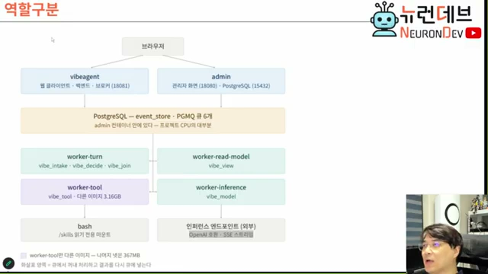
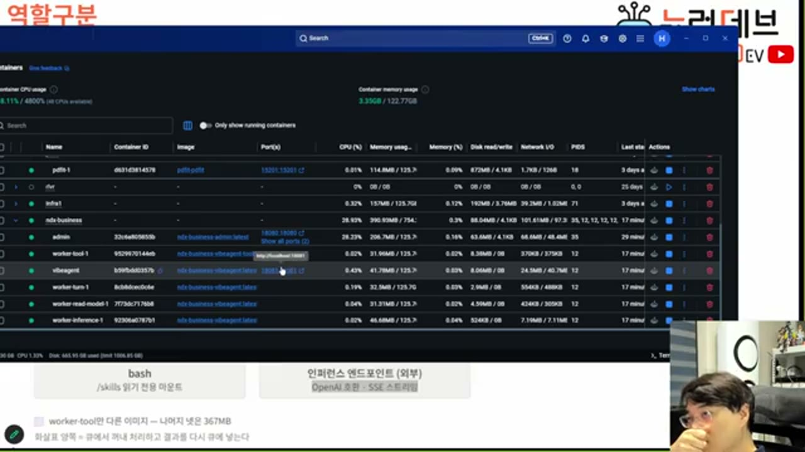
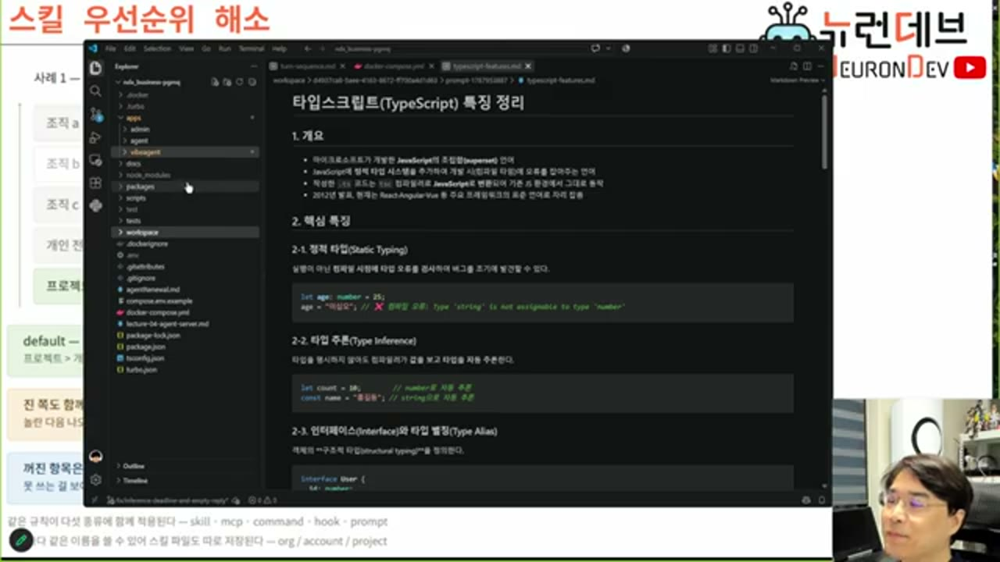
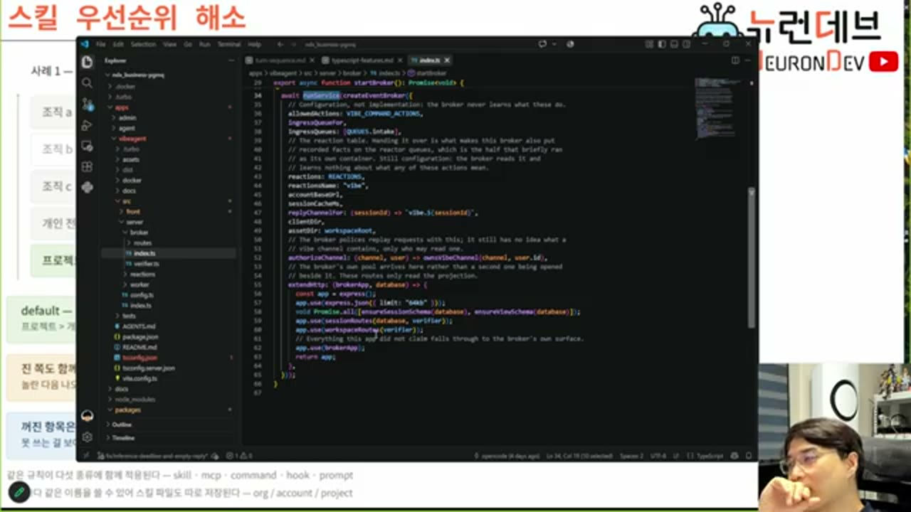

# 이벤트 소싱 기반 워커 아키텍처

## 역할 구분



브라우저가 두 표면(`vibeagent`, `admin`)에 붙고, 그 아래 하나의 PostgreSQL이 **이벤트 저장소(event_store)와 큐(PGMQ) 여섯 개를 겸합니다.** 그 아래 워커가 넷으로 갈립니다.

| 워커 | 처리하는 이벤트 | 역할 |
|---|---|---|
| `worker-turn` | `vibe_intake` · `vibe_decide` · `vibe_join` | 턴의 흐름 제어 |
| `worker-read-model` | `vibe_view` | 이벤트를 뷰(조회용 테이블)로 가공 |
| `worker-tool` | `vibe_tool` | 도구(bash) 실행 |
| `worker-inference` | `vibe_model` | 모델 추론 요청·응답 |

실제로 이 넷은 Docker 컨테이너로 분리되어 각자 돕니다.



## 왜 이렇게 잘게 쪼개는가 — 스레드 생존 기간

이 아키텍처의 핵심 동기는 하나입니다.

> **워커 쓰레드가 오래 살아 있지 않게 만든다.**

턴이 만약 하나의 함수 호출로 끝까지 처리된다면, 그 쓰레드는 턴이 끝날 때까지 — 모델 추론이 끝날 때까지 — 살아 있어야 합니다. 이벤트 기반으로 쪼개면 다릅니다. 워커는 이벤트 하나를 받아 처리하고, 결과를 다시 이벤트로 큐에 써넣은 뒤 **즉시 반환합니다.** 다음 단계는 그 이벤트를 감시하는 다른 워커(또는 같은 워커의 다음 실행)가 집어 갑니다.

턴이 진행되는 흐름을 이벤트 이름으로 따라가면 이렇습니다.

```
클라이언트 → vibe_intake (턴 실행 요청)
  → worker-turn이 받아 "턴 시작" 이벤트 발급 → 이벤트 브로커가 클라이언트에 중계
  → vibe_model (추론 요청) → worker-inference가 처리 → 모델 리플라이 이벤트
  → worker-turn이 리플라이를 보고 판단:
      툴콜 있음 → vibe_tool → worker-tool 처리 → 완료 이벤트 → worker-turn이 다시 vibe_model
      툴콜 없음 → 턴 파이널 (이벤트 두 개 발급 — 아래 참조)
```

인퍼런스만 예외적으로 시간이 걸립니다. 나머지는 전부 "이벤트 먹고 이벤트 뱉는" 짧은 처리이기 때문에 스레드 회수가 빠릅니다.

## 규칙 — 이벤트 하나는 반드시 한 곳만 소비한다

이 아키텍처에서 반복되는 제약이 하나 있습니다. **이벤트는 한 번에 한 소비자만 가져갑니다.** 그런데 턴이 끝났다는 사실은 클라이언트도 알아야 하고 리드 모델(뷰 워커)도 알아야 합니다. 소비자가 둘이면 어떻게 하는가— **이벤트를 두 개 발급합니다.** 하나는 클라이언트가 가져갈 이벤트, 하나는 리드 모델이 가져갈 이벤트입니다.

이 규칙 덕분에 "누가 이 이벤트를 가져가는가"를 소비자 쪽 로직으로 분기하지 않아도 됩니다. 대신 발급하는 쪽에서 필요한 만큼 이벤트를 복제해 큐에 넣습니다.

## PGMQ — 빠른 이유와 그 대가

워커 사이의 큐는 PostgreSQL 확장인 PGMQ입니다. 특별한 키밸류 서버가 아니라 **테이블에 씁니다.** 그런데도 빠른 이유는 락을 쓰지 않기 때문입니다 — 이벤트 소싱의 큐에 쌓이는 값은 불변값이므로, 락 없이 계속 append만 하면 됩니다.

이 설계는 대가를 요구합니다.

> **PGMQ의 신뢰도는 낮습니다. 중복 이벤트가 기록될 수 있고, 카프카처럼 이를 걸러 주는 기능이 없습니다. 멱등성은 전적으로 소비자(애플리케이션)의 책임입니다.**

강의에서 언급된 멱등성 처리 방식은 Redis나 RocksDB에 처리한 이벤트의 키를 저장해 두고, 같은 키가 다시 들어오면 무시하는 방식입니다.

## 세션·조직 바인딩과 정책 캐스케이딩

세션이 열릴 때 폴더(프로젝트 워크스페이스)가 확보되고, 그 폴더가 **한번 특정 조직 소속으로 정해지면 바뀌지 않습니다.** 조직이 정해지면 그 조직에 설정된 스킬·커맨드·MCP가 자동으로 컨텍스트에 실립니다(복사가 아니라 DB에서 조립).

스킬 이름이 개인·프로젝트·조직 계층에서 충돌하면 우선순위는 다음과 같습니다.

> **조직이 이깁니다.** 같은 이름의 스킬이 프로젝트와 조직에 동시에 있으면 조직 것이 적용되고, 상위 조직과 하위 조직 사이에도 상위가 이겨서 하위의 동명 스킬은 버려집니다.

모델 선택도 같은 캐스케이딩을 탑니다 — 프로젝트가 소속된 조직에 지정된 모델을 쓰고, 없으면 상위 조직, 그래도 없으면 기본 모델로 내려갑니다.

## 모노레포 구조



`apps/` 밑에 실행 단위(admin, vibeagent), `packages/` 밑에 라이브러리성 코드가 있는 표준적인 모노레포 형태입니다. 이벤트 브로커는 라이브러리로 만들어져 있어 Express 서버에 `createEventBroker`로 얹기만 하면 웹소켓 브로커가 됩니다.



프론트엔드(React)는 정적 파일로 빌드되어 같은 Express 서버가 서빙합니다 — 서버 사이드 렌더링 없이 단일 프로세스로 세 역할(백엔드·이벤트 브로커·웹 클라이언트 서빙)을 겸합니다.
