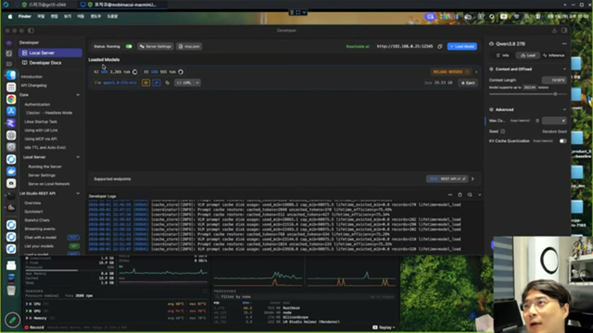
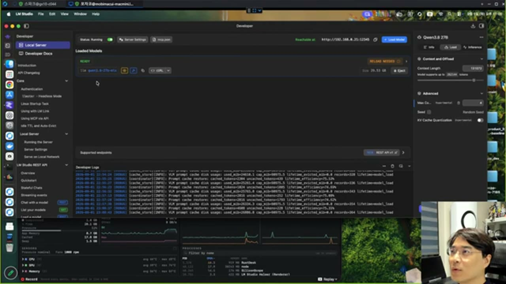

# 프리픽스 캐시 — 로그로 성립 여부를 판별하는 법

## 왜 이게 중요한가

LLM 추론은 두 단계로 나뉩니다. **프리필**(prefill, 받은 프롬프트 전체를 한 번에 처리)과 **제너레이트**(generate, 토큰을 하나씩 만들어 내는 단계)입니다. 프리필은 무겁고 제너레이트는 상대적으로 가볍습니다.

에이전트처럼 같은 세션이 계속 이어지는 경우, 이전 턴에서 이미 계산해 둔 프롬프트 앞부분(prefix)을 다시 계산하지 않고 캐시에서 재사용할 수 있습니다. 이것이 **프리픽스 캐시**입니다. 이게 성립하느냐 안 하느냐가 체감 속도를 가릅니다.

> **프리픽스가 깨지면 그동안 쌓여 있던 모든 컨텍스트를 처음부터 다시 계산합니다. 제너레이트만 느린 것과는 차원이 다르게 느려집니다.**

## 판별 신호 — 프로세싱 퍼센트가 튀는가

실시간 로그에서 프롬프트 프로세싱 진행률(%)을 보면 캐시 성립 여부를 즉시 알 수 있습니다.

- **캐시가 성립했을 때**: 68% → 100%처럼 **세 번 만에** 확 뛰어오릅니다. 캐시에 이미 있는 부분은 계산할 필요가 없으니, 실제로 처리하는 건 새로 추가된 토큰뿐이기 때문입니다.
- **캐시가 깨졌을 때**: 프로세싱 퍼센트가 **지지부진하게** 천천히 올라갑니다. 전체를 처음부터 다시 계산하고 있다는 뜻입니다.

이건 감이 아니라 로그에 실제로 찍히는 지표로 확인할 수 있습니다.

로그의 각 줄에 `cached_tokens=N uncached_tokens=M lifetime_efficiency=P%`가 찍힙니다. `cached_tokens`가 크고 `uncached_tokens`가 작을수록 캐시가 잘 유지되고 있다는 뜻이고, `lifetime_efficiency`는 그 세션 전체에서 캐시가 기여한 비율입니다.

## 벤치마크가 거짓말하는 방식 — 컨텍스트 크기를 숨긴 TPS

유튜브 등에서 "TPS 100 나왔어요"처럼 속도를 자랑하는 영상을 볼 때 반드시 확인해야 할 것이 있습니다.

> **그 수치가 어떤 컨텍스트 크기에서 나왔는가.**

컨텍스트를 작게 잡아 놓고 측정하면 누구나 높은 TPS를 찍을 수 있습니다. 실제로 바이브 코딩에 쓸 때는 컨텍스트를 262K까지 채워서 쓰게 되고, **컨텍스트가 커질수록 토큰 생성 시 로딩해야 하는 VRAM 접근량이 커져 기하급수적으로 느려집니다.** 작은 컨텍스트에서 잰 수치와 실사용 컨텍스트에서 잰 수치는 다른 숫자입니다.

> **의미 있는 벤치마크는 실제로 쓸 컨텍스트 크기와 프롬프트 양으로 측정한 것뿐입니다.** 장난감처럼 숫자만 높이려면 컨텍스트를 줄이면 되지만, 그렇게 얻은 수치는 실사용과 무관합니다.

## 정리 — 이 진단법을 언제 쓰는가

로컬이든 원격이든 LLM 기반 에이전트를 굴리는데 응답이 느려졌다면, 먼저 확인할 것은 코드가 아니라 **프롬프트 프로세싱 로그**입니다. 퍼센트가 지지부진하게 올라가고 있다면 프리픽스 캐시가 깨진 것이고, 원인은 대개 컨텍스트 구성 순서가 매 요청마다 바뀌는 데 있습니다(시스템 프롬프트·도구 목록 등 앞부분이 안정적이어야 캐시가 유지됩니다).
