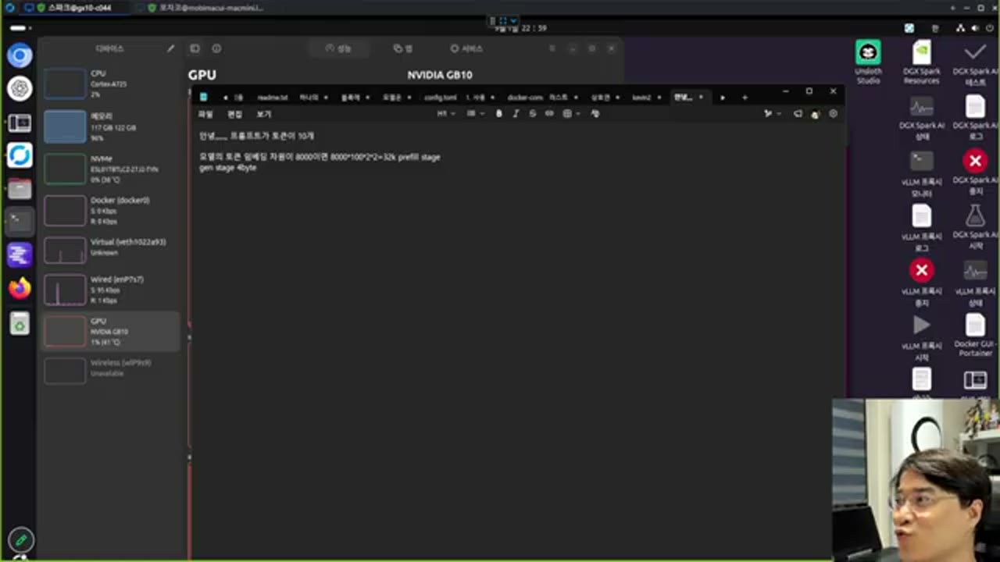

# KV 캐시 전송량 — 병목은 네트워크가 아니다

## 질문 — 여러 컴퓨터에 나눠 인퍼런스를 돌리면 네트워크가 병목이 되지 않는가

라이브 코딩 중 나온 질문에 대한 답입니다. 여러 대의 컴퓨터에 모델을 나눠 로딩하고 네트워크로 묶어 인퍼런스를 돌리는 구성에서, 네트워크 대역폭이 병목이 될 거라 예상하기 쉽습니다. 강의의 답은 **아니다**입니다.

## 계산 — 화면에 적힌 대로



화면에 실시간으로 적힌 계산은 이렇습니다.

```
프롬프트가 토큰 10개
모델의 토큰 임베딩 차원이 8000이면
8000 * 100 * 2 * 2 = 32k   (prefill stage)
gen stage: 4byte            (토큰 하나당)
```

여기서 `* 2 * 2`는 **KV 두 종류**(Key, Value)와 **FP16(2바이트)**을 곱한 것입니다. 제너레이트 단계는 토큰을 하나씩만 만들기 때문에, 그 한 토큰에 대해 K·V 각각 2바이트씩 **4바이트만** 전송하면 됩니다.

> **검증 참고**: `8000 × 100 × 2 × 2 = 3,200,000`바이트로, 화면의 "32k" 표기와는 자릿수가 100배 차이 납니다. 라이브로 암산하며 적은 값이라 이 지점의 산술 자체는 강의자도 검증하지 않았습니다. 이 자료는 화면에 적힌 값을 원문 그대로 인용했고, **결론(프리필만 무겁고 제너레이트는 가볍다 · 병목은 네트워크가 아니다)에는 자릿수 오차가 영향을 주지 않으므로** 원리 쪽을 신뢰하고 숫자는 검증된 사실로 취급하지 않았습니다.

## 두 단계의 전송량이 다른 이유

- **프리필 단계**: 프롬프트 전체 토큰에 대한 K·V를 한꺼번에 전송해야 하므로, 전송량이 **토큰 수에 비례**합니다.
- **제너레이트 단계**: 매 스텝마다 새로 생성된 토큰 **하나**의 K·V만 전송하면 되므로, 전송량이 스텝마다 일정하고 작습니다.

즉 네트워크에 부담이 되는 시점은 프리필 순간뿐이고, 그마저도 1기가비트 랜선 정도면 충분히 감당됩니다. 실제로 병목이 되는 자리는 다른 곳입니다.

## 진짜 병목 — VRAM 접근 대역폭

강의가 짚은 진짜 병목은 네트워크가 아니라 **VRAM에서 데이터를 읽는 속도**입니다.

> VRAM의 읽기 속도는 대략 **3TB/s**(3T) 대입니다. 모델 웨이트와 KV 캐시를 매 연산마다 이 대역폭으로 읽어 와야 하는데, **KV 캐시 양이 많아질수록(=컨텍스트가 길어질수록) 읽어야 하는 양이 늘어나 속도가 떨어집니다.**

여기서 강의가 바로잡는 흔한 오해가 있습니다.

> **"연산이 느려진다"가 아니라, 엄밀히는 "VRAM에서 읽어 와야 하는 양이 늘어나 접근 속도가 느려지는 것"입니다.**

컨텍스트를 키우면 느려지는 원인이 GPU의 연산 능력 부족이 아니라 **메모리 대역폭**에 있다는 뜻입니다. 이는 [02](02-prefix-cache-diagnosis.md)의 "컨텍스트가 클수록 기하급수적으로 느려진다"는 관찰과 같은 원인을 가리킵니다.

## 정리

여러 머신으로 인퍼런스를 스케일 아웃할 때 걱정해야 할 것은 네트워크 대역폭이 아니라, 각 머신이 **자기가 맡은 부분의 VRAM 대역폭을 얼마나 확보하고 있는가**입니다. 1기가비트 랜선으로도 KV 캐시 전송 자체는 충분히 감당되고, 실제 속도를 좌우하는 것은 로컬 메모리 접근입니다.
