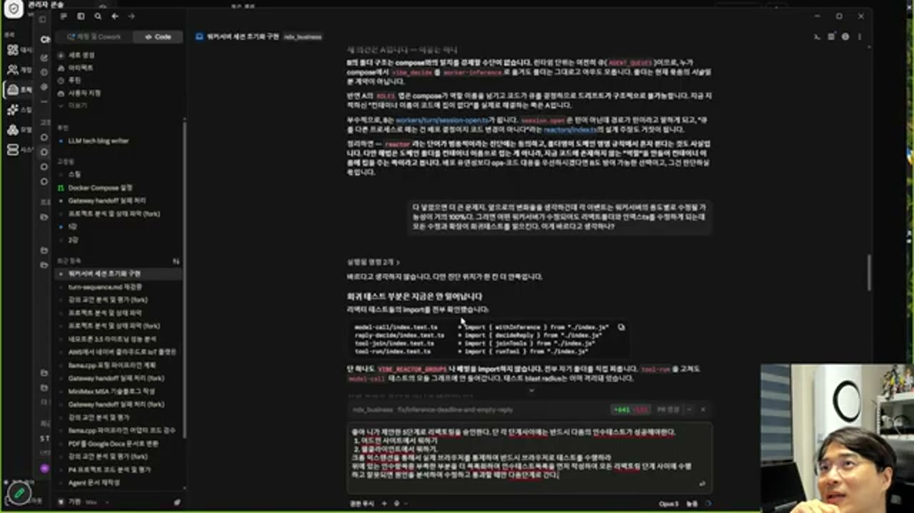

# AI와 함께 개발하는 방식 — 설계자로 남는 법

## 핵심 주장 — 하네스가 아니라 설계 이론

> **"바이브 코딩 잘하는 법은 하네스가 아닙니다. 하네스 잘 짜면 토큰이 엄청나게 소비될 뿐이고, 효과는 5% 정도 오릅니다."**

서브에이전트를 여러 개 조합하는 정교한 하네스가 체감 성능을 크게 끌어올릴 거라는 기대에 대한 직접적인 반박입니다. 강의가 대신 강조하는 것은 **끝없이 수정할 수 있는 구조로 계속 리팩토링하는 능력**이고, 이건 원래 개발자가 늘 해 오던 일입니다. 그러려면 필요한 소양은 알고리즘이나 언어 스펙이 아니라 **설계 이론**입니다.

## AI 시대 개발자의 역할 — 팀장처럼 관리한다

> **"AI로 개발한다는 건 팀장들이 아키텍처를 세우고 팀원들과 회의하는 과정에 가깝습니다."**

시니어 개발자가 AI와 일하는 방식은 신입 개발자를 관리하는 방식과 같습니다. 모델은 소프트웨어 공학의 모든 내용을 학습했기 때문에 근거를 대며 설득하면 알아듣습니다. 실제로 관찰된 패턴은 이렇습니다.

> 모델(강의에서는 Opus)이 처음엔 변명을 합니다. 그다음 "그런데 말이 맞는 것도 있다"고 인정합니다. 그다음 결국 시킨 대로 합니다. **거의 항상 이 순서로 전개됩니다.**

이 패턴을 알고 있으면, 첫 변명에 설득당해 물러서지 않고 **소프트웨어 공학적 근거로 반박**하는 것이 관리자의 역할이 됩니다.

## 진단 도구 — 유비쿼터스 랭귀지 불일치

코드가 실제로 잘못 짜여졌는지 판별하는 구체적인 방법 하나가 시연됩니다.

> 코드에서 `Reactor`라는 클래스가 턴(turn) 서버 역할을 하고 있었습니다. 강의자의 지적: **"리액터가 왜 턴서버냐? 그럼 뭐가 문제냐면 유비쿼터스 랭귀지가 성립하지 않는다는 것이다."**

팀(사람이든 AI든)이 같은 개념을 부르는 이름이 코드 곳곳에서 갈라져 있으면, 그 자체가 구조가 잘못 잡혔다는 신호입니다. **이름이 두 개로 갈리는 자리를 찾아 "왜 이름이 다른가"를 물으면 구조적 결함이 드러납니다.**

이런 진단은 코드를 직접 눈으로 보지 않고는 할 수 없습니다.

> **"코드 좀 보여줘. 진짜 이렇게 만들었다고? 그거 나와서 좀 보여줘."** — 물어봐야 합니다. AI의 요약("다 넣었어요")을 그대로 믿지 않고, 실제 핸들러 위치를 짚어 코드를 확인하는 습관이 필요합니다.

## 개발 : 리팩토링 = 4 : 6

> **"개발을 3, 40% 정도 하시고요. 60%는 리팩토링에 쏟아야지만 계속 유지보수 가능한 제품이 나와요."**

AI가 코드를 빠르게 뽑아내는 속도에 맞춰 개발 비중을 늘리는 것이 아니라, **오히려 리팩토링에 더 많은 토큰을 쓰는 쪽**이 권장됩니다. 처음 만든 코드는 "굴러가지만 유지보수는 안 되는" 상태이기 때문입니다.

리팩토링을 시킬 때 실제로 확인해야 할 것이 하나 더 있습니다.

> AI가 내놓는 계획은 대개 **단계별(phase)** 계획입니다. 하지만 "단계별로 하겠다"는 말이 **"각 단계가 끝난 시점에 안전한 상태인가"**를 보장하지는 않습니다. 이 질문을 명시적으로 끼워 넣지 않으면, 중간 단계에서 멈춰도 되는지 알 수 없는 상태로 진행됩니다.

## 모델 선택 기준 — 지시의 꼼꼼함에 맞춘다

> **"페이블(오퍼스)을 써야 하는 이유는 여러분에게 그 정도의 실력이 없기 때문입니다."**

- **오퍼스**: 지시가 대충이어도 알아서 채워 넣는 편. 시키는 사람이 세세히 관리할 여유가 없을 때.
- **소네트**: 지시 이행성이 좋아서, **꼼꼼하게 지시할 수 있는 사람**에게 더 잘 맞습니다.

두 모델의 우열이 아니라 **관리하는 쪽의 역량과 시간에 맞춰 고르는 문제**로 제시됩니다.

## 제품과 프로토타입을 가르는 기준

> **"돈 받고 파는 제품의 특징을 한마디로 요약하면, 하루에 12번씩 수정한다. 그 수정을 버틸 수 있는 구조가 돼야 합니다."**

한 번에 그럴듯하게 뽑아내는 것은 지금도 가능합니다("한 번에 만드는 뽑기는 OS도 만든다"는 비유). 문제는 **계속 고쳐야 하는 압박을 견디는 구조**를 만드는 것이고, 여기서 아직 AI 단독으로는 부족합니다 — 개발자가 코드를 계속 봐야 하는 이유입니다.

## 테스트 지시의 형태 변화

> **"단위 테스트는 필요 없습니다. 얘가 똑똑하기 때문에 인수 테스트로 조건만 걸면 됩니다."**

세부 테스트 항목을 사람이 하나하나 설계하던 작업이, **인수 조건만 걸어 주면 AI가 테스트까지 짜는 방식**으로 옮겨 간 것으로 관찰됩니다. 다만 이 관찰은 강의자 개인의 현재 작업 방식이며, 모든 상황에 일반화된 권고는 아닙니다.
