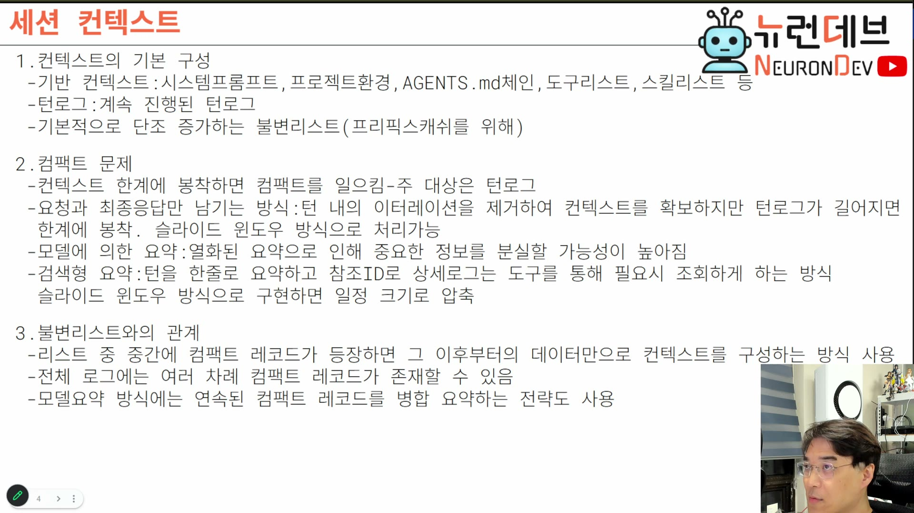

# 워크북 — 코딩 에이전트 만들기 (1·2강 누적)

## 사용법

**자료를 덮고 푼다.** 읽을 때는 이해한 것 같아도 백지에서는 안 나온다는 사실을 확인하는 게 목적이다. 정답은 [93-solutions.md](93-solutions.md)에 있고, 막히면 **먼저 해당 학습 파일로 돌아간다** — 정답을 먼저 열면 회수 연습이 독해로 바뀐다.

파트 1은 [`../docs/90-must-memorize.md`](../docs/90-must-memorize.md)의 항목 **46개와 1:1 대응**한다. 회차가 쌓이면 카드도 쌓이므로 권장 상한(20문항)을 넘는다. 대신 **강의별·주제별 8묶음(A~H)** 으로 나눴으니 한 번에 한 묶음씩 풀면 된다. 1강만 들었다면 A~D까지만 풀면 된다.

| 묶음 | 범위 | 문항 |
|---|---|---|
| A~D | **1강** — 에이전트 개념·루프·도구·훅·컨텍스트·로컬 LLM | 21 |
| E~H | **2강** — 세션·컨텍스트 조립·컴팩션·비즈니스 요구 | 25 |

코딩 과제(파트 3)의 풀이는 **별도 브랜치**에서 한다 (레포 [`README.md`](../../../README.md) § 규약 4).

---

## 파트 1. 회수 연습 (자료를 덮고)

> 정답: [93-solutions.md](93-solutions.md) 파트 1

### 묶음 A — 1강: 정의와 루프 · 4문항

**1-A-1.** 워크플로우와 에이전트를 가르는 **유일한 구분선**은 무엇인가? 다른 기준들이 부차적인 이유도 말하라.

**1-A-2.** "에이전트 = 모델의 제어권 확장"이라는 한 문장으로 세션·서브에이전트·골·도구·훅을 설명하라.

**1-A-3.** 서브에이전트의 실체는 무엇인가? 세션과의 차이는 무엇 하나뿐인가?

**1-A-4.** 에이전트 루프의 3요소를 포함 관계와 함께 쓰고, 각각을 한 줄로 정의하라.

### 묶음 B — 1강: 불변 트레이드오프 · 5문항

**1-B-1.** 모델에게 제어권을 넘길수록 얻는 것과 잃는 것을 각각 쓰라.

**1-B-2.** 전용 도구와 범용(쉘) 도구의 트레이드오프를 쓰고, 각 전략을 택한 제품을 대라.

**1-B-3.** 도구를 프로세스로 실행할 때와 인메모리로 실행할 때의 트레이드오프를 쓰라. 인메모리의 위험이 특히 커지는 조건은?

**1-B-4.** 어떤 기능을 코드에 가두는 것과 도구로 주는 것은 각각 무엇이 되는가? 이 선택의 정체를 한 단어로 말하라.

**1-B-5.** 컨텍스트 크기와 비용의 관계를 메커니즘까지 설명하라. "컨텍스트 축소"는 성능 정책인가 비용 정책인가?

### 묶음 C — 1강: 의사결정 경계와 하드웨어 산수 · 7문항

**1-C-1.** 4시-7시 규칙을 쓰라. 마지막 요청을 언제 날려야 하고, 마지노선은 언제이며, 언제부터 쓸 수 없는가?

**1-C-2.** 폴더 격리가 "최강 가드레일"인 이유를 비결정성과 연결해 설명하라. 파일이 하나뿐일 때도 폴더로 나누는가?

**1-C-3.** 로컬 LLM의 모델 크기 하한은 얼마인가? 그 아래(30B·120B)로는 왜 안 되는가?

**1-C-4.** 로컬 LLM의 양자화 하한은 얼마인가? 그 아래가 "사실상 다른 모델"이 되는 근거 지표는?

**1-C-5.** NVIDIA H200 한 장의 VRAM 용량과 메모리 종류를 쓰라.

**1-C-6.** 노드 하나(H200 약 4장, 500GB)에 460B Q5 모델을 적재했을 때 풀 컨텍스트 세션은 몇 개까지 열리는가? 개발자 몇 명 규모인가? 계산 과정을 쓰라.

**1-C-7.** 현재 Claude 모델들의 컨텍스트 창을 쓰라 (1M인 모델과 200K인 모델을 구분).

### 묶음 D — 1강: 진단 신호 · 5문항

**1-D-1.** 모델이 자꾸 "제가 틀렸습니다"라며 사과한다. 원인은 무엇이며, 무엇이 원인이 **아닌가**?

**1-D-2.** 단계별 작업 중 모델이 단계를 점프하거나 도중에 끝낸다. 원인과 처방을 쓰라.

**1-D-3.** 약한 모델이 같은 말만 반복한다(리즈닝 루프). 처방은?

**1-D-4.** 로컬 모델이 "성능이 안 난다"는 보고를 받았다. 가장 먼저 확인할 두 가지는?

**1-D-5.** 바이브 코딩으로 만든 제품이 수정이 쌓일수록 자꾸 깨진다. 원인은?

### 묶음 E — 2강: 세션과 캐시 · 4문항

**1-E-1.** "세션"의 정체를 한 문장으로 정의하라. 그 정의에서 **병렬 세션 수와 메모리 비용의 관계**가 어떻게 따라 나오는가?

**1-E-2.** 세션 식별 ID가 나뉘는 **세 층**을 각각 무엇을 가리키는지와 함께 쓰라. 이 셋을 하나로 합칠 수 없는 이유는?

**1-E-3.** 유휴 세션의 KV 캐시는 대략 얼마 뒤 내려가는가? 그 때문에 어떤 기능이 필요해지는가?

**1-E-4.** 포크(fork)가 즉시 시작되는 이유는?

### 묶음 F — 2강: 컨텍스트와 컴팩션 · 9문항

**1-F-1.** 컨텍스트를 이루는 두 부분을 쓰고 각각의 성질(고정/가변)을 말하라.

**1-F-2.** 기반 컨텍스트의 예산 목표는 몇 %인가? 실제 제품 관측값 하나를 대고, 이 상한이 필요한 이유를 말하라.

**1-F-3.** "도구 리스트는 상수가 아니라 계산 결과다"를 세 가지 입력으로 설명하라.

**1-F-4.** 같은 이름의 자원이 여러 위치에 있을 때 필요한 것은? 이 문제가 스킬에만 국한되지 않음을 예로 들어라.

**1-F-5.** AGENTS.md/CLAUDE.md의 로딩 방식을 설명하라. 단순 연결이 아닌 이유는?

**1-F-6.** 세션 도중 모델을 교체하면 무슨 일이 일어나며, 왜 경고가 뜨는가?

**1-F-7.** 컴팩션의 최적 트리거 지점은 몇 %인가? 그 %를 프로그램이 어떻게 아는가?

**1-F-8.** 잘림(truncation) 정책 3종을 쓰고, 왜 컴팩션이 그 전에 일어나야 하는지 말하라.

**1-F-9.** 모델 요약 방식의 열화 규모를 숫자로 설명하고, 추가 위험 하나를 대라.

### 묶음 G — 2강: 구현 규칙 · 7문항

**1-G-1.** 세션 서버의 두 방식을 쓰고, 둘을 가르는 **단 하나의 기준**을 말하라. 각 방식의 대표 제품도.

**1-G-2.** 세션 서버가 스트림 방식으로 이동하는 근거를 컨텍스트의 성질로 설명하라. 그 전환으로 얻는 실익은?

**1-G-3.** 이벤트 소싱의 대표적 단점은 무엇이고, 왜 이 도메인에서는 무해한가? 이 판단에서 얻을 일반 교훈은?

**1-G-4.** 클라이언트의 스트림 구독은 두 단계로 나뉜다. 각각을 쓰라.

**1-G-5.** 턴 로그 중간에 컴팩트 레코드가 등장하면 모델 입력을 어떻게 구성하는가? 컴팩트가 여러 번 일어나면?

**1-G-6.** 비즈니스 서버와 에이전트 중 무엇을 먼저 만드는가? 그 순서를 어겼을 때 생기는 재작업을 구체적으로 말하라.

**1-G-7.** 터보 모노레포의 `apps`와 `packages`의 역할과 참조 방향을 쓰라. `packages`에 들어가면 안 되는 것은?

### 묶음 H — 2강: 비즈니스 판단 · 5문항

**1-H-1.** 코덱스·클로드 코드가 있는데도 직접 만든 에이전트가 팔리는 **유일한 사업적 근거**는? 그것이 깨뜨리는 것 세 가지를 대라.

**1-H-2.** "에이전트 코어는 차별화 지점이 아니다"라는 판단의 근거는? 그렇다면 무엇이 상품성인가?

**1-H-3.** 모델 라우터에 대한 기업의 **핵심 요구**를 쓰고, 최소 구현 범위를 말하라.

**1-H-4.** "도커가 보안상 유리하다"는 일반론이 기업 현장에서 뒤집히는 이유를 말하라. 그 결과 어떤 선택을 하게 되는가?

**1-H-5.** 온프레미스 라이센스가 만드는 기술 문제와, 웹 검색을 대체하는 방식(및 과금 구조)을 쓰라.

---

## 파트 2. 판단 문제 (시나리오 + 근거)

> 해설: [93-solutions.md](93-solutions.md) 파트 2

정답이 하나로 떨어지지 않는다. **선택 + 근거 + 반대 선택이 나은 조건**을 함께 쓴다.

**2-1.** 사내 개발자 40명이 쓸 온프레미스 코딩 에이전트를 만든다. H200 4장(약 500GB VRAM) 노드 하나가 주어졌고, 460B Q5 모델을 적재한다. 세션 서버를 **세션별 인스턴스**로 갈 것인가 **스트림 서버**로 갈 것인가? 선택과 근거를 쓰고, 반대 선택이 더 나은 조건도 적으라.

**2-2.** 컴팩션 압축 방식을 골라야 한다. 개발 기간이 4주뿐이다. 모델 요약(방식 2)과 검색형 요약(방식 3) 중 어느 것을 택하겠는가? 근거와, 반대 선택이 나은 조건을 쓰라.

**2-3.** 금융권 고객이 "터미널만 제공된다"고 한다. 이미 웹 기반 다중 세션 UI를 절반쯤 만든 상태다. 무엇을 다시 결정해야 하는가?

**2-4.** 아래 화면은 컨텍스트 구성과 컴팩트를 설명하는 슬라이드다. 여기서 "불변 리스트"와 "컴팩트"가 **원리적으로 충돌**하는 지점을 지적하고, 강의가 그 충돌을 어떻게 해소하는지 설명하라.



**2-5.** 팀에 "우리는 각자 자기 모듈을 에이전트로 개발하자"는 제안이 올라왔다. 강의의 입장에서 이 제안의 문제를 지적하고, 대안 운영 방식을 구체적 산출물 수준으로 제시하라.

**2-6.** 온프레미스 제품에 벡터 검색(RAG)과 이벤트 스트림이 모두 필요하다. PostgreSQL(PGVector) 하나로 둘을 처리하는 선택과, Kafka + 별도 벡터DB로 나누는 선택 중 무엇을 고르겠는가?

**2-7.** (1강) 약한 로컬 모델(200B Q5)로 에이전트를 돌리는데 도구 호출 실수가 잦다. 도구를 전용 다수로 갈 것인가, 범용 쉘 하나로 갈 것인가? 선택과 근거, 반대 조건을 쓰라.

**2-8.** (1강) 팀이 "훅으로 모든 것을 검증하자"고 한다. 강한 모델을 쓰는 프로젝트에서 이 제안의 문제는 무엇인가?

---

## 파트 3. 재현 과제 (직접 만들기)

> 코딩 과제는 **실행 가능한 파일**로 준비돼 있다. `tests/{번호}-{slug}.test.ts`가 무엇을 만들지 정의하니 **먼저 읽고**, `src/`의 `🎯 TODO`를 채운 뒤 `pnpm test {번호}`로 판정한다. `solutions/`에는 참고 구현이 있는데, 통과한 뒤에 여는 것이다 — 먼저 열면 과제가 독해로 바뀐다.
> 코딩이 아닌 과제의 판정 체크리스트는 [93-solutions.md](93-solutions.md) 파트 3에 있다.

풀이는 별도 브랜치에서 한다:

```bash
git switch -c sol/coding-agent-architecture/e01-02-01
cd packages/coding-agent-architecture
# tests/e01-02-01-agent-loop/index.test.ts 를 읽고 src/e01-02-01-agent-loop/index.ts 의 🎯 TODO 를 채운다
pnpm test e01-02-01
```

### 1강 과제

**3-1. 에이전트 루프** — `src/e01-02-01-agent-loop/index.ts`

턴 안의 이터레이션을 돌리는 최소 루프를 만든다. 도구 결과가 다음 호출의 입력이 되고, 종료 조건이 있고, 도구 에러에 경로가 있어야 한다.

- 성공 기준은 그 파일 상단 JSDoc에 있다 (테스트가 검사하는 항목과 1:1)
- 소요 예상: 30~40분
- 막히면: [`../docs/ep01-concepts/02-agent-loop.md`](../docs/ep01-concepts/02-agent-loop.md)

**3-2. KV 세션 산수** — `src/e01-06-01-kv-session-budget/index.ts`

노드 메모리·모델 크기·세션당 캐시로 동시 세션 수와 수용 인원을 계산한다. 1강의 하드웨어 산수를 코드로 옮기는 과제다.

- 소요 예상: 20~30분
- 막히면: [`../docs/ep01-concepts/06-local-llm.md`](../docs/ep01-concepts/06-local-llm.md) § KV 캐시 산수

### 2강 과제

**3-3. 기반 컨텍스트 조립기** — `src/e02-03-01-context-assembler/index.ts`

도구·스킬 목록을 계산 결과로 만들고, 이름 충돌 우선순위를 한 곳에 명시하고, 5% 예산을 검사한다.

- 소요 예상: 40~60분
- 막히면: [`../docs/ep02-business-agent/03-context-assembly.md`](../docs/ep02-business-agent/03-context-assembly.md)

**3-4. 컴팩션 트리거 판정기** — `src/e02-04-01-compaction-trigger/index.ts`

80% 임계값과 응답 여유를 반영해 판정하고, 판정 지점을 턴 시작뿐 아니라 도구 결과 보고에도 둔다.

- 소요 예상: 30~45분
- 막히면: [`../docs/ep02-business-agent/04-compaction.md`](../docs/ep02-business-agent/04-compaction.md) § 문제 1

**3-5. 마지막 컴팩트 기준 재생기** — `src/e02-04-02-compact-replay/index.ts`

append-only 로그에서 마지막 컴팩트 이후만 잘라 모델 입력을 만든다. 로그 자체는 건드리지 않는다.

- 소요 예상: 20~30분
- 막히면: [`../docs/ep02-business-agent/04-compaction.md`](../docs/ep02-business-agent/04-compaction.md) § 컴팩트 레코드와 불변 리스트

### 문서 과제 (코딩 아님)

**3-6. 배포 형태 결정표**

가상의 고객 3곳(금융권·제조사·웹 서비스 회사)에 대해 8장의 세 축으로 배포 형태를 결정하고 근거를 한 줄씩 쓰라.

- 성공 기준
  - [ ] 세 고객 각각에 대해 **설치 환경 / 클라이언트 형태 / 과금 구조**가 결정돼 있다
  - [ ] 각 결정에 **고객 환경의 어떤 사실 때문인지**가 적혀 있다 (일반론 금지)
  - [ ] 최소 한 곳에서 "일반론과 반대되는 선택"이 나온다 (예: 보안이 중요한데 도커를 안 쓰는 경우)
- 소요 예상: 20~30분
- 막히면: [`../docs/ep02-business-agent/08-deployment-modes.md`](../docs/ep02-business-agent/08-deployment-modes.md)

---

## 파트 4. 오답 노트

틀린 문항을 여기 옮긴다. **"왜 틀렸나"를 세 범주 중 하나로 분류**하는 것이 핵심이다 — 지식 부족은 다시 읽으면 되고, 오해는 개념 교정이 필요하고, 부주의는 반복해도 안 고쳐진다. 원인이 다르면 처방이 다르다.

| 문항 | 내가 쓴 답 | 정답 | 왜 틀렸나 (지식 부족 / 오해 / 부주의) | 재확인 날짜 |
|---|---|---|---|---|
|  |  |  |  |  |
|  |  |  |  |  |
|  |  |  |  |  |
|  |  |  |  |  |
|  |  |  |  |  |

### 특히 오해가 잦은 지점 (자기 답과 비교해볼 것)

- **에이전트를 "도구를 쓰는 LLM"으로 이해했는가?** → 1강 01장. 구분선은 제어 흐름의 위치다.
- **세션을 대화창으로 이해한 채 넘어갔는가?** → 2강 01장. 이 오해가 남으면 2강 02·04장이 전부 흔들린다.
- **컴팩션을 "요약 기능"으로만 이해했는가?** → 2강 04장. 어려운 쪽은 "언제"다.
- **"스트림 서버가 최신이니 더 좋다"로 정리했는가?** → 2강 02장 + 2-1. 선택 기준은 다중 클라이언트 요구다.
- **"도커가 안전하니 도커"로 정리했는가?** → 2강 08장. 현장에서 뒤집힌다.
- **훅을 많이 달면 안전해진다고 생각했는가?** → 1강 04장 + 2-8. 강한 모델일수록 훅을 뺀다.
