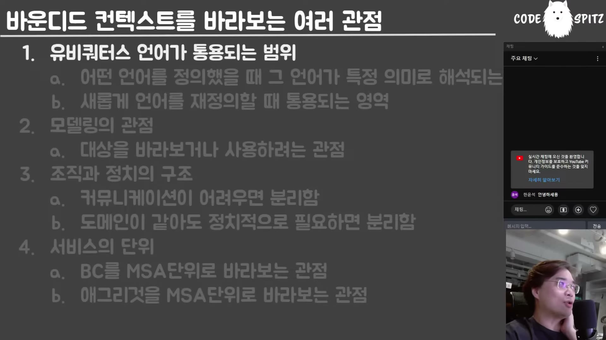

# 01. 바운디드 컨텍스트 — 네 가지 관점, 그리고 실제로 이기는 것

## 학습 목표

바운디드 컨텍스트를 보는 네 관점을 구별하고, 실무에서 경계를 실제로 정하는 힘이 무엇인지 안다. DDD가 왜 지금 다시 발굴됐는지, 그 배경이 우리 조직에 맞는지 판단할 수 있다.

## 선수 지식

- 없다. 이 문서가 시리즈의 출발점이다
- DDD 용어를 이미 안다면 "유비쿼터스 언어"에 대한 통념을 잠시 내려놓고 읽는 편이 낫다

## 핵심 원리 (WHY) — 네 관점이 같은 것을 가리키지 않는다

바운디드 컨텍스트는 하나의 정의로 굳어 있지 않다. 강의자가 네 관점을 나열하는데, 뒤로 갈수록 실무에서 강해진다.

| 관점 | 경계를 정하는 것 |
|---|---|
| ① 유비쿼터스 언어 | 그 단어의 뜻이 통용되는 범위 |
| ② 모델링 | 대상을 어떤 용도로 바라보는지의 범위 |
| ③ **조직과 정치** | **말이 통하는 사람들의 범위** |
| ④ 서비스 단위 | MSA 하나의 범위 (또는 애그리게이트 하나) |

### ① 유비쿼터스 언어 — 통념부터 깨고 시작한다

강의자는 흔한 설명을 정면으로 반박한다.

> 유비쿼터스 랭귀지는 **"도메인 전문가와 개발자가 공통으로 사용하는 언어" 같은 헛소리**를 자꾸 생각하는데 그런 거 없어요. 우리가 속해 있는 시장의 **도메인 전문가라는 건 거의 존재하지 않습니다.** 도메인에서 활동하고 있는 사람들은 도메인 전문가가 아닌 경우가 많아요. **도메인 수행자**에 오히려 가깝고, **여러분들이 분석하고 나면 여러분들이 전문가인 경우가 태반**이고.

그러면 유비쿼터스 언어는 무엇인가. **내가 정의한 단어의 의미가 통용되는 범위**다. 같은 "제품"이 마케팅에서는 홍보 대상이고 창고에서는 재고다. 냉장고를 인테리어 관점에서 보면 가로·세로·높이만 궁금하고, 전기 소비량이나 냉동칸 개수는 관심 밖이다.

> 어떤 단어를 그 영역에서 정의하면 그 단어가 **죄다 고유명사로 해석**이 되는 거죠.

**한국어 개발자에게 붙는 현실적 처방** — 이건 책에 없는 강의자의 실무 조언이다.

> **테이블 이름, 함수의 이름으로 뭘 해결하려고 그러지 마세요. 그거 안 돼요.** 우리는 네이티브 랭귀지 사용자가 아니라서 영어로 지어봤자 안 통해. … 제 추천은 **영어로 적당히 짓고 주석을 엄청 다는 것.** 이 메서드는 뭐하는 메서드, 이 클래스는 뭐하는 클래스 — **한국어로 달아 놔야** 돼요. 안 그러면 오해하게 됩니다.

### ② 모델링 관점

같은 사람을 체육관에서는 신체 조건·인바디로 보고, 학교에서는 학번·학년·학점으로 본다.

> 똑같은 대상에 대해서도 **얘를 어디에 써먹을 건지에 한정적으로 바라보고 나머지는 다 갖다 버리려는 게** 바로 모델링의 관점이네요.

## 필수 지식 (HOW) — ③ 실제로 이기는 것은 정치다

여기가 이 문서의 핵심이다.

> 또 다른 관점에서 **더 중요하고 현실적인 건 조직과 정치의 구조**예요. 의외죠. **조직과 정치의 구조야말로 바운디드 컨텍스트를 정의하는 더 큰 동기 부여**가 됩니다.

예시가 구체적이다. 마케팅 1팀과 2팀이 하는 일이 같은데 왜 나뉘어 있나 — 1팀장과 2팀장의 라인이 달라서다. 그리고 그것이 시스템에 그대로 내려온다.

> 1팀한테 프로모션 페이지를 오픈해 달라 그러면 기능이 15개가 제공되는데, 2팀한테 해 달라면 10개밖에 지원이 안 되고 — 뭐 이런 식의 일이 지천으로 일어난다는 거예요.

그래서 구축하는 입장의 판단은 이렇게 된다.

> 도메인을 넘어서, 비즈니스 로직을 넘어서 **커뮤니케이션이 어렵고 말이 안 통할 것 같으면 나누라는 거야.** … 그러면 똑같은 도메인인데 두 팀이 나누면 어떻게 돼요? **동기화 비용 들지. 메서드 호출하면 될 게 도메인 이벤트로 바뀌죠.** 원래 트랜잭션하게 움직여야 되는데 트랜잭션이 안 되니까 사가 쓰고 난리를 치죠. **괜찮아, 그 비용이 더 싸.** 김 팀장 싸우는 비용보다 그게 더 싸다.

**이 판단이 이 시리즈 전체의 출발점이다.** 팀을 나누면 트랜잭션이 깨지고 도메인 이벤트가 생긴다 — 그 이벤트를 관리하는 방법이 이 책의 나머지 전부다(03·05장).

## 필수 지식 (HOW) — ④ 서비스 단위, 그리고 DDD가 다시 뜬 이유

> 바운디드 컨텍스트를 서비스 단위로 바라보는 관점이, 여러분들이 바로 **이 구닥다리 이론이 다시 부활하게 된 큰 이유**이기도 해요. MSA 만들 때 어떻게 서비스를 나눠서 하나의 서비스를 MS로 볼까 — **"내가 구닥다리 이론들 중에 DDD를 발굴해 봤더니 이게 나누는 이유를 잘 설명해 주는 것 같아"** 이래가지고 얘가 다시 발굴된 거란 말이에요.

그런데 단위가 하나 더 작아질 수 있다.

> 바운디드 컨텍스트는 **MSA를 나누기에도 좀 큰 개념**에 가까워요. … **본질적으로 MSA가 추구하던 방향은 오히려 애그리게이트 수준으로 쪼개는 것**에 가까워요.

즉 "우리 회사가 얼마나 마이크로로 갈 거냐"가 여기서 갈린다 — 바운디드 컨텍스트 단위인가, 애그리게이트 단위인가.

## 필수 지식 (HOW) — DDD의 배경을 알고 쓴다

강의자는 DDD·SOLID의 출신을 짚는다. 이건 책의 논조가 아니라 강의자의 반론이다.

> 2장에서 다루는 여러 가지 SOLID 원칙도 그렇게 좋아하는 사람이 아니에요. 그걸 마치 바이블처럼 사람들이 떠드는데, **그걸 제창한 사람들이나 DDD 제창한 사람들까지 전부 다 우리나라 말로 하자면 차세대 SI 하던 사람들**이에요. 그러니까 이 사람들 발상이 **대규모 인력이 투입되는 개발에 되게 최적화**돼 있어. 그래서 **스타트업이나 도메인이 휙휙 바뀌는 곳에 잘 안 맞아요.**
>
> "동기화 비용, 코드 비용 이건 다 싼 거야. **인간들 싸우는 게 훨씬 더 비싸**" — 뭐 이런 관점을 갖는 것 자체가 대규모 인력이 투입되어 있는 차세대 개발이란 말이에요.

판단에 쓸 형태로 옮기면: **DDD의 전제는 "사람의 소통 비용 > 기계·코드 비용"이다.** 그 전제가 참인 조직(대규모, 여러 팀, 정치가 실재)에서는 잘 맞고, 소수 팀이 한 도메인을 빠르게 바꾸는 조직에서는 과할 수 있다.

## 이 지식이 판단에 쓰이는 자리

- **서비스 경계를 그을 때**: 도메인 구조를 그리기 전에 **누가 누구와 말이 통하는지**를 본다. 그것이 실제로 경계를 정한다.
- **경계를 나눌지 결정할 때**: 나누면 트랜잭션이 깨지고 이벤트가 생긴다는 비용을 계산하고, **소통 비용과 비교**한다.
- **DDD를 도입할 때**: 우리 조직이 DDD의 전제(소통 비용이 가장 비싸다)에 맞는지 먼저 확인한다.
- **네이밍에 시간을 쓸 때**: 영어 이름으로 도메인 일치를 달성하려 하지 않는다. 한국어 주석이 더 값을 한다.

### ⚠️ 암기 필수

- [ ] **바운디드 컨텍스트 4관점: 유비쿼터스 언어 / 모델링 / 조직·정치 / 서비스 단위.** 실무에서 실제로 이기는 것은 **조직과 정치**다.
- [ ] **"도메인 전문가"는 대개 존재하지 않는다** — 도메인 수행자가 있을 뿐이고, 분석을 마친 개발자가 전문가가 되는 경우가 태반이다.
- [ ] **경계를 나누면 메서드 호출이 도메인 이벤트로 바뀐다.** 그 비용을 감수하는 근거는 "사람이 싸우는 비용이 더 비싸다"다.
- [ ] **DDD의 전제 = 소통 비용 > 코드·기계 비용.** 대규모 SI 배경에서 나왔고, 도메인이 빠르게 바뀌는 소규모 조직에는 과할 수 있다.
- [ ] **MSA가 DDD를 발굴했다** — 서비스를 나누는 근거가 필요했기 때문이고, 실제로 추구하는 단위는 바운디드 컨텍스트보다 **애그리게이트**에 가깝다.
