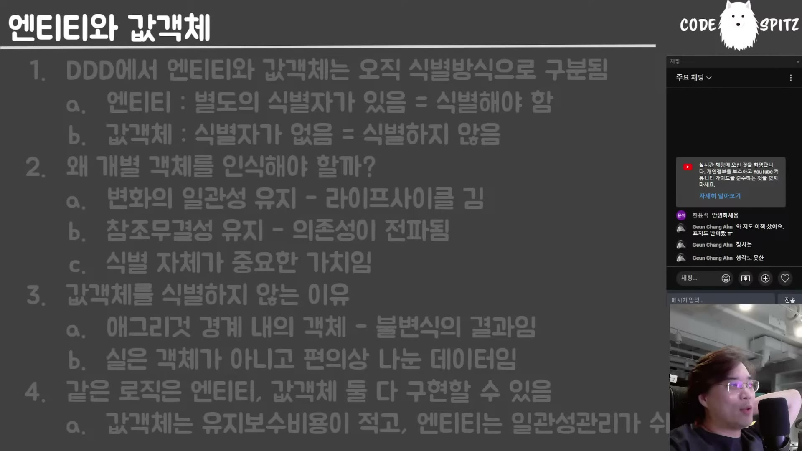

# 02. 엔티티와 값 객체 — 차이는 "식별할 가치가 있나"뿐이다

## 학습 목표

DDD 원론이 엔티티와 값 객체를 가르는 **유일한 기준**을 정확히 안다. 그 기준이 "식별자가 있다/없다"가 아니라 **"식별할 가치가 있나"**임을 이해하고, 그래서 같은 대상도 상황에 따라 갈린다는 것을 설명할 수 있다.

## 선수 지식

- 01장의 모델링 관점 — 같은 대상을 용도에 따라 다르게 본다는 발상이 여기서 반복된다
- 참조 무결성이라는 말의 뜻(A가 B를 가리키는데 B가 사라지면 안 된다)

## 핵심 원리 (WHY) — 원론에는 식별 방식 얘기밖에 없다

> DDD 원론에서 나오는 엔티티와 값 객체의 차이는 **오직 식별 방식밖에 없어요.** 이거 외에는 아무런 정의가 없습니다. **불변성에 대한 얘기조차도 없어요.**

이 말이 중요한 이유는, 실무에서 값 객체를 "불변 객체"와 같은 말로 쓰는 습관이 널리 퍼져 있기 때문이다. 원론에는 그런 규정이 없다.

그리고 강의자는 기준을 한 걸음 더 밀어붙인다.

> 엔티티는 별도의 식별자가 있다 — **이게 아니야. 식별을 해야 된다는 게 문제인 거야.** 걔는 하나하나를 다 다르게 인식을 해야 돼. **하나하나가 다른 가치를 가져.**
>
> 값 객체는 식별자가 없어. 그러면 속성들의 조합으로 식별하나? 아니야. **식별할 필요가 없다는 거야.** 핵심은 **식별할 가치가 없는 거야.**

### 택배 박스 197개

이 비유가 기준을 가장 잘 보여 준다.

> 우리 집 앞에 택배 박스가 200개 쌓여 있는데 그중에 **세 개는 내 박스**야. 이 세 개는 나한테 너무 소중하기 때문에 하나하나 다 식별을 해야 돼. 근데 나머지 **197개의 박스는 뭐죠? 식별의 가치가 없는, 그냥 남의 박스.**
>
> 똑같은 대상도 **내가 식별할 가치가 있냐 없냐에 따라서 아이디를 부여할지 말지가 결정**이 됩니다.

즉 엔티티/값 객체는 **대상의 성질이 아니라 보는 쪽의 관심**이다. 그리고 그 관심은 변한다.

## 필수 지식 (HOW) — 그조차 구현자의 선택이라는 관점

강의자가 조영호의 강의에서 받았다고 밝힌 관점이다.

> 값 객체와 엔티티의 유일한 차이는 식별하냐 마냐인데, **그조차도 구현자의 선택**이라는 거야. "아, 나는 엔티티로 구현하는 게 편해" 그럼 엔티티로 구현하고, "이건 값 객체로 구현할까" 그럼 값 객체로 구현한다는 거야. **큰 의미가 있는 게 아니라 그냥 선택의 문제**라는 거지.
>
> "야, 이 정도는 식별 안 해도 될 것 같은데" 이러다가 "야, 이거 너무 많아졌어" 혹은 **"이거 식별해야 되는 이유가 생겼어"** 이러면 식별한다는 거지.

## 필수 지식 (HOW) — 그러면 언제 식별해야 하는가

식별이 필요해지는 조건은 셋이고, 서로 이어져 있다.

### ① 라이프사이클이 길고 그 사이 계속 변한다

이름을 여섯 번 바꾼 사람을 생각해 보자.

> 그렇다고 저 사람의 **본질이 바뀌었을까요? 안 바뀌었어.** … 100년 동안 저 사람의 이름을 24번 바꿀 건데, 그럼에도 저 사람의 본질이 유지가 돼야 돼. 따라서 **이름으로 저 사람을 식별할 수가 없다**는 거야. 그러니까 식별자를 부여해야 돼.

### ② 참조 무결성이 걸려 있다

> 왜 추적해야 되죠? **참조 무결성 때문에** 그래요. 그놈이 이름을 바꿨다고 해서 걔가 사라지면 안 돼. … 수영 클럽에도 가입하고 스터디에도 가입했는데 이름을 바꿨어. 그렇다고 갑자기 스터디 멤버가 아니게 되면 안 된단 말이지.

그래서 판단 기준이 이렇게 정리된다.

> 객체를 식별해야 되는 이유는, 가장 이해하기 쉬운 건 **그 객체의 의존성이 사방으로 전파돼 있다**면 일관성을 유지해야 되기 때문에 어쩔 수 없이 식별자를 부여할 수밖에 없다는 거예요.

### ③ 애그리게이트 경계가 그 답을 대신 준다

여기서 이 문서가 03장과 만난다.

> 애그리게이트 안에 있는 애들은 **애그리게이트 루트만 바깥에 노출되지**, 애들은 애그리게이트 안에만 살고 있잖아요. 그러면 **의존성이 애그리게이트 내부로 한정**이 됩니다. 그럼 얘네들은 식별할 필요가 있을까요? **딱히 식별할 필요가 없어요. 대외적으로 참조되지 않으니까.**
>
> 일반적으로 **애그리게이트 루트는 엔티티로 구현하는 게 강제**돼요. 왜냐면 애그리게이트 루트는 다른 애들이 의존하기 때문이지.

**정리하면 규칙 하나가 나온다** — 애그리게이트 루트는 엔티티, 내부 객체는 자유(값 객체로 두어도 된다).

## 필수 지식 (HOW) — 값 객체를 식별하지 않는 적극적 근거

"필요 없다"를 넘어 "그것이 옳다"는 논거가 둘 더 있다.

**① 값 객체는 불변식을 돌린 결과물이다.**

> 애그리게이트 경계 내의 객체들은 따지고 보면 **불변식의 결과**다. 어떤 재료가 있어서 불변식을 돌리고 났더니 네 개밖에 안 남았어 — 나머지 다 튕겨내고. 따라서 걔네들은 원본이라기보다는 **불변식을 돌린 결과물**이고, 특히 불변식이 순수 함수로 돼 있는 경우에는 **아예 애당초 소스하고 완전히 다른 놈**이야. 그냥 **연산의 결과**라는 거지. … **출력물일 뿐이거든.** 따라서 불변식만 돌리면 얼마든지 바뀔 놈들이야. 이놈들한테 아이디를 부여할 가치가 있나.

**② 애초에 루트의 속성을 편의상 쪼갠 것일 수 있다.**

> 애그리게이트 루트 바깥에 노출되지 않고 안에서 객체를 나눠 놨는데, 그거 혹시 **편의상 나눈 거 아니야? 원래 다 애그리게이트 루트의 속성**인 거 아니었어? 내가 내부 코드 관리를 위해서 나눠놓은 거 아니야?

## 필수 지식 (HOW) — 유지보수 비용의 진짜 이유

이 대목이 통념을 한 번 더 뒤집는다.

> 값 객체는 유지보수 비용이 적어요. 왜냐? **아이디가 없어서 값이라서, 순수 함수처럼 값에 불변성이 있어서? 아니야. 참조가 되지 않기 때문이야.** 식별되지 않았으니까 **남이 참조할 수가 없어.** 독립체야. 그러니까 관리가 쉬운 거야.
>
> 우리는 함수형 프로그램을 다루는 게 아니잖아요. 객체지향에서 객체를 쓰면 불변인 거냐 아니냐 **이거 안 중요하고**, 식별되지 않기 때문에 **의존하기 어려워.** 그래서 관리가 쉬운 거야.

반대로 엔티티의 이점도 명확하다.

> 엔티티는 대신에 **일관성 관리가 쉬워.** 많은 변화에도 얘의 본질을 잃어버리지 않고 아이디를 유지하기 때문에. … 객체가 식별자를 갖고 있다면 **아무리 내부 값이 바뀌어도 외부에서 참조했을 때 참조 무결성이 계속 유지**되겠죠.

그리고 뮤테이션(상태 변경)은 객체지향에서 흠이 아니라는 지적도 함께 온다.

> 상태를 가두고 상태에 대한 직접적인 노출을 피한 채 캡슐화된 메서드를 노출하는 건 **객체의 본질**이란 말이에요.

## 이 지식이 판단에 쓰이는 자리

- **모델을 설계할 때**: "이건 엔티티인가 값 객체인가"를 대상의 성질로 묻지 않는다. **"우리가 이걸 하나하나 식별해야 하나"**로 묻는다.
- **ID를 붙일지 망설일 때**: 그 객체의 의존성이 애그리게이트 밖으로 나가는지 본다. 나가면 엔티티, 안에 머물면 자유다.
- **값 객체를 "불변이라 좋다"고 설명할 때**: 진짜 이유는 **참조될 수 없어서**라는 것을 기억한다. 그 차이가 설계 결정을 바꾼다.
- **나중에 식별이 필요해졌을 때**: 이건 설계 실패가 아니다. 관심이 변한 것이고, 그때 ID를 붙이면 된다.

### ⚠️ 암기 필수

- [ ] **DDD 원론에서 엔티티와 값 객체의 차이는 식별 방식뿐이다** — 불변성에 대한 규정은 **없다.**
- [ ] **기준은 "식별자가 있나"가 아니라 "식별할 가치가 있나"다.** 택배 박스 200개 중 내 것 3개만 식별 대상이다 — 대상의 성질이 아니라 **보는 쪽의 관심**이고, 관심은 변한다.
- [ ] **식별이 필요해지는 조건: 라이프사이클이 길고 계속 변한다 + 의존성이 사방으로 전파됐다(참조 무결성).**
- [ ] **애그리게이트 루트는 엔티티, 내부 객체는 자유.** 내부 객체는 의존성이 애그리게이트 안에 갇혀 대외 참조가 없다.
- [ ] **값 객체의 유지보수 비용이 낮은 이유는 불변성이 아니라 "식별되지 않아 참조될 수 없어서"다.**
- [ ] **애그리게이트 내부 객체는 불변식을 돌린 "결과물"**이다 — 순수 함수의 출력에 가까워 ID를 가질 근거가 약하다.
