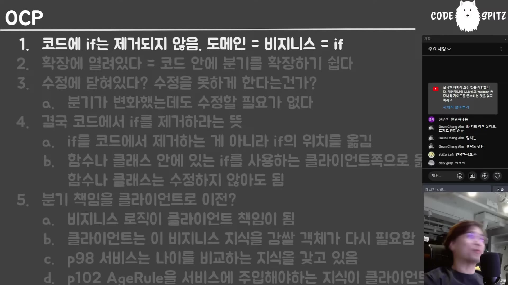

# 04. OCP 재해석 — if가 도메인이고, OCP는 그 책임을 밖으로 밀어낸다

## 학습 목표

개방-폐쇄 원칙(OCP)에서 "확장"과 "수정"이 각각 무엇을 가리키는지 정확히 안다. OCP를 적용하면 **무엇이 어디로 이동하는지**를 알고, 그것이 언제 이득이고 언제 손해인지 판단할 수 있다.

## 선수 지식

- 전략 패턴을 들어본 정도면 충분하다
- 03장의 "도메인이 바뀐 만큼만 코드가 바뀌게" — 이 문서가 그 목표를 다른 각도에서 다룬다

## 핵심 원리 (WHY) — if가 도메인 그 자체다



강의자는 OCP를 설명하기 전에 전제를 하나 못박는다. 이 전제가 나머지 전부를 결정한다.

> OCP는 **도메인 그 자체**다. 예를 들면 "우리 보험 상품은 50세 이하만 가입할 수 있어요" — if잖아. **이게 도메인 그 자체야.** 도메인이라는 건 if 그 자체야. 따라서 **우리 코드에 등장하는 if의 개수만큼의 도메인이** 있어.
>
> 그래서 **if를 없앤다는 건 도메인 코드가 아니라는 뜻**이고, 산업적으로 필요 없는 코드라는 뜻이야. … **비즈니스는 다 100% if로 돼 있습니다.**

즉 "조건문을 없애는 리팩터링"은 목표가 될 수 없다. if는 제거 대상이 아니다.

> **if는 제거할 수 없습니다.** 제거한다는 얘기는 얘는 산업적 코드가 아니라는 얘기야. 그냥 장난감 같은 코드라는 얘기지.

## 필수 지식 (HOW) — "확장"과 "수정"의 정확한 뜻

용어가 오해를 만든다.

> **확장이라는 단어 자체가 여러분들한테 엄청나게 오해를 일으켜.** 확장이라는 건 뭐냐면 **코드 안에 if문을 더 많이 쓸 수 있다는 얘기야.** 옛날에 분기를 두 개로 했는데 분기를 네 개로 하거나, 세 개로 줄이거나, 100개로 할 수 있다는 뜻이야.
>
> **확장 앞에 달려 있는 단어가 뭐냐 — 케이스야.** 케이스 확장에 열려 있다는 뜻이야.

예시가 현실적이다. 보험 가입 연령이 50세 → 55세로 바뀌고, "기존 가입 고객은 50세 적용 안 함"이 붙고, 다시 "여성은 55세"가 붙는다. **케이스가 계속 늘어난다.**

그러면 수정에 닫혀 있다는 것은?

> 수정을 못 하게 하는 거야? 도메인이 바뀌는데 어떻게 코드를 안 수정해? … **분기가 바뀌었는데도 코드를 수정할 필요가 없는 거야.** 분기를 더 늘리거나 줄이거나 바꿨는데도 코드를 수정할 필요가 없네 — 이게 말이 되나?

## 필수 지식 (HOW) — 달성 방법: 제거가 아니라 이동

논리를 이어 보면 답이 하나로 몰린다.

```
① if는 없앨 수 없다 (= 도메인이다)
② 그런데 코드가 안 변해야 한다
③ 그러려면 그 코드 안에 if가 없어야 한다
④ 따라서 — if를 없애는 게 아니라 다른 위치로 옮긴다
```

> if를 그 코드에서 제거해서 **다른 위치로 옮기는 거야.** 구체적으로는 함수나 클래스 안에 if가 있으면 **그 함수를 호출하는 쪽으로** if를 옮기는 거야.

전략 패턴이 대표적이지만, 강의자는 그것이 유일한 수단이 아니라고 짚는다.

> 꼭 전략 패턴으로 생각할 필요는 없어요. **바깥쪽에서 값을 받아서 출력해.** 예를 들면 `print`라는 함수를 만들었어요. 인자를 받아서 화면에 출력하는 함수. 그럼 얘는 **케이스라는 if가 아예 없잖아요.** 근데 그럼 그 if는 어디 간 거야? 남자일 때 "man"이라고 출력하고 여자일 때 "woman"이라고 출력하는 그 if는 어디 갔냐고 — **`print` 바깥으로 이동한 거지.**
>
> 수행의 결과를 받아들여도 상관없고 플래그의 결과를 받아들여도 상관없어. **그 안에서 if만 없어지면 돼.**

그래서 무엇이 닫히고 무엇이 열리는지가 갈린다.

| | if를 밖으로 뺀 함수 | 그 함수를 호출하는 쪽 |
|---|---|---|
| 수정에 | **닫혀 있다** | **열려 있다**(계속 바뀐다) |
| 갖게 되는 것 | 처리기 역할 | **분기 책임** |

## 필수 지식 (HOW) — OCP의 맹점

여기가 이 문서의 핵심이고, 교과서에서 잘 다루지 않는 부분이다.

> OCP의 맹점이 뭐냐면 — **분기의 책임이 함수 안에 있었는데 클라이언트로 이전해 버린단 말이야.** 모든 OCP는 다 그래.

그리고 그 분기 책임의 정체가 무엇인지 못박는다.

> **분기 책임은 비즈니스 책임이야.** 비즈니스 책임을 바깥으로 밀어냈어. OCP의 핵심은 뭐냐면 **비즈니스에 대한, 도메인에 대한 책임을 바깥으로 밀어내는 거예요.** 내부를 처리기로 바꿔 버리고.

### 양날의 검 — 신입사원의 관점

가장 설득력 있는 반례가 이것이다.

> 어떤 시니어가 팀에서 가장 오래돼서 비즈니스 로직을 제일 많이 알고 있어. 그래서 그 사람이 짠 함수 내부에는 **if가 떡칠**이 돼 있네. 그럼 나쁜 건가? **아니야. 신입사원이 와도 그 함수를 호출하면 전문가야.** 왜냐면 이 안에 **모든 케이스가 다 분기돼 있기 때문에** 안정적으로 잘 돌아.
>
> 근데 만약에 그 사람이 오늘 강의를 듣고 코드에서 if를 다 빼서 **전략 객체 3층으로 만들어 놨어.** 과연 신입사원이 전략 객체 조립을 잘해서 이 함수를 호출할 수 있을까? **양날의 검이라는 거야.**
>
> 그 사람은 앞으로 도메인이 아무리 바뀌어도 자기 함수를 바꿀 필요 없겠지. **하지만 이거 쓰는 놈들은 다 죽었어.**

결과적으로 새로운 비용이 생긴다.

> 클라이언트를 짜는 사람들이 다 전문가는 아니겠죠. 반복해서 실수 안 할 수도 없고. 그러니까 **클라이언트 쪽에는 비즈니스 지식을 감싸는 객체가 또 필요해져요.**

## 필수 지식 (HOW) — 그래서 언제 쓰나

강의자의 결론은 "쓰지 마라"가 아니라 **"무엇을 옮기는지 알고 쓰라"**다.

> 실무에서는 **그 함수가 그 도메인을 소유하는 편이, 걔가 노하우를 소유하는 편이 나을 때도 많아요.**

판단 기준을 정리하면 이렇게 된다.

| OCP가 유리한 조건 | if를 안에 두는 편이 유리한 조건 |
|---|---|
| 케이스가 자주 늘고, 그 추가를 **여러 팀·외부**가 한다 | 케이스를 **아는 사람이 소수**이고 호출자가 초보다 |
| 분기 조합을 호출자가 **정당하게 알아야** 한다 | 호출자는 결과만 원한다 |
| 그 함수가 프레임워크·라이브러리 경계에 있다 | 그 함수가 도메인 노하우의 집결지다 |

07장에서 같은 질문이 어댑터 층에서 다시 나온다 — **지식을 어디에 둘 것인가.** 그것이 이 시리즈에서 반복되는 결정이다.

## 이 지식이 판단에 쓰이는 자리

- **"if문을 줄이자"는 제안을 받았을 때**: if의 개수는 도메인 케이스의 개수다. 줄이는 것이 목표가 될 수 없다는 것을 안다.
- **전략 패턴·다형성으로 리팩터링할 때**: 무엇을 얻고 **무엇을 호출자에게 떠넘기는지** 계산한다.
- **팀에 초보가 많을 때**: 도메인 노하우를 함수 안에 두는 선택이 더 안전할 수 있다.
- **OCP를 적용한 뒤**: 클라이언트 쪽에 비즈니스 지식을 감싸는 객체가 필요해지는지 확인한다. 필요해졌다면 그 비용까지가 OCP의 값이다.

### ⚠️ 암기 필수

- [ ] **if는 도메인 그 자체다** — 코드에 등장하는 if의 개수만큼 도메인이 있다. **if를 없애는 것은 목표가 될 수 없다.**
- [ ] **OCP의 "확장"은 케이스(분기)의 확장이다.** 분기를 늘리거나 줄여도 그 코드가 안 바뀌는 것이 "수정에 닫힘".
- [ ] **달성 방법은 if의 제거가 아니라 이동** — 함수 밖(호출자)으로 옮긴다. 그래서 **함수는 닫히고 호출자는 열린다.**
- [ ] **OCP의 맹점: 분기 책임 = 비즈니스 책임을 클라이언트로 밀어낸다.** 함수는 처리기가 된다.
- [ ] **양날의 검** — if 떡칠 함수는 신입사원도 전문가로 만들고, 전략 객체 3층은 호출자를 전문가로 요구한다. 그래서 **클라이언트에 비즈니스 지식을 감싸는 객체가 새로 필요해진다.**
