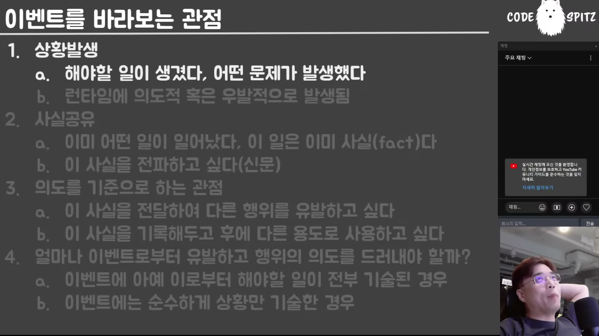

# 05. 이벤트와 명령 — 팩트인가, 의도인가

## 학습 목표

DDD·ES에서 말하는 "이벤트"가 무엇인지 세 관점으로 구별한다. 과거형으로 쓰는 이유가 규약이 아니라 **확정된 사실**이라는 요구임을 알고, 명령과 이벤트가 스펙트럼이라는 것을 설명할 수 있다.

## 선수 지식

- 03장: 애그리게이트를 작게 나누면 도메인 이벤트가 늘어난다는 결론
- 옵저버 패턴을 들어본 정도 (08장에서 본격적으로 구별한다)

## 핵심 원리 (WHY) — 여기서 말하는 이벤트는 좁은 뜻이다

> 여기서 말하는 이벤트는 **세상의 모든 이벤트가 아니고요, DDD·ES에서 말하는 이벤트**예요.

그리고 강의자는 이벤트를 나누는 것보다 **어떤 관점으로 나눌지**가 중요하다고 못박는다. 관점이 셋이다.

| 관점 | 무엇으로 보는가 |
|---|---|
| ① 상황 발생 | 런타임에 의도적/우발적으로 벌어진 일 → **명령**에 가깝다 |
| ② 사실 공유 | 이미 확정된 과거 → **이벤트**(팩트) |
| ③ 의도 | 왜 발급했나 — 남이 행동하기를 / 기록해 두려고 |

### ① 상황 발생 — 우발과 의도의 차이가 사라진다

> "야 나 배고파" 이런 거죠. … 얘는 특징이 뭐냐면 **런타임에 의도적 또는 우발적으로 발생**하지, 계획적으로 발생하지 않는다는 거예요.

그리고 수신자 입장에서는 그 구별이 무의미해진다.

> 갑자기 떡볶이가 먹고 싶은 것과 "떡볶이를 먹어야겠어" 사이에 **큰 차이가 없어요.** 떡볶이집 아저씨 입장에서는 **갑자기 얘가 나한테 떡볶이를 주문했다**로 보이지, 내가 3시 30분에 계획해서 주문한 건지 갑자기 배가 고픈 건지 **큰 차이가 없다는 거야.**

## 필수 지식 (HOW) — ② 팩트: 과거형은 규약이 아니라 요구다

이 대목이 실무에서 가장 자주 어겨진다.

> 사실 공유는 상황이 **이미 발생했다**는 거야. 과거형이야. 과거형은 **truth 혹은 fact**라고 불러요. **이건 도메인 용어입니다.** DDD·ES에서 이걸 팩트라고 부릅니다. 팩트는 **이미 확정된 사실**이에요.

그래서 발급 시점에 조건이 붙는다.

> 이벤트를 발급할 때 과거형으로 발급하면 **그 일이 확정되어 있어야** 돼. 예를 들면 **데이터베이스 트랜잭션이 다 끝나 있어야** 돼. 세이브가 완료돼 있어야 돼. 네트워크 호출이 다 끝나서 완료 결과를 받았어야 돼. **그 상태에서 이벤트를 발급해야 된다**는 거지.

그리고 현실 진단이 붙는다.

> 놀랍게도 **MSA 구현체를 가서 보면 확정된 사실이 아닌 이벤트를 발급하는 경우도 꽤 많습니다.** 사실을 이벤트로 발급할 때는 **반드시 확정시킨 다음에** 가야 돼요.

비유가 이 요구를 잘 설명한다 — 이탈리아에 갔다 왔다고 이벤트를 발급했는데 실제로 안 갔다 왔으면, 그건 사기이고 수신자는 그 거짓 위에서 자기 일을 한다.

## 필수 지식 (HOW) — ③ 의도: 얼마나 드러낼 것인가

발급 이유는 둘 중 하나다.

> 이 이벤트를 전달해서 **뭔가 딴 놈이 어떤 행동을 하기를 바라거나**, 그냥 **이 이벤트를 기록해 두려고** 그러는 거죠. 소셜에 왜 사진을 올리냐 — **3년 후에 추억을 되새기려고**, 혹은 **"내가 이렇게 잘 살았어" 알리려고.** 둘 중 하나잖아.

그러면 질문이 생긴다 — **이벤트에 의도를 얼마나 담아야 하나.**

## 필수 지식 (HOW) — 명령과 이벤트는 스펙트럼이다

책은 명령과 이벤트를 깔끔하게 나누지만, 강의자는 실무가 그렇지 않다고 말한다.

> 책에 나와 있는 것처럼 이렇게 깔끔하면 얼마나 좋아. **제가 경험한 도메인에서 명령과 이벤트가 이렇게 예쁘게 분리되는 경우는 없었어요.** 그게 바로 실무적으로 구현이 어려운 점이에요.

양 극단을 보면 스펙트럼이 보인다.

**가장 강한 명령 — 메서드를 내장한다**

> 내가 상대방의 행위를 강제하고 싶다, 통제하고 싶다 — 그러면 극단적으로는 **커맨드 객체 안에 invocation을 넣어 버리면 돼요.** 이게 가장 강력한 명령이죠. "너 이거대로 해." **지시서**라고 부르는 것들이죠, 인사명령 37호 뭐 이런 거. … **가장 강력하게 가면 그냥 전략 패턴인 거지.**

**가장 방만한 이벤트 — 로그만 남기고 무시**

> 팩트만 기술하고 아무 제한도 없어. 그럼 극단적으로 수신자 쪽에서 "아 이거 로그에 남기고 무시." **가장 방만한 이벤트는 로그일지도 몰라.**

그리고 방만한 쪽의 대가가 명확하다.

> 문제는 뭐냐면 **발급하는 쪽에서 이벤트를 200개 날렸는데 수신 쪽에서 뭘 하는지 전혀 파악이 안 되고 통제도 안 된다는 거야.** 그래서 **이벤트 발급의 여파가 뭔지 전혀 예상되지 않는다는 거예요.**

정리하면 이렇게 갈린다.

| | 명령 쪽으로 | 이벤트 쪽으로 |
|---|---|---|
| 수신자 재량 | 적다 | 많다 ("하려면 해") |
| 사실 여부 | **아직 안 일어난 일일 수 있다** | **반드시 팩트** |
| 트랜잭션 | MSA 트랜잭션에 쓰는 경우가 있다 | 느슨하다(결과적 일관성) |
| 위험 | 결합이 강해진다 | **여파를 예측할 수 없다** |

> 사실이 아닌 메시지를 전달하는 경우에는 **100% 명령**이야. **이벤트는 사실만 전달할 수 있거든.**

## 필수 지식 (HOW) — 이벤트는 연쇄한다

책의 예시는 송신자와 수신자를 분리해 보여주지만, 실제는 다르다.

> 실제로 도메인 이벤트도, 이벤트가 발생한 걸 수신하면 **그놈이 또 이벤트를 발생시키고**, 그 이벤트를 수신한 놈이 또 발생시키고 — 막 이래요. **계속 연쇄된단 말이야.** 심지어 **그 이벤트가 연쇄된 걸 추적하기도 해. 그게 바로 사가 패턴이야.**

그래서 명령을 "객체 내부 상태를 바꾸는 것"으로만 이해하면 부족하다.

> 그 객체 내부 상태는 변경하지 않는데 **또 다른 이벤트를 발생시키는 트리거가 되기만 해도** 그 애그리게이트 루트나 스토어의 생태계에 많은 상태 변화를 일으키게 돼요. … **중개 명령들이 되게 많단 얘기지.**

## 이 지식이 판단에 쓰이는 자리

- **이벤트를 발급할 때**: 과거형으로 쓸 거면 **트랜잭션·네트워크 호출이 끝난 뒤**에 발급한다. 확정 전 발급은 수신자에게 거짓을 전파한다.
- **이벤트에 의도를 담을지 정할 때**: 강제할수록 결합이 늘고, 느슨할수록 여파를 예측할 수 없다. 중간 어디에 둘지를 **의식적으로** 정한다.
- **"이벤트인가 명령인가" 논쟁이 붙었을 때**: 스펙트럼임을 인정하고, 사실 여부(팩트인가)와 수신자 재량으로 판단한다.
- **이벤트 흐름을 설계할 때**: 연쇄를 전제한다. 한 번 수신하고 끝나는 그림은 실제와 다르다.

### ⚠️ 암기 필수

- [ ] **이벤트를 보는 세 관점: 상황 발생 / 사실 공유(팩트) / 의도.** 수신자 입장에서는 우발과 의도의 구별이 무의미하다.
- [ ] **과거형 이벤트 = 확정된 사실.** DB 트랜잭션·네트워크 호출이 **끝난 뒤에** 발급해야 하고, 실무에서 이 규칙이 자주 깨진다.
- [ ] **사실이 아닌 메시지는 100% 명령이다** — 이벤트는 사실만 전달할 수 있다.
- [ ] **명령과 이벤트는 스펙트럼이다.** 극단적 명령 = 커맨드에 invocation 내장(= 전략 패턴), 극단적 이벤트 = 로그만 남기고 무시.
- [ ] **방만한 이벤트의 대가: 200개를 날렸는데 수신 쪽이 뭘 하는지 파악·통제되지 않아 여파를 예측할 수 없다.**
- [ ] **이벤트는 연쇄한다.** 수신자가 또 발급하고, 그 연쇄를 추적하는 것이 **사가 패턴**이다.
