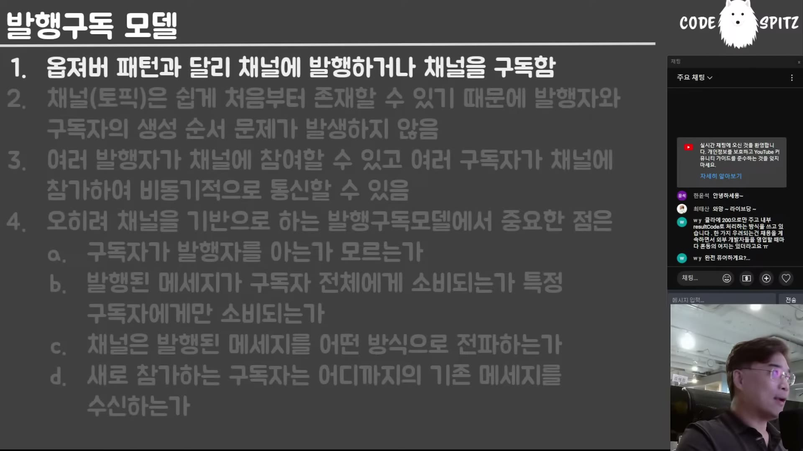

# 08. 발행-구독과 채널 — 주인공은 발행자도 구독자도 아니다

## 학습 목표

발행-구독 모델이 옵저버 패턴과 **무엇이 다른지** 정확히 안다. 그 차이가 왜 엔터프라이즈에서 결정적인지, 그리고 브로커 설정 항목들이 결국 무엇의 목록인지 설명할 수 있다.

## 선수 지식

- 05장: 이벤트가 연쇄한다는 성질
- 옵저버 패턴(구독자가 대상에 등록하는 구조)

## 핵심 원리 (WHY) — 옵저버와의 차이는 순서 문제다

> 발행-구독 모델은 **현대 아키텍처에서 가장 중요한 녀석**이에요. 꼭 알아두셔야 돼요. 발행-구독 모델을 잘 모르시는 분들의 일반적인 특징은 **"그거 옵저버 아니야?"**라고 얘기한다는 거야.



차이가 하나다. 그리고 그 하나가 많은 것을 바꾼다.

> 옵저버 패턴의 가장 큰 특징은 **옵저버가 subject를 알고 있어.** 여러분들이 넷플릭스를 아니까 넷플릭스에 가서 구독을 하잖아. 반대로 얘기하면 **subject가 존재하지 않으면 구독이 불가능해.**

그래서 문제가 생긴다.

> 옵저버 패턴은 **무조건 순서에 대한 문제가 생겨.** 일단 넷플릭스가 존재해야 우리가 구독할 수 있단 말이지. 근데 **엔터프라이즈에 있는 여러 시스템들은 그렇지 않아. subject가 나중에 태어나.** 여러 자원이 필요하기 때문에. 근데 나는 사전에 벌써 구독하고 싶기도 하고 — **순서 문제가 더럽게 발생해.**

발행-구독은 그 문제를 구조로 없앤다.

> 옵저버 패턴과 달리 발행-구독 모델에서 **핵심은 발행과 구독이 아니라 채널이야.** … 채널은 쉽게 처음부터 존재할 수 있어요. 왜냐면 얘가 무슨 발행을 하거나 하지도 않고 **그냥 객체 구조물**이기 때문에. … **채널부터 만들고 시작하면 돼. 채널은 아무런 의존성도 없으니까.**

```
observer    subscriber --> subject
            구독하려면 subject 가 먼저 태어나 있어야 한다

pub/sub     publisher --> channel <-- subscriber
            channel 은 아무것도 의존하지 않아 먼저 설 수 있다
```

**화살표 방향이 전부다** — 옵저버는 구독자가 대상을 가리키고, 발행-구독은 양쪽이 채널을 가리킨다. 가리켜지는 쪽이 아무 의존도 갖지 않기 때문에 먼저 설 수 있고, 그래서 생성 순서가 문제가 되지 않는다.

| | 옵저버 | 발행-구독 |
|---|---|---|
| 구독자가 아는 것 | **대상(subject) 자체** | **채널** |
| 대상이 없으면 | 구독 불가 | 무관 — 채널만 있으면 된다 |
| 생성 순서 | **문제가 된다** | 문제가 되지 않는다 |
| 중심 | 대상 | **채널** |

카프카의 토픽이 바로 그 채널이다.

> 카프카에서 이걸 **토픽**이라고 불러요. 근데 원래 전통적인 발행-구독 패턴에서는 그걸 **채널**이라고 부릅니다. 그리고 여러분들이 코틀린 코루틴에서 배웠던 뭐든 **여러 언어에서 채널이 나오면 다 이 얘기예요.**

## 필수 지식 (HOW) — 채널 매직

채널이 중심이 되면 채널에 권한이 몰린다. 강의자는 이를 "채널 매직"이라 부른다.

> 발행자가 채널에 발행을 했다고 **그 즉시 구독자한테 가는 것도 아니야. 채널 마음이야.** 채널이 전달하고 싶을 때 전달할 수 있어. **이런 비동기 버퍼링, 혹은 모아서 보내기, 필터링 등등 채널에 수많은 권한이 주어져요.**

구체적으로 채널이 결정하는 것들이다.

| 채널의 결정 | 예 |
|---|---|
| **필터링** | 조건에 맞지 않는 메시지는 구독자에게 가지 않는다 |
| **버퍼링·배치** | 하루에 한 개씩 발행된 것을 5개 모아 5일에 한 번 전달 |
| **발행자 노출 여부** | 구독자가 발행자를 알게 할지 감출지 |
| **팬아웃 정책** | 모든 구독자에게 / 특정 한 명에게 / 선착순 한 명에게 |
| **전파 방식** | 릴레이(순차) / 동시 |
| **재전송** | 보낸 것을 또 보낼 수 있다 |
| **핫/콜드** | 구독 시점 이후만 받나, 태초부터 받나, 5분 전부터 받나 |

발행자 노출 여부의 비유가 특히 좋다.

> 여러분들은 네이버 메인에서 뉴스를 소비하지만 **누가 발행했는지 써 있기 때문에** "이 신문사는 쓰레기네" 이렇게 생각한단 말이지. 근데 만약에 **네이버가 신문사를 싹 감추고서** 뉴스를 발행하면 여러분들은 발행자를 모르게 돼. **이것도 다 채널 매직이야.**

그리고 이 목록의 실용적 값이 마지막에 있다.

> **이것만 알면 다양한 발행-구독 모델용 소프트웨어를 만났을 때 두려워하지 않고 결정하시면 됩니다.** 어떤 게 나한테 유리한지, 내 서비스에 뭐가 어울리는 건지. **카프카도 이런 기능이 다 있어.** 카프카뿐만 아니야 — 거의 대부분의 이벤트 브로커, 메시지 중계 시스템이 그래.

즉 브로커의 설정 화면은 **채널 정책의 목록**이다. 이 구조를 알면 새 브로커의 설정이 낯설지 않다.

## 필수 지식 (HOW) — 왜 REST 아웃바운드를 이벤트로 바꾸나

책은 REST 인바운드·아웃바운드 어댑터를 먼저 만들고 나서 발행-구독으로 바꾼다. 그 동기를 강의자가 정리한다.

REST 아웃바운드를 쓰는 이득은 이렇다.

> 직접 애그리게이트 서비스를 아는 것보다 낫다는 거야. 오더 서비스가 카트 서비스를 직접 알아도 되잖아 — 스프링 빈이니까. 근데 **REST 프로토콜을 개입시키면 직접 참조를 피할 수 있기 때문에** 장점도 있고. 직접 참조를 피한다는 얘기는 **완전히 다른 네트워크 너머에 있을 수도 있고**, JSON 인터페이스니까 **내부에 변화가 있어도 충격을 한 번 더 흡수**할 수 있죠.

다만 대가도 정확히 짚는다.

> 문제는 **내가 스프링 빈보다 못할 수 있다는 거야.** 스프링 빈은 인터페이스 수준으로 내가 카트 서비스를 알고 있었는데.

그리고 그 위에서 발행-구독으로 가면 **아웃바운드가 대상을 몰라도 되는** 단계에 도달한다 — 채널에 던지면 되기 때문이다. 순서 문제도, 대상 존재 여부도 사라진다. 이것이 03장의 "애그리게이트를 작게 나누면 통신이 폭증한다"에 대한 답이 된다.

## 이 지식이 판단에 쓰이는 자리

- **"옵저버로 하면 되지"라는 제안을 받았을 때**: 대상이 나중에 태어나는지 묻는다. 그렇다면 옵저버는 순서 문제를 만든다.
- **브로커를 고를 때**: 제품 이름을 비교하기 전에 **채널 정책 목록**으로 요구사항을 적는다. 대부분의 브로커가 같은 항목을 다르게 부른다.
- **구독자가 발행자를 알아야 하는지 정할 때**: 그것도 채널의 결정이다. 기본값으로 흘려보내지 않는다.
- **서비스 간 호출을 이벤트로 바꿀 때**: 얻는 것은 직접 참조 제거와 순서 자유, 잃는 것은 컴파일 타임 계약이다(07장의 컨텍스트 에러와 이어진다).

### ⚠️ 암기 필수

- [ ] **옵저버는 구독자가 대상을 알고, 발행-구독은 채널을 안다.** 그래서 옵저버는 **대상이 먼저 존재해야 하고 순서 문제가 생긴다** — 엔터프라이즈에서는 대상이 나중에 태어난다.
- [ ] **발행-구독의 주인공은 채널이다.** 채널은 의존성이 없어 먼저 만들기 쉽고, 그래서 생성 순서 문제가 사라진다.
- [ ] **채널 매직 = 채널이 가진 정책들**: 필터링 / 버퍼링·배치 / 발행자 노출 여부 / 팬아웃(전체·특정·선착순) / 전파 방식 / 재전송 / 핫·콜드.
- [ ] **브로커 설정 화면은 채널 정책의 목록이다** — 이 구조를 알면 새 브로커도 낯설지 않다. 카프카의 **토픽 = 전통적 발행-구독의 채널.**
