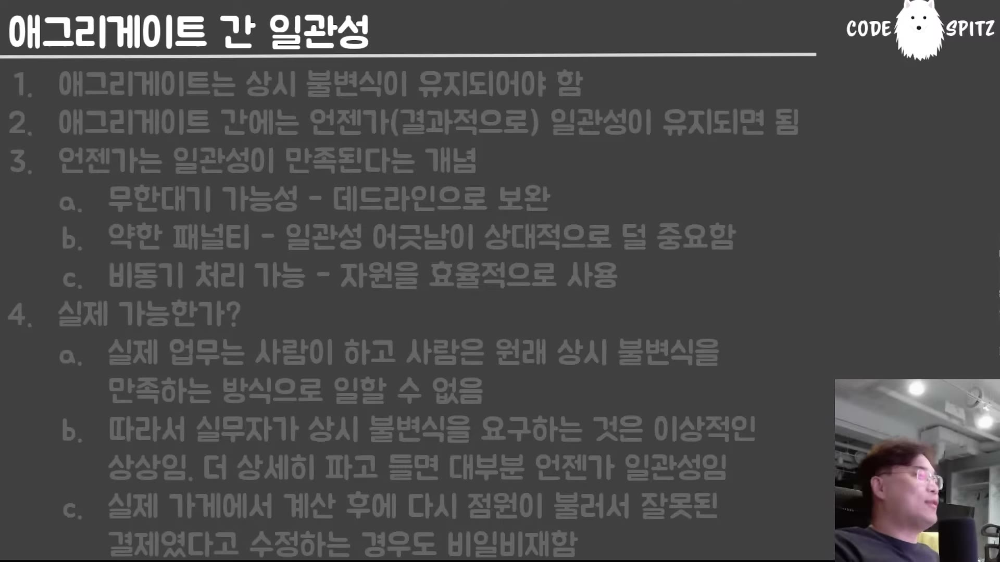
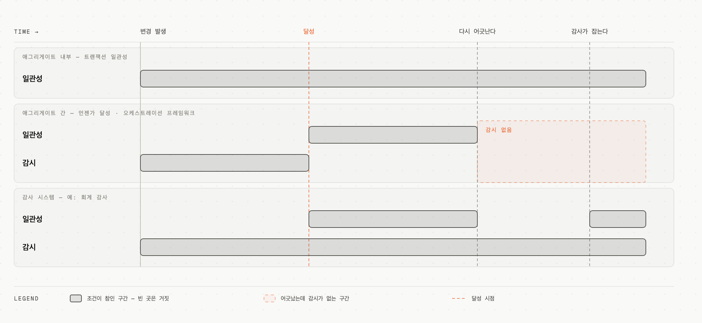

# 09. 일관성의 종류 — "언젠가는 달성된다"

## 학습 목표

트랜잭션 일관성과 결과적 일관성의 경계를 어디에 긋는지 안다. `eventual consistency`를 "결과적 일관성"보다 정확하게 이해하고, 도메인에서 진짜 트랜잭션이 필요한 구간을 찾아 **줄이는** 작업을 할 수 있다.

## 선수 지식

- 03장: 애그리게이트 = 트랜잭션 일관성의 단위
- 이 문서가 시리즈의 결론이다. 시간이 없으면 여기서 시작해도 된다

## 핵심 원리 (WHY) — 경계는 애그리게이트다

규칙 자체는 한 줄로 끝난다.

> **애그리게이트 내부는 상시 불변식이 유지돼야 됩니다.** 근데 **애그리게이트 간에는 언젠가 일관성이 달성되면 돼.**

그리고 강의자가 시리즈 전체에서 가장 강하게 지목한 지점이 이것이다.

> 여러분들 **DDD의 핵심적인 개념도 이거고**, 책 6장까지의 논조에서 봤을 때 **이 부분만 잘 이해하면 나머지 기술적인 내용은 자동 따라와요. 여기만 잘 이해하면 돼요.**

중요한 단서: 이건 MSA만의 문제가 아니다.

> 즉 **MSA 뭐 이런 문제가 아니야. 스프링 하나 내에서도** 트랜잭션 범위를 끝없이 확장하지 않고 **애그리게이트까지만** 하겠다 이거지.

## 필수 지식 (HOW) — 번역이 감을 죽인다

> 대부분 `eventual consistency`를 **"결과적 일관성"**이라고 번역하는데, 이게 감이 잘 안 와. **`eventual`은 "언젠가"라는 뜻이에요.** 언젠가는 일관성이 달성되겠지, 뭐 이런 **낙관적인 생각**인 거야. 지금은 아닐지라도, 잠시 후에도 아닐지라도 **언젠가는 일관성이 보장돼** — 이런 뜻이야.
>
> 일반 개발자들이 번역하려면 **"언젠간 일관성 보장"** 이렇게 번역해야 된다고 보고 있어.

그리고 "유지"가 아니라 **"달성"**이라는 단어를 쓰는 이유가 따로 있다. 이것이 이 문서에서 가장 실무적인 대목이다.

> 언젠가 일관성이 — 사실 **유지도 아니야. 달성이 되면 돼.** 왜 달성이라는 표현을 쓰냐면, `eventual consistency` 시스템들은 **유지하려고 그러지 않아요. 한번 달성하면 그냥 잊어버리려고 그래.**
>
> **어느 순간 일관성이 확립됐다는 타이밍을 딱 재면 그다음부터 잊어버려.** 더 이상 관리하지 않아. 이 책의 모든 코드도 다 그렇게 돼 있고 **거의 모든 오케스트레이션 프레임워크도 다 그렇게 돼 있어요.**
>
> 달성되었다가 **또 안 될 수도 있잖아.** 실제로는 "지금 됐다"고 보고했는데 "아 미안, 그거 아니었어" 이렇게 할 수도 있잖아. 근데 대부분의 시스템은 **한 번 달성되는 스냅샷이 발견되는 순간 감시를 풀어요.**

**감시 구간이 끝난 뒤에 어긋나면 그 시스템에는 그것을 알 방법이 없다** — 달성은 상태가 아니라 시점이고, 대부분의 프레임워크는 그 시점에서 손을 뗀다. 감사가 필요한 도메인에 일반 오케스트레이션 프레임워크를 쓰면 이 빈 구간을 그대로 갖게 된다.

## 필수 지식 (HOW) — 진짜 트랜잭션은 드물다

이 시리즈에서 가장 자주 인용할 대목이다.

> 여러분들이 **철떡같이 믿고 있었던 "트랜잭션 일관성이 필요하다"는 그 부분이, 트랜잭션 일관성이 필요 없는 경우가 대부분**이라는 거야.

**보험 요율 예시** — 도메인이 애초에 트랜잭셔널하지 않다.

> 아침에 출발할 때 오늘 고객과 상담할 **보험 요율을 프린트해서 나가**서 영업하고 다녀. 그 사이에 본사에서 요율도 달라지고 상품도 달라질 수 있어. 저녁에 사무실에 들러서 "제가 오늘 계약을 이렇게 성사시켰습니다" 했더니 요율도 달라져 있고 상품도 없어져 있네. **어떻게 할 것 같아요?**
>
> 사람들이 그 계약을 파괴할 것 같아요? 그 회사가 없었던 일로 할 것 같아요? **아니야.** "그래, 그럼 내가 그 요율로 그냥 해 줄게. 그 상품 파기했는데 완전히 없어진 건 아니야. **넌 그걸로 해.** 오늘부터 딴 사람은 안 되지만."

**회계 시스템 예시** — 가장 엄격해 보이는 도메인조차 그렇다.

> 기업은 무조건 회계 감사를 받거든요. **저는 여지껏 회계 감사 받는 법인 중에 수정 지시를 안 받는 법인을 한 번도 본 적 없어요.** … 그렇다는 얘기가 뭐야? **1년 내내 잘못된 회계를 유지하고 있다가 수정 지시를 받아서 eventual consistency가 됐다는 얘기잖아.**
>
> 그 회계장부가 기업 시스템에서 가장 중요하고 우리나라 세법의 근간이 되는데, **그조차도 트랜잭션이 아니라는 거야.**

심지어 회계 기준 자체가 바뀌어 과거 분류가 뒤집힌다 — 전환사채가 자본으로 잡히다가 부채로 재분류되면서 부채비율이 급등한 사례가 실제로 있었다.

> 이렇게 **되게 중요한 사회 시스템들조차도 알고 보면 다 eventual consistency로 돼 있단 말이지.**

## 필수 지식 (HOW) — 그래서 무엇을 해야 하나

### ① 대화를 먼저 한다

> 숙련된 개발팀과 개발자는 **제일 먼저 하는 게 도메인 분석해서 "이게 정말로 진짜로 트랜잭션 일관성이 필요한 부분인가"를 줄여가**. 많이 줄여. 그러면 분산 환경도 쓸 수 있고 다 쓸 수 있습니다.
>
> 제가 컨설팅을 하러 가보면 **대부분 개발자 스스로가 자승자박을 하고 있어.** 발주한 사람하고 얘기해 보면 그렇게 생각하지도 않아. **실제로 그렇게 일하지도 않고.**

그리고 대화의 방법까지 짚는다.

> 많은 개발 프로젝트가 실패했던 이유가 그거예요. **걔네들한테 얘기하면 걔네들이 자기네들의 상상 속의 이상향을 말한다는 거야. 지들도 그렇게 일을 안 하면서.** 그래서 **더 심층적으로 대화하세요.** "너 정말 그렇게 하냐? 그럼 이거는 왜 이때 이렇게 돼?" **계속 파고들어 보면 걔들도 그렇게 일 안 해.**

### ② 트랜잭션 범위를 줄이는 유일한 수단

> 트랜잭션 수준을 줄이려면 **불변식 그룹을 줄여야 돼. 불변식 그룹의 크기를 줄이거나 개수를 줄여야지** 실질적으로 트랜잭션 범위를 줄일 수 있어요. **그 외의 방법은 없다.**

불변식 20개를 한 애그리게이트에 묶으면 그만큼 큰 트랜잭션이 생기고, 불변식 하나면 트랜잭션이 없다. 03장의 "작게 나누라"가 여기서 이유를 얻는다.

### ③ 얻는 것: 자원을 싸게 쓴다

> 언젠가 일관성이 완성되면 되잖아. 그러면 **CPU가 놀 때 처리해도 되는 거고, 메모리 남을 때 처리해도 되는 거고.** 자원을 굉장히 효율적으로 이용할 수 있다는 거죠. AWS에서 인스턴스를 **되게 낮은 사양으로 맞춰도 돼.**

## 이 지식이 판단에 쓰이는 자리

- **요구사항을 받을 때**: "트랜잭션이 필요하다"를 그대로 받지 않는다. **실제로 그렇게 일하는지** 파고든다. 상상 속 이상향을 말하는 경우가 대부분이다.
- **트랜잭션 범위를 줄여야 할 때**: 코드 기법을 찾지 말고 **불변식 그룹의 크기·개수**를 줄인다. 그 외의 방법이 없다.
- **오케스트레이션 프레임워크를 도입할 때**: 그것이 **한 번 달성되면 감시를 푼다**는 것을 안다. 지속 감사가 필요하면 별도로 만든다.
- **인프라 비용을 줄일 때**: 결과적 일관성을 허용하는 구간은 낮은 사양·비동기로 내릴 수 있다.

### ⚠️ 암기 필수

- [ ] **애그리게이트 내부 = 상시 불변식 / 애그리게이트 간 = 언젠가 달성.** 이것만 이해하면 나머지 기술 내용은 따라온다. **MSA만의 문제가 아니고 한 프로세스 안에서도 같다.**
- [ ] **`eventual consistency` = "언젠가는 일관성이 달성된다".** "결과적 일관성"보다 이 번역이 감을 준다.
- [ ] **"유지"가 아니라 "달성"이다** — 대부분의 시스템은 **한 번 달성된 스냅샷을 발견하면 감시를 푼다.** 그 후 깨지면 모른다. 감사 시스템은 다르다.
- [ ] **트랜잭션 일관성이 필요하다고 믿은 구간이 대부분 아니다** — 사람이 하는 일이기 때문이다. **회계장부조차** 감사 수정 지시로 맞춰지는 eventual consistency다.
- [ ] **트랜잭션 범위를 줄이는 유일한 방법은 불변식 그룹의 크기·개수를 줄이는 것.**
- [ ] **기획·실무자는 상상 속 이상향을 말한다.** "정말 그렇게 하냐"고 파고들어야 진짜 요구가 나온다 — 많은 프로젝트가 이걸 안 해서 실패했다.
