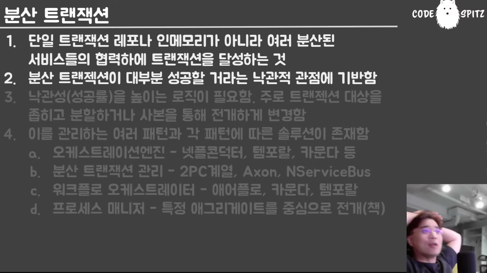

# 10. 사가와 낙관성 — 낙관성은 성격이 아니라 조정한 결과다

## 학습 목표

분산 트랜잭션이 성립하는 전제를 안다. **낙관성을 높이는 방법**이 설계 행위임을 이해하고, 어떤 기능은 애초에 분산 트랜잭션으로 만들면 안 되는지 판단할 수 있다. 데드라인이 무엇을 대가로 지불하는지 안다.

## 선수 지식

- 09장: 애그리게이트 간은 언젠가 달성된다는 규칙
- 05장: 이벤트 연쇄를 추적하는 것이 사가라는 언급

## 핵심 원리 (WHY) — 분산 트랜잭션 = 애그리게이트 간 트랜잭션

용어를 먼저 정리한다. "분산"이 네트워크를 뜻하지 않는다.

> 분산 트랜잭션은 DDD 입장에서 **애그리게이트 간 트랜잭션**이 그렇죠. **한 서버에 있든 외부 서버에 있든, 하나의 JVM 안에 있는 인메모리 객체들이든 — 이게 중요한 게 아니야.** 애그리게이트 내에서는 트랜잭션을 사용하는데 **애그리게이트 간에는 분산 트랜잭션을 쓴다**는 거야. 그게 핵심인 거지.

구조는 이렇다.

> 핵심이 뭐냐면, 분산 트랜잭션에 참가하고 있는 **각 태스크들은 자기 안에서 트랜잭션이 된다**는 거예요. 지 안에서는 트랜잭션이 돼. 근데 **이 트랜잭션이 되는 애들끼리 묶어서 트랜잭션을 하려고** 그러는 거야.

## 필수 지식 (HOW) — 낙관성이 전제다

사가는 "대부분 성공한다"를 전제로만 성립한다.

> 이 분산 트랜잭션이 **성공하지 못할 것 같으면 아예 이거 하면 안 돼요.** 실패 확률이 높아서 맨날 보상해야 되고 복구해야 되고 — **뭐 이런 것들은 아예 만들 생각을 하면 안 돼.**

### 만들면 안 되는 대표 예: 회원 가입

> 회원 가입을 분산으로 만들면 어떻게 되느냐 — 회원 아이디를 다른 데서 발급받아서 그 아이디 기반으로 정보를 넣는다든지. **회원 중복 처리만 해도 이게 실패할 가능성이 높잖아요.** 가입하는 동안에 "그 아이디 없다"고 시작했는데 나중에 진짜로 DB 쓰려고 했더니 **그 사이에 딴 놈이 가입했어.** 이런 일이 빈번하잖아. **맨날 실패하는 트랜잭션이라는 거야. 맨날 보상 절차가 들어가.** 그런 애들은 원래부터 구현하면 안 돼요.

### 그리고 여기가 핵심이다

> 대부분 트랜잭션이 성공할 거야 — 라는 **낙관적 관점을 갖고 있어야지 이걸 쓰는 거야.** 근데 왜 낙관적이냐? **내가 낙천적인 성격이라서? 그거 아니고 — 내가 이게 낙관성이 높도록 조정했기 때문이야. 이게 핵심이야.**

즉 낙관성은 주어지는 조건이 아니라 **만드는 것**이다. 방법은 하나로 수렴한다.

> 어떻게 하면 낙관성이 높아질까? 성공률이 높아질까? **분산 트랜잭션 대상을 좁히면 돼요.**

구체적 수단들이다.

| 수단 | 예 |
|---|---|
| 충돌 감지 범위를 좁힌다 | 전체가 아니라 **특정 ID에 소속된 것만** 충돌 감지 |
| 트랜잭션을 일으킬 주체를 줄인다 | 20명이 일으킬 수 있던 것을 **한 명만** 가능하게 메서드를 분리 |
| **사전 절차로 미리 확정한다** | **사전 티켓 발급** — 미리 자리를 잡아두면 나중에 충돌하지 않는다 |
| **사본을 통해 전개한다** | 원본을 붙잡지 않고 사본에서 진행한 뒤 마지막에 반영 — 03장의 아카이빙과 같은 발상이다 |

**계좌 이체가 왜 잘 되는지**가 이 원리의 예시다.

> 계좌 이체의 성공률은 높을까요 낮을까요? **높아.** 나랑 걔랑 **둘 사이의 트랜잭션**이기 때문에. 여기에 더 다수가 와서 충돌 범위가 넓으면 훨씬 더 충돌 가능성이 높아져서 힘들어져. 근데 너랑 나 사이에 계좌 이체는 **충돌 범위가 훨씬 더 좁아. 이 사이에 딴 놈만 안 끼어들면 돼.**
>
> 그래서 **그 태스크 자체를 충돌이 안 나는 좁은 범위로 정의해야지만 분산 트랜잭션을 만들 수가 있어.** 안 그러면 대부분 실패하는 분산 트랜잭션이 돼버려.

그리고 강의자는 이것이 책의 범위 밖이라고 짚는다 — 책은 기법을 가르치고, **그 기법을 쓸 수 있게 만드는 설계**가 이 이야기다.

> **이런 게 되지 않으면 책에 있는 기법을 쓸 수 없어요. 일단 이걸 먼저 해야 돼.**

## 필수 지식 (HOW) — 데드라인이 지불하는 대가

사가의 실무 문제는 참가자가 대답하지 않는 것이다.

> 참가자들이 응답이 느리거나 뻗어 있는 경우가 있죠. 그러면 **이게 실패한 건지 뭔지 모르고 대기를 해야 돼.** 그러다 보면 **끝없이 대기해야 될 가능성**이 있어요. 이거를 **데드라인** 같은 걸로 보완하는 거죠.

그리고 메시징 시스템의 성질이 이 문제를 키운다.

> 메시지 시스템의 장점이자 단점인데 — **메시지를 내가 띄웠어. 상대방이 나한테 메시지를 안 주네. 이러면 계속 기다려야 돼.**
>
> **왜 MSA가 대부분 API로 돼 있냐면, API는 콜하고 응답이 안 오는 걸 감지하기가 쉽잖아요.** 근데 메시지는 — 내가 날리고 **내 스스로 타임아웃을 건 거지. 메시지 시스템이 타임아웃을 나한테 알려 주는 것도 아니라고. 나 스스로가 그냥 감지한 거야.**
>
> 그렇다는 얘기는 **저놈이 진짜 안 준 건지, 잠깐 늦은 건지, 네트워크가 늦은 건지** — 어쨌든 "너 타임아웃이야" 하고 **내가 자율적으로 판단한 거지. 걔 사정을 본 것도 아니라는 거지.**

이것이 데드라인의 대가다.

> 데드라인 시스템의 나쁜 점이 — **끊어버려.** "황기 오랜만에 우리 점심 먹을까" 하고 메시지를 보냈어요. 황기가 20분 있다가 봤어. 근데 나는 **내 마음속에 10분 동안 답이 안 오면 거부한 걸로 봐야겠다** 하고 내 마음대로 정하고 **이미 거부가 끝난 거야.**

그래서 적용 조건이 붙는다.

> **약한 페널티가 암묵적으로 적용돼 있습니다.** 일관성이 어긋나는 게 상대적으로 덜 중요하다는 거야. … **페널티가 약한 시스템에만 써야지, 강한 시스템에 쓰면 무리가 있습니다.**

(서킷 브레이커로 간을 보면 나아지지만, 무한 대기를 스스로 끊는 것이 데드라인의 본질이라는 점은 그대로다.)

## 필수 지식 (HOW) — 페널티 강도로 판단한다

| | 약한 페널티 | 강한 페널티 |
|---|---|---|
| 예 | **재고 수치** | **결제** |
| 왜 | 창고 실물과 실시간 일치가 애초에 불가능. "대충 맞으면 됨" | 결제 확정 없이 배송하면 손실이 직접 발생 |
| eventual consistency | 쓴다 | 쓰기 어렵다 |

재고의 실상이 설명을 잘 보여 준다.

> 재고를 실시간 연동하기 너무 빡세기 때문에 그냥 대충 반영해요. 창고에 100개 있는데 **스마트스토어에 50개로 잡아도 돼. 왜? 50개는 분명히 있을 거잖아.** 손님들이 50개를 다 팔아치우기 전에 다시 업데이트만 하면 된단 말이죠.

### 그리고 반전이 온다

> 강한 페널티에 eventual consistency를 적용하기가 어렵거든요. 그래서 쇼핑몰 업체는 어떻게 했을까요? **트랜잭셔널하게 바꿨을까요? 아니야.**
>
> **쿠팡을 비롯해서 거의 전 세계 업체들은** — "그럼 결제도 약한 페널티로 보겠다. **일단 물건 보낼게. 나중에 결제하든 돈 있으면 내가 받아간다.**" 그냥 이렇게 돼 있다는 거야. 네이버페이 **선결제**라는 거 써 봐. 쿠팡 같은 데서 결제해 봐 — **결제 성공 알림이 오기 전에 이미 구매 완료로 나온다고.**
>
> **"나 돈 많으니까 이런 거 그냥 비용으로 떨구면 돼"** — 얘를 약한 페널티로 보겠다 이거야.

이 관찰이 이 문서의 결론으로 이어진다.

> **큰 기업들은 개발자들과 달리, 강한 페널티 기반의 트랜잭션이라고 생각했던 것들을 비용으로 떨구고 다 약한 페널티로 바꿔버리고 MSA로 바꿔 버려요. 그게 더 낫다고 보는 거야.**
>
> **자본의 힘으로 안 되는 거 없습니다.**

무인 판매 비유가 이 태도를 압축한다 — 냉장고에 NFC·자동결제를 붙이지 않고 **가격표와 계좌번호만** 붙인다. 누군가 훔쳐 가는 것은 비용으로 떨군다.

> 우리 개발자들만 **완벽하게 떨어진 세상으로 보고 있다는 거야.** 실제 도메인은 대부분 다 느슨하고, **강한 결합조차도 느슨하게 보고 비용을 떨궈 버리는 성질**이 많습니다.

## 필수 지식 (HOW) — 구현 수단

책은 프로세스 매니저 형태로 보여주지만, 실무에서는 전용 엔진을 쓴다. 슬라이드가 네 부류로 갈라 둔다.

| 부류 | 예 |
|---|---|
| **오케스트레이션 엔진** | Netflix Conductor · Temporal · Cadence |
| **분산 트랜잭션 관리** | 2PC 계열 · Axon · NServiceBus |
| **워크플로 오케스트레이터** | Airflow · Cadence · Temporal |
| **프로세스 매니저** | 특정 애그리게이트를 중심으로 전개 — **책이 택한 방식** |

> 실무적으로는 당연히 **트랜잭션 타워**를 사용합니다. … **오케스트레이션 엔진**이라고 부르는 애들이 있거든요.

부류가 겹쳐 보이지만 결정 기준이 다르다 — **2PC 계열은 강한 일관성**을 목표로 하고(그래서 이 시리즈의 논조와 반대 방향이다), 오케스트레이션·워크플로 엔진은 **보상 절차를 사람이 정의**하게 한다.

09장의 단서를 여기 다시 붙여야 한다 — **이 엔진들도 한 번 달성되면 감시를 푼다.**

## 이 지식이 판단에 쓰이는 자리

- **사가를 도입할 때**: 먼저 **실패율**을 추정한다. 자주 실패할 것이면 만들지 않는다(회원 가입 아이디 중복 같은 것).
- **낙관성이 낮을 때**: 포기하지 말고 **범위를 좁힌다** — 충돌 감지 대상, 트랜잭션 주체, 사전 티켓 발급.
- **타임아웃을 걸 때**: 그것이 **상대 사정을 모르는 내 판단**임을 안다. 약한 페널티 구간에만 쓴다.
- **"이건 트랜잭션이어야 한다"고 느낄 때**: 페널티를 비용으로 떨굴 수 있는지 계산해 본다. 큰 기업들이 실제로 그렇게 한다.

### ⚠️ 암기 필수

- [ ] **분산 트랜잭션 = 애그리게이트 간 트랜잭션.** 네트워크 너머인지 한 프로세스 안인지는 상관없다. 각 참가자는 **자기 안에서는 트랜잭션**이 된다.
- [ ] **사가는 낙관성을 전제한다.** 자주 실패할 것(회원 가입 아이디 중복 등)은 **애초에 만들면 안 된다** — 보상·복구 비용이 본 작업을 넘는다.
- [ ] **낙관성은 성격이 아니라 조정한 결과다.** 높이는 방법 = **충돌 범위 좁히기**(대상 한정 / 주체 제한 / **사전 티켓 발급**). 계좌 이체가 잘 되는 이유는 둘 사이만 관여하기 때문이다.
- [ ] **메시지 시스템은 타임아웃을 알려주지 않는다** — 내가 스스로 판단한 것이다. 그래서 MSA가 대부분 API로 돼 있다(응답 없음을 감지하기 쉽다).
- [ ] **데드라인은 약한 페널티를 암묵적으로 가정한다.** 상대 사정을 모른 채 끊기 때문이다.
- [ ] **페널티 강도로 판단한다: 재고(약함) ↔ 결제(강함).** 그런데 **쿠팡 등은 결제마저 약한 페널티로 바꿨다** — 손실을 비용으로 떨구고 MSA를 택한다.
