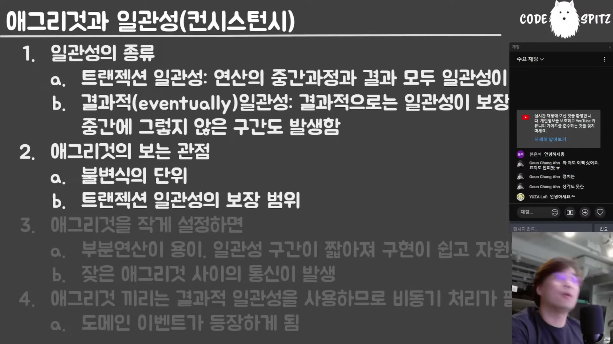

# 워크북 — 이벤트 소싱과 MSA

## 사용법

**자료를 덮고 푼다.** 읽을 때는 이해한 것 같아도 백지에서는 안 나온다는 사실을 확인하는 게 목적이다. 정답은 [93-solutions.md](93-solutions.md)에 있고, 막히면 **먼저 해당 학습 파일로 돌아간다** — 정답을 먼저 열면 회수 연습이 독해로 바뀐다.

파트 1은 [`../docs/90-must-memorize.md`](../docs/90-must-memorize.md)의 항목 **43개와 1:1 대응**한다. 주제별 6묶음(A~F)으로 나눴으니 한 번에 한 묶음씩 풀면 된다.

| 묶음 | 범위 | 문항 |
|---|---|---|
| A | 정의 — 일관성·애그리게이트·식별 | 7 |
| B | 불변 트레이드오프 | 7 |
| C | 의사결정 경계 | 8 |
| D | 구현 규칙 | 8 |
| E | 진단 신호 | 6 |
| F | 조직과 판단 | 7 |

코딩 과제(파트 3)의 풀이는 **별도 브랜치**에서 한다 (레포 [`README.md`](../../../README.md) § 규약 4).

---

## 파트 1. 회수 연습 (자료를 덮고)

> 정답: [93-solutions.md](93-solutions.md) 파트 1

### 묶음 A — 정의 · 7문항

**1-A-1.** 이 시리즈의 주제인 **두 일관성**을 쓰고, 각각을 "중간 과정"이라는 말을 써서 구별하라.

**1-A-2.** `eventual consistency`를 감이 오게 번역하면? 강의자가 "결과적 일관성"이라는 번역을 아쉬워하는 이유는?

**1-A-3.** 애그리게이트의 정의를 쓰라. "주인공"이 무엇인지 밝히고, 애그리게이트와 불변식 중 어느 것이 먼저인지 말하라.

**1-A-4.** 불변식의 뜻을 쓰라. 이름과 달리 자주 바뀌는 이유는 무엇이며, 스크럼에서는 언제 바뀌는가?

**1-A-5.** DDD 원론에서 엔티티와 값 객체를 가르는 유일한 기준은? 원론에 **없는** 규정을 하나 대라.

**1-A-6.** 팩트(fact)란 무엇인가? 과거형으로 쓰는 것이 규약이 아니라 요구라는 말의 뜻을 설명하라.

**1-A-7.** 분산 트랜잭션을 DDD 용어로 정의하라. "분산"이 무엇을 뜻하지 **않는지**도 말하라.

### 묶음 B — 불변 트레이드오프 · 7문항

**1-B-1.** 애그리게이트를 작게 나눌 때 얻는 것 셋과 잃는 것 하나를 쓰라. 잃는 쪽이 이 책 전체의 주제로 이어지는 경로를 설명하라.

**1-B-2.** 값 객체의 유지보수 비용이 낮은 **진짜 이유**는? 흔한 오답(불변성)이 왜 틀렸는지도 말하라.

**1-B-3.** 엔티티가 대신 잘하는 것은 무엇인가?

**1-B-4.** 명령과 이벤트의 양 극단을 각각 쓰라. 방만한 쪽의 대가를 구체적으로 설명하라.

**1-B-5.** OCP를 적용하면 함수와 호출자에게 각각 무슨 일이 일어나는가? 신입사원 관점의 반례를 들어라.

**1-B-6.** 애그리게이트를 관계형 테이블로 쪼갤 때와 한 테이블 JSON에 몰 때의 트레이드오프를 쓰라. 후자에서 트랜잭션이 사라지는 이유는?

**1-B-7.** PGMQ(RDB 큐)와 카프카를 각각 언제 고르는가? 전자가 아웃박스 패턴을 불필요하게 만드는 이유를 설명하라.

### 묶음 C — 의사결정 경계 · 8문항

**1-C-1.** 트랜잭션 일관성과 결과적 일관성의 **경계**는 어디인가? 이 규칙이 MSA에만 적용되지 않는다는 것을 설명하라.

**1-C-2.** 트랜잭션 범위를 줄이는 방법을 쓰라. "그 외의 방법은 없다"는 말의 뜻은?

**1-C-3.** 애그리게이트 크기의 정답은 무엇인가? 실무에서 그 결정을 이기는 힘은?

**1-C-4.** 애그리게이트 루트와 내부 객체는 각각 엔티티/값 객체 중 무엇이 되는가? 근거를 의존성으로 설명하라.

**1-C-5.** 사가로 만들면 **안 되는** 기능의 예를 대고, 왜 안 되는지 설명하라.

**1-C-6.** "낙관성은 성격이 아니라 조정한 결과"라는 말을 풀어 쓰라. 낙관성을 높이는 수단 네 가지를 대라.

**1-C-7.** 계좌 이체의 성공률이 높은 이유를 충돌 범위로 설명하라.

**1-C-8.** 페널티 강도의 예를 약함·강함 각각 하나씩 대라. 데드라인이 암묵적으로 가정하는 것은?

### 묶음 D — 구현 규칙 · 8문항

**1-D-1.** 재수화가 가능하려면 애그리게이트에 무엇이 없어야 하는가? 그 제약이 입구를 어떻게 만드는가?

**1-D-2.** 이벤트 소싱의 애그리게이트 루트를 디자인 패턴 용어로 말하라. 그 패턴이 대체하는 구현 수단은?

**1-D-3.** 리플레이 중에 하지 말아야 하는 일은? 하면 무슨 일이 일어나는지 구체적으로 쓰라.

**1-D-4.** `restore`를 허용하는 조건은? 그 조건이 필요한 이유를 말하라.

**1-D-5.** 과거형 이벤트를 발급하는 시점의 조건을 쓰라. 실무에서 이 규칙이 자주 깨진다는 관찰도 함께.

**1-D-6.** 불변식 유지의 일반 구현 절차 네 단계를 순서대로 쓰라. 실무 구현이 게을러지는 지점은?

**1-D-7.** 애그리게이트 내부 객체를 외부에 노출하지 않는 이유는?

**1-D-8.** 서비스 간 DTO를 정의하는 주체는 누구여야 하는가? 그 처방이 실제로 쓰이는 기술 하나를 대라.

### 묶음 E — 진단 신호 · 6문항

**1-E-1.** 에러도 예외도 없는데 결과가 "없음"으로 나온다. 이 실패의 이름과 원인은?

**1-E-2.** 응답 필드가 `"null"` 문자열이나 의미 없는 기본값으로 채워져 온다. 원인은? 같은 팀 안에서도 발생하는 이유는?

**1-E-3.** 클라이언트 로직이 응답 코드 분기 때문에 쪼개진다. 원인과 실무적 처방을 쓰라.

**1-E-4.** 사가가 끝없이 대기한다. 메시지 시스템의 어떤 성질 때문인가? 그래서 MSA가 대부분 무엇으로 구현되는가?

**1-E-5.** 재수화했더니 상태가 원본과 다르다. 확인할 두 가지는?

**1-E-6.** 보상 절차가 상시로 돌고 있다. 이것이 알려주는 사실과 처방은?

### 묶음 F — 조직과 판단 · 7문항

**1-F-1.** 바운디드 컨텍스트를 실제로 정하는 힘은 무엇인가? 그 관점의 두 판단 규칙을 쓰라.

**1-F-2.** "도메인 전문가"에 대한 강의자의 반박을 쓰라. 그러면 실제로 전문가가 되는 사람은 누구인가?

**1-F-3.** DDD의 전제를 비용 비교 형태로 쓰라. 그 전제가 잘 맞지 않는 조직은?

**1-F-4.** DDD의 목표를 "확장"이라는 단어를 쓰지 않고 한 문장으로 쓰라.

**1-F-5.** "트랜잭션 일관성이 필요하다"는 요구를 의심해야 하는 근거를 쓰라. 회계 시스템 예시로 설명하라.

**1-F-6.** 기획·실무자와 대화할 때 무엇을 주의해야 하는가? 구체적인 대화 방법도 쓰라.

**1-F-7.** 큰 기업이 강한 페널티를 다루는 방식을 쓰라. 쇼핑몰의 실제 예를 대라.

---

## 파트 2. 판단 문제 (시나리오 + 근거)

> 해설: [93-solutions.md](93-solutions.md) 파트 2

정답이 하나로 떨어지지 않는다. **선택 + 근거 + 반대 선택이 나은 조건**을 함께 쓴다.

**2-1.** 팀장 두 명이 사이가 나빠 같은 도메인을 두 팀이 나눠 개발하겠다고 한다. 기술적으로는 한 애그리게이트여야 하는 범위다. 어떻게 판단하고, 나눌 경우 무엇을 감수해야 하는가?

**2-2.** 기획팀이 "주문과 재고는 반드시 트랜잭션으로 묶여야 합니다"라고 요구한다. 무엇을 먼저 하고, 어떤 질문을 던지겠는가?

**2-3.** 팀원이 "장바구니 아이템마다 ID를 부여하자"고 제안한다. 아이템은 장바구니 밖에서 참조되지 않는다. 어떻게 답하겠는가? 나중에 ID가 필요해지면 그것은 설계 실패인가?

**2-4.** 시니어가 짠 함수에 if가 30개 있다. 주니어가 "전략 패턴으로 리팩터링하자"고 한다. 판단과 근거, 반대 선택이 나은 조건을 쓰라.

**2-5.** 아래 슬라이드는 애그리게이트와 일관성을 정리한 것이다. 여기서 **"애그리게이트를 작게 설정하면"**의 두 항목이 서로 상충하는 지점을 지적하고, 그 상충이 이 책 전체의 주제로 이어지는 경로를 설명하라.



**2-6.** 주문 서비스가 장바구니 서비스에서 아이템을 받아온다. 아이템 DTO를 어디에 정의할지 결정하라. 세 선택지(주문 쪽 / 장바구니 쪽 / 양쪽 밖)의 트레이드오프를 쓰고 고르라.

**2-7.** 결제 확정 없이 배송을 보낼 수 있는가? 판단과 근거를 쓰고, 실제 쇼핑몰들이 택한 방향과 비교하라.

**2-8.** 온프레미스 제품에 이벤트 발행이 필요하다. 이미 PostgreSQL이 있다. 카프카를 추가할지 PGMQ로 갈지 결정하라. 요구가 "스트리밍 분석"으로 바뀌면 답이 달라지는가?

**2-9.** 사가의 한 참가자가 자주 5초 이상 응답한다. 데드라인을 3초로 걸겠다는 제안이 나왔다. 무엇을 확인하고 어떻게 판단하겠는가?

---

## 파트 3. 재현 과제 (직접 만들기)

> 코딩 과제는 **실행 가능한 파일**로 준비돼 있다. `tests/`가 무엇을 만들지 정의하니 **먼저 읽고**, `src/`의 `🎯 TODO`를 채운 뒤 `pnpm test {번호}`로 판정한다. `solutions/`는 통과한 뒤에 여는 것이다 — 먼저 열면 과제가 독해로 바뀐다.

```bash
git switch -c sol/event-sourcing-msa/03-01
cd packages/event-sourcing-msa
pnpm test 03-01
```

**3-1. 불변식 아카이빙** — `src/03-01-invariant-archiving/index.ts`

애그리게이트 메서드의 일반 절차(사본 → 로직 → 검사 → 반영)를 만든다. 핵심은 **실패했을 때 원본이 손상되지 않는 것**이고, 얕은 복사로는 통과할 수 없다.

- 소요 예상: 30~40분
- 막히면: [`../docs/03-aggregate-and-invariant.md`](../docs/03-aggregate-and-invariant.md)

**3-2. 커맨드 패턴과 재수화** — `src/06-01-command-rehydration/index.ts`

이벤트 소싱의 애그리게이트 루트를 Invoker로 만든다. 가장 자주 깨지는 곳은 **리플레이 중에 커맨드를 다시 쌓는 것**이다.

- 소요 예상: 40~50분
- 막히면: [`../docs/06-command-pattern-rehydration.md`](../docs/06-command-pattern-rehydration.md)

**3-3. 채널 정책** — `src/08-01-channel-policy/index.ts`

"채널 매직"을 구현한다 — 필터·팬아웃·발행자 노출·핫/콜드. 필터를 어디에 적용하는지, 콜드 재생이 팬아웃 커서를 건드리는지가 판정 대상이다.

- 소요 예상: 50~70분
- 막히면: [`../docs/08-pubsub-channel.md`](../docs/08-pubsub-channel.md)

**3-4. 사가 보상과 데드라인** — `src/10-01-saga-compensation/index.ts`

실패 시 **성공한 것만 역순으로** 되돌리고, 데드라인으로 무한 대기를 끊고, 보상 실패를 숨기지 않는다.

- 소요 예상: 40~60분
- 막히면: [`../docs/10-saga-and-optimism.md`](../docs/10-saga-and-optimism.md)

### 문서 과제 (코딩 아님)

**3-5. 우리 도메인의 일관성 지도**

자기 프로젝트(또는 아는 도메인)에서 기능 5개를 골라 표를 만든다.

| 기능 | 상시 불변식인가 | 페널티 강도 | 근거 (실무자가 실제로 어떻게 일하나) |
|---|---|---|---|

- 성공 기준
  - [ ] 5개 중 **최소 2개가 "상시 불변식이 아니다"**로 판정됐는가 (전부 트랜잭션이라면 09장을 다시 읽는다)
  - [ ] 각 판정의 근거가 **실무자의 실제 행동**인가 (규정·문서가 아니라)
  - [ ] 페널티가 강한 것 중 하나에 대해 **비용으로 떨굴 수 있는지** 검토했는가
  - [ ] 트랜잭션이 필요하다고 판정한 것의 **불변식 그룹 크기**를 적었는가
- 소요 예상: 30~40분
- 막히면: [`../docs/09-consistency-kinds.md`](../docs/09-consistency-kinds.md)

---

## 파트 4. 오답 노트

틀린 문항을 여기 옮긴다. **"왜 틀렸나"를 세 범주 중 하나로 분류**하는 것이 핵심이다 — 지식 부족은 다시 읽으면 되고, 오해는 개념 교정이 필요하고, 부주의는 반복해도 안 고쳐진다.

| 문항 | 내가 쓴 답 | 정답 | 왜 틀렸나 (지식 부족 / 오해 / 부주의) | 재확인 날짜 |
|---|---|---|---|---|
|  |  |  |  |  |
|  |  |  |  |  |
|  |  |  |  |  |

### 특히 오해가 잦은 지점

- **값 객체를 "불변 객체"로 이해했는가?** → 02장. 원론에 불변성 규정은 없고, 기준은 식별 가치다.
- **애그리게이트가 불변식보다 먼저라고 생각했는가?** → 03장. 불변식이 객체를 묶은 결과가 애그리게이트다.
- **`eventual consistency`를 "결국 맞춰진다"로만 이해했는가?** → 09장. **한 번 달성되면 감시를 푼다**는 성질이 함께 온다.
- **OCP를 무조건 좋은 것으로 정리했는가?** → 04장. 분기 책임이 클라이언트로 이전된다.
- **발행-구독을 옵저버의 다른 이름으로 봤는가?** → 08장. 주인공이 채널이고, 순서 문제가 사라진다.
- **사가를 "실패하면 되돌리는 것"으로만 이해했는가?** → 10장. 낙관성이 전제이고, 자주 실패할 것은 만들면 안 된다.
- **"MSA는 기술이 좋아져서 가능해졌다"로 정리했는가?** → 00·09장. 도메인이 결과적 일관성을 허용하기 때문이다.
