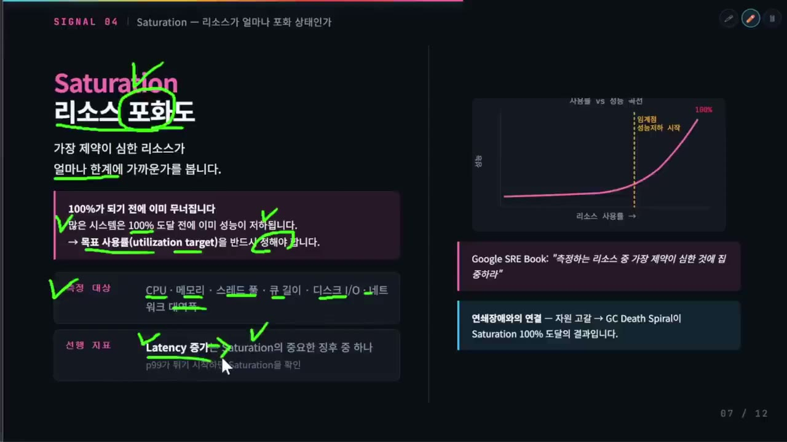

# 06. 포화와 큐잉 — 왜 100%가 되기 전에 무너지는가

## 학습 목표

사용률이 오를 때 응답 시간이 왜 비선형으로 폭발하는지 식으로 설명하고, **"지연이 평상시의 N배까지 허용"이라는 예산에서 목표 사용률을 역산**할 수 있다. `iostat %util` 같은 시간 기반 사용률이 병렬 자원에서 왜 거짓말하는지 말할 수 있다.

## 선수 지식

[01](01-prerequisites.md) § 4(큐·사용률·대기 시간). [02](02-golden-signals.md) § Saturation. [03](03-use-method.md) § Utilization의 두 가지 뜻.

## 핵심 원리 (WHY) — 대기는 사용률에 비례하지 않는다

"CPU 80%면 아직 20% 여유가 있다"는 직관은 자원을 **저장 공간**으로 보는 데서 온다. 디스크 용량은 실제로 그렇다 — 80%면 20% 더 넣을 수 있다.

하지만 처리 자원은 저장 공간이 아니라 **줄 서는 창구**다. 창구가 80% 시간 동안 바쁘다는 것은 "20% 더 처리할 수 있다"는 뜻이 아니라 "**도착이 겹칠 확률이 이미 높다**"는 뜻이다. 그리고 겹치면 기다린다.

### 식으로 보기 — M/M/1

가장 단순한 큐 모델(도착이 무작위, 서비스 시간이 무작위, 창구 하나)에서 평균 응답 시간은 이렇게 나온다.

```
ρ = λ/μ            사용률 (도착률 ÷ 처리율)
W = 1/(μ - λ)      평균 응답 시간 (대기 + 처리)
```
— [M/M/1 queue](https://en.wikipedia.org/wiki/M/M/1_queue)

`S = 1/μ`(부하 없을 때의 순수 처리 시간)로 정리하면 훨씬 읽기 쉬워진다.

```
W = S / (1 - ρ)
```

**응답 시간은 `1/(1-ρ)` 배로 늘어난다.** 이 배수를 계산해 보면 직관이 왜 틀렸는지 바로 보인다.

| 사용률 ρ | 지연 배수 `1/(1-ρ)` | 뜻 |
|---|---|---|
| 50% | **2×** | 처리 시간의 2배 |
| 70% | **3.3×** | Gregg의 "70%부터 의심" 지점 |
| 80% | **5×** | 흔한 알림 임계값 |
| 90% | **10×** | |
| 95% | **20×** | |
| 99% | **100×** | |

같은 값을 길이로 보면 곡선의 무릎이 어디인지 눈에 들어온다.

```
   ρ      1/(1-ρ)
 ─────────────────────────────────────────────────────────────
   50%      2.0×   ████
   70%      3.3×   ███████
   80%      5.0×   ██████████
   90%     10.0×   ████████████████████
   95%     20.0×   ████████████████████████████████████████
   99%    100.0×   ████████████████████████████████████████ … (여기서 5배 더)
 ─────────────────────────────────────────────────────────────
   70% → 80%   사용률 +10%p   ⇒   3.3× → 5×     (1.5배)
   90% → 95%   사용률  +5%p   ⇒   10×  → 20×    (2.0배)
```

(99% 막대는 지면에 안 들어와서 잘랐다 — 실제 길이는 그 위 막대의 5배다.)

70%→80%는 사용률 10%p 증가인데 지연은 3.3배→5배로 **1.5배** 늘어난다. 90%→95%는 그 절반인 5%p인데 10배→20배로 **2배** 늘어난다. **같은 크기의 사용률 증가가 뒤로 갈수록 더 큰 지연을 만든다** — 이것이 "급격히 증가한다"의 정확한 의미다.

그리고 시스템은 이 곡선의 어느 지점에서 "무너졌다"고 판정된다. 무너지는 지점이 100%가 아닌 이유는 **그 전에 이미 지연이 타임아웃을 넘기 때문**이다. 타임아웃이 처리 시간의 5배라면 사용률 80%에서 이미 절반쯤 실패한다.



### 이 모델의 한계 — 그래도 방향은 맞다

M/M/1은 실제 시스템이 아니다. 창구가 하나이고, 도착이 완전 무작위(포아송)이며, 큐 길이에 제한이 없다고 가정한다. 실제 서버는 코어가 여럿이고, 트래픽에는 패턴이 있고, 큐에는 한계가 있다.

그래서 이 표의 배수를 **예측값으로 쓰면 안 된다.** 하지만 두 가지는 실제 시스템에서도 성립한다.

1. **관계가 비선형이고, 뒤로 갈수록 급해진다** — 창구가 늘면 곡선이 오른쪽으로 밀리지만 모양은 같다
2. **100% 전에 실용적 한계가 온다** — 어떤 모델을 써도 이 결론은 바뀌지 않는다

그리고 실제 시스템은 이 모델보다 **더 나쁘다.** 트래픽은 무작위보다 몰려서 오고(버스트), GC·컨텍스트 스위칭·캐시 오염 같은 2차 효과가 사용률과 함께 커지며, 큐가 길어지면 큐 자체가 메모리를 먹는다.

## 필수 지식 (HOW)

### 목표 사용률을 역산한다

"CPU 80%면 알림"은 어디서 온 숫자인가? 대부분 관례다. 근거를 가지고 정하려면 **지연 예산에서 거꾸로 계산**한다.

```
허용 지연 배수 k 를 정한다  →  ρ_max = 1 - 1/k
```

| 허용 지연 배수 | 목표 사용률 |
|---|---|
| 2× | 50% |
| 3× | 67% |
| 4× | 75% |
| 5× | 80% |
| 10× | 90% |

읽는 법: "부하가 걸렸을 때 응답 시간이 평상시의 4배까지는 SLO 안에 들어온다"면 목표 사용률은 75%다. 그 이상이면 SLO를 위반할 궤도에 올라간 것이다.

이 계산의 값은 정확한 숫자가 아니라 **숫자에 근거가 붙는다는 것**이다. 80%를 쓰기로 했다면 "지연 5배까지 감당 가능한 시스템"이라고 말하고 있는 셈이고, 그 주장이 맞는지 확인할 수 있다. p50이 40ms이고 타임아웃이 1초인 서비스라면 5배(200ms)는 충분히 여유롭다. p50이 300ms인 서비스에서 5배는 1.5초로 이미 타임아웃 밖이다.

**같은 80%가 시스템에 따라 안전하거나 위험하다.** 임계값을 조직 표준으로 한 번 정해 전부에 적용하는 것이 편해 보이지만, 그것이 "우리 대시보드는 초록인데 사용자는 화났다"의 흔한 원인이다.

### 스케일 아웃이 곡선을 바꾸는 방식

인스턴스를 2배로 늘리면 무슨 일이 일어나는가. 도착률 λ는 그대로이고 처리율 μ가 2배가 되므로 ρ가 절반이 된다. 지연 배수는:

```
ρ = 0.9 → 10×      인스턴스 2배 →  ρ = 0.45 → 1.8×
```

**지연이 10배에서 1.8배로 떨어진다.** 인스턴스를 2배 늘렸는데 지연이 5.5배 개선되는 것은 비선형성이 반대 방향으로도 작동하기 때문이다. 포화 근처에서 스케일 아웃의 효과가 과도하게 커 보이는 이유가 여기 있다.

역으로 **이미 여유로운 시스템에 인스턴스를 늘리면 효과가 거의 없다.** ρ=0.3(1.43×)에서 2배 늘려도 ρ=0.15(1.18×)로, 지연은 17%밖에 개선되지 않는다.

```
인스턴스 2배 → ρ 절반. 같은 조치인데 출발 지점에 따라 결과가 다르다

  포화 근처   ρ 0.90        ρ 0.45
              10×    ──▶    1.8×        지연 5.5배 개선  ← 곡선의 급한 구간
              ████████████████████ ▶ ███▌

  여유 구간   ρ 0.30        ρ 0.15
              1.43×  ──▶    1.18×       지연 17% 개선    ← 곡선의 평탄한 구간
              ███ ▶ ██▌

  ⇒ "서버를 늘렸는데 안 빨라졌다" = 병목이 사용률이 아니라는 신호
    (직렬 구간 · 외부 의존 · 알고리즘을 봐야 한다)
``` "느려서 서버를 늘렸는데 안 빨라졌다"면 병목이 사용률이 아니라 다른 곳(직렬 구간, 외부 의존, 알고리즘)이라는 신호다.

### `%util`의 거짓 — 시간 기반 사용률이 병렬 자원에서 무의미해진다

[03](03-use-method.md)에서 본 두 가지 사용률 정의가 여기서 실전 문제가 된다.

`iostat`의 `%util`은 **"적어도 하나의 요청이 진행 중이었던 시간의 비율"** 이다. 창구가 하나인 자원(회전 디스크)에서는 이 값이 곧 포화도에 가깝다. 100%면 쉴 틈이 없었고 더 받을 수 없다.

**병렬 처리가 가능한 자원에서는 이 값이 한계를 말하지 않는다.**

```
시간 축 →   같은 %util 100%, 전혀 다른 상태

  직렬 장치 (회전 디스크)
    in-flight   ─█─█─█─█─█─█─█─█─█─█─█─█─█─█─█─   %util 100%
                한 번에 하나. 쉴 틈이 없다 = 정말로 더 못 받는다

  병렬 장치 (NVMe, 큐 깊이 4)
    in-flight   ─████────████────████────████──   %util 100%
                동시에 4개. "적어도 하나 진행 중"이 100%일 뿐이고,
                큐 깊이를 4 → 32 로 늘리면 처리량이 더 나온다

  ⇒ 시간 기반 사용률은 "쉬었는가"를 재고, 한계는 "기다렸는가"가 말한다
    → await (요청당 대기 시간) · avgqu-sz (평균 큐 깊이)
```

| 자원 | `%util` 100%의 뜻 |
|---|---|
| 회전 디스크 | 포화. 더 받으면 큐가 쌓인다 |
| SSD · NVMe | **"항상 뭔가 하고 있었다"는 것뿐.** 내부 병렬성 때문에 여유가 많이 남아 있을 수 있다 |
| RAID 배열 | 같다. 여러 디스크가 동시에 일한다 |
| 가상 디스크(EBS 등) | 같다. 게다가 하이퍼바이저 레벨의 실제 한계는 보이지 않는다 |

SSD는 오히려 **병렬 작업을 줘야 최고 성능이 나온다.** 큐에 요청이 하나뿐이면 내부 채널을 다 쓰지 못한다. 그래서 `%util` 100%는 SSD에서 "잘 쓰고 있다"에 가까울 수 있다.

**대안**: 병렬 자원에서는 `await`(요청당 평균 대기 시간)와 `avgqu-sz`(평균 큐 깊이)를 본다. 둘은 병렬성에 관계없이 "기다렸는가"를 직접 말한다. USE의 언어로 옮기면, **사용률(`%util`)이 아니라 포화(`await`·큐 깊이)를 봐야 하는 대표 사례**다.

이 함정은 클라우드에서 더 심해진다. 프로비저닝된 IOPS 한계, 버스트 크레딧, 인스턴스 레벨 네트워크 대역폭 상한 — 실제 한계선은 게스트 OS 지표가 아니라 **클라우드 제공자의 지표**에 있다.

### 포화를 예측 지표로 쓰기

포화는 현재 상태만 말하는 것이 아니라 **언제 한계에 닿을지**도 말할 수 있다. 용량 기반 자원에서는 증가율이 그대로 예측이 된다.

```
남은 여유 / 증가 속도 = 남은 시간
예: 디스크 여유 40GB, 시간당 10GB 증가  →  4시간 후 가득 찬다
```

이런 예측형 알림이 임계값 알림보다 나은 이유는 **행동 시간을 준다**는 것이다. "디스크 90%"는 지금 뭘 해야 할지 말하지 않지만 "4시간 후 가득 찬다"는 대응 창을 명시한다.

같은 발상이 에러 예산의 소진 속도 알림으로 이어진다([07](07-slo-and-error-budget.md)) — 그쪽은 자원 대신 예산이 대상이다.

### ⚠️ 암기 필수

- [ ] **응답 시간은 `1/(1-ρ)` 배로 늘어난다** — 50%→2배, 80%→5배, 90%→10배, 95%→20배. (이유: "80%면 20% 여유"라는 직관이 틀린 정확한 크기. 같은 5%p 증가가 뒤로 갈수록 더 큰 지연을 만든다)
- [ ] **목표 사용률 역산: `ρ_max = 1 - 1/k`** (허용 지연 배수 k). (이유: 임계값 80%에 근거를 붙이는 유일한 방법. 근거 없는 조직 표준 임계값이 "대시보드는 초록인데 사용자는 화남"을 만든다)
- [ ] **시간 기반 `%util` 100%는 병렬 자원에서 한계가 아니다** — SSD·NVMe·RAID·가상 디스크. 대신 `await`·큐 깊이를 본다. (이유: 진단이 정반대로 갈리는 지점. SSD의 100%는 "잘 쓰는 중"일 수 있다)
- [ ] **포화 근처에서 스케일 아웃 효과가 과대하고, 여유로울 때 과소하다** — ρ=0.9에서 2배 증설하면 지연 10×→1.8×, ρ=0.3에서는 1.43×→1.18×. (이유: "서버 늘렸는데 안 빨라졌다"가 병목이 사용률 아님을 알리는 신호)
- [ ] **포화는 예측 지표로 쓸 수 있다 — 남은 여유 ÷ 증가 속도 = 남은 시간** (이유: 임계값 알림은 대응 시간을 주지 않고, 소진 속도 알림은 준다)

## 자가 진단

- 우리 알림의 CPU 임계값은 어떤 지연 배수를 전제하는가? 그 배수가 우리 타임아웃 안에 들어오는가?
- 스토리지 지표로 `%util`을 보고 있는가? 그 장치는 병렬 처리를 하는가?
- 용량형 자원(디스크, 로그 볼륨) 중 "언제 찬다"를 알려주는 알림이 있는 것이 몇 개인가?

## 다음

→ [07-slo-and-error-budget.md](07-slo-and-error-budget.md) — 신호를 알림으로 바꾸는 규율.
