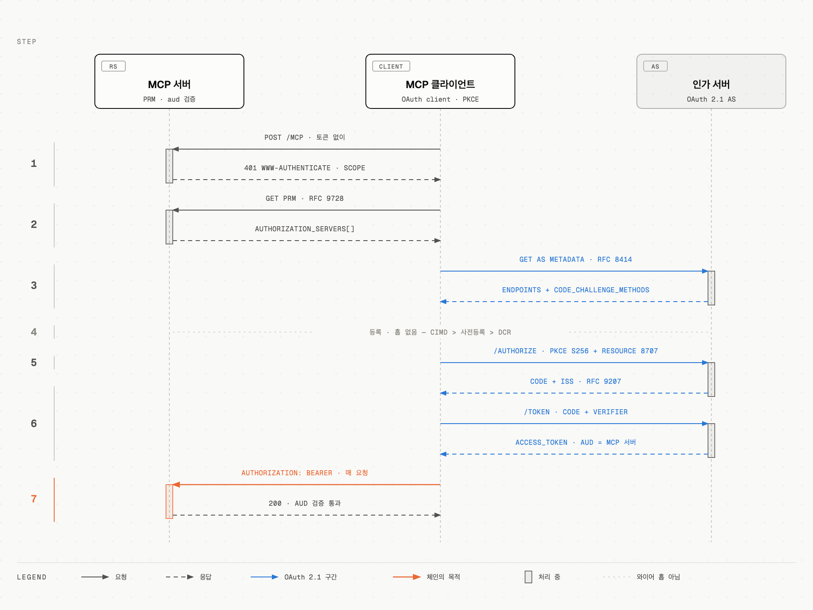

# 인가(Authorization) — OAuth 2.1 위의 MCP 접근 통제

## 학습 목표

401부터 토큰 획득까지의 인가 체인을 단계별로 그릴 수 있고, 각 단계의 표준(RFC)과 그것이 막는 공격을 짝지을 수 있으며, 클라이언트 등록 3방식의 선택 기준과 스코프 전략(step-up)을 설계할 수 있다.

## 선수 지식

- [01-prerequisites.md](01-prerequisites.md)의 OAuth 2.1 + PKCE
- [05-transports.md](05-transports.md)의 Streamable HTTP

## 핵심 원리 (WHY)

MCP 인가는 새 발명이 아니라 **OAuth 2.1의 신중한 부분집합**이다. 역할 매핑: MCP 서버 = **리소스 서버(RS)**, MCP 클라이언트 = **OAuth 클라이언트**, 인가 서버(AS)는 별도 존재(같이 호스팅돼도 논리적으로 분리).

인가는 **선택 기능**이다. HTTP 전송이면 이 명세를 따르고(SHOULD), **stdio는 이 명세를 따르지 말고 환경에서 자격증명을 얻어라**(SHOULD NOT) — 로컬 프로세스는 환경변수·OS 키체인이라는 더 자연스러운 통로가 있고, OAuth 리다이렉트 흐름은 원격 HTTP 서버를 위해 설계됐기 때문이다.

설계의 반복 주제는 **"사전 관계 없음(no prior relationship)"**이다. 사용자가 임의의 MCP 서버 URL을 붙여넣는 세계에서는 (1) 클라이언트가 AS를 미리 알 수 없고 → 디스커버리 체인, (2) AS에 미리 등록돼 있을 수 없고 → CIMD/DCR, (3) 토큰이 엉뚱한 서버로 흘러갈 수 있다 → audience 바인딩. 체인의 각 고리가 이 문제 하나씩을 푼다.

## 필수 지식 (HOW)

### 전체 체인 (외울 것)

1. 토큰 없이 요청 → 401 + `WWW-Authenticate: Bearer resource_metadata="…", scope="…"`
2. PRM(Protected Resource Metadata, RFC 9728) 가져오기 → `authorization_servers` 목록
3. AS 메타데이터 디스커버리 (RFC 8414 / OIDC Discovery) → 엔드포인트·능력
4. 클라이언트 등록 (CIMD 우선 / 사전등록 / DCR 폴백)
5. 인가 요청: PKCE(S256) + `resource` 파라미터(RFC 8707) + 스코프 전략, 예상 issuer 기록
6. 콜백: iss 검증(RFC 9207) → 코드+verifier+resource로 토큰 교환
7. 매 요청 `Authorization: Bearer <토큰>` → 서버는 audience 검증

**일곱 고리 중 MCP 서버와 주고받는 것은 ①②⑦뿐이고 ③⑤⑥은 인가 서버와의 순수 OAuth 왕복이며 ④는 아예 와이어 홉이 아니다** — 그래서 인가 실패를 진단할 때 "몇 번째 고리인가"보다 "어느 상대와의 왕복이 깨졌나"가 먼저 갈린다.

### ① ~ ② 보호 리소스 메타데이터 (RFC 9728)

MCP 서버는 PRM을 **반드시 구현**(MUST)하고 `authorization_servers`(최소 1개)를 담는다. 클라이언트에게 알리는 경로 두 가지 — 서버는 최소 하나 구현(MUST), **클라이언트는 둘 다 지원**(MUST):

1. 401의 `WWW-Authenticate` 헤더 `resource_metadata` 파라미터 (있으면 이걸 우선)
2. well-known URI 폴백 — 엔드포인트 경로 삽입형 먼저(`/.well-known/oauth-protected-resource/public/mcp`), 다음 루트(`/.well-known/oauth-protected-resource`)

AS가 여러 개면 선택은 클라이언트 몫. 각 AS는 독립적이므로 **클라이언트 자격증명·토큰은 AS별로 분리 보관**(MUST) — A에서 받은 client_id를 B에 재사용 금지.

### ③ AS 메타데이터 디스커버리

전용 suffix 없이 표준 well-known을 쓴다. issuer URL에 **경로가 있으면**(`https://auth.example.com/tenant1`) 순서대로: ① OAuth path-insertion `/.well-known/oauth-authorization-server/tenant1` ② OIDC path-insertion `/.well-known/openid-configuration/tenant1` ③ OIDC path-appending `/tenant1/.well-known/openid-configuration`. 경로 없으면 ①②만.

**문서 검증**(MUST): 받은 메타데이터의 `issuer`가 URL 구성에 쓴 issuer와 정확히 동일해야 한다. `attacker.example`에서 가져온 문서가 `"issuer": "https://honest.example"`이라 주장하면 거부 — 이 검증이 이후 iss 대조의 신뢰 뿌리다.

### ④ 클라이언트 등록 — 3방식과 우선순위

| 방식 | 언제 | 요지 |
|---|---|---|
| **사전등록(pre-registration)** | 기존 관계 있음 | 하드코딩 client_id 또는 사용자 입력 UI. 발급한 AS에 귀속(issuer로 키잉, AS 바뀌면 재등록 MUST) |
| **CIMD** (Client ID Metadata Documents) | 관계 없음 — **표준 권장(SHOULD)** | `client_id` 자체가 HTTPS URL이고, 그 URL이 메타데이터 JSON(client_id·client_name·redirect_uris 필수)을 서빙. AS가 필요할 때 fetch·검증. `client_id` 값 = 문서 URL 정확히 일치(MUST). **AS 간 이식 가능** — 재등록 불필요 |
| **DCR** (RFC 7591) | 하위 호환 폴백 — **deprecated** | AS의 `registration_endpoint`에 POST해 client_id 발급. OIDC AS에선 `application_type` 명시 필수(네이티브 앱은 `"native"` — 기본값 `"web"`이 localhost 리다이렉트와 충돌) |

클라이언트 우선순위(SHOULD): 사전등록 보유 → AS가 `client_id_metadata_document_supported: true`면 CIMD → `registration_endpoint` 있으면 DCR → 사용자에게 입력 요청.

CIMD가 DCR을 밀어낸 이유: DCR은 AS에 등록 상태(DB 행)를 만든다 — 익명 등록 남용·정리 문제가 따라온다. CIMD는 클라이언트가 자기 정체성을 **자기 도메인에 호스팅**하고 AS는 캐시하며 조회만 한다. 상태가 클라이언트 쪽으로 이동하고, 도메인 소유가 곧 신원 증명이 된다.

### ⑤ ~ ⑥ 인가 요청과 응답 검증

- **PKCE**: 필수(MUST), 가능하면 S256. 진행 전 **AS의 PKCE 지원을 메타데이터로 확인** — `code_challenge_methods_supported`가 없으면(OAuth든 OIDC든) **진행 거부**(MUST). PKCE 없는 AS로 흘러가는 다운그레이드를 막는다
- **resource 파라미터 (RFC 8707)**: 인가 요청과 토큰 요청 **양쪽에** MCP 서버의 정규(canonical) URI를 넣는다(MUST) — AS가 지원하든 말든 보낸다. 정규 URI: 소문자 scheme/host 권장, fragment 금지, 가급적 구체적으로(`https://mcp.example.com/mcp`). 트레일링 슬래시는 의미 없으면 빼는 쪽으로 일관되게. 이것이 토큰을 특정 서버에 **audience 바인딩**하는 수단이다
- **issuer 검증 (RFC 9207)**: 리다이렉트 전에 선택한 AS의 검증된 issuer를 기록해두고(PKCE verifier와 같은 요청별 레코드에), 콜백의 `iss` 파라미터와 **단순 문자열 비교**(정규화 금지 — 대소문자 접기·기본 포트 생략·슬래시 정규화 전부 금지). AS가 `authorization_response_iss_parameter_supported: true`인데 `iss`가 없으면 **거부**. 광고 없이 `iss`가 와도 비교는 한다. 에러 응답에도 동일 적용 — 불일치면 error 내용조차 표시 금지. 이것이 **mix-up 공격**(악성 AS가 다른 AS의 코드를 가로채기) 방어다 — PKCE는 이걸 못 막는다(verifier를 공격자 토큰 엔드포인트에 제출하게 되므로)

### ⑦ 토큰 사용 규칙

- `Authorization: Bearer <토큰>` 헤더로, **매 요청**(MUST). **URI 쿼리스트링 금지**(MUST NOT)
- 클라이언트: 그 서버의 AS가 발급한 토큰 외에는 보내지 말 것(MUST NOT)
- 서버: 토큰이 **자기를 audience로 발급된 것인지 검증**(MUST). 아니면 401. **다른 토큰을 수락하거나 전달(transit) 금지**(MUST NOT) — token passthrough 금지의 규범적 근거. 상류 API를 부르려면 자기가 별도 OAuth 클라이언트가 되어 **별도 토큰**을 받아라
- 401 = 토큰 없음·무효·만료 / 403 = 스코프 부족 / 400 = 요청 자체 불량
- 리프레시 토큰: 클라이언트는 발급을 가정하지 말 것(MUST NOT). 공개 클라이언트에는 AS가 리프레시 토큰 **로테이션** 필수. 서버(RS)는 `offline_access`를 scope 챌린지·PRM에 넣지 말 것(SHOULD NOT) — 리프레시는 리소스 요구사항이 아니다

### 스코프 전략 — 최소 권한과 step-up

**초기 선택 우선순위**(SHOULD): ① 401 `WWW-Authenticate`의 `scope` 파라미터 → ② 없으면 PRM의 `scopes_supported` 전부 → ③ 그것도 없으면 scope 생략. `scopes_supported`는 "기본 기능의 최소 집합"을 표현하는 자리다(전체 카탈로그가 아니라).

**런타임 스코프 부족**: 서버는 `403 + WWW-Authenticate: Bearer error="insufficient_scope", scope="필요한 것들"`로 답한다(SHOULD). 현재 작업에 필요한 스코프를 **한 챌린지에 전부** 담아라 — 하나씩 찔끔 내면 재인가 왕복이 반복된다. 스코프 계층(broad가 narrow를 함의)은 서버가 판정 시 고려(MUST).

**Step-up 흐름**(클라이언트, SHOULD): 챌린지 파싱 → **기존 요청 스코프 ∪ 챌린지 스코프**로 재인가(안 그러면 이전 권한을 잃는다 — 누적은 클라이언트 책임) → 원 요청 재시도(몇 회 제한, 초과 시 영구 실패 처리).

### 보안 요구 요약 (spec의 security-considerations)

- 통신: AS 엔드포인트 전부 HTTPS(MUST), 리다이렉트 URI는 localhost 또는 HTTPS(MUST)
- 토큰 탈취 대비: 안전한 저장(MUST), 짧은 수명 액세스 토큰(SHOULD)
- 오픈 리다이렉트: redirect_uri 사전 등록 + **정확 일치 검증**(MUST), state 파라미터 사용·검증(SHOULD)
- CIMD 특수 위험: AS의 메타데이터 fetch는 SSRF 표면(사설망 차단 등 적용), **localhost 리다이렉트는 CIMD로도 프로세스 사칭을 못 막는다** → AS는 localhost 전용 클라이언트에 추가 경고 표시(SHOULD)·리다이렉트 호스트 명확 표시(MUST)
- confused deputy: 정적 client_id로 서드파티 AS를 쓰는 프록시 서버는 **동적 등록 클라이언트별 사용자 동의**를 먼저 받아야(MUST) — 상세 공격 흐름은 [11-security.md](11-security.md)

## 우리 작업과의 연결

사내 MCP 서버를 HTTP로 열 때 최소 체크리스트가 이 파일이다: PRM 서빙 + 401 챌린지, 토큰 introspection/JWT 검증에서 **aud 확인**, 스코프는 도구 단위로 쪼개기. 클라이언트 측(호스트 앱)이라면 디스커버리 체인과 iss 검증을 SDK가 해주는지부터 확인하라 — 직접 구현은 "잘 검증된 라이브러리를 써라"가 공식 권고다.

### ⚠️ 암기 필수

- [ ] **인가 체인 7단계**: 401+WWW-Authenticate → PRM(RFC 9728) → AS 메타데이터(RFC 8414/OIDC, path-insertion 우선) → 등록(사전등록>CIMD>DCR) → PKCE(S256, `code_challenge_methods_supported` 없으면 중단) + resource(RFC 8707) → iss 검증(RFC 9207, 문자열 정확 비교) → Bearer 헤더
  - 이유: 인가 실패 진단은 "체인의 몇 번째 고리인가"를 찾는 일이다
- [ ] **토큰 3금칙**: 쿼리스트링 금지 / audience 불일치 토큰 수락 금지 / **passthrough 금지**(받은 토큰을 하류로 전달 금지 — 상류 호출은 별도 토큰)
  - 이유: MCP 보안 사고의 최다 원인 축. 셋 다 MUST (NOT)
- [ ] **등록 3방식**: CIMD = client_id가 HTTPS URL(자기 호스팅, AS 간 이식) / 사전등록 = issuer별 귀속 / DCR = deprecated 폴백(OIDC에선 application_type 필수)
  - 이유: "이 클라이언트를 어떻게 등록시키지"는 모든 원격 서버 통합의 첫 결정
- [ ] **스코프 규칙**: 초기 = 챌린지 scope > scopes_supported > 생략. 부족 = 403 insufficient_scope + 필요 스코프 일괄. step-up = **기존 ∪ 신규**로 재인가(누적은 클라이언트 책임)
  - 이유: 과다 권한(블라스트 반경)과 재인가 루프 사이의 균형점이 이 규칙이다

## 자가 진단

Q1: iss 검증이 막는 공격을 시나리오로. PKCE로는 왜 안 막히나?

**즉답 예시**: mix-up 공격 — 클라이언트가 여러 AS와 상호작용할 때, 공격자가 통제하는 AS가 흐름을 조작해 정직한 AS가 발급한 인가 코드를 자기에게 제출하게 만든다. 콜백의 iss를 "리다이렉트 전에 기록해둔 issuer"와 비교하면 코드가 의도치 않은 토큰 엔드포인트로 가는 것을 차단한다. PKCE는 못 막는다 — 클라이언트가 code_verifier를 공격자의 토큰 엔드포인트에 스스로 제출해버리기 때문이다.

Q2: OIDC Discovery 문서에 code_challenge_methods_supported가 없다. OIDC 표준엔 원래 없는 필드인데, 진행해도 되나?

**즉답 예시**: 안 된다. MCP는 OIDC 프로바이더 메타데이터라도 이 필드의 존재를 확인하고 없으면 진행을 거부하라고 요구한다(MUST). PKCE 지원을 확신할 수 없는 AS로 진행하면 PKCE 다운그레이드 여지가 생기기 때문이고, 그래서 역으로 "MCP 호환 AS는 OIDC라도 이 필드를 포함해야 한다(MUST)"는 서버측 의무가 같이 명시돼 있다.

Q3: MCP 서버가 받은 클라이언트 토큰으로 그대로 GitHub API를 호출하면 정확히 무엇이 문제인가?

**즉답 예시**: token passthrough — 명시적 금지다. 그 토큰의 audience는 MCP 서버이지 GitHub가 아니므로 audience 경계가 깨지고, 하류(GitHub)는 그 토큰을 "MCP 서버가 검증한 것"으로 오신뢰한다(confused deputy). 레이트리밋·감사 추적도 무너진다. 올바른 구조: MCP 서버가 GitHub의 OAuth 클라이언트로서 별도 토큰을 획득(URL 모드 elicitation 패턴)하고, 사용자 정체성에 바인딩해 저장한다.

Q4: 403 insufficient_scope에 scope="files:write"만 왔다. 클라이언트가 files:write만으로 재인가하면 무슨 일이?

**즉답 예시**: 이전에 갖고 있던 스코프(예: files:read)를 잃은 토큰이 나와 다른 작업이 연쇄로 깨질 수 있다. 서버는 현재 작업에 필요한 것만 챌린지해도 되므로(이전 부여분 포함 의무 없음), 누적은 클라이언트 몫이다 — 기존 요청 스코프와 챌린지 스코프의 **합집합**으로 재인가해야 한다. 계층 스코프의 의미적 중복은 AS가 정규화하니 걱정하지 않아도 된다.

Q5: CIMD의 client_id가 https://app.example.com/oauth/meta.json일 때 AS가 반드시 검증해야 하는 것 두 가지는?

**즉답 예시**: (1) fetch한 문서 안의 `client_id` 값이 그 URL과 **정확히 일치**하는가, (2) 인가 요청의 `redirect_uri`가 문서의 `redirect_uris` 목록에 있는가. 추가로 문서 구조(유효 JSON + 필수 필드) 검증은 MUST, fetch 시 SSRF 방어와 HTTP 캐시 존중은 SHOULD다.

## 공식 문서

- [Authorization (spec)](https://modelcontextprotocol.io/specification/2026-07-28/basic/authorization) — 체인 전체, 스코프, 토큰 규칙
- [Authorization Server Discovery](https://modelcontextprotocol.io/specification/2026-07-28/basic/authorization/authorization-server-discovery) — PRM, well-known 우선순위
- [Client Registration](https://modelcontextprotocol.io/specification/2026-07-28/basic/authorization/client-registration) — CIMD/사전등록/DCR
- [Authorization Security Considerations](https://modelcontextprotocol.io/specification/2026-07-28/basic/authorization/security-considerations)
- [Understanding Authorization (tutorial)](https://modelcontextprotocol.io/docs/2026-07-28/tutorials/security/authorization) — Keycloak 실습, aud 검증 코드
