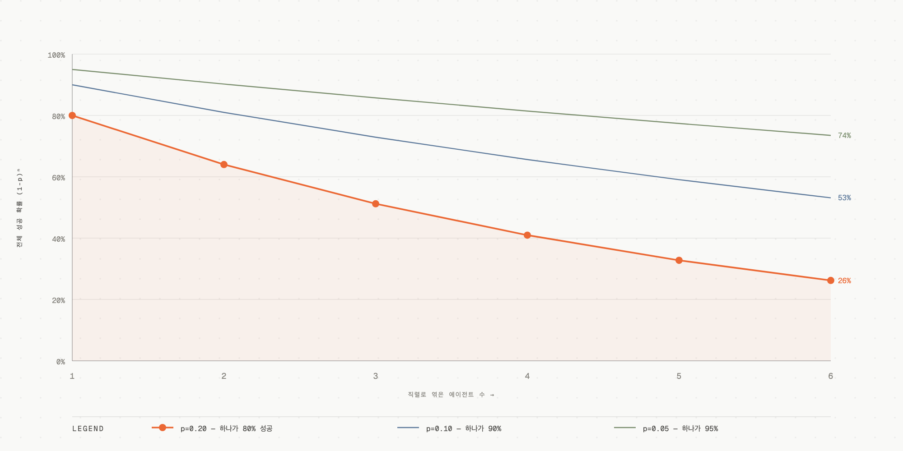

# 07. 멀티 에이전트를 만들어야 하는가 — 판단의 챕터

## 학습 목표

이 챕터를 다 읽으면, 멀티 에이전트가 정당화되는 조건 3가지로 당신 프로젝트를 판정하고, 업계의 상반된 두 입장을 근거로 팀을 설득할 수 있다.

## 선수 지식

[04장 멀티 에이전트 패턴](04-multi-agent-patterns.md). 무엇을 나누는지 알아야 "나눠야 하나"를 판단할 수 있다. **이 챕터는 마지막에 있지만, 프로젝트 시작 전에 팀과 함께 읽어야 한다.**

## 핵심 원리 (WHY) — 나누면 모든 게 곱셈으로 는다

> **에이전트를 여러 개로 쪼개면 비용·지연시간·실패 지점이 전부 곱셈으로 늘어난다.**

에이전트 하나가 실패 확률 p라면, 5개를 직렬로 엮으면 전체 성공 확률은 대략 (1-p)⁵로 급락한다. 비용은 에이전트 수만큼 곱해지고, 지연시간은 순차 의존이면 합산된다. 게다가 **컨텍스트 파편화**([04장](04-multi-agent-patterns.md))로 에이전트들이 서로 모순된 결정을 내리기 시작한다.

읽어낼 것은 곡선의 휘어짐이다 — **하나가 95%로 아주 안정적이어도 여섯 개를 엮으면 74%**이고, 80%짜리는 26%까지 내려간다. 부품의 신뢰도를 올려서 만회할 수 있는 종류의 손실이 아니다.

가장 흔한 실패 패턴: **툴 10개 붙인 단일 에이전트로 될 일을 5개 에이전트로 쪼개서 디버깅 지옥에 빠지는 것.** 멋있어 보여서, 혹은 "요즘 멀티 에이전트가 대세라서" 나누는 순간 프로젝트가 늪에 빠진다.

## 필수 지식 (HOW) — 정당화 조건 3가지

멀티 에이전트가 단일 에이전트보다 나은 경우는 **다음 셋이 모두 충족될 때**다:

1. **서브태스크가 병렬화 가능하다** — 동시에 돌릴 수 있어야 나누는 이득(속도)이 생긴다. 순차 의존이 강하면 나눠도 느리기만 하다. (Anthropic 리서치 시스템의 90% 단축은 병렬 검색에서 나왔다 — [04장](04-multi-agent-patterns.md))
2. **각자 독립된 컨텍스트를 필요로 한다** — 서브태스크마다 다른 지식·다른 도구가 필요해서, 한 에이전트의 컨텍스트 윈도우에 다 넣으면 오염되거나 넘칠 때. 컨텍스트 분리가 이득일 때만.
3. **결과 병합 규칙이 명확하다** — 서브에이전트 결과를 어떻게 하나로 합칠지 규칙이 분명해야 한다. 병합이 모호하면 파편화된 결과를 사람이 손으로 이어붙이게 된다.

**이 셋 중 하나라도 안 맞으면 단일 에이전트가 거의 항상 낫다.** 툴을 여러 개 붙인 단일 에이전트를 먼저 시도하고, 그것이 명확한 한계에 부딪힐 때만 나눠라.

### 나눴다면 — "앱 레이어냐 플랫폼이냐"는 또 다른 질문

나누기로 정했다고 곧장 플랫폼(독립 서비스·레지스트리·A2A)을 지을 필요는 없다. **나누는 것(위 3조건)** 과 **서비스 인프라로 짓는 것(플랫폼)** 은 별개의 결정이다. 대부분은 앱 레이어(한 프로그램 안 함수 + 중앙 오케스트레이터)로 시작하는 게 맞고, 플랫폼 승격은 별도의 트리거(다팀 독립개발·독립 배포·외부 연동·런타임 개방)가 실제로 걸릴 때만이다. 이 승격 게이트는 [08장](08-agent-platform-infra.md)에 정리돼 있다.

## 반드시 알아야 할 — 업계의 두 입장

이 주제는 업계 최고 팀들 사이에서도 결론이 갈린다. **양쪽을 다 읽어야 판단 기준이 생긴다.**

### 입장 1 — "만들지 마라" (Cognition)
Walden Yan의 *Don't Build Multi-Agents*(2025)는 여러 LLM 에이전트를 병렬·분산으로 엮는 유행을 정면으로 비판한다. 핵심 논지: 멀티 에이전트는 **컨텍스트 파편화와 일관성 없는 의사결정**으로 취약하고 혼란스러워진다. 대신 **컨텍스트 엔지니어링**(동적 시스템에서 컨텍스트를 자동으로 잘 구성하는 것 — 프롬프트 엔지니어링의 다음 단계)이 에이전트 엔지니어의 1순위 과제라고 주장한다.

단, Cognition은 이후 **좁은 범위에서는 멀티 에이전트가 작동한다**고 입장을 보강했다: 여러 에이전트가 지능을 보태되 **쓰기는 단일 스레드로 유지**하는 패턴(단일 작성자 원칙, [04장](04-multi-agent-patterns.md)).

### 입장 2 — "이렇게 만들면 된다" (Anthropic)
Anthropic의 *How we built our multi-agent research system*은 반대 사례다. 리드 에이전트 + 3~5개 서브에이전트의 오케스트레이터-워커 구조로 복잡한 리서치 시간을 **최대 90% 단축**했다. 단, 이득은 **병렬화 가능한 검색 작업**이라는 특정 조건에서 나왔고, 툴 설계에 막대한 공을 들였다.

### 두 입장을 어떻게 화해시키나
모순이 아니다. **둘 다 "함부로 나누지 말고, 나눌 거면 병렬화되는 작업을 단일 작성자로"**라고 말한다. Cognition은 "대부분의 경우 나누지 마라"에, Anthropic은 "이 조건이면 나눠도 된다"에 방점을 둘 뿐이다. 정당화 조건 3가지가 그 교집합이다.

## 🛠 직접 해볼 것 — 당신 프로젝트를 판정하라

- [ ] 사내 프로젝트가 푸는 문제를 한 문장으로 적는다
- [ ] **정당화 조건 3가지 체크리스트**로 판정:
  - [ ] 서브태스크가 병렬화 가능한가? (예/아니오 + 근거)
  - [ ] 각 서브태스크가 독립된 컨텍스트를 요구하는가?
  - [ ] 결과 병합 규칙이 명확한가?
- [ ] 셋 중 하나라도 "아니오"면 → **단일 에이전트 + 툴 여러 개**로 먼저 설계해보기
- [ ] *Don't Build Multi-Agents*(Cognition)와 *multi-agent research system*(Anthropic)을 **팀과 함께 읽고** 각자의 조건을 정리
- [ ] 당신 프로젝트에서 "쓰기를 단일 스레드로 유지"할 지점이 어디인지 그려보기

**자가진단:**
1. 에이전트 5개를 직렬로 엮으면 전체 성공 확률에 무슨 일이 생기나? (답: 곱셈으로 급락)
2. 멀티 에이전트 정당화 3조건을 말해보라.
3. Cognition과 Anthropic이 실제로는 왜 모순이 아닌가?
4. 조건이 애매할 때 먼저 시도할 설계는? (답: 단일 에이전트 + 툴 여러 개)

## ⚠️ 암기 필수

- [ ] **멀티 에이전트 정당화 3조건: ① 병렬화 가능 ② 독립 컨텍스트 필요 ③ 명확한 병합 규칙. 하나라도 빠지면 단일 에이전트가 낫다.**
- [ ] **나누면 비용·지연·실패 지점이 곱셈으로 는다.** 기본값은 "나누지 않는다".
- [ ] **먼저 단일 에이전트 + 툴 여러 개를 시도하고, 명확한 한계에 부딪힐 때만 나눈다.**
- [ ] **업계 두 입장(Cognition "만들지 마라" vs Anthropic "이렇게 만들면 된다")은 모순이 아니라 방점의 차이다.**

## 공식 문서

- [Don't Build Multi-Agents — Cognition](https://cognition.ai/blog/dont-build-multi-agents) — 멀티 에이전트 회의론과 컨텍스트 엔지니어링
- [How we built our multi-agent research system — Anthropic](https://www.anthropic.com/engineering/multi-agent-research-system) — 멀티 에이전트 성공 사례와 조건
- [Building Effective AI Agents — Anthropic](https://www.anthropic.com/engineering/building-effective-agents) — "가장 단순한 것부터, 필요할 때만 복잡하게"의 원전
