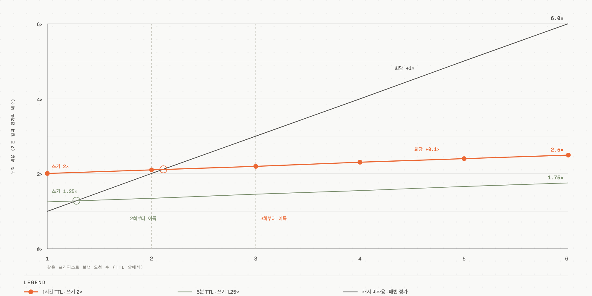

# 06. 프롬프트 캐싱 — 스냅샷을 요청 사이로 옮기기

## 학습 목표

이 파일을 다 읽으면 (1) 프롬프트 캐싱이 KV 캐시와 정확히 어떤 관계인지, (2) 캐시가 조용히 미적중하는 원인을 코드에서 찾는 방법, (3) TTL·최소 토큰·브레이크포인트 제약을 근거로 캐싱 전략을 결정하는 방법을 알 수 있습니다.

## 선수 지식

- [03-kv-cache.md](03-kv-cache.md) — 프롬프트 캐싱이 재사용하는 대상이 무엇인지
- [04-kv-cache-reduction.md](04-kv-cache-reduction.md)의 ④ 접두사 공유
- [05-prefill-and-decode.md](05-prefill-and-decode.md) — 왜 TTFT만 개선되는지

> 이 파일의 수치와 규격은 Claude API 기준입니다(2026-06-24 캐시 시점). 다른 제공자는 세부가 다르지만 **프리픽스 매칭이라는 근본 제약은 동일**합니다.

---

## 핵심 원리: 스냅샷의 수명을 요청 경계 밖으로 늘린 것

일반 KV 캐시는 **한 요청 안에서만** 삽니다. 요청이 끝나면 사라지고, 다음 요청은 프롬프트를 처음부터 prefill합니다.

프롬프트 캐싱은 그 스냅샷을 **요청이 끝난 뒤에도 보관**해서, 다음 요청이 같은 앞부분을 가지면 prefill을 건너뛰게 합니다.

```
[캐싱 없음]
요청 1: [시스템 3000토큰][질문 A]  → 3000토큰 prefill
요청 2: [시스템 3000토큰][질문 B]  → 3000토큰 prefill (완전히 같은 계산을 다시)

[캐싱 있음]
요청 1: [시스템 3000토큰][질문 A]  → 3000토큰 prefill + KV 저장 (캐시 쓰기)
요청 2: [시스템 3000토큰][질문 B]  → 저장된 KV 로드 + [질문 B]만 prefill (캐시 읽기)
```

02 원리 ①의 **접두사 공유** 성질이 그대로 상업화된 것입니다. append-only이므로 앞부분이 같으면 계산 결과도 같다는 보장 위에 서 있습니다.

### ⭐ 그래서 개선되는 것은 TTFT뿐입니다

05에서 본 대로 캐싱은 prefill을 건너뛰는 기법입니다. 응답 생성 속도(TPOT)는 개선되지 않습니다 — decode는 캐시된 KV를 **읽어야** 하는 작업이니까요. **"응답이 느려서 캐싱을 붙였다"는 접근은 실패합니다.**

---

## 필수 지식 1: 하나의 불변식 — 프리픽스 매칭

> **어느 위치의 한 바이트라도 바뀌면, 그 뒤 전체가 무효가 된다.**

캐시 키는 브레이크포인트까지의 **정확한 바이트**에서 유도됩니다. 위치 N이 달라지면 N 이후의 모든 브레이크포인트가 무효입니다.

### 렌더 순서를 알아야 한다

```
tools  →  system  →  messages
```

이 순서로 프롬프트가 조립됩니다. 세 가지 결과가 따라옵니다.

- `tools`는 **위치 0**입니다. 도구를 추가·삭제·재정렬하면 **전체 캐시가 날아갑니다.**
- 마지막 system 블록에 브레이크포인트를 두면 `tools + system`이 함께 캐시됩니다.
- `messages`는 맨 뒤이므로, 5번째 턴의 변경은 그 앞 4턴의 캐시를 건드리지 않습니다.

### 설계 규율: 안정 → 변동 순서

02 원리 ①의 "안정적인 것을 앞에"가 여기서 구체 지침이 됩니다.

| 입력의 성격 | 놓을 위치 |
|---|---|
| 절대 안 변함 (고정 시스템 프롬프트, 결정론적 도구 목록) | 맨 앞, 브레이크포인트 앞 |
| 세션마다 변함 | 전역 프리픽스 뒤, 세션 단위로 캐시 |
| 턴마다 변함 | 마지막 브레이크포인트 뒤 |
| **요청마다 변함** (타임스탬프, UUID) | **제거하거나 맨 끝으로** |

마지막 줄이 실무 사고의 원인 1위입니다.

---

## 필수 지식 2: 조용한 무효화자 — 코드에서 찾는 법

캐시가 미적중해도 **에러가 나지 않습니다.** 그냥 비용이 다 나옵니다. 그래서 코드 리뷰로 잡아야 합니다.

| 패턴 | 왜 깨지는가 |
|---|---|
| 시스템 프롬프트에 `datetime.now()` / `Date.now()` | 프리픽스가 매 요청 달라짐 |
| 프리픽스 앞쪽에 `uuid4()` / 요청 ID | 모든 요청이 유일해짐 |
| `json.dumps(d)` (sort_keys 없이) / `set` 순회 | 직렬화 순서가 비결정적 → 바이트가 달라짐 |
| 시스템 프롬프트에 세션·유저 ID 보간 | 유저별 프리픽스 → 유저 간 공유 불가 |
| 조건부 시스템 섹션 (`if flag: system += ...`) | 플래그 조합마다 별개 프리픽스 |
| `tools=build_tools(user)` — 유저별 도구 목록 | 도구는 위치 0 → 유저 간 아무것도 공유 안 됨 |

**진단 방법**: 같은 프리픽스로 반복 요청했을 때 `cache_read_input_tokens`가 계속 0이면 위 목록 중 하나가 작동하고 있습니다. 두 요청의 렌더된 프롬프트 바이트를 diff하면 찾을 수 있습니다.

### 검증 필드

```python
response.usage.cache_creation_input_tokens  # 캐시에 쓴 토큰 (쓰기 프리미엄 지불)
response.usage.cache_read_input_tokens      # 캐시에서 읽은 토큰 (약 0.1× 지불)
response.usage.input_tokens                 # 캐시되지 않아 정가로 처리된 토큰
```

⚠️ **`input_tokens`는 "캐시되지 않은 나머지"일 뿐입니다.**

```
전체 프롬프트 크기 = input_tokens + cache_creation_input_tokens + cache_read_input_tokens
```

몇 시간 돌린 에이전트의 `input_tokens`가 4K로 보인다면 나머지가 캐시에서 온 것입니다. **단일 필드가 아니라 합을 보세요.**

---

## 필수 지식 3: 최소 캐시 가능 토큰 — 비단조적이다

프리픽스가 최소 길이보다 짧으면 **에러 없이 조용히 캐시되지 않습니다** (`cache_creation_input_tokens: 0`).

| 모델 | 최소 토큰 |
|---|---:|
| Claude Opus 5, Claude Fable 5, Claude Mythos 5 | **512** |
| Claude Opus 4.8, Sonnet 5, Sonnet 4.6, Sonnet 4.5, Opus 4.1, Opus 4, Sonnet 4 | 1,024 |
| Claude Opus 4.7, Mythos Preview, Haiku 3.5 | 2,048 |
| Claude Opus 4.6, Opus 4.5, Haiku 4.5 | **4,096** |

### ⚠️ 세대가 올라간다고 작아지지 않습니다

최신 모델은 512인데 Opus 4.6·4.5와 Haiku 4.5는 4,096입니다. **8배 차이이고 단조적이지 않습니다.**

실무 함의: 3K 토큰 프롬프트는 Claude Opus 5·Opus 4.8·Sonnet 4.5에서는 캐시되지만 **Opus 4.6이나 Haiku 4.5에서는 조용히 캐시되지 않습니다.** 모델을 바꾸면서 이 표를 확인하지 않으면 "왜 갑자기 비용이 올랐는지" 알 수 없게 됩니다.

특히 Haiku 4.5는 저비용 모델인데 최소 토큰이 가장 큰 4,096입니다 — "싼 모델로 내렸는데 캐시가 안 걸려서 오히려 비싸진" 상황이 실제로 발생합니다.

---

## 필수 지식 4: TTL·가격·손익분기

### 두 가지 TTL

```python
cache_control = {"type": "ephemeral"}              # 5분 (기본값)
cache_control = {"type": "ephemeral", "ttl": "1h"} # 1시간
```

### 가격 배수

| 동작 | 배수 (기본 입력 단가 대비) |
|---|---|
| 캐시 **읽기** | 약 **0.1×** |
| 캐시 **쓰기** (5분 TTL) | **1.25×** |
| 캐시 **쓰기** (1시간 TTL) | **2×** |

### 손익분기 — TTL에 따라 다릅니다



손익분기를 정하는 것은 **출발점(쓰기 프리미엄)과 기울기(회당 단가)** 둘입니다. 캐시 선은 회당 0.1×로 거의 눕고 미사용 선은 회당 1×로 올라가므로, 쓰기에 낸 1.25×와 2×를 회수하는 지점이 각각 **2회**와 **3회**입니다.

**1시간 TTL은 공짜가 아닙니다.** 쓰기 비용이 2배이므로 더 많은 읽기가 있어야 회수됩니다. 판단 기준:

| 트래픽 양상 | 선택 |
|---|---|
| 5분보다 자주 요청이 온다 | **5분 TTL** — 실제 요청이 캐시를 계속 살려둠 |
| 요청이 드문드문, 간격이 5분~1시간 | **1시간 TTL** — 재작성 비용보다 유지가 이득 |
| 요청 간격이 1시간 초과 | 캐싱 이득 거의 없음 |

### 브레이크포인트 제약

**요청당 최대 4개.** 어느 콘텐츠 블록에도 붙일 수 있습니다(system 텍스트, 도구 정의, 메시지의 `text`/`image`/`tool_use`/`tool_result`/`document`).

세밀한 배치가 필요 없으면 **최상위 `cache_control`** 을 쓰면 마지막 캐시 가능 블록에 자동 배치됩니다.

---

## 필수 지식 5: 무효화 계층 — 모든 변경이 전체를 깨지 않는다

이건 실무에서 매우 유용한데 잘 안 알려진 사실입니다. **캐시는 3계층이고, 변경은 자기 계층과 그 아래만 무효화합니다.**

| 변경 내용 | tools 캐시 | system 캐시 | messages 캐시 |
|---|:---:|:---:|:---:|
| 도구 정의 (추가/삭제/재정렬) | ❌ | ❌ | ❌ |
| 모델 교체 | ❌ | ❌ | ❌ |
| `speed`, 웹검색·인용 토글 | ✅ | ❌ | ❌ |
| 시스템 프롬프트 내용 | ✅ | ❌ | ❌ |
| `tool_choice`, 이미지, thinking on/off | ✅ | ✅ | ❌ |
| 메시지 내용 | ✅ | ✅ | ❌ |

(✅ = 유지, ❌ = 무효화)

**읽는 법**: `tool_choice`를 요청마다 바꾸거나 thinking을 켜고 끄는 것은 tools+system 캐시를 **유지합니다.** 반면 도구 정의 변경과 모델 교체는 전면 재구축입니다.

### 캐시를 지키는 두 가지 우회로

전면 무효화 두 가지 중 일부는 우회할 수 있습니다.

| 무효화 원인 | 캐시 보존 대안 | 지원 |
|---|---|---|
| 시스템 프롬프트 내용 변경 | `messages[]`에 `{"role": "system", ...}` 메시지 추가 | Claude Opus 5·4.8·Fable 5·Mythos 5 (**베타 헤더 불필요**) |
| 도구 정의 추가/삭제 | `tool_addition` / `tool_removal` 블록 | Claude Opus 5 이상, `mid-conversation-tool-changes-2026-07-01` 베타 |
| 모델 교체 | **없음** — 캐시는 모델 범위 | — |

첫 줄이 **에이전트 하네스에서 가장 유용한 도구**입니다. 세션 중간에 모드 전환이나 갱신된 컨텍스트를 주입해야 할 때, 최상위 `system`을 편집하면 전체 대화 캐시가 날아가지만 `messages[]`에 system 역할 메시지를 append하면 캐시가 그대로 살아 있습니다. (부수 효과로, 사용자 입력에 위조될 수 없는 **운영자 채널**이기도 합니다.)

모델 교체에는 우회로가 없으므로, 메인 루프는 한 모델로 유지하고 저렴한 하위 작업은 **서브에이전트**로 분리하는 것이 정석입니다.

---

## 필수 지식 6: 놓치기 쉬운 세 가지 함정

### ① 20블록 되돌아보기 창

각 브레이크포인트는 **최대 20개 콘텐츠 블록**까지만 뒤로 걸어가며 기존 캐시 항목을 찾습니다.

한 턴이 20블록을 넘으면(도구 호출·결과 쌍이 많은 에이전트 루프에서 흔함) 다음 요청의 브레이크포인트가 이전 캐시를 **찾지 못하고 조용히 미적중**합니다.

**처방**: 긴 턴에서는 15블록마다 중간 브레이크포인트를 두거나, 이전 턴의 마지막 캐시 블록에서 20블록 이내에 마커를 배치합니다.

### ② 동시 요청 타이밍

캐시 항목은 **첫 응답이 스트리밍을 시작한 뒤에야** 읽을 수 있습니다.

같은 프리픽스로 N개를 동시에 보내면 **전부 정가를 냅니다** — 서로가 쓰고 있는 중인 것을 읽을 수 없으니까요.

**fan-out 패턴 처방**: 1개를 먼저 보내고 **첫 토큰이 스트리밍되기를 기다린 뒤**(전체 응답이 아님) 나머지 N−1개를 발사합니다.

### ③ 공유 프리픽스 + 변동 서픽스에서의 마커 위치

```python
# ❌ 틀림 — 매 요청이 다른 캐시 항목을 쓰고 아무것도 읽지 않음
messages = [{"role": "user", "content": [
    {"type": "text", "text": SHARED},
    {"type": "text", "text": question, "cache_control": {"type": "ephemeral"}},
]}]

# ✅ 맞음 — 공유 구간 끝에 마커
messages = [{"role": "user", "content": [
    {"type": "text", "text": SHARED, "cache_control": {"type": "ephemeral"}},
    {"type": "text", "text": question},   # 마커 없음 — 매번 다름
]}]
```

**규칙: 마커는 "공유되는 구간의 끝"에 둡니다.** 전체 프롬프트의 끝이 아닙니다.

### 사전 워밍 (선택)

첫 실사용 요청의 캐시 미적중 지연을 없애려면 `max_tokens: 0` 요청으로 미리 캐시를 채울 수 있습니다. prefill만 돌고 즉시 반환됩니다(출력 토큰 과금 없음, 캐시 쓰기 비용만).

**할 가치가 있을 때**: 첫 요청 지연이 사용자에게 보이고(대화형), 프리픽스가 커서 콜드 라이트가 느리고, 트래픽 전에 실행할 시점이 있을 때(부팅·배포 직후).
**하지 말 것**: 트래픽이 연속적일 때(실제 요청이 캐시를 살려둠), 프리픽스가 작을 때, 프리픽스가 요청마다 다를 때.

---

## 우리 프로젝트와의 연결

`cc-system` 하네스 관점의 직접 적용:

- **스킬 본문은 안정 프리픽스, 대상 경로·인자는 변동 서픽스** — 스킬 프롬프트를 앞에, `{TARGET}` 경로나 사용자 인자를 뒤에 두면 스킬 본문 구간이 캐시됩니다.
- **조사관 에이전트의 도구 목록을 요청마다 다르게 만들지 말 것** — 도구는 위치 0이므로 유저·모드별로 도구를 구성하면 캐시 공유가 전면 차단됩니다.
- **세션 중간 지시는 `messages[]`의 system 역할로** — 하네스가 중간에 모드를 바꾸거나 상태를 주입할 때 최상위 `system`을 다시 조립하지 않습니다.
- **`.cc-system/cache/*.md`를 여러 에이전트에 넘길 때** — 같은 캐시 파일을 여러 에이전트가 프리픽스로 공유하도록 배치 순서를 맞추면 반복 prefill을 피할 수 있습니다.

---

## ⚠️ 암기 필수

- [ ] **렌더 순서 `tools → system → messages`. 도구 변경과 모델 교체는 전체 캐시를 무효화**
  - 이유: "왜 캐시가 하나도 안 걸리나"의 원인 1·2위
- [ ] **캐시 읽기 0.1× / 쓰기 1.25×(5분) 또는 2×(1시간). 손익분기는 2회(5분), 3회 이상(1시간)**
  - 이유: TTL 선택의 유일한 정량 근거
- [ ] **최소 캐시 토큰은 모델별로 512~4,096이고 비단조적이다** (Opus 5=512, Haiku 4.5=4,096)
  - 이유: 모델 교체 시 캐시가 조용히 꺼지는 사고를 막는다. 에러가 안 나므로 표를 아는 것이 유일한 방어
- [ ] **브레이크포인트는 요청당 최대 4개. 마커는 "공유 구간의 끝"에 둔다**
  - 이유: 마커를 전체 끝에 두면 매 요청이 새 항목을 쓰고 아무것도 읽지 않는다
- [ ] **진단 신호: `cache_read_input_tokens`가 반복 요청에서 계속 0 = 조용한 무효화자 작동 중**
  - 이유: 캐시 미적중은 에러가 없으므로 이 필드가 유일한 관측 창
- [ ] **시스템 프롬프트를 중간에 바꿔야 하면 `messages[]`에 `role: "system"` 메시지를 append** (Opus 5/4.8/Fable 5/Mythos 5, 베타 헤더 불필요)
  - 이유: 최상위 `system` 편집은 전체 대화 캐시를 파괴한다. 에이전트 하네스에서 가장 자주 필요한 우회로

---

## 자가 진단

<details>
<summary>Q1: 시스템 프롬프트 맨 앞에 "현재 시각: {now}"를 넣었다. 캐시에 무슨 일이 생기는가?</summary>

**즉답 예시**: 캐시가 전혀 작동하지 않습니다. 시스템 프롬프트는 렌더 순서상 `tools` 다음이고, 그 안에서도 맨 앞이므로 프리픽스의 앞부분입니다. 매 요청마다 그 바이트가 달라지면 그 뒤 전체가 무효가 되어 모든 브레이크포인트가 미적중합니다. 게다가 에러가 없어서 조용히 정가를 냅니다. 처방: 시각 정보를 `messages` 뒤쪽으로(마지막 브레이크포인트 뒤) 옮기거나, 지원 모델이라면 `role: "system"` 메시지로 주입합니다.

</details>

<details>
<summary>Q2: 3,000토큰 프롬프트를 쓰는 서비스를 Sonnet 4.5에서 Haiku 4.5로 내렸다. 비용은 어떻게 되는가?</summary>

**즉답 예시**: 단가는 내려가지만 **캐시가 꺼집니다.** Sonnet 4.5의 최소 캐시 토큰은 1,024라 3,000토큰 프리픽스가 캐시됐지만, Haiku 4.5는 4,096이므로 조용히 캐시되지 않습니다(`cache_creation_input_tokens: 0`, 에러 없음). 캐시 읽기가 0.1×였던 구간이 전부 1×로 돌아오므로, 단가 인하폭에 따라 **오히려 비싸질 수 있습니다.** 모델을 바꿀 때 최소 토큰 표를 확인해야 하는 이유입니다.

</details>

<details>
<summary>Q3: 같은 시스템 프롬프트로 20개 요청을 동시에 발사했다. 캐시 적중률은?</summary>

**즉답 예시**: 0입니다. 캐시 항목은 첫 응답이 스트리밍을 시작한 뒤에야 읽을 수 있으므로, 동시에 나간 20개는 서로가 쓰는 중인 것을 읽을 수 없어 전부 정가를 냅니다(20번의 캐시 쓰기 발생). 처방: 1개를 먼저 보내고 **첫 토큰이 스트리밍되기를 기다린 뒤** 나머지 19개를 발사합니다. 전체 응답 완료를 기다릴 필요는 없습니다.

</details>

<details>
<summary>Q4: 도구 호출이 많은 에이전트 루프에서, 턴이 길어질수록 캐시 적중률이 떨어진다. 원인 후보는?</summary>

**즉답 예시**: 20블록 되돌아보기 창입니다. 각 브레이크포인트는 최대 20개 콘텐츠 블록까지만 뒤로 걸어가며 기존 캐시를 찾습니다. 한 턴에서 `tool_use`/`tool_result` 쌍이 여러 개 쌓여 20블록을 넘으면, 다음 요청의 브레이크포인트가 이전 캐시를 못 찾고 조용히 미적중합니다. 처방: 긴 턴에서 15블록마다 중간 브레이크포인트를 두거나, 이전 턴의 마지막 캐시 블록에서 20블록 이내에 마커를 배치합니다.

</details>

<details>
<summary>Q5: 세션 중간에 "이제 간결 모드로" 같은 운영자 지시를 넣어야 한다. 두 방법의 캐시 영향을 비교하라.</summary>

**즉답 예시**: (1) 최상위 `system`을 편집 — 시스템 프롬프트는 대화 이력 전체보다 앞에 있으므로 캐시된 모든 턴이 다시 처리됩니다. 최악의 선택입니다. (2) `messages[]`에 `{"role": "system", "content": ...}` 를 append — 캐시된 이력 뒤에 오므로 프리픽스가 그대로 유지됩니다. Claude Opus 5/4.8/Fable 5/Mythos 5에서 베타 헤더 없이 지원되며, 사용자 입력으로 위조할 수 없는 운영자 채널이라는 부수 이점도 있습니다.

</details>

## 공식 문서

- [Prompt caching](https://platform.claude.com/docs/en/build-with-claude/prompt-caching) — `cache_control` 문법, TTL, 브레이크포인트, `usage` 필드
- [Claude 모델 가격](https://platform.claude.com/docs/en/about-claude/pricing) — 캐시 읽기/쓰기 배수 확인
- [Effective context engineering for AI agents](https://www.anthropic.com/engineering/effective-context-engineering-for-ai-agents) — 캐시를 의식한 컨텍스트 배치 (→ 09에서 이어짐)
